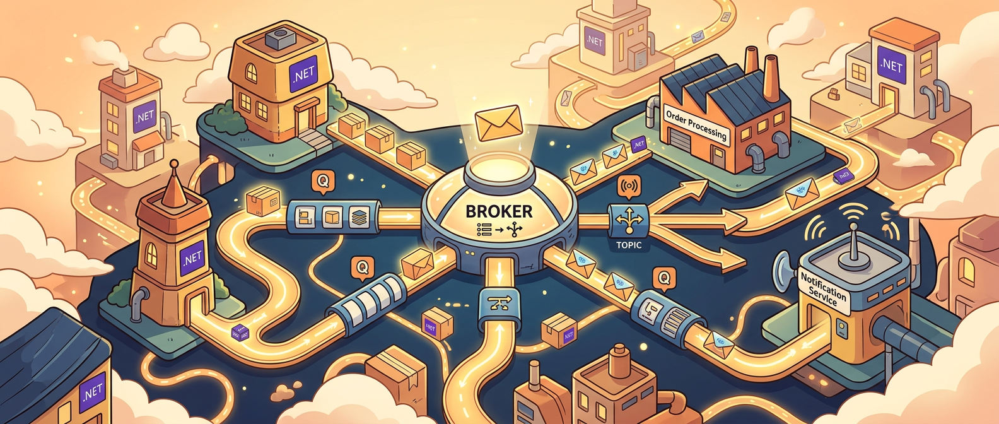

很多团队第一次认真碰消息系统，通常都不是因为“我们早就想学 RabbitMQ 了”，而是因为同步调用终于开始露出它那张熟悉的疲惫脸。

一个请求进来，本来只想保存订单，结果顺手还要发邮件、调库存、通知仓库、算积分、打审计日志。刚开始服务都健健康康时，这条链看起来也还能跑；一旦某个下游慢一点、挂一下、或者流量突然高起来，整个 API 很快就开始像拖着一串铁球走路。

Adrian Bailador 这篇文章的价值，就在于它没有一上来先丢 RabbitMQ 配置，而是先把 .NET 里消息传递最该理解的基本盘讲清楚：**消息不是为了“显得高级”，而是为了把某些不该绑死在请求链上的工作拆出来，让系统在可靠性、解耦和吞吐上更从容。**

如果你把这些基础概念先理顺，后面再看 RabbitMQ、Azure Service Bus、AWS SQS 这些具体工具，就会顺很多。否则很容易陷入“消息队列学了一堆，为什么系统还是一团糟”的状态。

## 消息传递首先解决的，不是异步酷炫，而是同步链路太容易被下游拖死

文章开头那个电商例子非常典型：用户下单之后，系统还要做一长串后续动作。如果这些动作全都同步串在一个 HTTP 请求里，调用方就被迫等待每一步都完成。邮件服务慢了，用户就跟着慢；仓库系统挂了，整个下单也可能一起挂；高峰流量一来，API 线程和连接全被长尾操作占住。

Messaging 真正解决的就是这个问题。你不是要求主请求亲眼看着每一件事都完成，而是让主请求先把“有件事需要做”这条信息交给 broker，再由后面的消费者按自己的节奏处理。

这个变化看起来只是“同步改异步”，实际背后改的是耦合关系：

- 主流程不再强依赖所有下游实时在线
- 请求响应时间不再跟全部后续动作绑定
- 短时失败可以通过重试和积压缓冲，而不是直接打爆前台请求

所以消息系统首先是一个系统弹性工具，而不是中间件收藏癖。

## queue 和 topic 这两个词，很多人会用，但不一定真的分得清

Adrian 这篇把 queue 和 topic 的区别讲得很直接，这点很好。因为很多团队一上来就说“我们要上消息队列”，但实际上他们需要的可能是完全不同的两种分发语义。

**Queue** 更像点对点工作分配。生产者把消息塞进去，多个消费者可以竞争处理，但一条消息最终只会被其中一个消费者拿走。它特别适合任务分发、后台作业、命令处理这类场景。

比如你有一批 PDF 生成任务，开 10 个 worker 并行吃，一个任务只需要完成一次。这时候 queue 非常自然。

**Topic** 则更像广播。生产者发一个事件，多个独立消费者都能各自拿到一份副本。它更适合事件驱动架构：订单创建后，邮件服务关心、仓库服务关心、积分服务也关心，但它们彼此不应该互相认识。

这两种语义的差别，其实对应的是两个完全不同的问题：

- queue 在解决“这份工作谁来做”
- topic 在解决“这件事发生后，谁需要知道”

这个区分特别重要。因为很多架构混乱，往往就是从这里开始的。把事件当命令发，或者把本来只该处理一次的任务广播出去，后面整个系统会越来越绕。

## 真正容易踩坑的，不是发消息，而是你以为“发出去就等于完成了”

消息系统最容易让人掉以轻心的一点，是它表面上把复杂度藏起来了。同步调用失败会立刻报错，消息发送成功却很容易制造一种错觉：好像事情已经妥了。

实际上，消息系统的复杂度恰恰在“发出去之后”才开始真正出现。比如：

- 消息有没有被消费
- 消费失败了会不会重试
- 重试会不会导致重复处理
- 消费者挂掉时消息会不会丢
- 顺序有没有保证
- schema 变化会不会把下游打烂

所以文章把 delivery semantics 单独拉出来讲是对的。At most once、at least once、exactly once 这些词看着像分布式术语，实际它们决定的是你要怎么理解系统正确性。

在现实世界里，大多数团队真正依赖的都是 **at least once + 幂等消费者**。也就是说，宁可消息重复，也不能默默丢；然后让消费者具备“同一条消息多处理几次也不会产生错误副作用”的能力。

这点特别关键，因为很多人脑子里还停留在“消息只会来一次”的朴素想象。一旦把这个假设带进生产，重复扣款、重复发邮件、重复生成记录这种事故就会很快出现。

## 幂等、死信队列、重试，不是什么高级玩法，而是生产环境基本盘

我很同意文章在这部分的取向：不要把 messaging 写成“换个通信方式”而已。真正让消息系统能上线的，是几个配套能力。

### 幂等

既然 at-least-once 是常态，你就要假设重复消息迟早会来。消费者不能天真地认为“我上次处理过了，这次肯定不是同一条”。

幂等意味着同一条消息多次执行，最终状态和执行一次一样。对于支付、发券、发邮件、库存扣减这种有外部副作用的场景，这几乎是硬要求。

### Dead Letter Queue

死信队列也不是锦上添花。没有 DLQ，失败消息要么悄悄丢掉，要么无限重试到把系统拖垮。DLQ 的意义是让失败变得可见——你至少知道哪条消息挂了、为什么挂、之后能不能人工修复或回放。

### Retry with Backoff

失败后立即疯狂重试，看起来像“努力恢复”，本质上常常是在追打一个已经脆弱的下游。退避重试不是温柔，而是基本常识：给故障系统一点恢复空间，也给消息系统自己一点秩序。

这些东西组合起来，才叫“可靠消息处理”。否则你只是把同步调用的脆弱，搬到了异步系统里继续脆弱。

## 选 RabbitMQ、Azure Service Bus 还是 AWS SQS，先看你需要什么约束，不要只看谁更火

文章后半段对几种常见 broker 的定位也比较实用，虽然是入门级概览，但框架是对的。

- **RabbitMQ**：更灵活、更可控，适合想自己掌握路由和部署形态的团队
- **Azure Service Bus**：Azure 生态里非常顺手，托管能力更完整，企业味更浓
- **AWS SQS + SNS**：AWS 场景下的标准搭配，省运维、扩展性强

这里最值得带走的不是“谁最好”，而是消息中间件从来不只是功能表比较。你选的是一套运行时约束：部署责任、协议能力、运维复杂度、和云生态耦合程度。

如果团队已经在 Azure 里重度生活，那 Service Bus 很多时候就不是“功能选择”，而是整体系统一致性选择。反过来，如果你在容器和自托管环境里更强调控制权，RabbitMQ 的吸引力就会更大。

所以选型不要问“社区最推荐哪个”，而该问：**我们是更缺控制力，还是更缺托管能力；更怕运维，还是更怕平台耦合。**

## 真正成熟的判断，不是“消息队列好不好”，而是什么地方值得引入消息

这篇文章还有一个我挺赞同的态度：不要为了显得架构高级，就过早把一切都事件化、队列化。

Messaging 明显有价值，但它也会带来新的复杂度：最终一致性、消息积压、重复投递、消费者监控、回放机制、运维成本。它不是免费午餐。

所以真正成熟的引入方式通常不是“从第一天开始全站上消息”，而是先识别那些同步调用已经明显不舒服的接缝：

- 下游不稳定，导致主链路脆弱
- 工作耗时长，不适合卡住请求
- 一个事件发生后，多个服务都要独立响应
- 高峰流量会把某个处理路径压爆

当你在这些地方切入 messaging，它会很自然；如果你只是因为“微服务都该有消息队列”，那很容易把系统做成另一种更难理解的耦合体。

## 对 .NET 开发者来说，这类文章最实际的价值是什么

我觉得这篇最适合被当成一篇“消息系统基础地图”。它不负责替你做所有选型，但能帮你先把几件特别关键的事分开：

- 同步调用和异步消息到底在解决什么不同问题
- queue 和 topic 的语义边界是什么
- 为什么重复消息不是 bug，而是默认现实
- 为什么幂等、DLQ、退避重试不是高级选配
- 为什么消息系统应该在真正需要的接缝上引入

这些基础一旦清楚，后面你再看 .NET 里的 MassTransit、NServiceBus、Raw RabbitMQ Client、Azure Service Bus SDK，脑子就不会只是 API 细节，而会知道自己在搭什么系统行为。

## 参考

- [Messaging in .NET: Queues, Topics, and Why You Need Them](https://adrianbailador.github.io/blog/49-messaging-in-net/) — Adrian Bailador
- [RabbitMQ](https://www.rabbitmq.com/) — RabbitMQ
- [Azure Service Bus](https://learn.microsoft.com/azure/service-bus-messaging/service-bus-messaging-overview) — Microsoft Learn
- [Amazon SQS](https://docs.aws.amazon.com/AWSSimpleQueueService/latest/SQSDeveloperGuide/welcome.html) — AWS
