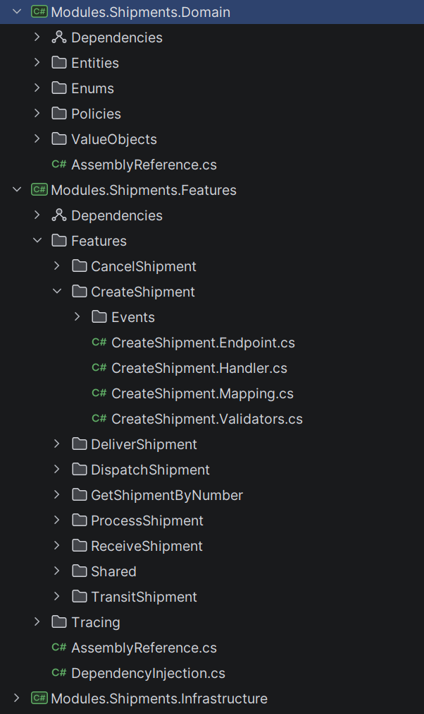

一聊 Vertical Slice Architecture，很多人脑子里很快就会出现一个经典担忧：这样按 feature 切开之后，不是很容易重复吗？两个 slice 各写一份校验，三个 handler 各查一次同一张表，五个功能都各自格式化日期，这看着就不够 DRY。

Anton 这篇文章真正有价值的地方，是它没有简单站队“重复就是坏”或者“VSA 就该随便重复”，而是把问题收回到一个更实在的层面：**在 Vertical Slice Architecture 里，重复代码有时是合理代价，真正危险的往往不是重复本身，而是为了消灭重复而过早抽象、过早共享。**

这件事如果不先想清楚，VSA 很容易被做成另一种老问题：表面上按 feature 分层了，实际上共享 helper、通用 service、抽象基类又偷偷长回来，最后 slice 还在，耦合也没少。

## VSA 为什么天然会让重复更显眼

Anton 开头先对比了传统分层架构和 Vertical Slice Architecture，这个切法很重要。

在传统 layered architecture 里，代码按 controller、service、repository、model 这些技术职责分。新加一个功能，往往自然要穿过几层。这个结构很容易把你推向“复用优先”的思维：如果两个功能都查订单表，那就给 repository 再加个方法；如果两个功能都要走类似业务校验，那就建一个 shared service。

而 VSA 把重心换掉了。它按 feature 切，把 endpoint、handler、validation、data access、response model 都放到一个 slice 里。这样做的最大好处当然是改动范围清楚、定位快、每个 feature 更独立，但代价也很明显：**那些以前被技术层共享逻辑悄悄吃掉的重复，现在会重新浮到台面上。**

这不是 VSA 变差了，而是它让你不得不认真面对“这段代码到底该不该共享”这个判断。以前很多共享看起来很自然，只是因为分层结构默认鼓励你这么干；现在结构不再替你做这个决定了。

## DRY 真正针对的是重复知识，不是所有长得像的代码

我很认同 Anton 这里反复强调的一点：很多人误解了 DRY。他们把 DRY 理解成“看到两段像的代码，就要赶紧抽出来”。可 DRY 真正反对的不是所有重复代码，而是**重复知识**。

这区别很关键。

两段代码今天看起来很像，不代表它们未来会因为同一个原因变化。如果它们未来会朝不同方向演化，那么此刻硬把它们抽到一起，往往不是在提升质量，而是在制造耦合。

Anton 文章里那个支付和退款的例子就很典型：一开始两边验证逻辑很像，于是团队很自然想抽一个共享 validator。结果后面业务一变，退款允许部分负值，还不需要检查“是否有足够余额”，这时候共享 validator 立刻开始长 if-else。

这就是过早抽象最常见的代价。你以为自己是在避免重复，实际上是在把本来可以独立演化的规则绑死在一起。

所以 VSA 里的一个基本判断应该是：**如果两段代码只是“现在很像”，但未来变化原因不一定相同，那宁可先重复，也不要急着共享。**

## 真正值得抽共享的，往往不是 feature 级逻辑，而是更稳定的层

Anton 这篇最实用的地方，就是它不是停在抽象原则，而是把重复按层次拆开看：数据库关注点、基础设施关注点、业务关注点、应用关注点。

这个拆法很值钱，因为不同层的共享风险本来就不一样。

### 1. 数据库关注点

Anton 对 EF Core 的态度也很典型：他倾向于直接在 application use case 里用 DbContext，而不是什么都先走 repository。这种写法在 VSA 下确实很顺手，因为它减少了很多本来为了“可能未来会换数据库”而存在的抽象。

但这不意味着数据库相关逻辑永远不该共享。文章的意思更接近：**简单查询重复几次没问题，复杂查询重复多了再抽。**

比如跨多个 slice 都在用的复杂过滤、排序、联表投影，这时候抽成 query extension、expression extension、specification，甚至 repository method，都有现实意义。关键不是“数据库逻辑能不能共享”，而是“这段查询是否已经足够复杂、足够稳定，值得被多个 feature 真正依赖”。

这个判断很像 VSA 里一条常识：别为了一行重复 query 造一个通用层，但也别在十个地方复制一段同样复杂的查询然后装作没看见。

### 2. 基础设施关注点

基础设施层通常更适合共享，这点我基本同意。像 clock、ID 生成器、hashing、JSON 配置、分页扩展、HTTP client 配置、重试策略这些东西，本来就不太会因为某个业务 feature 的变化而改变。

也就是说，它们的变化原因更偏技术决策，而不是 feature 需求本身。所以共享这类代码，通常不会破坏 slice 独立性。

Anton 给的好坏例子也挺实在：`Clock`、`Pagination` 这种职责清楚、没有业务含义的工具很适合共享；而 `OrderHelper`、`CommonValidation` 这种名字含糊、实际可能混进一堆业务规则的东西，就非常危险。

这个判断可以压成一句话：**基础设施层适合共享，但前提是它真的只是基础设施，不是假装技术中立的业务垃圾桶。**

### 3. 业务关注点

这是最需要克制的一层。

文章里对 business concerns 的态度很清楚：业务逻辑变化快，而且经常只影响部分 feature。如果你太早把它们抽成共享 validator、共享 helper、共享 service，后面业务一分叉，共享层就会迅速开始长条件分支。

Anton 这里给出的方向是把真正稳定、属于领域本身的规则下沉进 domain model：实体、值对象、领域服务、领域事件。这点很关键，因为它不是“别共享”，而是“别在错的层共享”。

比如 `Shipment.CanBeCancelled()` 这种规则，如果多个 slice 都需要，它最自然的位置不是某个 CancelShipmentHelper，而是 Shipment 自己。这样多个 slice 共享的是同一个领域真相，而不是共享一个 feature 层工具。

这其实就是 rich domain model 在 VSA 里的现实价值：它让共享回到领域概念上，而不是散落在各个 handler 外围的技巧性抽象上。

### 4. 应用层关注点

虽然 Anton 后面还有 application concerns 的展开，但前面这些逻辑已经足够说明问题了：应用层共享通常需要比基础设施更谨慎、比业务层更靠中间。像通用验证 pipeline、日志、缓存、请求处理模式这些，有些适合共享在 middleware 或 pipeline 层，而不是混进某个 feature 的内部实现里。

重点依然不是“能不能共享”，而是**共享后是否仍然尊重变化边界。**

## VSA 最容易被做坏的方式，就是表面按 feature 切，实际又偷偷回到共享崇拜

我觉得这篇文章最值得拿来当提醒的，不是它给了多少技巧，而是它点中了一个 VSA 落地里特别常见的问题：很多团队嘴上用的是 Vertical Slice Architecture，手上做的还是“看到重复就抽通用层”的老习惯。

结果很快会变成这样：

- feature 文件夹是有了
- 但 validation 都塞进 CommonValidation
- query 都被抽去 SharedRepository
- helper 到处横飞
- 一改共享逻辑，多个 slice 全跟着震

这时候你得到的不是 VSA，而是一种把 feature 文件夹贴在传统共享思维外面的混合体。结构看上去 modern，耦合还是老问题。

所以我反而觉得，VSA 的难点从来不只是怎么切 feature，而是你能不能忍住别太早把一切抽象回去。

## 今天再看这篇文章，它最适合当“共享边界判断指南”

如果你已经在 .NET 里做 Vertical Slice Architecture，这篇文章最大的价值不是某个单点模式，而是一套判断顺序：

1. 先问这段重复代码是不是重复知识，还是只是暂时长得像
2. 再问它未来变化原因是否相同
3. 再决定它更像数据库 concern、基础设施 concern、业务 concern，还是应用 concern
4. 最后才决定该放在 slice 内、领域内，还是共享层

这个顺序能帮你少走很多弯路。因为很多“为了整洁而共享”的动作，最后都会反噬成“为了改一个功能而牵动一串无关 feature”。VSA 的好处本来就在于局部变化的独立性，别为了表面 DRY 把这个好处自己削掉。

## 如果把这篇文章收成一个最实用的提醒

那大概就是：**在 Vertical Slice Architecture 里，重复代码不是第一现场，错误共享才是。**

看到重复先别急着抽。先看这段逻辑是不是代表同一个业务知识、会不会因为同一个原因变化、适不适合沉到领域模型或基础设施层。如果答案都还不够清楚，那暂时重复，往往比过早抽象更便宜。

这也是 VSA 真正成熟的用法：不是拒绝共享，而是只在共享真的能降低未来修改成本时才共享。

## 参考

- [How to Avoid Code Duplication in Vertical Slice Architecture in .NET](https://antondevtips.com/blog/how-to-avoid-code-duplication-in-vertical-slice-architecture-in-dotnet) — Anton Martyniuk
- [N-Layered vs Clean vs Vertical Slice Architecture](https://antondevtips.com/blog/n-layered-vs-clean-vs-vertical-slice-architecture) — Anton Martyniuk
- [Specification Pattern in EF Core](https://antondevtips.com/blog/specification-pattern-in-ef-core-flexible-data-access-without-repositories) — Anton Martyniuk
