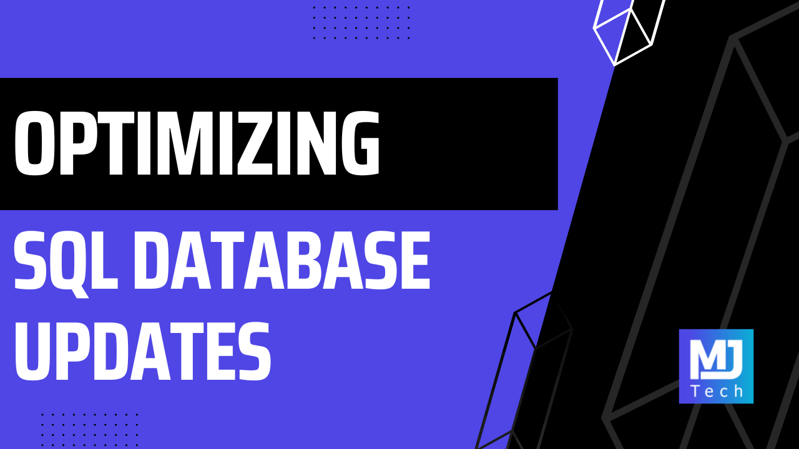

很多性能问题一开始看着都像 SQL 问题。你看到批量更新慢，直觉往往是：是不是语句写得不够优雅，索引不对，或者 PostgreSQL 没吃到最佳执行计划。可 Milan 这篇文章最有价值的地方，就是它把问题拆开后发现：**大多数 bulk update 场景里，真正拖后腿的往往不是 SQL 本身，而是应用代码和数据库之间来回说了太多次话。**

这点特别适合 .NET 开发者记住，因为我们太容易把优化想成 ORM vs Dapper、LINQ vs raw SQL、CTE vs VALUES 这种技术口味之争。可 Milan 这组 benchmark 给出的结论很朴素：当你把 10,000 次数据库 round-trip 压成 1 次，收益往往比你在单条 SQL 上绞尽脑汁大得多。

## 真正的问题，不是“怎么更新一行”，而是“怎么更新一万行还别一直来回喊数据库”

文章里的场景很典型：一批订单要统一更新为 `Processed`，同时每一行还有一个不同的 `processed_at` 时间戳。这种场景的难点不在“能不能 update”，而在“每行值都不一样”，所以你不能简单写一个 `WHERE id IN (...)` 然后给所有行塞同一个值。

很多人到这一步，第一反应就是开循环，一行一条 `UPDATE`，Dapper 或 ADO.NET 逐个发。逻辑当然成立，但一旦批量上来，网络往返成本就会立刻站出来打你脸。

Milan 在 10,000 行上的数字很有说服力：最慢的方法 2,414ms，最快的 41ms。差距不是一点点。这里最值得注意的，不是“哦，UNNEST 真快”，而是你会突然意识到：**你的系统有时不是被数据库算慢了，而是被应用层自己磨慢了。**

## Naive Dapper 为什么慢，不是因为 Dapper 慢，而是因为它被用成了“逐行聊天机器人”

文章里第一个方案是最直观的：循环 updates，每次 `ExecuteAsync` 一条 `UPDATE`。这类代码很多人都写过，因为它看起来最不费脑，也最接近业务意图。

问题在于，10,000 行就意味着 10,000 次请求发出去、10,000 次等待数据库回应。SQL 本身再简单，这种持续往返也会把延迟堆起来。

所以这里最该避免的误解是“Dapper 性能不行”。不是。Dapper 的问题不是执行慢，而是你让它用最不适合批量场景的方式在工作。

这一点其实对很多 .NET 性能问题都适用：工具快不快，很多时候不是库决定的，而是调用模式决定的。把一个高性能轻量工具拿来做 10,000 次逐条聊天，它一样会被 round-trip 成本拖死。

## EF Core SaveChanges 比你以为的更能打，但它依然不是 bulk update 工具

文章里一个挺有意思的点，是 EF Core `SaveChanges` 在这类 benchmark 里没有很多人想象中那么惨。因为它会 batching，把多个 SQL 更新语句打包成更少的 round-trips，所以在 10,000 行场景下已经明显优于 naive Dapper。

这对很多 .NET 团队其实是个挺健康的提醒：别动不动就把性能问题理解成“只要 EF Core 出现就是原罪”。在不少中等规模场景里，合理配置 batch size 的 EF Core 其实已经能把事情做得不错。

但 Milan 这篇也很清楚地指出了边界：`SaveChanges` 再怎么 batching，本质上还是在生成 N 条 `UPDATE`，而且前面通常还要先把实体查出来进 change tracker。它能少一些 round-trips，但它没有改变“还是在做很多单独更新”这个本质。

所以如果场景已经明确是大批量状态修改，那 EF Core `SaveChanges` 更像一个“比 naive 好很多”的过渡解，而不是终点方案。

## 从 VALUES / CTE 开始，优化的关键就已经不是 ORM，而是“把更新压成一条语句”

文章最重要的跃迁，其实发生在 Approach 3：用 `VALUES` 派生表把所有更新值一次带进去，再通过一条 `UPDATE ... FROM` 完成所有行更新。

从这里开始，性能的世界就变了。因为数据库终于不用被应用一条条喊，而是一次拿到一整批需要更新的数据，然后自己在服务器端完成 join 和 update。

这一步的意义，比具体写成 `VALUES` 还是 `CTE` 更重要。因为它把优化焦点从“如何更优雅地调用执行器”转成了“如何减少请求边界次数”。

文章里 `VALUES` 和 CTE 的差距其实不大，这也印证了一个现实：在 bulk update 这种场景里，很多时候真正的大头收益来自**是否把操作收束成一个 statement**，而不是 statement 具体长哪副样子。

这也是为什么 Milan 会说 CTE vs VALUES 更像风格选择，而不是性能分水岭。真正的分水岭早在“循环单条更新”与“一条语句批量更新”之间已经出现了。

## PostgreSQL 的 UNNEST 真正香的地方，不只是快，而是把动态 SQL 的麻烦也一起拿掉了

如果说 `VALUES` / CTE 已经很不错，那 `UNNEST` 的优势就在于它让 SQL 形状固定下来。你不需要再生成 `@Id0, @Id1, @Id2 ...` 这种不断膨胀的参数列表，也不用担心 query text 随批量大小一起长胖。

只传两个数组：`Ids` 和 `ProcessedAts`，然后 PostgreSQL 在服务器端展开它们。

这个设计为什么值钱？不只是 benchmark 更快，而是它同时解决了几个工程上的烦点：

- SQL 模板固定，不需要拼字符串
- 参数个数固定，避免海量参数管理
- query plan 更稳定，更容易复用
- 批量变大时，应用代码复杂度不会跟着线性膨胀

所以我挺认同 Milan 把它作为 PostgreSQL 场景下的优先解。它不只是“赢在跑分”，更像是在正确利用数据库本身的数组能力，让应用层少干很多笨活。

## temp table + binary COPY 看似复杂，但它在告诉你一件事：参数系统本身也会成为瓶颈

文章最后一个方案——临时表 + binary COPY——非常适合作为“规模继续上去后会发生什么”的示范。

在前面几个方案里，不管是逐行更新、VALUES、CTE 还是 UNNEST，本质上都还在走“我通过 SQL 参数把更新数据送给数据库”这条路。只是送法越来越高效。

但当批量再大、参数再多时，参数系统自己也会变成限制。这个时候，COPY 的思路就很自然：别再把它当一堆 SQL 参数传了，直接用数据库最擅长的二进制导入路径把数据流进去，然后再做 `UPDATE ... FROM`。

这套做法复杂度高一些，但它展示了一个很重要的思路：**当规模继续增大时，优化不一定只是换写法，而可能是换传输机制。**

对于超大批量导入、更新、对账、离线同步这类任务，这个思路很值得记住。不是所有数据操作都该走 ORM/参数绑定那条主路，数据库本来就有更贴近底层吞吐的入口。

## 真正该带走的，不是七种写法，而是一种性能判断顺序

我觉得这篇文章最适合被当成一篇性能判断指南，而不只是 PostgreSQL 技巧合集。它实际上给出了一个很健康的优化顺序：

1. **先看 round-trips 有多少**
2. 再看是不是能把多条操作合成一条 statement
3. 再看 SQL 文本是否因为批量增长而越来越臃肿
4. 最后才考虑更底层的批量传输手段，比如 COPY

这个顺序很重要，因为很多开发者一上来会跳到最后两步，开始研究更花哨的 SQL 写法、驱动级优化，结果真正该先解决的 round-trip 问题根本没动。

Milan 这篇 benchmark 最大的教育意义也在这里：性能优化最怕的是在错误层次上努力。数据库不是没能力，往往只是你让它干活的方式太碎。

## 对 .NET 开发者来说，这篇文章最有现实价值的地方

如果你平时在做 outbox processor、批量任务、定时作业、状态回写、事件清理、订单批处理，这篇文章会特别实用。因为这些场景里最常见的一类代码，恰恰就是“遍历列表然后逐个更新”。逻辑直白，但一旦规模上来，问题就来了。

这篇文章不会替你自动决定所有选型，但至少能帮你先建立一个很实用的认知：

- `SaveChanges` 能做事，但不是 bulk update 专家
- Dapper 很快，但别把它用成逐行聊天器
- PostgreSQL 场景下，`UNNEST` 和 `COPY` 值得优先考虑
- 性能差距的第一来源往往是通信方式，不是 ORM 信仰

## 如果把这篇文章收成一句最实用的话

那大概就是：**.NET 里批量更新慢，先别急着怀疑数据库，先看看你是不是让应用和数据库聊了太多次。**

把 10,000 次更新压成 1 次 round-trip，往往就是性能拐点。后面的 `VALUES`、CTE、`UNNEST`、binary COPY，本质上都是在朝这个方向继续收缩成本。

## 参考

- [Optimizing Bulk Database Updates in .NET: From Naive to Lightning-Fast](https://www.milanjovanovic.tech/blog/optimizing-bulk-database-updates-in-dotnet) — Milan Jovanović
- [Efficient Updating in EF Core](https://learn.microsoft.com/ef/core/performance/efficient-updating) — Microsoft Learn
- [Npgsql COPY](https://www.npgsql.org/doc/copy.html) — Npgsql Docs
