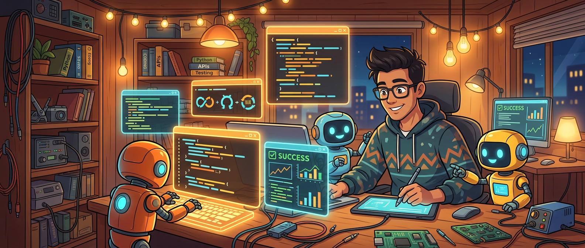

这两年大家聊 agent，最容易聊飘。有人把它讲成一种几乎会自己长出产品的智能体神话，有人把它讲成 prompt 套娃的高级版本，还有人干脆把所有能连续回复几轮的东西都叫 agent。Simon Willison 这篇文章的价值，就在于它把这个词往地上拽了一把。

他的定义很简单：**agent 是会为了达成目标，在循环里调用工具的系统。** 再往 software engineering 里落一步，所谓 **agentic engineering**，就是用这类会写代码、会执行代码的 agent 来做开发。

这听起来像一句定义题，但真正重要的部分其实在后半句。不是“会写代码”，而是“会执行代码，还会根据执行结果继续改”。这就是为什么这篇文章虽然不长，却把问题说到了点上。

## 真正让开发变得 agentic 的，不是生成代码，而是把反馈回路接上

今天已经没人会对“模型能生成一段能跑的代码”这件事太震惊了。真正把事情推到下一阶段的，是模型不只负责输出文本，而是能直接调用终端、运行测试、读报错、改文件，再跑一轮。

这一步看起来只是多了个执行器，实际意义却很大。因为没有执行能力时，LLM 本质上还是一个很强的文本补全器。它可以写出看起来很像那么回事的代码，但它不知道这段代码在你的环境里到底会不会炸，会炸在哪里，也不知道上一版改完以后到底有没有真的更接近目标。

一旦执行回路接上，事情就变了。模型不再只是“提建议”，而是开始参与一个最基本的工程循环：

- 先基于目标产出一个版本
- 跑起来看结果
- 根据报错和输出修正
- 再跑一轮验证

这套循环并不神秘，甚至可以说很朴素。但软件开发里很多真正有价值的进展，本来就来自这种朴素循环，而不是某个一次到位的天才答案。

> 把 LLM 接到可执行、可验证的回路里，它才开始从“会说”变成“会干活”。

## 人的工作没有减少，反而更像回到了工程本身

Simon 在文里有一句我很认同：现在既然软件已经能帮我们写能运行的代码，那人类工程师还剩什么可做？答案是，**还有一大堆事。**

这点特别值得反复讲，因为很多关于 AI 写代码的讨论，都会偷偷把“写代码”混同成“做工程”。可软件工程从来不只是把函数敲出来。真正费脑子的，往往是更前面的那些问题：

- 这个问题到底该怎么定义
- 哪个方案适合当前团队、系统和约束
- 哪些 trade-off 能接受，哪些不能
- 结果看起来能跑，但靠不靠谱
- 这套做法下次还值不值得复用

这些判断，恰恰是 agentic engineering 时代更重要的部分。因为 agent 把“试错速度”拉高了，人就更该把力气花在方向、约束、验收和复盘上。

说白了，AI 不是把工程师从决策里替掉了，而是把工程师从一部分重复打字里拎出来，逼着人去面对那些原本就该由人负责的判断。

## 这篇文章真正讲清楚的，是 coding agent 到底比聊天机器人多了什么

很多人第一次接触 Claude Code、Codex、Gemini CLI 这类工具时，会有一种熟悉感：不就是一个会聊天的模型，外加几个工具吗？

表面上确实像，但差别其实不小。

聊天式模型的典型模式是：你问，它答；你再问，它再答。即使它能调用少量工具，很多时候也只是为了补充回答内容。可 coding agent 的结构更接近一个围绕目标不断推进的小型执行器。你给它的是目标，不是逐行指令；它中间怎么拆步骤、怎么调用工具、怎么根据结果回退重试，属于它自己在 loop 里完成的工作。

所以 Simon 才会把定义压缩成那句很干脆的话：**Agents run tools in a loop to achieve a goal.** 这句话的重点不是 agent 有多聪明，而是它有了一个能持续行动的工作方式。

这也是为什么 code execution 在这里这么关键。没有执行，loop 就是不完整的。模型只能猜测“这大概行”；有了执行，它才能把“我觉得”变成“我验证过”。

## 在今天的工程语境里，最该关注的不是 AI 会不会写代码，而是你给没给它可验证的环境

我觉得这篇文章对工程团队最有现实价值的提醒，是它把注意力从模型能力重新拉回了工程环境本身。

很多团队一聊 AI coding，第一反应都是比模型：谁更强、谁上下文更长、谁 benchmark 更高。这当然有意义，但如果没有合适的工具和验证环境，再强的模型也只能停留在“建议机器”阶段。

真正决定一个 coding agent 能不能稳定产出结果的，往往是这些更工程化的问题：

- 它能不能运行测试
- 能不能读到真实错误输出
- 能不能修改文件并再次验证
- 有没有明确的任务边界和约束
- 失败经验有没有沉淀成说明、脚本或 harness

Simon 文里那句“LLMs 不会从过去的错误中学习，但 coding agents 可以，只要我们主动更新指令和工具链”也很重要。它其实在说一件很现实的事：**别指望模型自己长记性，得靠工程把经验固化下来。**

这和传统软件开发并不矛盾。以前我们靠测试、脚手架、文档、CI、lint 让团队少重复犯错；现在只是把这些东西也变成 agent 的工作地面。模型负责在地面上跑，地面本身还是要人来铺。

## AI 已经改变了试错速度，但没有改写工程判断的责任归属

如果把这篇文章放回 2026 年来看，它最不过时的地方反而是它没有夸张。Simon 没有把 agentic engineering 写成什么“人类不再需要理解系统”的未来叙事，而是很冷静地指出：这些工具让我们能更有野心，也能更快迭代，但前提是我们要会定义问题、搭工具、验结果。

这也是我觉得这篇文章特别适合 AideHub 读者的原因。现在 AI 已经明显改写了开发流程，特别是在原型验证、重复实现、跨语言迁移、测试补全这些场景里，速度提升非常实在。但那些没有变化的东西也同样清楚：

- 架构 trade-off 还是得有人拍板
- 安全、正确性、边界条件还是得有人兜底
- 需求本身值不值得做，还是人的判断
- 产出能不能进入生产环境，还是工程责任问题

AI 确实让“写代码”更便宜了，但它没有让“为代码负责”这件事自动消失。

## 这篇文章最值得带走的一句话

如果非要把它压成一句最实用的话，我会这么说：**agentic engineering 的核心，不是让模型多说一步，而是让模型进入一个能执行、能验证、能反复修正的工程回路。**

这也是 coding agent 和普通聊天式 AI 最大的分水岭。前者的价值不只在生成，而在迭代；不只在回答，而在验证；不只在写出一版代码，而在把目标一步步推到真的能工作的地方。

对开发者来说，这个视角比“哪个模型更聪明”更重要。模型会继续变，名字也会继续换，但只要软件开发还是一个靠反馈回路推进的行业，**执行、验证和迭代**就会一直是 agentic engineering 最硬的地基。

## 参考

- [What is agentic engineering?](https://simonwillison.net/guides/agentic-engineering-patterns/what-is-agentic-engineering/) — Simon Willison
- [Claude Code](https://code.claude.com/) — Anthropic
- [OpenAI Codex](https://openai.com/codex/) — OpenAI
- [Gemini CLI](https://geminicli.com/) — Google
