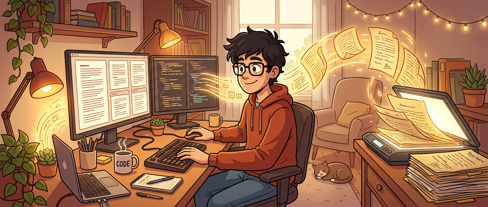

很多人一提 OCR，脑子里还是老路线：Tesseract 这类传统工具对规则版面还行，一旦遇到扫描模糊、倾斜、污点多、结构复杂的 PDF，结果就开始一塌糊涂。过去如果你真想把这类烂扫描件转成还能用的文本，通常要么忍着低质量输出，要么直接上 Gemini、GPT 这类视觉模型，靠大厂 API 硬解。

Martin Alderson 这篇文章最值得看的地方，是它把一个越来越现实的新选项摆出来了：**用 Qwen 3.5 这类开源多模态模型来做文档 OCR，而且不只是能做，是已经开始有了“够便宜、够快、够实用”的味道。**

这背后真正有意思的不是“模型会识别图片里的字”——这件事本身早就不新鲜了。更关键的是，开源模型现在开始逼近一个门槛：你既能本地跑敏感文档，又能在云端用很低成本做大批量 OCR，还不至于在质量上立刻跪下。

## 这篇文章真正解决的，不是 OCR 会不会做，而是有没有一条更现实的替代路线

Martin 一开头就说得很直接：Gemini 做复杂 PDF 的 OCR 的确很强，尤其是那种格式很差、扫描很烂的文档。但问题也很明显，价格在涨，而且很多场景下其实有点杀鸡用牛刀。

这点非常现实。很多文档处理工作并不需要一个“超级聪明的通用推理模型”，你要的只是把页面上的内容尽量准确地抠出来，保留布局、表格、列表，然后后面再用别的工具处理。要是每一步都用高价 frontier model，成本很快就不对了。

再加上隐私问题，很多企业或个人文档根本不想直接丢给外部大模型 API。尤其是合同、财务资料、历史档案、内部扫描件这类东西，哪怕不是绝密，也常常不适合随手全上传。

所以这篇文章最核心的问题意识，不是“能不能 OCR”，而是：**有没有一种不必完全依赖大厂视觉 API、但又比传统 OCR 更靠谱的中间解。**

Qwen 3.5 给出的，就是这么一条路。

## Qwen 3.5 真正有意思的地方，是小尺寸多模态模型开始变得够用了

文章里一个很关键的点，是 Qwen 3.5 这代模型把多模态能力压到了更小的参数规模上。以前能看图的开源模型，往往还是偏大，真正跑起来不是显存压力高，就是速度和部署门槛不太友好。

现在从 0.8B、2B、4B、9B 到更大的变体，选择一下子丰富了很多。Martin 的结论是，做 OCR 时 **9B 是一个很平衡的甜点位**：

- 小模型虽然也能认，但更容易跑偏
- 页面复杂一点时，容易开始“总结文档”而不是老老实实 OCR
- 9B 在质量和速度之间达到了更实用的平衡

这个观察挺重要，因为它说明 OCR 这类任务并不只是“模型看得见”就够。你还需要它**足够听话**。很多小模型的问题不是完全看不懂，而是容易脱离任务：本来让它逐字输出，它却自作聪明帮你概括内容。这在 OCR 场景里基本就是事故。

所以文章真正有价值的地方，不是列了一串模型大小，而是给了一个很实用的判断：**你不是在挑最强模型，而是在挑最不容易跑偏、同时又跑得动的模型。**

## 先把 PDF 拆成页图，再让模型逐页 OCR，这条流程很朴素，但很有效

Martin 的实操路线其实相当直白：先用 PyMuPDF 把 PDF 每一页导成图片，再把图片发给模型做 OCR。

这听起来不高级，但恰恰是这种拆法让整个流程更稳定。因为你避免了直接把复杂 PDF 丢进模型时各种不可控因素：解析方式、嵌入对象、字体层、扫描层混杂在一起。先变成一页一张图，任务边界反而很清楚。

PyMuPDF 在这里的价值不是“又一个 Python 库”，而是它很快，适合做大批量页面提取。Martin 用 100dpi 做示例，这个数字不一定是唯一正确答案，但已经足够说明一个关键点：OCR 效果不是只看模型，前面的图像抽取质量同样重要。

这一整套思路其实很适合今天的 AI 工程实践：

- 先把复杂输入拆成模型更擅长处理的单位
- 再让模型在窄任务里稳定输出
- 最后把结果拼回你的后处理链路

这比指望一个大模型端到端神奇解决所有问题，通常靠谱得多。

## 本地跑的意义，不只是省钱，而是把敏感文档处理权拿回来

文章里讲本地运行时，我觉得最值得注意的不是 LM Studio 本身，而是它说明这件事已经开始变得“普通人能试”。

以前说本地多模态 OCR，很多时候像一句极客口号：理论上可以，实际折腾死。现在借助 LM Studio 这类工具，你至少能比较顺手地把模型拉起来，开本地 API，然后用 Python 脚本一页页喂进去。

Martin 在 Radeon 9070XT 上跑 9B，大概能做到 **3 秒一页** 的 dense text OCR。这个速度对大规模批处理当然不算夸张，但对本地、隐私友好、零云依赖的流程来说，已经很像一个真正能用的起点了。

而且这件事的意义不止在“便宜”。很多文档 OCR 场景里，最大的阻碍从来就不是钱，而是**你根本不想把这些文件发出去**。只要本地方案的质量到了能接受的水平，它就不是廉价替代，而是某些场景里的首选。

## 真要跑量，OpenRouter 这条路的重点不是能跑，而是单位成本低得离谱

如果说本地运行的价值是隐私和控制权，那 Martin 文里提到的 OpenRouter 路线，真正震撼人的地方就是吞吐和成本。

按他的估算，一页大概 1000 input tokens + 500 output tokens，1,000 页 OCR 下来只要十几美分。这已经不是“还能接受”的水平，而是接近可以拿去扫档案库、扫历史文献、扫大量内部文档的量级了。

更关键的是它还可以并发。Martin 用 `ThreadPoolExecutor` 一次扔 128 页出去，10 秒左右完成一批。这意味着大规模 OCR 的瓶颈，开始不再只是模型价格，而更多转成你的并发策略、供应商速率限制、后处理流程和存储架构。

这就是为什么我觉得这篇文章比普通“教你怎么调一个模型 API”更值得收。它展示的不是某个 demo，而是一条已经开始有工程可行性的路线：

- 本地可跑，适合敏感文档
- 云端可并发，适合海量文档
- 开源权重，减少平台锁定
- 单页成本极低，能撑起批量化场景

这几件事放在一起，味道就完全不一样了。

## AI 已经改变了 OCR 的上限，现在更重要的是它开始改变 OCR 的部署方式

这篇文章放回 2026 年的语境里，真正值得关注的一点是：OCR 已经不只是“识别率更高一点”的问题了。

以前 OCR 的进步主要体现在识别精度。现在更大的变化是，视觉 LLM 正在把 OCR 从一个单独的软件模块，变成一个能跟理解、抽取、归类、问答无缝接起来的前置步骤。文档一旦被转成质量还不错的文本，后面的信息抽取、结构化、搜索、摘要、比对全都顺了。

而 Qwen 3.5 这类开源模型又进一步把这个能力从“必须上闭源 API”拉回到了“本地也能干、便宜也能干”的区间。

这件事对很多场景都很重要：

- 企业内部老文档数字化
- 合同和发票批量转文本
- 历史档案和研究材料整理
- 扫描件知识库构建
- 敏感 PDF 的离线处理

换句话说，AI 现在不只是让 OCR 更准，而是在让 OCR **更容易嵌进自己的系统，而不是只能租别人的系统来做。**

## 这篇文章最该带走的一句话

如果非要压成一句话，我会说：**Qwen 3.5 做 OCR 值得试，不是因为它第一次让模型会认扫描件，而是因为开源多模态 OCR 终于开始在质量、成本、速度和隐私之间找到一个像样的平衡点。**

这就是它最有现实价值的地方。不是“又一个模型能做 OCR”，而是你终于有机会不靠高价闭源 API，也能把大量烂扫描文档转成后续可处理的文本资产。

## 参考

- [How to use the Qwen 3.5 LLMs to OCR documents](https://martinalderson.com/posts/how-to-use-qwen-3-5-to-ocr-documents/) — Martin Alderson
- [PyMuPDF](https://pymupdf.readthedocs.io/) — Documentation
- [Qwen 3.5 on OpenRouter](https://openrouter.ai/qwen/qwen3.5-9b) — OpenRouter
