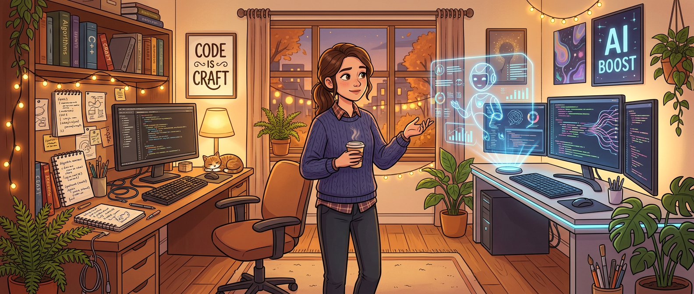

很多关于 AI 写代码的讨论，最后都会掉进两种熟悉腔调里。一种是过度乐观，觉得程序员终于从重复劳动里解放，接下来只要“提需求、验结果”就行；另一种是标准恐慌，仿佛软件行业明天就会被模型整体吞掉，大家集体失业回家。

Anil Dash 这篇文章的价值，在于它没有顺着这两种偷懒叙事走，而是把问题掰得更细、也更疼了一点：**AI 对程序员的冲击，并不只有“会不会失业”这一层，还有“如果代码还在继续被生产，但亲手写代码这件事正在退出中心位置，那程序员的工作、身份和尊严会怎么变”。**

这个角度很值得 AideHub 读者认真看，因为它不只是产业判断，也是在问一个越来越现实的工程问题：在 AI 时代，程序员到底还剩下什么是自己的核心价值。

## 这篇文章最厉害的地方，是它把“程序员”拆成了两类完全不同的人

Anil 文里一个很锋利的处理，是他没有把程序员看成一个铁板一块的群体，而是粗略分成了两种人。

一类，是把写代码当成一份稳定工作的人。编程对他们来说首先是职业，是收入，是养家糊口的一条上升通道。他们当然也会学新技术、也能把工作做好，但不一定把“我是 coder”当成最深的自我认同。

另一类，则是把编程看成一种表达方式、一种长期手艺、甚至是一部分人格结构的人。这类人很多从小就写代码，哪怕工作早就不要求他们亲自敲那么多，他们照样会在下班后、周末、空闲时继续折腾。对他们来说，代码不只是产物，也是乐趣、秩序感和成就感来源。

这个划分非常重要。因为 AI 带来的冲击，并不是均匀打在“程序员”三个字上的，而是会对这两类人造成**完全不同形状的伤害**。

## 对把编程当职业的人来说，真正的风险不是学不会新工具，而是岗位正在被整体压缩

Anil 对第一类程序员的判断其实很冷，也挺准。

过去软件行业一直有一个默认安慰：技术变化快没关系，程序员最擅长学习新东西。今天学 Java，明天学 Go，后天再补一点云原生和 AI 工具，照样还能活。

但这次变化不太一样。问题不是你会不会多学一个框架，而是很多原本由中层工程岗位承担的标准化业务代码，正在被更便宜的 AI 生成能力迅速吞掉。管理层看到的不是“程序员可以更强”，而是“原来需要这么多人做的事，现在是不是可以少很多人做”。

这也是为什么最近几年 tech layoff 里，AI 经常既是借口，也是催化剂。有些公司本来就想裁员，只是借 AI 说辞把动作做得更理直气壮；但也确实有越来越多岗位，会被 deskilling，也就是去技能化。原本需要一个合格工程师完成的事情，被拆成更低成本的需求描述、AI 生成、人工验收流程之后，组织会天然倾向于压缩中间那层“稳定产出业务代码的人”。

这不是说这些工程师不努力，也不是说他们没能力，而是系统层面开始重写“这类工作值多少钱、需要多少人做”。这个变化最残酷的地方，就在于它不太能靠“再努力一点”解决。

## 对把编程当手艺的人来说，更难受的不是丢工作，而是失去那种亲手把东西写对的感觉

如果说第一类人面临的是岗位风险，那第二类人承受的，就是一种更复杂的失落。

Anil 这部分写得很准，因为它抓住了很多真正喜欢写代码的人心里那个不太好解释的东西：**写代码不只是为了交付软件，也是为了体验一种“我把这件事做对了”的满足感。**

那种感觉很像烘焙、木工、编织或者乐器练习。你熟悉材料，理解结构，知道一个细节为什么要这么写，知道一个接口为什么这样拆更优雅，知道一段逻辑怎样收住才算漂亮。最后不是只有“能跑”，而是有一种很安静的自豪感，觉得世界上至少还有一小块东西，是靠自己的判断和手感被整理得恰到好处的。

而 AI coding 的一个巨大变化，就是把这件事逐渐边缘化。你开始越来越少直接写代码，而更多是在描述结果、约束过程、审查产物、丢掉不好的版本、再让模型重来。软件还是在被做出来，但你和“写出那段代码”之间，隔了越来越厚的一层代理。

这对只在乎结果的人也许是解放，但对把代码当 craft 的人来说，确实像一种丧失。不是失去全部工作，而是失去工作里最像自己的那一部分。

> AI 拿走的未必是程序员的全部价值，但它确实可能先拿走程序员最有手感、最像手艺的那部分工作。

## 这也是为什么很多程序员对 AI 的态度，和其他创作者不完全一样

Anil 还提了一个挺重要的点：为什么程序员群体对 LLM 的反应，经常和作家、摄影师、音乐人不太一样？

他给了几个解释，比如开源文化、代码复用与自动化本来就是软件行业的传统、以及技术劳动长期缺乏组织化传统。这些都对。但我觉得更深一层的原因，是编程这个领域一直就有一种很强的“工具升级就是正常进化”的文化。

程序员很早就在接受：

- 更高级的语言替代更底层的细节
- 框架替代大量样板代码
- 库替代自己重复造轮子
- IDE、补全、lint、生成器替代很多机械劳动

所以当 AI 来接管更多代码产出时，很多程序员第一反应不是“这不配叫创作”，而是“这是不是又一层更强的抽象”。

问题是，这次抽象有点抽太高了。以前工具更多是在帮你写，AI 正越来越像在替你写。这个边界一旦跨过去，职业安全感和手艺认同就会同时被碰到。

## AI 改变的，不只是软件生产效率，还有软件行业内部的权力关系

这篇文章另一个特别值得保留的点，是它没有把问题只理解成“个人要不要学 AI 工具”，而是明确提到**权力关系**。

这很关键。因为很多 AI 叙事喜欢把变化讲成纯技术升级，好像大家只是站在同一条起跑线上，谁适应得快谁赢。可真实情况是，组织里的权力从来就不是平均分布的。谁有预算权、谁能决定 headcount、谁能把“效率提升”翻译成“裁员合理性”，这些都不是工程师决定的。

所以 AI 对程序员的影响，本来就不只是工具升级，而是劳动被如何重新定价、工作被如何重新切片、管理层拿什么理由来重组团队。你不把这层说出来，就很容易把结构性问题全甩给个体，说成“你适应得不够快”。

Anil 文章里那种对 tech labor 弱组织化的提醒，其实非常有现实意义。软件行业长期太习惯把自己看成“未来创始人训练营”，而不是一个有共同劳动处境的行业。可当 deskilling 和 automation 真落到头上时，这种幻觉会先碎。

## 但这篇文章也不是在宣判“程序员没了”，而是在逼人承认价值重心变了

我觉得这篇文章的好，不在于它悲观，而在于它没有装轻松。

它当然承认很多程序员会继续活下来，很多有创造力、有判断力、会组织复杂系统的人，反而可能在新阶段找到新的位置。但它也要求大家别回避一个事实：**程序员的核心价值，正在从“亲手写大量代码”往“定义方向、做判断、验证结果、组织系统、坚持审美和伦理边界”迁移。**

这个迁移不是一句“那大家都转 prompt engineer 不就好了”能打发掉的。因为它涉及的不是职位名称，而是：

- 什么能力还值得高薪
- 什么工作会被降价
- 什么工种会被边缘化
- 什么样的工程师能保住主动性
- 什么样的创造快乐会被保留，什么会被稀释

对 AideHub 的读者来说，这个判断其实挺重要。因为今天还把 AI 只看成“更快写代码的工具”，已经有点不够了。它正在重写软件生产链条里，哪些环节是贵的，哪些环节只是可替代执行。

## 这篇文章最该带走的一句话

如果非要压成一句话，我会这么说：**AI 之后，程序员不会立刻消失，但“写代码”这件事本身，正在从很多程序员工作的中心位置退下去。**

对把编程当饭碗的人，这是岗位和议价能力的冲击；对把编程当手艺的人，这是更深的身份和乐趣问题。Anil Dash 这篇文章最值钱的地方，就是它没有把这两种痛苦混成一句泛泛的“AI 会影响程序员”，而是把它们清清楚楚地点了出来。

而这恰恰也是现在最该认真讨论的部分：当代码仍然会越来越多，但亲手写代码的人变得越来越少，软件行业准备如何重新理解“程序员”这个角色。

## 参考

- [What do coders do after AI?](https://www.anildash.com/2026/03/13/coders-after-ai/) — Anil Dash
- [The Last Human Coders](https://www.nytimes.com/2026/03/12/magazine/ai-coding-programming-jobs-claude-chatgpt.html?unlocked_article_code=1.SlA.gzDD.giRxmN2oQFcF&smid=url-share) — New York Times Magazine
