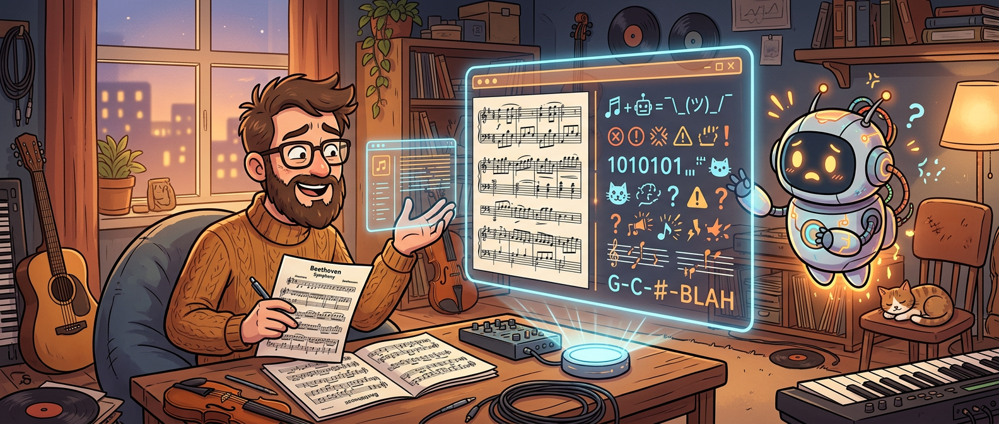

有些 AI 实验之所以有意思，不是因为它们赢了，而是因为它们失败得很有代表性。John D. Cook 这篇关于用 AI 把乐谱图片转成 LilyPond 代码的小测试，就属于这一类。

LilyPond 本身就是个很小众的东西，它有点像乐谱世界里的 TeX：你不是拖拽音符，而是写一种描述性语言，再把它编译成漂亮的五线谱。按理说，这类语言既冷门、样本量又不大，看起来不像是大模型特别擅长的题目。可 John 发现，直接让 AI 生成 LilyPond 代码，居然经常还能写得像模像样。于是他进一步问了个更刁钻的问题：**如果我给模型一张真实乐谱图片，它能不能把图上的内容忠实转成 LilyPond？**

结果很有戏剧性：**作为“识别后精确转录”的工具，它还不太行；作为“看图后猜风格、猜出处、顺手编一段像那么回事的音乐”的系统，它反而表现得过于积极。**

这篇文章最值得带走的，不是某个模型跑赢了谁，而是它把一个很典型的 AI 边界暴露得很清楚：模型在高层语义理解上经常已经够强，但在要求逐项忠实、结构严谨、不能自由发挥的任务上，仍然很容易开始即兴创作。

## 这不是一个“AI 会不会写 LilyPond”的问题，而是“AI 能不能老老实实抄谱”

John 一开始说得很实在：他之前已经有过让 AI 直接生成 LilyPond 代码的不错体验。这件事本身就挺说明问题。即便 LilyPond 是冷门语言，只要它在公开互联网上还有足够多示例，模型就可能学到一些模式，至少能生成看起来合语法、能编译、甚至排版效果不错的代码。

但这类成功，很容易让人误以为下一步自然就是“那它应该也能把一张乐谱图片准确转回来”。实际上，这两个问题的难度完全不是一个级别。

- **生成 LilyPond** 更像语言建模 + 一点音乐常识
- **从图片转录成 LilyPond** 则更像 OCR + 乐谱结构识别 + 严格对齐 + 零容错编码

后者难得多，因为你不只是要求模型“写出合理的东西”，而是要求它“别自由发挥，给我一模一样地抄出来”。而这恰恰是今天很多大模型最不稳定的部分。

## 模型最容易犯的，不是看不懂，而是看懂了一部分后开始补完剩下的部分

John 的实验特别有意思的地方，在于模型并不是完全胡来。无论是 Grok 还是 ChatGPT，都有一些“看起来很聪明”的表现：

- 能猜出片段可能来自 Bach
- 能识别 jazz standard 的曲名
- 能给出正确或接近正确的和弦标记
- 能感知风格，写出某种“像原作气质”的东西

问题是，用户根本没让它们作曲。

这里暴露出的，其实就是很多视觉-文本任务的典型风险：**模型一旦从局部信息里形成了高层判断，就很容易把“识别”滑向“生成”。**

这在普通对话里可能显得很聪明，因为它会补足上下文、猜测意图、让回答更流畅。但在乐谱转录、法律条文提取、财务数据抄录这类场景里，这种“聪明”反而是灾难。你要的是忠实还原，它给你的却是带主观补完的近似版本。

John 文里最有代表性的地方，就是 AI 不是没看到音符，而是看到一部分后，开始自信地编剩下的内容。某种意义上，这比完全看不懂更危险，因为输出表面上看起来还挺像回事。

## 乐谱这类任务特别难，因为它不是普通 OCR，而是高度结构化的视觉语言

从工程角度看，这篇文章还有一个很值得记住的点：乐谱根本不是“图片里有字，认出来就完了”那种 OCR 问题。

一页乐谱里同时混着很多层信息：

- 音符位置
- 节拍与小节结构
- 升降号与调号
- 和弦标记
- 标题与作曲作词信息
- 可能还有歌词、力度、演奏符号

这些元素不是平铺罗列的文本，而是一种高度依赖空间关系的视觉记谱系统。一个音符差一条线、一拍多半拍、一个休止符放错位置，意义都完全变了。

这也是为什么 John 的实验结果会呈现出一种很典型的错法：模型能抓住“这是 Bach”“这是 jazz”“这些 chord symbol 大概是什么”，但真到逐小节对齐、逐音符还原的时候，就开始崩。因为它擅长的是语义层压缩，不擅长在这种细粒度空间结构里做严谨转写。

## 这篇实验最值钱的地方，是它把“AI 哪一步已经能帮忙”说得比“它还不行”更清楚

我觉得这篇文章不该被解读成“AI 排版乐谱没戏”。更有价值的解读其实是：**AI 在这个工作流里已经能帮上一部分忙，但不能乱信。**

比如从文中的结果看，模型已经在这些层面表现出一定实用性：

- **识别出处或风格**：它可能猜出是哪首歌、哪位作曲家、什么风格
- **识别和弦标记**：对 jazz 片段里的 chord symbols 抓得还不错
- **快速起草 LilyPond 框架**：哪怕不准，也能给你一个可编译的起点
- **辅助人工校对**：让人工不是从零录入，而是从一个草稿开始修

这很像现在很多 AI 工具的真实位置。不是“完全自动化”，而是“把最机械的 30%-60% 工作先推过去，再由懂行的人做最后那段关键修正”。

如果你把它当成自动抄谱器，现在当然还不稳；但如果你把它当成一个**带强烈 improvisation 冲动的乐谱助理**，它已经不是完全没价值了。

## AI 时代最该警惕的，不是它答错，而是它在不该创作的时候特别想创作

这篇文章放回更大的 AI 工程语境里，也很有代表性。因为它其实不是只在说音乐，而是在说一个跨领域都成立的问题：

当任务要求**精确提取**时，模型却特别容易切换到**合理生成**模式。

这在很多专业场景都会出事：

- OCR 文档时改写原句
- 抽取表格时补全缺失数据
- 转录合同条款时擅自“润色”
- 从图像识别结构时自作主张补结构

乐谱只是把这个问题放大了。因为音乐符号天然精密，一旦错了，错得非常明显。可在别的领域，很多错误未必一眼看出来，反而更危险。

所以 John 这个实验虽然轻松，但其实很适合作为一个提醒：**AI 很擅长生成“像”的东西，但“像”不等于“对”。** 当你的任务要求的是保真，不是创意，那就必须给模型配上更强的校验链条，或者干脆把它放在辅助位而不是决定位。

## 这篇文章最该带走的一句话

如果要压成一句话，我会这么说：**现在的 AI 在乐谱图片转 LilyPond 这类任务上，更像一个有音乐直觉但纪律性很差的助理，能看出你在干嘛，却经常忍不住自己编下去。**

这也正是它最值得研究的地方。不是因为它已经做到了完全可靠，而是因为它把今天很多 AI 系统的真实边界暴露得很清楚：高层理解越来越强，低层保真仍然脆弱。

对真正要把 AI 接进专业工作流的人来说，这种失败实验往往比一堆成功宣传更有用。因为它提醒我们，哪些环节能放手，哪些环节还得盯紧。

## 参考

- [Typesetting sheet music with AI](https://www.johndcook.com/blog/2026/03/13/typesetting-sheet-music-with-ai/) — John D. Cook
- [LilyPond](https://lilypond.org/) — Official site
