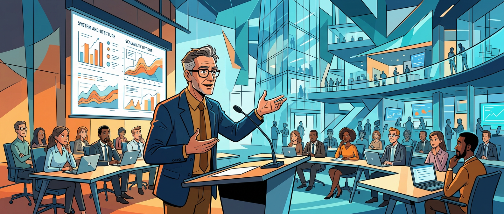

工程师圈子里有一种很常见的道德直觉：**ego 大的人不好合作，技术团队应该推崇谦逊。** 这话当然不是错的，毕竟谁都见过那种又爱压人、又听不进反馈、还总觉得自己永远没错的工程师。问题是，Sean Goedecke 这篇文章讲的是另一层更尴尬的现实：**如果你在一家足够大的技术公司里做工程，尤其是做到 senior、staff 这种层级，你可能还真的需要一点不太讲理的自我确信。**

这篇文章最值钱的地方，不是说“自负是美德”，而是它把工程师在大组织里实际需要的一种人格张力说清楚了：你得有足够大的 ego 才敢做判断、敢承担模糊、敢在复杂系统里往前拱；但如果你的 ego 大到不能服从组织、不能接受项目被砍、不能忍受政治现实，那你又会被组织很快修理。

这不是一个讨喜的结论，但挺像真的。

## 这篇文章的核心锚点，是它把 ego 重新定义成一种“能扛住不确定性的自我确信”

Sean 这里说的 ego，不是单纯指讨人厌、自恋或者爱抢功，而更接近一种带点不理性的强自信：**哪怕问题很复杂、系统很混乱、信息很不完整，我还是相信自己能摸出来。**

这个定义很重要，因为它把 ego 从“社交缺点”拉回了“工作机制”。在大代码库里做工程的人，其实每天都在面对一种很打击人的现实：

- 代码一上手往往就是错的
- 系统再熟也不代表你真的懂全貌
- 真遇到难问题时，起步阶段经常像在黑箱里乱摸
- 你知道自己知道得不够多，却还得继续推进

Sean 文里有个很关键的判断：如果没有一种足够强的内在确信，很多工程师其实根本没法在这种环境里持续行动。因为你越知道系统有多复杂，就越容易被“我是不是根本搞不定”这种感觉压住。

所以这里的 ego，不是装出来的傲慢，而更像一种心理支架。它让你在一片不确定里，仍然敢先往前走。

## 在大代码库里，光靠谦逊不够，你还得敢相信“我能搞明白”

Sean 先讲的是工程本身，这部分我觉得挺准。软件工程最反直觉的一点在于：它表面上很理性，实际工作体验却经常很混乱。你每天都在报错、打补丁、修误判、补认知盲区。再资深的人，也很少能对一个大系统做到真正稳定的“全局把握”。

这也是为什么很多工程问题最开始都很像不可能任务。你面对的是一片几百万行代码、几十个历史决策、无数上下游依赖，还有一堆不完整的信息。在这种情况下，纯粹的谦逊其实帮不了你太多。谦逊会告诉你“系统很复杂、我不该太自信”，这没错；但项目不会因为你态度端正就自己推进。

你终归还是得有人先跳进去，先试，先查，先做出一版判断。Sean 说工程师需要一种能对抗这种环境的 ego，我觉得说白了就是：**你得相信自己能从混乱里找出一点秩序。**

这也解释了为什么很多看起来优秀的工程师，私底下其实都带点“主角感”。不是他们真的觉得自己天下无敌，而是如果一点这种信念都没有，很多复杂问题压根开不了工。

## 真到了大公司，ego 的作用就不只是扛技术不确定性，而是支撑你去“表态”

Sean 后半篇真正更有意思的，是他把 ego 从技术层推进到组织层。

在大公司里，很多工程师的问题不是不会分析，而是不敢下结论。因为技术问题总是充满 trade-off：这条路也有道理，那条路也能讲通；你越懂细节，越知道自己可能错。这时候最舒服的姿势就是模糊一点、圆滑一点、别说死。

可组织不是靠“大家都很谨慎”运转的。很多时候，工程师真正的职责恰恰是：**在信息不完备的时候，依然给出一个清晰立场。**

Sean 这里的一个关键锚点是：如果工程师不愿意在模糊问题上明确表态，最后拍板的往往就会是更不懂技术的人。这个判断很现实。很多组织里的坏决策，不是因为没人看出风险，而是因为大家都觉得“这个问题太复杂了，我先别说太满”。最后非技术决策者只好按自己的直觉赌。

所以某种程度上，工程师需要 ego，是因为组织会逼着你在不确定里发言。你必须有一种近乎不讲理的心理力量，支撑自己在心里说一句：**虽然这事我也不能百分百确定，但我现在愿意站这个位置。**

## 大 ego 还体现在：你得敢得罪人，敢打断，敢纠正场面上的错误共识

Sean 文里另一个特别具体的锚点，是他讲到工程师需要有足够大的 ego 去做几件很多人本能上会回避的事：

- 采取明确立场
- 愿意惹一两个人不高兴
- 在会议里打断并纠正错误或模糊表述

这个观察非常像大组织现实。很多会议表面上气氛和谐，实际是在一层层把含糊假设往下传。大家点头、微笑、默认继续，不是因为都懂了，而是因为没人想冒着显得唐突或自大的风险去打断。

问题是，一旦所有人都“太会做人”，技术错误就会被带着礼貌一路推进，最后变成错误立项、错误预期和几个月白干。Sean 这里提到的那种工程师形象，其实就是：**得足够相信自己，才敢在大家都顺着场面往下走时站出来说一句“等一下，这里不对”。**

这类动作在社交上不讨喜，但在工程上经常是必要的。你不能只当一个温和的技术参与者，很多时候你还得当一个不合时宜的纠偏器。

## 但这篇文章更值钱的一半，是它也明确说了：ego 不能大到和组织对着干

如果 Sean 只讲到这里，这篇文章就会滑向一种很廉价的“强者工程师哲学”：要自信、要强势、要不怕冲突。可他后面补上的那一半，才是真正让文章成立的地方。

他说，真正有效的大厂工程师，往往又必须在某些场景里**意外地低 ego**。这不是人格分裂，而是组织生存技能。

原因很简单：你在技术问题上可以有很大裁量空间，但在组织目标本身上，工程师通常没有那么大的权力。老板、老板的老板、VP，才是决定方向的人。你可以争 implementation，可以争时机，可以争风险评估，但很多时候你并不能决定“公司到底做不做这件事”。

这正是很多资深工程师会 burn out 的地方。Sean 的锚点之一是：**burnout 常常不是因为工作太累，而是因为你投入很深，却发现自己根本没资格决定方向。**

这句话挺扎心，而且挺真。很多工程师在技术判断上长期被鼓励“大胆一点”“有主见一点”，于是慢慢会误以为自己也应该在组织方向上拥有同等分量。可一旦你在这件事上和 VP 顶起来，组织会非常迅速地提醒你：权力不是这么分的。

## 项目被砍、成果被埋、莫名挨政治流弹，这些都要求工程师把 ego 收回来

Sean 文里我觉得最有现实感的一部分，是他讲到大公司里那些很难受、但又非常常见的情境：

- 一个你拼命赶出来的项目，在上线前突然被取消
- 一件你明明做得不错的事，因为高层政治斗争反而伤到你 reputationally
- 一些需求本身其实只是上层随口一提，结果组织误判成战略重点，做完又发现没人真在乎

这些场景在小团队里也会发生，但在大公司里频率更高、体量更大、伤害也更钝。它们最磨人的地方，是你常常并不是因为技术做错了，而是被组织流动性和权力结构顺手碾了一下。

这时候，如果你的 ego 大到无法接受“我辛苦做的东西居然就这么没了”，那你很容易崩。Sean 这里的判断其实很冷：**真正能在大组织里持续有效的人，不只要能强硬推进，也得能吞下很多并不公平的结果。**

听着不浪漫，但大公司本来就不是浪漫场所。

## 这篇文章最尖锐的一点，是它把优秀工程师写成一种“组织变色龙”

Sean 最后的结论非常有辨识度：最成功的那类大厂工程师，往往像一种组织里的变色龙。

- 面对技术问题、平级协作、模糊争论时，要高 ego
- 面对高层权力、组织方向、项目生杀时，又得低 ego

这个说法听着有点犬儒，甚至有点不舒服，但恰恰因为不舒服，才像是真的。因为它点破了一件很多工程文章不太愿意承认的事：**工程能力在大组织里从来都不是单独起作用的，它总是和组织结构一起运作。**

你不能只会写代码、做架构、给判断，你还得知道什么时候该强，什么时候该退；什么时候坚持是负责，什么时候坚持只是自我投射；什么时候纠错是在保护项目，什么时候纠错是在和组织权力硬碰硬。

这不是每个人都想学的能力，但如果你真的想在大厂里长期有效，它可能比再学一门新语言更重要。

## 这篇文章最该带走的一句话

如果非要把它压成一句话，我会这么说：**大厂工程师需要的大 ego，不是为了显得自己厉害，而是为了在巨大不确定性和组织摩擦里，仍然敢判断、敢表态、敢推进；但真正能活下来的前提，是你也知道什么时候必须把 ego 收回去。**

Sean Goedecke 这篇文章的价值，就在于它没有把“谦逊”和“自信”讲成非此即彼的道德选择，而是讲成了大组织工程工作的真实张力。你不是越低 ego 越成熟，也不是越高 ego 越能做事。真正难的，是在不同场景里切换，而且切换得足够快。

对今天的工程师来说，这个判断甚至比单纯讨论 AI 是否改变软件工作更现实。因为哪怕写代码的方式继续变化，**人怎么在复杂组织里推动事情往前走**，依然会是那个很少被写进 JD、但决定你能走多远的核心能力。

## 参考

- [Big tech engineers need big egos](https://www.seangoedecke.com/big-tech-needs-big-egos/) — Sean Goedecke
- [A unified theory of ego, empathy and humility at work](https://matthogg.fyi/a-unified-theory-of-ego-empathy-and-humility-at-work/) — Matt Hogg
- [Nobody knows how large software products work](https://www.seangoedecke.com/nobody-knows-how-software-products-work/) — Sean Goedecke
- [Taking a position](https://www.seangoedecke.com/taking-a-position/) — Sean Goedecke
