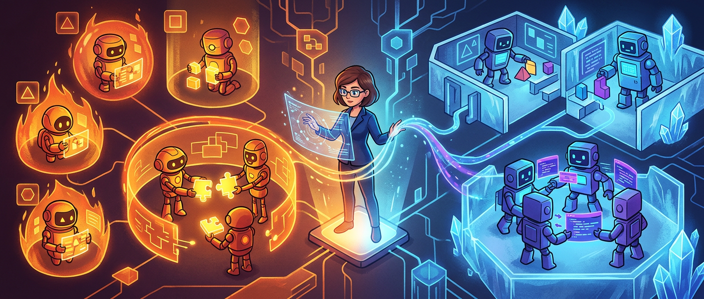

很多人一碰到复杂任务，就会条件反射地往“多 agent 系统”上靠。任务变复杂了？那就多分几个 agent。一个写代码，一个做测试，一个搞规划，再来几个互相 review，看上去就很高级。

Akshay Pachaar 这篇长帖最值得看的地方，就是它一上来先把这个冲动泼了盆冷水：**大多数人太早上多 agent，而且上的方式还错了。** 真正该先问的问题不是“我要不要多个 agent”，而是：**这个任务到底需要什么样的协调方式。**

这句话听起来像概念整理，实际非常关键。因为 Claude 现在给你的两套多 agent 模式，`sub-agents` 和 `agent teams`，虽然都长得像“多个 agent 一起干活”，但底层思路完全不是一回事。Akshay 这篇最有价值的，就是把它们拆开讲明白了。

## 先问协调方式，不要先问要不要多 agent

Akshay 的核心判断其实非常适合做多 agent 设计的起点：**任务一复杂，不代表你就需要一个会互相聊天、互相协调、持续存在的 agent 集群。**

很多时候，人们把“复杂”直接等同于“拆更多角色”，结果很容易把系统做成一场华丽的接力赛：planner 传给 implementer，implementer 再传给 tester，tester 再传回 orchestrator。角色看起来很清晰，信息却在每次交接里不断变形。

Akshay 的观点更像一个工程判断：先别迷信角色，先看**上下文怎么流动**、**任务怎么依赖**、**信息要不要持续共享**。这个顺序一倒过来，架构选择就会清楚很多。

## Sub-Agents：靠上下文隔离做并行和压缩

Akshay 对 sub-agents 的定义非常清楚：它们是**运行在独立上下文窗口里的专门 Claude 实例**。

他的比喻也很好懂。你可以把 parent agent 想成一个研究负责人，它不会自己把所有资料从头啃到尾，而是把具体问题分给几个研究员。研究员各自查完，最后只带着压缩过的结论回来。parent agent 再把这些结论综合成最后输出。

这就是 sub-agents 的工作方式。每个 sub-agent 会拿到：

- 自己的 system prompt
- 自己能调用的工具集合
- 干净、隔离的上下文窗口
- 一个明确的任务

关键点在于：**它完成后，返回给 parent 的不是完整推理过程，而是压缩后的最终结果。**

所以 Akshay 才会强调，sub-agents 的价值不只是 parallelism，而是 **compression**。这点很重要，因为很多人只把它理解成“并发跑多个 agent”，其实它更大的价值是：你让大量探索发生在局部上下文里，不把噪音直接倒进主 agent 的脑子里。

## Sub-Agents 的限制其实是优点

Akshay 提到一个很容易被误解的限制：sub-agents **不能再 spawn 别的 sub-agent，也不能彼此直接沟通**。所有信息都必须回到 parent，由 parent 统一协调。

这个设计很多人第一眼会觉得太笨：都多 agent 了，为什么不让他们自己聊？

但 Akshay 的判断是，这恰恰是它的优点。因为信息流足够清晰，系统就会更可预测。你知道：

- 决策中心在哪
- 信息汇总点在哪
- 哪些上下文是局部探索
- 哪些结果才会进入主线

这种约束非常适合那些**天然可分、天然可压缩**的任务，比如：

- 多路 research
- 独立的代码库探索
- 针对不同维度的审查（安全、性能、依赖、风格）
- 主 agent 只需要 summary，不需要每一步细节

说白了，sub-agents 更像“高质量外包工位”，不是一个真正长期共处的团队。

## Agent Teams：靠持续通信做协作

Agent teams 就完全是另一种东西了。

Akshay 的定义里，它们不是短命 worker，而是**持续存在、能彼此通信、还能围绕共享任务状态协作的长生命周期 agent 实例**。你可以把它理解成：不是临时雇几个研究员查资料，而是真的组了一支会持续配合的项目团队。

他拆出来的三部分很清楚：

- 一个负责协调和综合的 **team lead**
- 多个并行工作的 **teammates**
- 一个记录待办、进度、依赖关系的 **shared task list**

这里最关键的，不是“有 lead”，而是后两件事：
1. agent 可以持续存在并积累上下文
2. agent 之间可以直接沟通

这就意味着系统不再只是“发任务-收结果”，而是会出现真正的协作行为：一个 agent 发现接口结构不对，可以直接告诉另一个 agent 改；一个任务被阻塞，可以通过共享任务状态自动等待依赖完成，而不是靠 lead 一直人工编排。

## 真正的区别：fire-and-forget vs 持续协作

Akshay 把两者区别压成一句话，其实已经非常够用了：

- **sub-agents 是 fire-and-forget**
- **agent teams 是 ongoing coordination**

这就是本质差异。

Sub-agents 适合你把任务切开、扔出去、收结果。它们不会和彼此产生关系，也不会形成持续共享记忆。

Agent teams 则适合那种任务中途会不断冒出新发现，而且这些发现会立即影响别的任务线程。比如：

- 前端发现 API 返回结构根本不够用
- 后端需要立刻知道这个变化
- 测试 agent 要基于最新接口补测试
- 整个系统里每个角色都不能只盯着自己手里那块静态任务

一旦任务真正依赖这种动态协调，sub-agent 那种“查完回来汇报”的模式就不够了。

## 设计多 agent，别按角色拆，要按上下文拆

这篇长帖里我觉得最值钱的一句，不是 sub-agent vs team，而是 Akshay 对**拆分原则**的判断：

> 很多多 agent 设计之所以失败，不是因为 agent 不够聪明，而是因为人们按“角色”拆任务，而不是按“上下文”拆任务。

这个判断非常硬。因为按角色拆，看起来最自然：planner、coder、tester、reviewer，多整齐。但现实常常是，角色拆分带来的不是效率，而是信息退化。

planner 知道的，implementer 不全知道；implementer 决策过的，tester 又得重新猜。结果就是一个不断传话的电话游戏。

Akshay 的建议更接近工程直觉：先问这个子任务到底需要什么上下文。如果两个任务需要大量重叠信息，那它们大概率不该拆给两个 agent。只有当上下文真的可以隔离，而且接口足够清楚时，拆分才值。

他举的例子也很实用：实现功能的 agent，其实最好顺手把相关测试也写了。因为它已经拥有那个上下文。硬拆成“一个写实现、一个写测试”，很多时候只是在制造 handoff 成本。

这条建议我非常认同。它本质上是在说：**别为了看起来像组织架构图，就牺牲上下文连续性。**

## 真正常用的，其实是 5 种编排模式

Akshay 后面还把常见 orchestration pattern 收成了五类，这部分很适合拿来当实战 checklist：

- **Prompt chaining**：前一步输出给后一步，适合顺序依赖强的流程
- **Routing**：先分类，再把任务送给合适处理器
- **Parallelization**：把彼此独立的子任务并行跑掉
- **Orchestrator-worker**：中心 agent 负责拆解、分发、汇总
- **Evaluator-optimizer**：一个生成，一个评估，循环改进

这部分有个隐含信息很重要：真正的多 agent 系统，并不是一定要长得像“好几个 agent 一起聊天”。很多生产环境里最常见的，还是 `orchestrator-worker` 这种很克制的模式。

也就是说，很多人以为自己需要的是“agent 团队”，实际需要的可能只是一个会拆任务、会分发、会汇总的中心 agent，再加几个临时 worker。

## 什么时候根本不该上多 agent

Akshay 这篇最难得的一点，是它不是在推销复杂架构，而是在提醒你：**很多团队花了几个月搭多 agent pipeline，最后发现一个 prompt 写得更好的单 agent，效果差不多。**

这是特别值得写进脑子里的提醒。因为多 agent 最大的问题从来不是“能不能跑起来”，而是：

- 复杂度会不会超过收益
- 依赖和同步会不会比任务本身还麻烦
- 成本会不会一路失控

Akshay 给出的判断标准也很实用。多 agent 只有在三类场景下才真正值回票价：

1. **上下文保护**：某个子任务会产出大量主线不需要的噪音
2. **真实并行**：确实有多条独立 research / search 线程可以同时推进
3. **专业化**：任务需要冲突性 system prompt，或者工具太多导致单 agent 性能下降

反过来，如果 agent 之间一直要共享上下文、相互等待、频繁同步，那很可能你根本不该拆。

## 多 agent 最常见的失败方式

Akshay 最后列的 failure mode 也非常像真踩坑的人写出来的：

### 1. 任务描述太糊，agent 开始重复劳动

如果每个 agent 没有清楚的目标、输出格式、边界和禁区，它们很容易研究同一件事，还都以为自己在干正事。

### 2. 验证 agent 在“没验证”的情况下宣布成功

如果验证标准写得不具体，比如没有明确要求跑哪些测试、覆盖哪些 case、满足什么条件才能算完成，系统就很容易产出假阳性。

### 3. token 成本增长得比你想象快

这点对今天的 agent 系统尤其现实。Akshay 的建议是：不同任务分层用模型，把贵模型放在真需要的地方，别让 routine work 也一直烧最贵的配置。

这三条其实说明了一个更底层的问题：**多 agent 架构失败，很多时候不是因为 agent 不够强，而是因为任务边界、验证边界和成本边界没有设计好。**

## 最后那条原则，才是真正该记住的

Akshay 最后给了一个非常好的收束：**围绕上下文边界设计，而不是围绕角色或组织图设计。**

这几乎可以当成所有多 agent 设计的总原则。

如果你不知道要不要拆，就先别拆。先用单 agent 做，推到它真的出问题的地方。等你看清楚它是在哪种边界上失效，再只针对那个边界增加复杂度。

这比一开始就画一个很酷的多 agent 架构图靠谱得多。

因为很多时候，真正好的 agent 设计不是“组件更多”，而是**复杂度只出现在确实需要它的地方。**

## 参考

- [Claude Subagents vs. Agent Teams, explained](https://x.com/akshay_pachaar/status/2033167408463069526) — Akshay Pachaar
- [Claude Code / Agents docs](https://docs.anthropic.com/) — Anthropic
