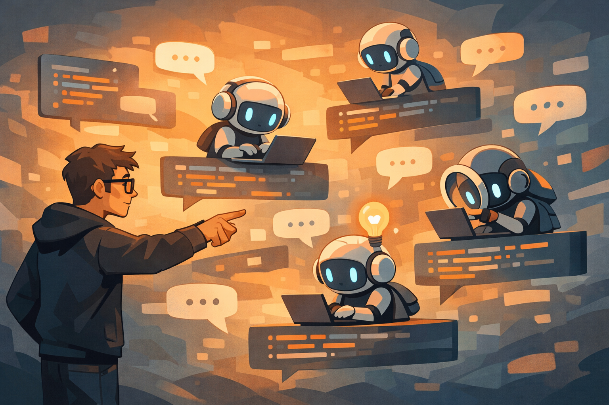

“AI 会不会终结编程”这类标题，现在已经有点像科技媒体的固定节目了。每隔一阵，大家就会把这个问题重新端出来，换一批例子，再吵一轮。

但 Clive Thompson 这篇写给《纽约时报杂志》的长文，真正值得看的地方，不是它又把“程序员要完了”拿出来吓人，而是它抓到了一个更具体、也更真实的变化：**很多程序员还在做软件，只是他们越来越少把时间花在“亲手一行行写代码”上。**

Slashdot 转引这篇文章时，挑出了几个特别有代表性的细节：Google 内部说 AI 给工程速度平均带来了大约 10% 的提升；一些创业公司里，接近 100% 的代码已经由 AI 生成；有人把手下那群 Claude agents 形容成“正在学习如何合作的外星智能”；也有人明确感觉到，自己写代码的手感正在退化。

这些细节摆在一起，比“取代”两个字更值得琢磨。因为它们说明的不是一个职业突然消失，而是：**程序员的工作重心，正在从直接构造，往描述、判断、验收和纠偏转移。**

## 这篇最有价值的是它写到了“怪”

报道里最抓人的一句，不是关于效率数字，而是那句：很多硅谷程序员现在“几乎已经不怎么编程了”，他们在做的是一种**非常、非常怪的事**。

这个“怪”其实点得很准。

以前说写软件，默认画面是一个人对着编辑器敲代码、调试、改逻辑。现在越来越多时候，真实画面变成了另一种样子：你先用自然语言把目标讲给 agent，等它给出计划，再决定放不放行；它跑完之后，你再检查结果、补边界、追 bug、骂它为什么没跑测试。

《纽约时报》能抓到的开头场景也很典型：创业公司 Hyperspell 的 Manu Ebert 看着 Claude Code 同时开几个 agent，一个写功能，一个做测试，另一个负责监督。客户要加一个功能，现在半小时就能搞完；放在过去，他说光这一件事就要一天。

这不是“代码突然不重要”了，而是**代码越来越像中间产物，不再是程序员每天最主要的体力劳动。**

## 程序员更像建筑师，不再像施工工人

Slashdot 转述里还有一个很关键的比喻：程序员现在更像 architect，而不是 construction worker。

这话听起来有点俗，但放在 AI coding 的现实里，其实相当准确。

因为现在最吃重的那部分能力，慢慢不是“你能不能迅速把某个 for 循环敲出来”，而是：

- 你能不能把目标描述清楚
- 你能不能判断 agent 的方案靠不靠谱
- 你能不能看出哪些地方只是“看起来能跑”
- 你能不能在系统失控前及时踩刹车

说白了，**生成代码的边际成本下来了，判断代码是否该存在、该怎么接进系统、出了问题怎么收场，这些事反而更值钱了。**

这也是为什么报道里有人说，现在的工作更像 Steve Jobs 式的原型筛选：让一堆系统先吐出候选方案，再由人来决定哪个方向是对的。

这个变化并不轻松。它甚至有点别扭。因为很多开发者当年入行，本来就不是为了当“提示词经理”或者“AI 审片人”。他们喜欢的，恰恰是亲手搭东西的那种控制感。

## Kent Beck 的兴奋和苹果工程师的不爽，都是真的

这篇文章里最有意思的一点，是它没有把所有人写成同一种态度。

一边是 Kent Beck 这样的老牌编程人物，重新被 LLM 激活了，做项目比以前更快，还把这种不确定性感受成某种“老虎机式上瘾”。这个表述很怪，但很诚实：AI 写代码的快感，很多时候确实不只是效率，而是那种“我一说它就开始长东西”的即时反馈。

另一边，也有人非常明确地不开心。报道里那位匿名苹果工程师说得很直白：写代码本来就是他觉得有趣、有满足感的事，如果全让机器代劳，等于把这份热情外包掉了。

这两种感受并不冲突，甚至可以同时存在于同一个人身上。

你可以一边承认：AI 确实能让很多麻烦活变快。另一边又觉得：自己最喜欢的那部分手艺感，被稀释了。

这就是这轮变化麻烦的地方。它不像过去某些工具升级，只是把同一件事做得更快。它是在偷偷改写“做这份工作到底算什么”。

## Google 的 10%，和创业公司的 100%，说明的不是同一件事

报道里提到 Google 观察到平均大约 10% 的 engineering velocity 提升，同时 Google 内部 AI 生成代码的比例还不到 50%；而一些创业公司里，接近 100% 的代码都交给 AI 了。

这两个数字放一起看，比单独看更有意思。

它说明了一件很现实的事：**AI 对编程的影响，不会是所有组织同步、同幅度地变化。**

在成熟大公司里，系统重、边界多、历史包袱大、验证链条长。你当然能让 AI 帮忙写测试、搭脚手架、做局部修改，但大改动天然就慢，因为慢的根本不只是“写代码”那一步。

而在小团队、早期产品或者原型阶段，很多代码本来就更像“快速试出一个能工作的版本”。这时候 AI 的提速会显得夸张得多，甚至让“几乎全交给 AI 先生成”成为默认做法。

所以如果有人拿创业公司里 100% AI 生成代码的现象，直接推出“大厂程序员明年就没了”，那基本是在偷换语境。

## 真正危险的，不是 AI 写了很多代码

这篇报道里我更在意的，其实不是“AI 写了多少”，而是另一句：一些新开发者已经能感觉到，自己的技能在变弱。

这点不能轻飘飘带过。

因为 AI 对程序员最大的风险，也许不是岗位一下子没了，而是**你在生产力上越来越依赖它，但在理解力上没有同步长出来。**

如果一个人天天都能靠 agent 把功能堆出来，却越来越少自己拆问题、自己调试、自己判断系统边界，那几年之后很可能会出现一种尴尬状态：

- 小活做得飞快
- 稍微复杂一点的问题就离不开模型
- 系统一旦出非常规故障，自己接不住

这不是危言耸听，而是任何自动化工具都可能带来的经典副作用。区别只是，这次自动化碰到的不是体力活，而是原本被视为“脑力核心”的那部分工作。

## 反对者担心的，也不只是饭碗

报道里提到的反对声音也值得保留，不该被一股脑写成“老古董不接受新技术”。

反对者担心的至少有四类问题：

- 训练和推理带来的能源消耗
- 模型训练对版权作品的掠夺式使用
- 高速产出会不会堆出一大坨松垮、难维护的代码
- 公司会不会把 agent 当成压价和施压工具

这些担心里，有些是伦理问题，有些是工程质量问题，有些是劳动关系问题。它们不是一个“你会不会用 AI”就能抹掉的。

尤其是代码质量这块，今天很多团队其实已经隐约踩到了：AI 最擅长的是把局部补齐，但一个系统真正难维护的地方，往往是跨模块约束、历史兼容性、异常路径、长期演化成本。这些地方正好不容易在一轮对话里被看全。

所以“AI 会写很多代码”本身不是答案。关键是，**谁来替这些代码的后果负责。**

## 编程没有结束，只是“写”不再等于全部

这篇文章如果硬要压成一句话，我觉得不是“编程结束了”，而是：**编程这份工作正在从手工产出，变成高密度判断。**

这并不意味着代码不重要。恰恰相反，代码还是系统落地的材料。只是越来越多时候，你的价值不在于手速，而在于你能不能把一堆快速生成的东西变成可靠的软件。

这也是为什么我不太喜欢“终结编程”这种说法。它会把讨论带偏，好像问题只剩下“程序员会不会被替代”。

真正更值得问的是：

- 哪些能力正在升值？
- 哪些经验会更快折旧？
- 新人应该怎么避免只剩下调用 agent 的表面熟练？
- 团队该怎么把“快”换成“稳”，而不是换成更多技术债？

这些问题，明显比标题更难，但也更接近现实。

AI 没有让编程消失。它只是先把程序员每天到底在干什么，改得越来越不像以前了。

## 参考

- [Will AI Bring 'the End of Computer Programming As We Know It'?](https://developers.slashdot.org/story/26/03/14/2137238/will-ai-bring-the-end-of-computer-programming-as-we-know-it?utm_source=rss1.0mainlinkanon&utm_medium=feed) — Slashdot
- [Coding After Coders: The End of Computer Programming as We Know It](https://www.nytimes.com/2026/03/12/magazine/ai-coding-programming-jobs-claude-chatgpt.html?unlocked_article_code=1.TFA.JuvB.P-MSK-ymmFUc&smid=url-share) — Clive Thompson / The New York Times Magazine
