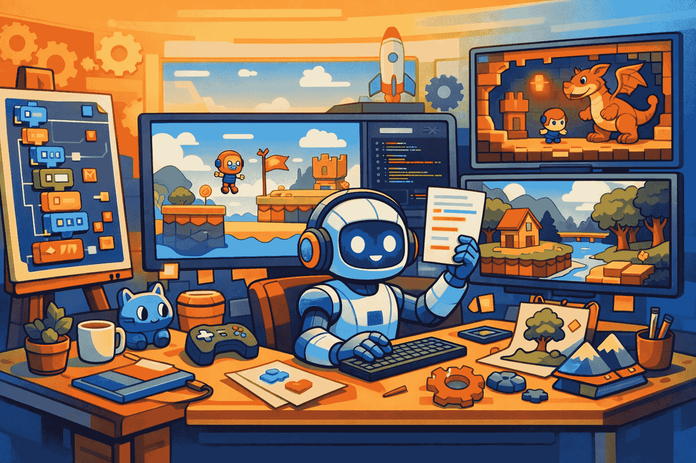

“用 AI 做游戏”现在已经不新鲜了。真正稀缺的，反而是那些不只会吐一点概念图、脚本片段或者半成品 demo，而是敢说：**给我一个游戏描述，我尽量帮你落成一个真的 Godot 项目。**

`godogen` 就是在往这个方向冲。

这个项目来自 `htdt`，定位非常直接：它不是一个给开发者“参考一下”的灵感仓库，而是一组 Claude Code skills，目标是把一段游戏描述，推进成一个完整的 Godot 4 工程——有场景树、有脚本、有资源组织、有截图反馈，甚至还有一轮视觉 QA 回路。

这就比“AI 帮你写点游戏代码”更像一回事了。

## 它交付的不是代码片段，而是项目

README 里最值得注意的一句，是它强调输出是 **a real Godot 4 project**。

这个表述很关键。因为很多所谓 AI 游戏生成，最后交出来的东西本质上只是：

- 几个脚本文件
- 一点资源草图
- 一个缺失运行上下文的 demo
- 或者一段“你再手动补一下就能跑”的伪成品

而 `godogen` 的目标明显更重。它想做的是把这些碎片缝成一个有组织的工程：

- scene tree 不是乱长的
- scripts 是可读、可维护的
- assets 有基本结构
- 还能在运行后截图，再拿视觉模型回头挑毛病

也就是说，它想解决的不是“AI 会不会写几行 GDScript”，而是：**能不能让 agent 真的承担起从想法到项目骨架的那段重活。**

## 最有价值的是它把游戏生成拆成了流水线

`godogen` 最有意思的地方，不在单点能力，而在它承认“做游戏”不是一把梭的 prompt 能解决的。

项目里把整个流程拆成了一条相对完整的 agent pipeline：

1. **先规划架构**
2. **再生成资源**
3. **写 GDScript 和场景结构**
4. **运行 Godot 项目**
5. **截图**
6. **做视觉 QA**
7. **根据实际结果再修**

这个拆法很对味。因为游戏开发最麻烦的地方，本来就不是单纯“把代码写出来”，而是很多问题只有跑起来才暴露：

- 层级不对
- 贴图丢了
- 物理表现怪异
- 3D 资源比例翻车
- 视觉上完全不像你脑子里那回事

所以它引入截图和视觉检查，其实是在补很多 coding agent 都天然缺的一块：**模型得看到运行结果，而不是只看自己刚写的文本。**

这会让整个系统从“生成”更接近“闭环修正”。

## 两个 Claude Code skills 分工，是个很像样的设计

README 里提到，整套流程由两个 Claude Code skills 编排：一个负责 plan，一个负责 execute，而且每个任务都尽量在 fresh context 里跑，避免上下文越滚越脏。

这套思路我挺认同。

因为做这类长流程任务时，一个常见死法就是：所有东西都塞进一个上下文，最后模型前半段想的是玩法设计，中间切到资源生成，后半段又开始修 Godot 节点树，结果整个脑子像塞满便签纸的垃圾桶。

把“规划”和“执行”拆开，至少有两个现实好处：

- **职责更清楚**：谁负责想结构，谁负责把结构落地
- **上下文更干净**：每个阶段都不用背一整坨历史包袱

这其实已经不是简单的“提示词工程”，而是更接近 agent workflow design 了。

## 它对 GDScript 的处理，说明作者真的踩过坑

项目里还有一个特别值得注意的设计：它专门补了 **GDScript reference** 和 **850+ Godot classes 的 lazy-loaded API docs**。

这很说明问题。

因为 GDScript 这类语言，对通用大模型来说，通常不算训练最扎实的区域。你让模型写点 Python、TS、React，它大概率比较顺；但一旦进到 Godot 生态，尤其是具体 API、场景节点、引擎细节，就更容易一本正经地乱来。

所以 `godogen` 没有假装“模型自己都会”，而是主动给它补上下文基础设施。这件事看上去低调，实际上非常关键：**不是让模型更天才，而是尽量别让它在不熟的语言生态里硬装懂。**

这也是为什么我会觉得它不像那种只会在 README 里吹能力的项目。因为它显然知道，GDScript 不是你光靠信仰就能稳定写对的。

## 资源生成和 3D 转换，也被纳入了同一条管道

`godogen` 不是只做代码生成，它还把资源生产也吃进来了。

README 里给出的配置是：

- **Gemini** 负责 2D 贴图和美术资源
- **Tripo3D** 负责把部分图像转成 3D 模型

这让它更像“游戏原型工厂”，而不是单纯的代码助手。

当然，这里也能看出它的边界：它更适合的是**快速原型、概念验证、低到中等复杂度项目搭骨架**，而不是一上来就指望它做出商业级美术生产流水线。

但即便如此，把资源和代码一起纳入 agent 可调度范围，本身已经很有代表性了。因为这说明现在不少人探索的方向，已经不是“AI 帮我编程”，而是“AI 帮我把一个多模态制作流程先跑起来”。

## 它最现实的提醒：这玩意很慢，而且最好上云

这个项目还有个很诚实的地方：它没有假装一切都轻松丝滑。

README 直接写了，一次完整生成可能要花 **几个小时**。而且推荐放到云 VM 上跑，最好还带 GPU，方便 Godot 截图那部分工作。

这点很重要。

因为很多 AI 工具演示喜欢制造一种错觉：好像你输一句话，几分钟后整个系统就神奇完成了。但真正要走到“完整项目 + 截图检查 + 修回路”这个层级时，时间成本和资源成本都会迅速上来。

换句话说，`godogen` 更像一个真正的生产管道试验，而不是桌面级玩具。

它值钱的地方，也正是这种“没那么轻，但确实更接近真实工作流”的味道。

## 更像未来工作流的原型，而不是成品答案

我觉得 `godogen` 最值得看的，不是它今天到底能不能稳定生成一个让所有人都满意的游戏，而是它把一个趋势提前摆在了桌上：

**未来的 AI 游戏制作，很可能不是一个万能模型单刷，而是一串可分工、可运行、可观察、可回修的 agent 流水线。**

在这个视角下，`godogen` 更像一个原型：

- 规划是一个阶段
- 编码是一个阶段
- 资源生成是一个阶段
- 运行验证是一个阶段
- 视觉检查又是一个阶段

这比“AI 会做游戏吗”这种空问题实在得多。它已经在回答一个更具体的问题：**如果真要让 agent 参与做游戏，流程该怎么搭。**

## 它不一定适合所有人，但很适合拿来观察方向

如果你是独立开发者、Godot 玩家，或者本身就在研究 coding agent / agent engineering，这项目很值得看。

原因不是因为它已经把“自动做游戏”彻底做成了，而是因为它把一套挺完整的实验框架摆出来了：

- 技能怎么组织
- 规划和执行怎么拆
- 引擎截图怎么纳入反馈
- 语言盲区怎么用 docs 补
- 资源生成怎么进同一条流水线

这几个问题，任何以后想做“AI + 游戏制作”系统的人，基本都绕不过去。

所以我会把 `godogen` 看成一个很有代表性的信号：AI 游戏开发这件事，正在从“会写小游戏脚本”往“能不能先自动搭出一整个项目骨架”推进。

它离一键造爆款游戏当然还远，但离“值得认真研究的 agent 工作流样本”，已经很近了。

## 参考

- [htdt/godogen](https://github.com/htdt/godogen) — GitHub
- [Watch the demos](https://youtu.be/eUz19GROIpY) — YouTube
