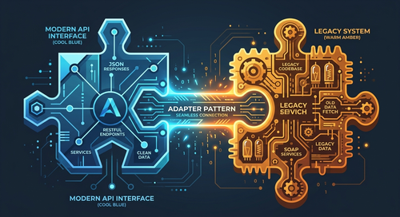

集成第三方服务几乎是每个 .NET 项目都绕不过去的事。支付网关、云存储、消息队列、老旧内部系统……每个系统都有自己的请求格式、认证方式和响应结构。如果直接把这些差异暴露在业务层，随着项目增长，代码会越来越难以维护。

适配器模式（Adapter Pattern）是一种结构型设计模式，专门用来解决这类问题。它的核心思路是：用一层"翻译"把外部系统的接口转换成应用程序期望的接口，让业务层完全不知道背后用的是哪套实现。

## 问题从哪里来

设想你的应用定义了一个支付接口：

```csharp
public interface IPaymentProcessor
{
    void ProcessPayment(decimal amount);
}
```

整个系统都依赖这个抽象。但现在有个遗留支付服务长这样：

```csharp
public class LegacyPaymentService
{
    public void MakePayment(string amount)
    {
        Console.WriteLine($"Processing payment of {amount} via legacy system.");
    }
}
```

两者之间有两个不兼容的地方：方法名不同（`ProcessPayment` vs `MakePayment`），参数类型也不同（`decimal` vs `string`）。而且你没有权限修改这个遗留服务。

如果直接在业务代码里手工做转换，今天是一个地方，明天是十个，等到要换掉这个遗留服务的时候，改动范围会让你头疼。

## 适配器模式是什么

适配器模式将一个类的接口转换成客户端期待的另一种接口，使原本由于接口不兼容而无法协作的类可以一起工作。

更直白地说：**适配器包了一层外壳，对外暴露干净统一的接口，对内调用第三方或遗留系统的实际实现。**

它能带来的好处：

- 业务逻辑与外部实现完全解耦
- 需要换供应商时只替换适配器，不动业务代码
- 更容易写单元测试（mock 接口即可）
- 减少因外部 API 变化引发的破坏性改动

## 第一个例子：对接遗留支付服务

### 创建适配器

```csharp
public class PaymentAdapter(LegacyPaymentService legacyService) : IPaymentProcessor
{
    public void ProcessPayment(decimal amount)
    {
        string amountString = amount.ToString("F2");
        legacyService.MakePayment(amountString);
    }
}
```

适配器做了三件事：

1. 实现应用程序的接口（`IPaymentProcessor`）
2. 把 `decimal` 转成 `string`（格式转换）
3. 委托给遗留服务的真实方法

### 使用适配器

```csharp
internal class Program
{
    static void Main(string[] args)
    {
        LegacyPaymentService legacyService = new();
        IPaymentProcessor paymentProcessor = new PaymentAdapter(legacyService);
        paymentProcessor.ProcessPayment(123.4567868m);
    }
}
```

业务代码只需要知道 `IPaymentProcessor`，遗留系统完全被隔离在外。

## 两种适配器形式

### 对象适配器（推荐）

通过**持有引用**来委托调用，适合：

- 第三方库（无法修改原类）
- 需要灵活组合多个依赖
- 大多数 .NET 场景

### 类适配器

通过**继承**来适配，适合：

- 可以继承目标类的场景
- 目标类未被 `sealed`
- 对性能极度敏感的场景

在 .NET 中，对象适配器是更常见也更推荐的选择——继承会带来额外的耦合，而 DI 容器和接口组合让对象适配器更自然。

## 第二个例子：多云存储切换

这是一个更贴近生产的场景：系统需要同时支持 Amazon S3、Azure Blob Storage 和 Google Cloud Storage，而每家 SDK 的 API 完全不同。

### 定义统一接口

```csharp
public interface ICloudStorage
{
    Task UploadFileAsync(string containerName, string fileName, Stream fileStream);
    Task<Stream> DownloadFileAsync(string containerName, string fileName);
    Task DeleteFileAsync(string containerName, string fileName);
}
```

这是整个系统的契约，业务代码只依赖这个接口。

### 实现 Google Cloud 适配器

```csharp
public class GoogleCloudStorageAdapter : ICloudStorage
{
    private readonly StorageClient _storageClient;

    public GoogleCloudStorageAdapter(StorageClient storageClient)
    {
        _storageClient = storageClient;
    }

    public async Task UploadFileAsync(string containerName, string fileName, Stream fileStream)
    {
        await _storageClient.UploadObjectAsync(containerName, fileName, null, fileStream);
    }

    public async Task<Stream> DownloadFileAsync(string containerName, string fileName)
    {
        MemoryStream memoryStream = new();
        await _storageClient.DownloadObjectAsync(containerName, fileName, memoryStream);
        memoryStream.Position = 0;
        return memoryStream;
    }

    public async Task DeleteFileAsync(string containerName, string fileName)
    {
        await _storageClient.DeleteObjectAsync(containerName, fileName);
    }
}
```

适配器把 Google SDK 的方法签名（`UploadObjectAsync`、`DownloadObjectAsync`、`DeleteObjectAsync`）映射到了统一接口上，调用方完全感知不到底层用的是哪家云。

### 依赖注入配置

```csharp
builder.Services.AddTransient<Func<string, ICloudStorage>>(sp => provider =>
{
    return provider switch
    {
        "Azure"  => sp.GetRequiredService<AzureBlobStorageAdapter>(),
        "Google" => sp.GetRequiredService<GoogleCloudStorageAdapter>(),
        "AWS"    => sp.GetRequiredService<S3StorageAdapter>(),
        _        => throw new ArgumentException("Unsupported cloud provider")
    };
});
```

通过工厂函数，在运行时根据配置动态选择适配器。如果你要新增一家云供应商，只需要再写一个适配器类，DI 配置加一行，其余业务代码完全不需要改。



## 适合用的场景

- **接入第三方 API**：支付、短信、邮件、地图等——每家接口都不一样
- **对接遗留系统**：无法修改老代码，只能在外面包一层
- **多供应商标准化**：同一类服务有多个实现，要统一接口
- **迁移过渡期**：新旧两套实现并存，通过适配器灰度切换

## 不适合用的场景

- 接口本身已经兼容，强加适配器只是增加中间层
- 转换逻辑极其简单，直接用 helper 函数更清晰
- 对性能有极端要求，每次调用多一次间接转发不可接受
- 系统够小，额外的抽象层只会带来复杂度，没有可维护性收益

## 适配器 vs 装饰器

这两个模式有时会被混淆：

- **适配器**：改变接口（让不兼容的接口能一起用）
- **装饰器**：保持接口不变，增加行为（如日志、缓存、重试）

判断方法很简单：如果你需要"翻译接口"，用适配器；如果你只是想"叠加功能"，用装饰器。

## 小结

适配器模式的价值在于把"外部系统的差异"封装在一个地方。不管第三方怎么改 API、你想换哪家云、还是要接入一个十年前写的老系统——业务代码都不必知道这些细节。

实际使用时，记住几个要点：

- 先定义好你的接口契约，不要让外部接口影响你的设计
- 优先用对象适配器（持有引用），避免继承带来的耦合
- 结合 DI 容器和工厂函数，可以在运行时灵活切换实现
- 接口越稳定，切换成本就越低

## 参考

- [原文：Adapter Pattern in .NET: How to Simplify Third-Party Integrations](https://thecodeman.net/posts/simplifying-integration-with-adapter-pattern)
- [Design Patterns that Deliver ebook - Stefan Đokić](https://thecodeman.net/design-patterns-that-deliver-ebook)
