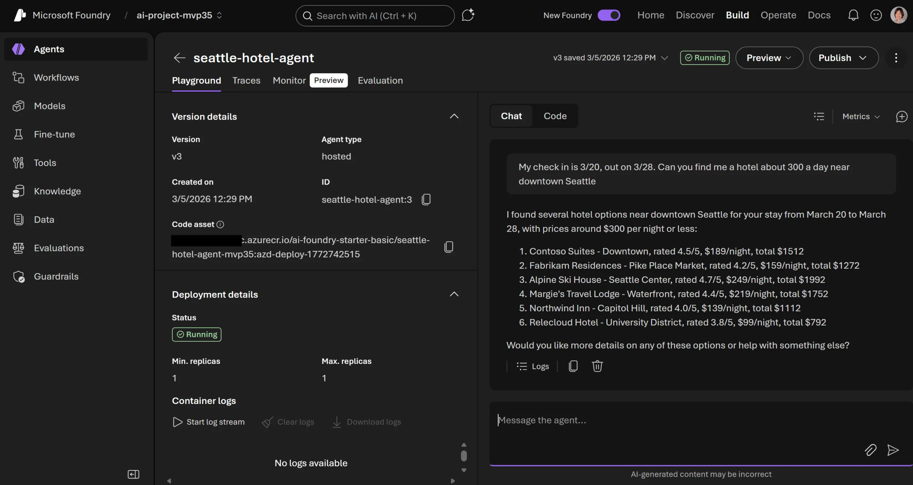
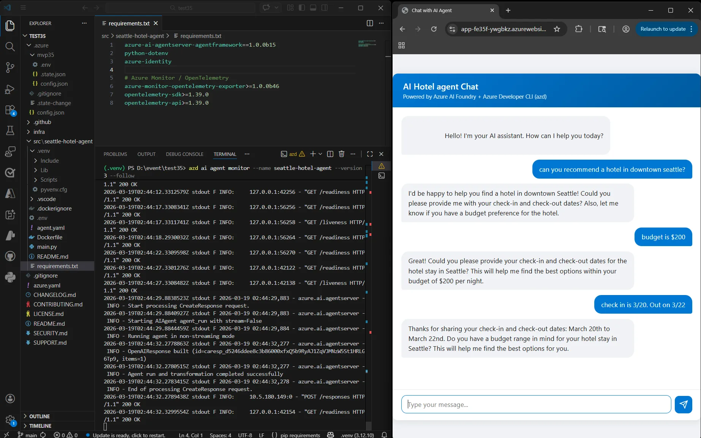

你已经写好了一个 AI Agent，本地运行也没问题。然后呢？

把 Agent 从笔记本电脑搬到 Microsoft Foundry 的生产端点，通常意味着手动配置资源组、模型部署、托管身份、RBAC 角色分配——这还没算监控和调试。`azd ai agent` 命令把这些环节压缩到两条命令里。

本文是完整的端到端操作记录：部署 Agent、从终端调用它、本地开发迭代、实时查看日志，全程在 VS Code 里完成。


## 前置条件

开始之前确认以下几项已就绪：

- [VS Code](https://code.visualstudio.com/) 已安装
- [Azure Developer CLI（azd）](https://learn.microsoft.com/azure/developer/azure-developer-cli/install-azd) 已安装
- [Git](https://git-scm.com/) 已安装
- 拥有可访问 [Microsoft Foundry](https://ai.azure.com/) 的 Azure 订阅，并确认目标区域有 GPT-4o 等模型的配额

## 克隆示例 Agent 项目

这里使用一个 Python 编写的西雅图酒店礼宾 Agent 作为演示：

```bash
git clone https://github.com/puicchan/seattle-hotel-agent
cd seattle-hotel-agent
code .
```

用 VS Code 打开后，所有后续操作都在集成终端里完成。

## 两条命令完成部署

先登录 Azure：

```bash
azd auth login
```

然后初始化并部署：

```bash
azd ai agent init
azd up
```

`azd ai agent init` 会在你的仓库里生成完整的基础设施即代码（IaC）定义；`azd up` 负责在 Azure 上把这些资源都创建出来，再把 Agent 发布到 Foundry。部署完成后，终端会打印一个直接指向 Foundry Portal 中 Agent 的链接。

### 生成了什么

`azd ai agent init` 在仓库里写入以下文件：

- `infra/main.bicep`——汇总所有资源的入口 Bicep 模板
- **Foundry Resource**（AI 资源的顶层容器）和 **Foundry Project**（Agent 的运行项目）
- **模型部署**配置（如 GPT-4o）
- **托管身份**及 RBAC 角色分配，让 Agent 可以安全访问模型和数据源
- `azure.yaml`——azd 服务映射，把 Agent 代码和 Foundry 主机绑定
- `agent.yaml`——Agent 定义文件，包含元数据和环境变量

这些文件都在你的仓库里，可以检查、修改、纳入版本控制。

## 在 Foundry Playground 里试用

部署完成后，点击终端里打印的 Foundry 链接，就能直接在浏览器里与 Agent 对话。试问它：

> "西雅图市中心酒店有哪些套房可以预订？"



## 从终端调用 Agent

不用打开浏览器，在 VS Code 终端里直接发送请求：

```bash
azd ai agent invoke
```

这条命令把提示词发给**远程** Agent 端点，并且保留多轮对话上下文。有个细节值得记一下：当本地 Agent 正在运行时（见下一节），`azd ai agent invoke` 会自动切换到本地实例，不需要改任何参数。

## 本地运行，快速迭代

改了 Agent 逻辑之后，不必每次都重新部署，直接在本地启动：

```bash
azd ai agent run
```

再开一个终端，用 `azd ai agent invoke` 对着本地实例发请求。改代码、重启、再调用——整个反馈循环控制在秒级，适合高频迭代。

## 实时监控日志

这是调试体验里最实用的一个命令：

```bash
azd ai agent monitor
```

默认打印最近约 50 条日志后退出。加上 `--follow` 参数可以持续流式输出：

```bash
azd ai agent monitor --follow
```

如果你有前端应用或任何客户端在消费这个 Agent 端点，通过这个命令可以实时看到每一条请求和响应，对排查生产问题很有帮助。

## 检查 Agent 健康状态

想快速确认 Agent 是否正常运行：

```bash
azd ai agent show
```

输出会告诉你已发布的 Agent 是否健康，以及部署的关键元数据。

## 清理资源

跑完这个演示后，删掉所有 Azure 资源避免持续计费：

```bash
azd down
```

## 加餐：接入前端聊天应用

想通过真实 UI 体验 Agent 完整闭环？官方提供了一个轻量级聊天应用，直接指向你刚才部署的 Agent：

```bash
git clone https://github.com/puicchan/chat-app-foundry
cd chat-app-foundry
```

通过环境变量把聊天应用指向你的 Agent（这些值可以从 `azd up` 的输出或在 `seattle-hotel-agent` 目录运行 `azd env get-values` 获取）：

```bash
azd env set AZURE_AI_AGENT_NAME "seattle-hotel-agent"
azd env set AZURE_AI_AGENT_VERSION "<version-number>"
azd env set AI_ACCOUNT_NAME "<your-ai-account-name>"
azd env set AI_ACCOUNT_RESOURCE_GROUP "<your-resource-group>"
azd env set AZURE_AI_FOUNDRY_ENDPOINT "<your-foundry-endpoint>"
```

然后部署聊天应用：

```bash
azd up
```

应用运行后，另开一个终端启动日志流式输出：

```bash
azd ai agent monitor --follow
```

在聊天 UI 里问一个问题，同时观察终端里的日志——请求从浏览器出发，打到 Foundry 上的 Agent，响应流回终端，整条链路一目了然。



## 命令速查

| 命令 | 作用 |
|------|------|
| `azd ai agent init` | 生成 Foundry Agent 项目的 IaC 文件 |
| `azd up` | 创建 Azure 资源并部署 Agent |
| `azd ai agent invoke` | 向远端或本地 Agent 发送提示词 |
| `azd ai agent run` | 在本地运行 Agent（用于开发） |
| `azd ai agent monitor` | 流式输出已发布 Agent 的实时日志 |
| `azd ai agent show` | 查看已发布 Agent 的健康状态 |
| `azd down` | 删除所有 Azure 资源 |

## 后续方向

这套工作流是 AI Agent 开发内循环的完整形态：构建、部署、测试、监控，全在终端里。同样的 `azd` 工作流也可以接入 CI/CD 流水线——在 GitHub Actions 中加一步 `azd up` 就能实现每次推送到 `main` 分支自动部署；用 `azd env` 管理开发、预发布、生产多套环境，命令不变。

`azd ai agent` 系列命令由 Foundry 团队开发的 azd 扩展驱动，是合作团队扩展 azd 来支持新主机和工作流的一个范例。目前这套命令还在持续演进，本地开发测试和实时监控能力都已可用，目标是让 Agent 完整生命周期——从脚手架到评测再到生产监控——全部收敛到终端里。

## 参考

- [原文链接](https://devblogs.microsoft.com/azure-sdk/azd-ai-agent-end-to-end)
- [Azure Developer CLI 文档](https://learn.microsoft.com/azure/developer/azure-developer-cli/)
- [示例 Agent 仓库（hotel concierge agent）](https://github.com/puicchan/seattle-hotel-agent)
- [示例聊天前端仓库](https://github.com/puicchan/chat-app-foundry)
- [Microsoft Foundry Portal](https://ai.azure.com/)
