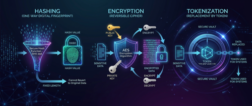
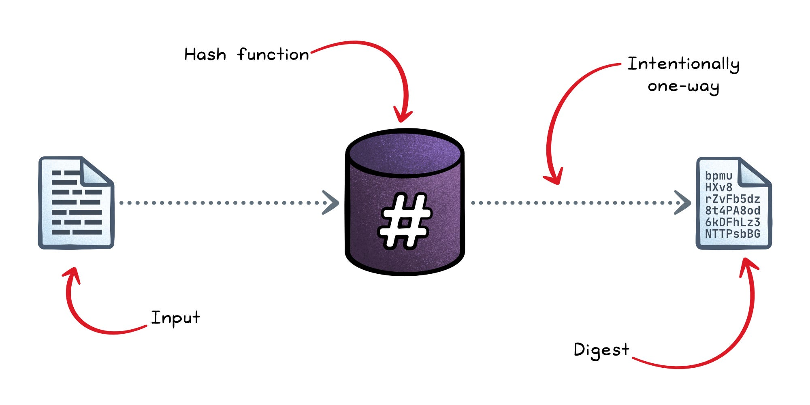
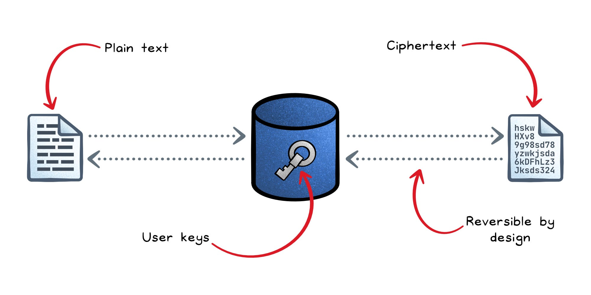
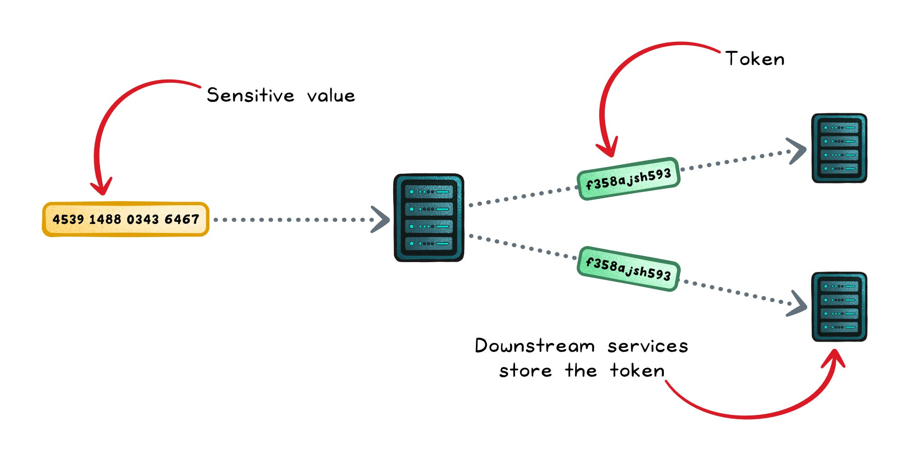
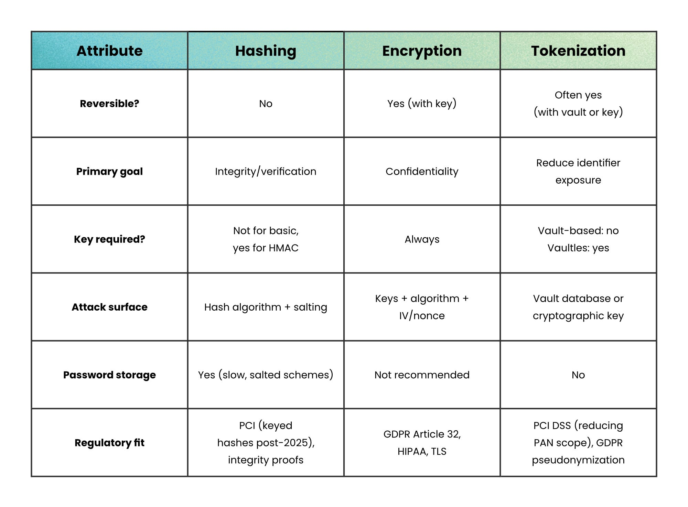

大多数安全漏洞不是因为算法太弱，而是因为在错误的场景用了正确的工具。

把该哈希的数据加密，或者把该令牌化的数据只做哈希，系统不会报错，安全防线却悄悄垮掉了。哈希（Hashing）、加密（Encryption）、令牌化（Tokenization）都能把敏感数据变换成另一种形态，但它们解决的是完全不同的问题。

## 一个问题决定用哪个

动手之前，先回答这一个问题：**你需要恢复原始值吗？**

- 不需要 → 哈希通常是正确选择
- 需要，目标是保密 → 用加密
- 需要，目标是限制敏感数据扩散 → 用令牌化

三种技术各自对应一个安全目标：

- **哈希** → 完整性验证
- **加密** → 可控访问下的保密性
- **令牌化** → 降低数据在系统间的暴露面

底层机制可能有交叉，但设计目的完全不同。

## 哈希

密码学哈希函数将任意长度的输入转换为固定长度的摘要。改动一个字符，输出就会完全不同。它是单向操作：无法从摘要还原原始输入。

哈希的用途集中在**完整性**场景：

- 验证文件下载是否被篡改
- 检测消息在传输途中是否被修改
- 支持数字签名
- 存储密码（需要使用专用构造）

但大多数开发者忽略了一个细节：**哈希不是一类东西**。

**无密钥哈希（如 SHA-256）**：可以确认数据没变，但前提是通过可信渠道发布摘要。如果攻击者同时控制了文件和摘要，就可以一起替换。

**带密钥哈希（如 HMAC）**：使用共享密钥对数据进行认证，可以抵抗主动攻击者。当你同时需要完整性和真实性时，选它。

**密码哈希（如 Argon2、scrypt、bcrypt）**：专用场景。刻意设计得慢且耗内存，让数据库泄露后暴力破解的代价极高。**绝对不要用 SHA-256 存密码。**

最常见的失误是把无密钥哈希当 MAC 用——它不是，长度扩展攻击会证明这一点。

哈希做不到的事：
- 无法提供保密性
- 无法还原数据
- 如果没有密钥，不能自动提供认证

如果你之后还需要读出原始值，哈希就是错误的工具。

## 加密

加密用密钥把明文变成密文，只有持有正确密钥的人才能还原。

加密可逆，这使它成为**保密性**场景的正确工具：

- 传输中的数据（TLS）
- 静止状态的数据（磁盘/数据库加密）
- 安全消息传递
- 安全存储

现代加密主要有两种形态：

**对称加密（AES）**：同一把密钥加密和解密，速度快，适合大体量数据。

**非对称加密（RSA、ECC）**：公钥加密，私钥解密，速度较慢，主要用于密钥交换和签名，而非批量数据。

实际系统几乎都使用**混合加密**：对称加密处理数据本身，非对称加密安全地交换那把对称密钥。TLS 就是这样工作的。

还有一个关键细节：**保密性不等于完整性。**

今天，没有完整性保护的加密被认为是不完整的。带关联数据的认证加密（AEAD），例如 AES-GCM，同时提供两种保证：

- **保密性** → 攻击者看不到内容
- **完整性/真实性** → 攻击者无法悄悄修改内容

早期那些只加密不认证的设计，即便攻击者从未见过明文，也可以对密文动手脚。这正是现在强烈推荐 AEAD 的原因。

加密的优势：
- 对原始数据的可控访问
- 强保密性保证
- 合规认可（GDPR、HIPAA 明确引用加密）

但加密引入了一个沉重的依赖：**密钥管理**。密钥生命周期、轮转、存储（通常借助 HSM）和密码周期策略，都会成为一等公民问题。

加密保护的是内容，但它不会减少敏感数据在系统之间的传播范围。

## 令牌化

令牌化用一个代理"令牌"替换敏感值，令牌本身不携带任何可利用的含义。

以支付系统为例，主账号（PAN，即完整卡号）被替换成一个令牌，下游系统存储的是令牌，而不是卡号。

令牌化与加密的区别是**架构层面**的：

- 加密保护数据的内容
- 令牌化限制敏感数据在系统间的暴露范围

加密回答的是"如何隐藏这个数据"，令牌化回答的是"如何防止这个数据到处扩散"。

令牌化有三种主要实现方式：

**基于保险库（Vault-based）的令牌化**：生成一个随机令牌，与原始值一起存入受保护的数据库（保险库）。还原令牌就是查询保险库。逻辑简单，但保险库本身成为价值最高的攻击目标。

**无保险库（Vaultless）的密码学令牌化**：使用保格式加密（Format-Preserving Encryption）生成令牌，无需保险库，但密钥管理变得关键。

**不可逆令牌化**：令牌从不设计为可还原。当你只需要校验或引用一条记录、而不需要恢复原始值时使用。

令牌化在监管环境中的价值在于，它从源头限制了敏感数据**存在于哪些地方**。

## 横向对比

三种技术都能变换数据，但保护方式截然不同。

## 什么时候不该用

知道什么时候**不该**用某个工具，和知道什么时候该用同样重要。

**不要用哈希，当：**
- 你需要取回原始值。哈希是单向门。
- 你用 SHA-256 这类快速算法保存密码。改用 bcrypt、scrypt 或 Argon2，因为速度快恰恰是密码安全的敌人。
- 你把无密钥哈希当 MAC 用。它不是，长度扩展攻击会让你吃苦头。

**不要用加密，当：**
- 你从来不需要读回原始值。哈希更简单，还省去了密钥管理负担。
- 你想限制数据在服务之间扩散。把 PAN 加密后到处传密文，只是换了个位置藏问题，令牌化才能真正移除它。

**不要用令牌化，当：**
- 你的系统规模小，没有严肃的合规或数据最小化要求。维护一个保险库会引入可用性依赖和运维开销，未必值得。
- 你需要对原始值做范围扫描或聚合查询。令牌化打乱了值的顺序和聚合关系。

## 小结

哈希、加密和令牌化不是同一个想法的变体，它们是三个不同问题的答案。

**需要验证时，哈希。需要取回时，加密。需要隔离时，令牌化。**

选错了问题，技术不会大声报警，它只是悄悄保护了错误的东西。算法本身很少是问题所在，选择才是。

## 参考

- [Hashing vs Encryption vs Tokenization - Level Up Coding](https://blog.levelupcoding.com/p/hashing-vs-encryption-vs-tokenization)
