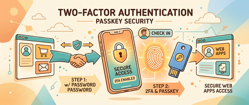
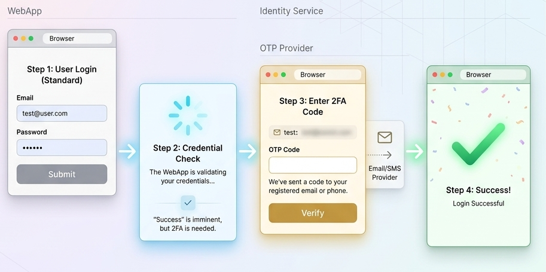
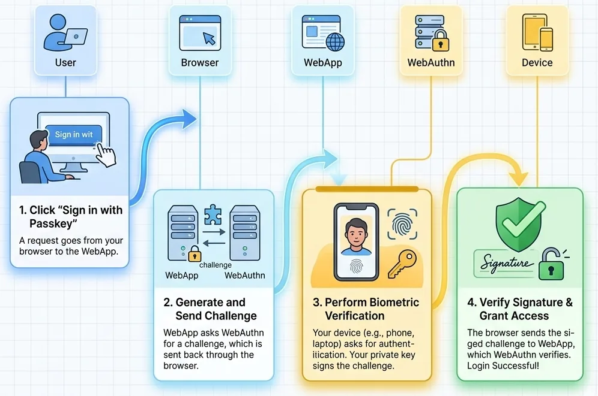
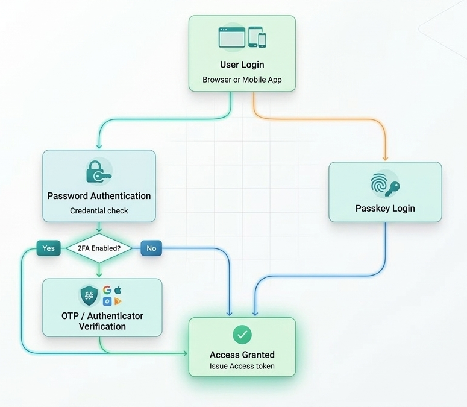

密码单独使用已经不够安全了。钓鱼攻击、数据库泄露、暴力破解——任何一种都可能让凭据失效。本文梳理 ASP.NET Core 中两种主流加固方案：传统双因子认证（2FA）和新兴的 Passkey 无密码认证，帮助你理解这两套机制的工作原理，以及何时选择哪种方案。



## 为什么密码不够用

攻击者拿到密码的手段主要有三类：钓鱼页面、数据库批量泄露、撞库（用其他站点的泄露凭据尝试登录）。2FA 在这些场景下有效，因为即使密码丢了，攻击者还需要通过第二个验证因素。

通常第二因素分三类：

- **你知道的**：密码、PIN
- **你拥有的**：手机、验证器 App、硬件密钥
- **你本身的**：指纹、面容 ID

开启 2FA 后，即使密码泄露，没有第二因素就无法登录。

## ASP.NET Core Identity 的 2FA 支持

ASP.NET Core Identity 内置支持多种 2FA 方式：邮件验证码、短信验证码、TOTP 验证器 App，以及恢复码。

整个认证流程分为两步：

### 第一步：用户名密码登录

```csharp
var result = await _signInManager.PasswordSignInAsync(
    model.Email,
    model.Password,
    model.RememberMe,
    lockoutOnFailure: true
);

if (result.RequiresTwoFactor)
{
    return RedirectToAction("VerifyCode");
}
```

如果用户启用了 2FA，`PasswordSignInAsync` 会返回 `RequiresTwoFactor = true`，流程跳转到验证码输入页。

### 第二步：验证码校验

Identity 支持通过不同 Provider 生成验证码：

```csharp
// 生成邮件验证码并发送
var code = await _userManager.GenerateTwoFactorTokenAsync(user, "Email");
```

验证用户提交的码：

```csharp
var result = await _userManager.VerifyTwoFactorTokenAsync(
    user,
    _userManager.Options.Tokens.AuthenticatorTokenProvider,
    "Email",
    code
);
```



## 配置 TOTP 验证器 App

Google Authenticator、Microsoft Authenticator、Authy 等 App 基于 TOTP（时间性一次性密码）工作，每 30 秒生成一个新的 6 位码。

启用流程：

1. 服务端为用户生成一个密钥（secret key）
2. 将密钥编码为 QR 码展示给用户
3. 用户用 App 扫描 QR 码，完成绑定
4. 之后每次登录，App 生成的动态码即为第二因素

生成密钥的代码：

```csharp
var authenticatorKey = await _userManager.GetAuthenticatorKeyAsync(user);
if (string.IsNullOrEmpty(authenticatorKey))
{
    await _userManager.ResetAuthenticatorKeyAsync(user);
    authenticatorKey = await _userManager.GetAuthenticatorKeyAsync(user);
}
```

拿到 `authenticatorKey` 后，通常用 `QRCoder` 等库把它渲染成 QR 码图片嵌入页面。

## 恢复码：用户丢失设备时的退路

如果用户换了手机或丢失了设备，TOTP 就无法使用。恢复码是预先生成的一组一次性备用码：

```csharp
var recoveryCodes = await _userManager.GenerateNewTwoFactorRecoveryCodesAsync(user, 10);
```

生成后需要提示用户妥善保存（截图、打印、密码管理器），服务端不应自己存储明文备份。

## Passkey：下一代无密码认证

2FA 加固了密码认证，但 Passkey 选择直接抛弃密码这个概念。Passkey 基于 **FIDO2 / WebAuthn** 标准，使用非对称加密替代共享密钥。

核心机制：

- 注册时，用户设备在本地生成密钥对。私钥留在设备上，公钥上传服务器
- 登录时，服务器发送一个随机挑战（challenge），设备用私钥签名后返回
- 服务器用存储的公钥验证签名

私钥从不离开用户设备，这使得钓鱼攻击从根本上失效——攻击者即使伪造了登录页面，也无法获得有效的签名。



### 2FA 与 Passkey 的对比

| 特性 | 传统 2FA | Passkey |
|------|---------|---------|
| 是否需要密码 | 是 | 否 |
| 用户体验 | 多步骤 | 一步完成 |
| 安全模型 | 共享密钥 | 公钥加密 |
| 抗钓鱼能力 | 中等 | 非常高 |
| 设备集成 | 验证器 App | 生物识别、设备安全芯片 |

## 在 ASP.NET Core 中集成 Passkey

ASP.NET Core 支持通过 `Fido2.AspNet` NuGet 包接入 WebAuthn 注册与登录流程：

```bash
dotnet add package Fido2.AspNet --version 4.0.0
```

**注册流程**：

1. 用户点击"注册 Passkey"
2. 服务端生成 WebAuthn 挑战
3. 浏览器弹出生物识别验证（指纹/面容）
4. 设备生成密钥对，公钥发送到服务器
5. 服务器存储公钥，注册完成

**登录流程**：

1. 用户选择"用 Passkey 登录"
2. 浏览器弹出生物识别验证
3. 设备用私钥签名挑战后返回
4. 服务器用公钥验证签名，通过则登录成功



## 安全实践要点

无论选择哪种认证方案，以下几点在 ASP.NET Core 中都应落实：

- 多次登录失败后启用账户锁定（`lockoutOnFailure: true`）
- 强制邮件验证，确认用户邮箱真实
- 恢复码只能使用一次，生成后不保留明文
- 全站强制 HTTPS，防止中间人攻击
- 记录认证事件日志（成功、失败、锁定）
- 提供用户自助管理 2FA 方法和 Passkey 的界面

## 选型建议

对于现有系统，建议将 TOTP 验证器 App 作为 2FA 的主要选项，同时提供邮件码作为备选，并生成恢复码。对于新系统或用户体验要求高的场景，可以把 Passkey 作为可选的无密码登录通道，与传统 2FA 并存，逐步过渡。

示例项目可以参考原文作者在 GitHub 上的完整实现：[TechPdo/TwoFactorAuth](https://github.com/TechPdo/TwoFactorAuth)，展示了带 2FA 支持的 ASP.NET Core MVC 生产级认证系统。

## 参考

- [Two-Factor Authentication (2FA) and Passkey Authentication in ASP.NET Core - C# Corner](https://www.c-sharpcorner.com/article/two-factor-authentication-2fa-and-passkey-authentication-in-asp-net-core/)
- [TechPdo/TwoFactorAuth - GitHub](https://github.com/TechPdo/TwoFactorAuth)
- [FIDO2/WebAuthn Standard](https://fidoalliance.org/fido2/)
- [ASP.NET Core Identity 文档](https://learn.microsoft.com/en-us/aspnet/core/security/authentication/identity)
