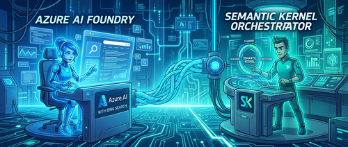

如果你的项目之前直接调用 Bing Search REST API，现在需要认真看一下这篇文章了——[微软已宣布停用直接 Bing Search API 访问](https://learn.microsoft.com/en-us/lifecycle/announcements/bing-search-api-retirement)，今后 Bing 的搜索能力只能通过 Azure AI Foundry 内的 Agent 工具（即 Bing Grounding）来使用。

这个变化打破了"直接调用一个 HTTP 接口拿搜索结果"的简单模式，开发者需要在架构上多走一层。本文来自微软 ISE（Industry Solutions Engineering）工程博客，展示了用 A2A 协议把 Foundry 里的搜索 Agent 包装成 Semantic Kernel 插件工具的完整方案。

## 问题在哪

Bing Grounding 功能目前被封装在 Azure AI Foundry Agent 内部。这造成了一个服务边界：用 Semantic Kernel 或 LangChain 构建的外部 Agent，**无法像调用函数库那样直接使用 Bing 搜索**——必须经过一个在 Foundry 生态内托管的中间 Agent 来代理请求。

这意味着你需要一套可靠的 Agent 间通信协议，而不是简单的函数调用。

## 解决方案：双 Agent 架构

方案把职责拆成两个独立的 Agent：

- **搜索专家（Azure AI Foundry Agent）**：配置了 Bing Grounding 工具，负责处理搜索请求——包括查询构造、执行和结果解析。
- **协调者（Semantic Kernel Agent）**：面向用户，维持对话上下文，在需要外部信息时把搜索任务委派给搜索专家。


两者之间通过 **A2A（Agent-to-Agent）协议** 通信，Semantic Kernel 的一侧把远程 Foundry Agent 当作一个本地工具来调用。

## 配置 Azure 侧的 Bing Grounding

在写代码之前，先要在 Azure 门户里把连接建好：

1. 打开 Azure AI Studio，进入目标项目
2. 在左侧导航找到 **Connections（连接）**
3. 新建连接，选择 **Bing Search**，填入你的 Bing Search API 密钥
4. 创建成功后，系统会给出一个 **Connection ID**，把它存入环境变量 `BING_CONNECTION_ID`

这个 Connection ID 是后续代码的关键凭据，务必妥善保存。

## A2A 协议深入：Agent 之间怎么说话

Google 提出的 A2A 协议为跨框架的 Agent 提供了一套标准化的通信接口。其核心逻辑分三层：

### Agent 发现

A2A 协议通过"Agent Card"来广播能力。客户端先拿到 Agent Card，再初始化通信客户端：

```python
# 客户端发现过程
resolver = A2ACardResolver(httpx_client=httpx_client, base_url=base_url)
agent_card = await resolver.get_agent_card()
```

Agent Card 里包含该 Agent 的能力描述、支持的消息格式和通信端点，让调用方在通信前就知道对面能做什么。

### 消息结构

A2A 消息格式统一，每条消息都有：

```python
request = SendMessageRequest(
    id=str(uuid4()),                    # 请求唯一标识
    params=MessageSendParams(
        message={
            "messageId": uuid4().hex,   # 消息追踪 ID
            "role": "user",             # 发送方角色
            "parts": [{"text": user_input}],  # 消息内容
            "contextId": str(uuid4()),  # 对话上下文
        }
    )
)
```

这四个字段分别解决：请求追踪、角色区分、多类型内容支持，以及跨多轮的对话上下文管理。

### 把远程 Agent 包装成 Semantic Kernel 插件

整个集成的关键代码在这里——把 A2A 调用封装成一个普通的 Semantic Kernel `@kernel_function`：

```python
class SearchTool:
    @kernel_function(
        description="web search using search agent",
        name="web_Search"
    )
    async def web_search(self, user_input: str) -> str:
        timeout = httpx.Timeout(120.0, connect=60.0)

        async with httpx.AsyncClient(timeout=timeout) as httpx_client:
            # Step 1: 发现 Agent
            resolver = A2ACardResolver(httpx_client=httpx_client, base_url=base_url)
            agent_card = await resolver.get_agent_card()

            # Step 2: 初始化客户端
            client = A2AClient(httpx_client=httpx_client, agent_card=agent_card)

            # Step 3: 构造消息
            request = SendMessageRequest(
                id=str(uuid4()),
                params=MessageSendParams(
                    message={
                        "messageId": uuid4().hex,
                        "role": "user",
                        "parts": [{"text": user_input}],
                        "contextId": str(uuid4()),
                    }
                )
            )

            # Step 4: 发送并等待响应
            response = await client.send_message(request)

            # Step 5: 提取结果文本
            result = response.model_dump(mode='json', exclude_none=True)
            return result["result"]["parts"][0]["text"]


supervisor_agent = ChatCompletionAgent(
    service=AzureChatCompletion(
        api_key=os.getenv("AZURE_OPENAI_API_KEY"),
        endpoint=os.getenv("AZURE_OPENAI_ENDPOINT"),
        deployment_name=os.getenv("AZURE_OPENAI_DEPLOYMENT_NAME"),
        api_version=os.getenv("AZURE_OPENAI_API_VERSION"),
    ),
    name="SupervisorAgent",
    instructions="You are a helpful general assistant. Use the provided tools to assist users with their ask on latest news and search.",
    plugins=[SearchTool()]
)
```

`SearchTool` 被注册为 Semantic Kernel 插件后，LLM 会在用户发出搜索类请求时自动调用它，整个 A2A 通信对上层完全透明。

## 服务端：搜索 Agent 的实现

Foundry 侧的 Agent 按照 A2A 协议暴露服务：

```python
class AIFoundrySearchAgent:
    def __init__(self):
        self.endpoint = os.getenv("AZURE_AI_ENDPOINT")
        self.model = os.getenv("AZURE_OPENAI_DEPLOYMENT_NAME")
        self.conn_id = os.getenv("BING_CONNECTION_ID")
        self.credential = DefaultAzureCredential()
        self.threads: dict[str, str] = {}

        agents_client = AgentsClient(
            endpoint=self.endpoint,
            credential=self.credential,
        )

        # 用连接 ID 初始化 Bing Grounding 工具
        bing = BingGroundingTool(connection_id=self.conn_id)

        # 创建专用搜索 Agent
        self.agent = agents_client.create_agent(
            model=self.model,
            name='foundry-search-agent',
            instructions="An intelligent bing search agent powered by Azure AI Foundry. Your capabilities include Latest news and Web search. Return in 1 line only",
            tools=bing.definitions,
        )


class FoundryAgentExecutor(AgentExecutor):
    async def execute(self, context: RequestContext, event_queue: EventQueue) -> None:
        user_input = context.get_user_input()
        context_id = context.context_id

        task = context.current_task
        if not task:
            task = new_task(context.message)
            await event_queue.enqueue_event(task)

        # 执行搜索，结果通过 A2A 事件队列返回
        result = await self.agent.search(user_input, context_id)
        await event_queue.enqueue_event(new_agent_text_message(result))
```

`FoundryAgentExecutor` 实现了 A2A 协议要求的 `execute` 接口，负责接收请求、调用 Bing Grounding，再把结果通过事件队列返回给调用方。

## 用 A2A Inspector 测试

[A2A Inspector](https://github.com/a2aproject/a2a-inspector) 是一个 Web 工具，可以直接对接任何实现了 A2A 协议的服务端，查看请求/响应的原始结构，验证协议兼容性，方便调试和规范对齐。

## A2A 协议的架构价值

这套方案引入了多个可量化的架构收益：

- **平台无关性**：Semantic Kernel、LangChain 或其他框架构建的 Agent 都能通过 A2A 互通
- **松耦合**：只要 A2A 兼容性保持不变，任何一侧的 Agent 都可以独立升级或替换
- **可扩展性**：新的 Agent 能力可以随时加入生态，不需要修改现有组件
- **可描述性**：标准化的消息格式让监控和排错更直观

原文作者 Munish Malhotra 特别指出：**这不只是对 API 停用的被动应对，而是在建立一种更现代的能力组合方式**——把外部能力视作"专门化 Agent"而非"简单 API"，整个系统会更容易维护和演进。

## 环境变量清单

搭建这套方案需要配置以下环境变量：

| 变量名 | 用途 |
|---|---|
| `AZURE_OPENAI_API_KEY` | Azure OpenAI API 密钥 |
| `AZURE_OPENAI_ENDPOINT` | Azure OpenAI 端点 |
| `AZURE_OPENAI_DEPLOYMENT_NAME` | 模型部署名称 |
| `AZURE_OPENAI_API_VERSION` | API 版本 |
| `AZURE_AI_ENDPOINT` | Azure AI Foundry 端点 |
| `BING_CONNECTION_ID` | Bing Search 连接 ID（Azure AI Studio 中获取） |

## 参考

- [原文：Building Search-Enabled Agents with Azure AI Foundry and Semantic Kernel and A2A](https://devblogs.microsoft.com/ise/building-bing-search-enabled-agent-with-microsoft-foundry-and-semantic-kernel)
- [Bing Grounding 配置文档](https://learn.microsoft.com/en-us/azure/ai-foundry/agents/how-to/tools/bing-grounding?view=azure-python-preview&tabs=python&pivots=overview)
- [Bing Search API 停用通告](https://learn.microsoft.com/en-us/lifecycle/announcements/bing-search-api-retirement)
- [A2A Inspector 工具](https://github.com/a2aproject/a2a-inspector)
