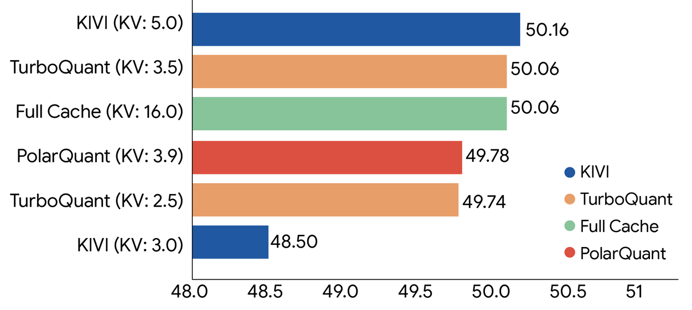
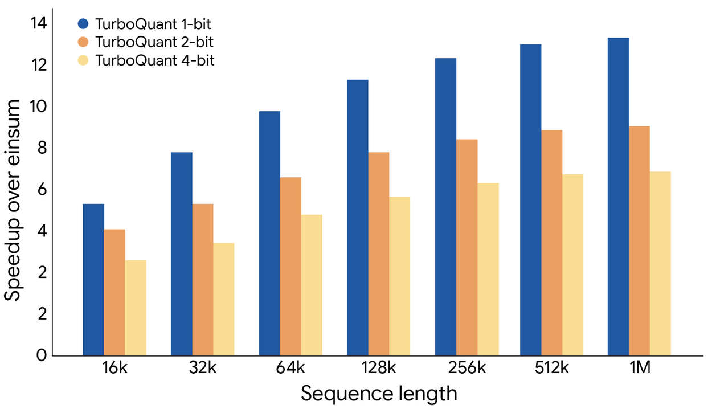

大语言模型推理时最大的内存消耗之一是 KV 缓存（key-value cache）——模型在生成每个 token 时需要保存之前所有 token 的键和值，序列越长，内存占用越高，速度也越慢。

Google Research 最近发布了 **TurboQuant**，这是一套将向量量化推到极致的压缩方案，核心目标是：**在几乎不损失精度的前提下，大幅压缩 KV 缓存和向量搜索索引的内存占用**。它将在 ICLR 2026 正式发表，同时配套的 PolarQuant 方法将在 AISTATS 2026 发表。

本文解读 TurboQuant、QJL、PolarQuant 三个算法的原理和实验结果，帮助你判断这套方案的适用价值。

## 为什么传统量化会有"额外开销"

向量量化（Vector Quantization）的思路并不新鲜：把高精度浮点数向量映射到更少比特的离散符号，减小存储和计算开销。问题在于大多数量化方法需要对每个小块数据分别计算并保存**量化常数**（quantization constants），以便解码时恢复原始值。

这些常数虽然是辅助信息，但本身也要占内存，相当于每个数值被量化节省的比特，又有 1～2 个比特悄悄还给了量化常数。这就是"内存开销"——量化之后的实际压缩率比理论值低。

TurboQuant 要解决的，正是这个开销问题。

## TurboQuant 的两步压缩

TurboQuant 的压缩过程分两个阶段：

**第一步：高质量压缩（PolarQuant 负责）**

对原始数据向量做随机旋转，把向量的几何结构简化，使得标准量化器可以直接、独立地处理向量的每个分量。这一步承担了绝大部分压缩能力——用大部分比特预算捕捉向量的主要方向和强度。

**第二步：消除残差误差（QJL 负责）**

第一步压缩后还剩一点误差。TurboQuant 用仅 **1 比特** 的额外预算，对这个残差运行 QJL 算法做误差修正。这一步不是精确还原误差，而是通过数学技巧消除统计偏差，让最终的注意力分数更准确。

## QJL：1 比特零开销的技巧

QJL（Quantized Johnson-Lindenstrauss）的思路来自 Johnson-Lindenstrauss 变换——一个保持高维数据点间近似距离关系的降维工具。

QJL 的操作极简：把每个向量分量映射成一个**符号位**（+1 或 -1）。因为编码方式是固定的，不需要存储任何量化常数，内存开销为零。

为了在极端压缩下保持精度，QJL 使用了一个非对称估计量：查询向量（query）保留高精度，而键向量（key）使用低精度的符号表示。这种非对称处理使内积估计的误差统计上无偏，可以准确计算注意力分数。

## PolarQuant：换个坐标系来压缩

PolarQuant 直接攻克量化常数开销的问题，方法是换一套坐标系。

普通量化在笛卡尔坐标下操作（X、Y、Z 轴距离），每个方向的值域是不固定的，所以需要量化常数来标定边界。PolarQuant 将向量转成**极坐标**表示：

- **半径（radius）**：表示向量的强度或幅值
- **角度（angle）**：表示向量的方向或含义

极坐标中角度的分布范围天然固定（在已知的圆形网格上），不再需要对边界做归一化处理。这样就省掉了量化常数，彻底消除了内存开销。

具体实现上，PolarQuant 把 d 维向量的坐标两两分组，逐步映射到极坐标，再对半径递归做极坐标变换，最终得到一个总半径加一组角度的紧凑编码。

## 实验结果

Google Research 在标准长上下文基准上对三个算法做了全面评测：LongBench、Needle In A Haystack（大海捞针测试）、ZeroSCROLLS、RULER、L-Eval，使用的开源模型包括 Gemma 和 Mistral，以及 Llama-3.1-8B-Instruct。

几个关键结论：

**KV 缓存压缩：3 比特，零精度损失，无需训练**

TurboQuant 将 KV 缓存量化到 3 比特后，在所有长上下文基准测试上均未出现精度下降，同时 KV 内存占用相比全精度（32 比特）缩减至少 **6 倍**。整个过程不需要模型再训练或微调，这对于实际部署来说很重要。

**运行时提速：4 比特可达 8 倍加速**

下图显示了在 H100 GPU 上计算注意力 logits 的速度对比。4 比特 TurboQuant 相比 32 比特无量化基线，性能提升最高达 **8 倍**，测量基准是高度优化的 JAX 实现。

**向量搜索：超越专用方案**

在高维向量搜索任务上，TurboQuant 的 1@k 召回率（即真正 top-1 结果命中 top-k 列表的频率）在 GloVe 数据集（d=200）上超过了 PQ 和 RabbiQ 两个专门为搜索优化的方案，而后两者还依赖大型码本和数据集特定调优。

## 现实意义

TurboQuant 的价值在于几点叠加：

- 不依赖训练，部署成本低
- PolarQuant 彻底消除了量化常数开销，理论上可以达到更优的压缩率下限
- QJL 的零开销 1 比特纠偏可以单独嵌入其他量化方案
- 对 KV 缓存和向量搜索两个场景都有效

原文提到，这套方法会直接应用于 Gemini 模型的 KV 缓存，也将用于 Google 规模下的语义搜索。

目前这三个算法已有对应论文，TurboQuant 和 QJL 的代码尚未公开，但论文中包含理论证明和完整实验细节，可以据此复现。

## 参考

- [TurboQuant 原文](https://research.google/blog/turboquant-redefining-ai-efficiency-with-extreme-compression)
- [TurboQuant 论文（arxiv）](https://arxiv.org/abs/2504.19874)
- [PolarQuant 论文（arxiv）](https://arxiv.org/abs/2502.02617)
- [Quantized Johnson-Lindenstrauss 论文](https://arxiv.org/abs/2406.03482)
