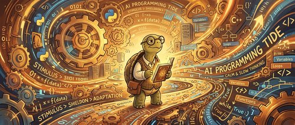

距离真正意义上的编程 Agent 出现已经将近一年。它们能帮你从零搭出完整项目，速度令人着迷。但 Mario Zechner 在这篇文章里提醒我们：热情消退之后，账单正在到期。

## 软件质量在悄悄下滑

Zechner 的观察是感性的，但有一定依据。软件整体"脆"了——98% 的可用率反而开始被当成常态，而不是失败；界面 bug 越来越离奇，QA 本应能抓住这些问题。

更具体的案例：AWS 传出 AI 引发故障，内部随后启动了一次 90 天重置计划。微软 CEO 公开说公司的代码已经有相当比例由 AI 生成，而微软同期发出了一份关于 Windows 质量的公开声明。那些宣称"100% 代码由 AI 生成"的公司，陆续交出了内存泄漏几个 GB、界面乱糟糟、功能随机崩溃的产品。这不是 AI 编程能力有多强的证明，更像是对"甩手"工作方式的一次集体预警。

## Agent 的错误为什么比人类更危险

一个人类程序员犯错，有两种自我修正机制：被别人骂，或者自己受够了。无论哪种，频繁犯同一类错误的代价会逐渐变大，直到推动改变。再加上人类有速度上限，即便 bug 率再高，一天能引入的问题总量是有限的。

Agent 没有这套机制。它不会从错误中学习（除非你专门维护一套记忆系统并且恰好观察到了那个错误），也没有速度瓶颈。几小时内生成 2 万行代码，里面散落的每一处"无害小错误"——多余的方法、不合理的类型、重复的逻辑——都在以人类决感知不到的速度积累。

Zechner 把这叫做 **booboo 的复利**：单独看都是小事，累积起来就是一个你无法信任的代码库。等到某天真正感受到痛，往往已经来不及了。

## Agent 是复杂度的商人

当你把架构决策完全交给 Agent，它会给你一套什么？

它的训练数据里充满了企业级"行业最佳实践"——大量被广泛采用却鲜少被质疑的模式。它不了解你这个具体系统的历史，看不到之前所有的决策，也看不到其他 Agent 同期在做什么。结果就是：抽象套抽象，代码重复、职责混乱，复杂度以人工方式需要数年才能积累的速度，在几周内堆满你的仓库。

Zechner 的类比很准：这和那些历史悠久的企业代码库没有本质区别，只是时间压缩了几十倍。那些遗留代码库至少还有组织和人员跟着慢慢进化，能形成某种扭曲的共生。你用两个人加 agent 搭出来的同等混乱，没有这个适应过程。

## Agentic 搜索的低召回率

当你希望 Agent 自己来清理这团混乱时，它也做不好——不是因为上下文窗口不够大，而是因为**搜索召回率低**。

无论给 Agent 配 ripgrep、LSP、向量数据库还是代码索引，随着代码库变大，Agent 能找到的相关代码就越不完整。它看不见它需要关注的东西，于是继续引入重复、制造不一致。这也是最初那些"booboo"产生的根本原因之一。

## 什么样的任务适合交给 Agent

Zechner 没有说 Agent 没用，他说的是：需要搞清楚哪类任务适合。

适合的任务有几个共同特征：  
- **可以被明确限定范围**，Agent 不需要理解整个系统  
- **有评估闭环**，Agent 能自行验证结果是否达标  
- **不是核心关键路径**，出错影响可控  
- 或者纯粹用来**当作橡皮鸭**，借助压缩进训练数据的集体智慧进行头脑风暴

Karpathy 的 [auto-research](https://github.com/karpathy/autoresearch) 就是一个好例子——给 Agent 一个量化的评估函数，比如应用启动时间，让它自己优化。但要清楚：它优化的只有那个指标，代码质量和结构之外的一切，它不在乎。你仍然是最终的质量关口。

## 慢下来的具体含义

Zechner 给出了他认为目前可行的工作方式：

**设定每天 Agent 生成代码量的上限**，与你实际能 review 的速度匹配。如果你看不完，就不要生成那么多。

**架构、API 定义这类决定系统整体形态的东西，手写**。这不是情怀，而是功能上的必要：写代码或者一步一步看代码成型，会引入足够的摩擦，让你真正思考"我想建什么，这个系统感觉对不对"。这里用得上的是你的经验和判断力，目前没有 SOTA 模型能替代这一点。

**把无聊的、重复的、不需要你学什么的活交给 Agent**，然后认真评估它的输出，取其中真正合理的部分，自己把收尾的实现做完。

**保持对代码库的理解**。这会反过来改善 Agent 的表现——你能帮它定位到它自己找不到的代码，从而减少它的"booboo"。如果出了事，你有能力自己修。

## 主动权不能拱手相让

文章的最后，Zechner 回到了一个朴素的判断：

> 这一切都需要纪律。这一切都需要人类。

速度是诱人的。Agent 能在几分钟内给你一个跑通的原型，这种反馈让人上瘾。但软件最终必须被维护、被调试、被改进。如果你已经不再理解它，那你就是在给自己埋雷。

慢下来，不是放弃效率，而是在保留主动权的前提下选择性地提速。

## 参考

- [Thoughts on slowing the fuck down — Mario Zechner](https://mariozechner.at/posts/2026-03-25-thoughts-on-slowing-the-fuck-down/)
- [AI caused outage at AWS — FT](https://www.ft.com/content/00c282de-ed14-4acd-a948-bc8d6bdb339d)
- [Amazon 90-day reset — Business Insider](https://www.businessinsider.com/amazon-tightens-code-controls-after-outages-including-one-ai-2026-3)
- [Karpathy's auto-research](https://github.com/karpathy/autoresearch)
