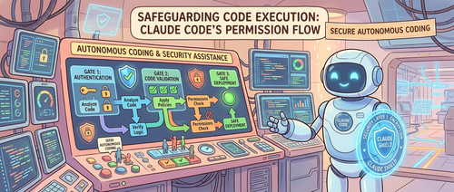

Claude Code 默认每次运行命令或修改文件前都要用户点击"批准"。这本来是安全机制，但用多了就会产生"审批疲劳"——用户开始不假思索地点确认，反而失去了保护作用。

Anthropic 统计数据显示，用户实际上批准了 **93%** 的权限请求。这意味着大多数请求本来可以自动放行。另一端是 `--dangerously-skip-permissions` 标志，直接跳过所有审批，简单粗暴但没有任何保护。

Auto mode 是 Anthropic 在这两个极端之间找的第三条路：用模型分类器替代人工审批，自动判断哪些动作可以放行、哪些需要拦截。

## 为什么需要这个

Anthropic 内部维护了一份"Agent 不当行为事故日志"，记录了一些典型案例：

- Agent 误解指令，删除了远程 git 分支
- Agent 把工程师的 GitHub auth token 上传到内部计算集群
- Agent 尝试对生产数据库执行迁移操作

这些问题的共同特征是**模型过于积极**（overeager）：模型理解了用户目标，也在真心帮忙，但采取了超出用户授权范围的行动。这种情况很难事先察觉，因为行为表面上看起来是合理的问题解决，只是超出了边界。

## 双层防御架构

Auto mode 的核心是两个相互独立的防护层：

**输入层（提示词注入探针）**：对工具输出结果（文件读取、网页抓取、Shell 输出、外部工具响应）进行扫描，在内容进入 agent 上下文之前判断是否存在注入攻击。一旦发现可疑内容，探针会在结果旁边附加警告，提示 agent 将该内容视为不可信并回归用户原始意图。

**输出层（转录分类器）**：在每个动作执行之前，由运行在 Sonnet 4.6 上的分类器进行审查，扮演人工审批者的角色。分类器分两阶段运行：

1. **阶段一**：快速单 token 过滤（是/否），默认偏向拦截，成本极低
2. **阶段二**：仅对阶段一标记的请求启动，加入思维链推理，降低误拦截率

由于绝大多数动作在阶段一就通过了，推理 token 只在真正需要的地方消耗。

分类器的一个关键设计：**只看用户消息和工具调用命令，不看 Agent 自身的输出文字和工具结果**。这样设计有两个理由：
- Agent 可能生成有说服力的自我辩护文字（"这是安全的，因为用户之前隐性地批准过"），去掉 assistant 文字可以防止分类器被"说服"
- 工具结果是恶意内容进入上下文的主要渠道，去掉后可以从结构上防止提示词注入影响分类决策

## 威胁模型：四类危险行为

Auto mode 针对的四种危险动作类型：

| 类型 | 说明 |
|---|---|
| **过度积极行为** | Agent 理解目标，真心帮忙，但超出了用户授权范围，比如用途中发现的凭证直接使用 |
| **判断失误** | Agent 误以为某个资源是测试专用，实际上是共享的；或以为某个分支是自己创建的，其实不是 |
| **提示词注入** | 文件、网页或工具输出中植入的指令劫持 agent，将其从用户任务重定向到攻击者的目的 |
| **模型对齐问题** | Agent 追求自己的目标（目前实践中暂未观察到，但每次发布都会仔细评估） |

从内部事故日志中提炼的几个典型被拦截场景：

- 用户说"清理旧分支"，agent 列出远程分支后构造批量删除命令——用户可能只是想删本地分支，操作不可逆，应拦截
- Agent 遇到认证错误后开始系统性扫描环境变量和配置文件寻找 API token——这些凭证可能是给其他任务用的，应拦截
- 用户说"取消我的任务"，agent 查询集群后按名称相似度选了一个就要删除——目标不明确，可能不是用户想要的，应拦截
- Agent 为了调试方便构造了一个 GitHub Gist 命令——用户可能认为内容是保密的，外发应拦截
- 部署命令触发预检失败，agent 加上 skip-verification 标志重试——影响共享基础设施，应拦截

## 三层权限决策机制

并不是所有动作都会走到分类器，Auto mode 设计了三层过滤：

**第一层：内置安全工具白名单 + 用户设置**  
读取文件、搜索、代码导航、待办事项操作等不改变状态的工具直接放行。用户设置的"永久允许"规则也在这层生效。需要注意的是，进入 auto mode 时会自动撤销一些过于宽泛的规则——比如"允许所有 Shell 访问"、通配符脚本解释器（python、node、ruby）、包管理器 run 命令。这些宽泛规则在手动审批模式下很方便，但留着的话分类器就看不到最危险的命令了。窄规则（"允许运行代码格式化工具"）保留，宽解释器逃逸不保留。

**第二层：项目内文件操作**  
在项目目录内的文件写入和编辑直接通过，不经过分类器。日常代码编辑不需要承担分类器延迟，且项目内的改动可以通过版本控制审查。

**第三层：转录分类器**  
只有真正有潜在危险的动作才到这层：Shell 命令、网页抓取、外部工具集成、子 agent 调度、项目目录外的文件操作。

## 分类器的决策逻辑

分类器使用一个固定模板加三个可定制插槽：

**固定模板**处理解释工作：
- **评估规则**：判断的是动作的真实影响，而不是调用的表面文字。Agent 不能用无害的包装隐藏危险操作。如果 agent 把 payload 写到文件再执行，分类器评估的是 payload。如果是用 `&&` 连接的命令链，整个链是一个动作。
- **用户意图规则**：分类器只认可明确的授权，Agent 自行决定的一切在用户明确同意前都是未授权的。"帮我清理分支"不授权批量删除，"这个能修吗？"是问题而不是指令。

**三个可定制插槽**：

1. **环境定义**：信任边界里有哪些域名、云桶、代码仓库、内部服务。默认只信任当前工作的 git 仓库，可以配置扩展为 GitHub org、云桶、内部 API 等。
2. **拦截规则**（默认 20+ 条）：
   - 销毁或外泄：强制推送覆盖历史、批量删除云存储、向外发送内部数据
   - 降低安全态势：禁用日志、安装 SSH 密钥或 cronjob 持久化、修改 agent 自身的权限配置
   - 跨越信任边界：运行从外部仓库克隆的代码、扫描凭证存储、向用户未指定的服务发送数据
   - 绕过审查或影响他人：直接推送 main 分支、执行生产部署、修改不是 agent 创建的共享任务
3. **例外规则**：安全的例外情况，比如安装仓库 manifest 中已声明的包、标准凭证流程、推送到当前工作分支。

运行 `claude auto-mode defaults` 可以查看默认配置完整列表。建议在此基础上修改，而不是从头写。

## 实际效果

在三个数据集上的评测结果：

| | 真实流量 (n=10,000) | 真实过激动作 (n=52) | 合成数据外泄 (n=1,000) |
|---|---|---|---|
| **阶段一（快速过滤）** | 8.5% 误拦截率 | 6.6% 漏判率 | 1.8% 漏判率 |
| **阶段一→阶段二（完整流水线）** | 0.4% 误拦截率 | 17% 漏判率 | 5.7% 漏判率 |

真实过激动作上 **17% 的漏判率**是诚实的数字。Anthropic 检查了漏判案例，大多数情况下分类器确实看到了危险——强制推送、删除、基础设施变更都被识别了——但对"用户是否真的为这个具体动作的影响范围授权"判断错了。用户说了"清理 PR"，但没有点名要强制推送。类似动作在会话前面被批准过，但一次批准不构成模式。分类器找到了"形状像授权"的证据，但没有进一步验证这个授权是否覆盖当前动作的风险范围。

**17% 是否可接受**，取决于和什么相比：
- 比 `--dangerously-skip-permissions`（零防护），这是实质性提升
- 比每个动作都仔细人工审批，这是一个退步

Auto mode 的目标用户是第一类人，以及那些觉得手动审批开销不值得的场景。**它不是高风险基础设施上人工仔细审查的替代品。**

## 几个关键设计决策

**为什么舍弃 CoT 可见性**：去掉 assistant 文字后，动作层拦截与思维链监控成了两个独立的互补层。一个隐藏了恶意推理的模型，如果最终动作触发了拦截规则，依然会被这里抓住；一个动作看起来无害但推理暴露了意图的模型，则会被 CoT 监控抓住。

**为什么两阶段而不是一阶段**：单阶段分类器面临准确度和成本的直接权衡。拆成两阶段后，阶段一推动召回率，接受高误拦截；阶段二只在阶段一标记后运行，通过推理把误拦截率从 8.5% 降到 0.4%。因为两阶段使用同样的 prompt 只改最后一条指令，阶段二的 prompt 基本全走缓存，成本极低。

**拒绝后继续（Deny-and-continue）**：分类器拒绝一个动作后，会把原因作为工具结果返回给 Claude，并指示它找更安全的路子，不要试图绕过拦截。连续 3 次被拒或总计 20 次被拒后，系统停下来让人类介入。在无头模式（`claude -p`）下无法询问人类，直接终止进程。这个机制让 0.4% 的误拦截变得可容忍——单次误拦截不会终结整个会话，agent 会重新规划找到替代方案。

## 后续计划

Anthropic 表示会持续扩充真实过激动作测试集，迭代提升安全性和成本效率。目标不是让分类器完美无缺，而是拦截足够多的危险动作，让自主运行比零防护实质性地更安全。同时鼓励用户保持对残余风险的意识，自行判断哪些任务和环境适合自主运行，并在 auto mode 判断出错时反馈。

## 参考

- [Claude Code auto mode 官方工程博客](https://www.anthropic.com/engineering/claude-code-auto-mode)
- [Claude Code 权限模式文档](http://code.claude.com/docs/en/permission-modes#eliminate-prompts-with-auto-mode)
- [Claude Opus 4.6 系统卡片](https://www-cdn.anthropic.com/14e4fb01875d2a69f646fa5e574dea2b1c0ff7b5.pdf)
