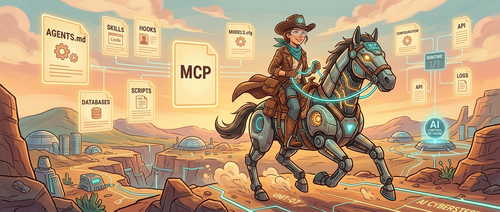

有人做了一个实验：同一个 AI 模型，同一套编程基准测试，完全相同的环境。第一次跑出来 42%，第二次跑出来 78%。分数翻了将近一倍。没有换模型，没有改提示词，没有调温度参数。

唯一变化的是 harness——包裹在模型外面的那套规则、工具、技能文件和反馈循环。

这是目前 AI 辅助开发领域最重要的发现之一，但很少有人在讨论它。

## 两个独立验证

LangChain 独立验证了同样的结论。他们的编程代理在 Terminal Bench 2.0 榜单上从 30 名开外直接跳进前 5，什么都没改，只改了 harness。

OpenAI 的 Codex 团队则更进一步：他们用 AI 代理构建了一个超过百万行代码的生产应用，其中零行代码由人类手写。工程师的工作不是写代码——而是设计 harness。

OpenAI 团队自己说："当代理遇到困难时，我们把它当成信号。我们找出缺少的东西——工具、护栏、文档——然后把它们喂回到仓库里。"他们不换模型，他们修 harness。

## 什么是 Harness Engineering

用 Mitchell Hashimoto（Terraform 创始人）的定义：

> "每当你发现代理犯了一个错误，你就花时间设计一个方案，让代理永远不再犯同样的错误。"

AI 编程代理像一匹马。模型是马本身，力量强大。但没有缰绳、马鞍和嚼子，马会乱跑。**Harness 就是把这股力量引向你需要方向的那套装置。**

没有好的 harness，代理会猜测、会跑偏、会反复犯同一类错误，生成的代码表面好看但上线就挂。

Harness engineering 就是设计和配置这套装置的实践，目标是让代理永远不对同一个坑绊两次。

## 五个调节杠杆

每个编程代理都有五个可以调整的配置点：

### 1. 系统提示（CLAUDE.md / AGENTS.md）

这是放在仓库根目录的 Markdown 文件，每次会话开始时自动注入代理上下文。它告诉代理这个代码库是做什么的、要遵守什么规范、要避开什么。

ETH Zurich 对 138 个 agent 文件做过测试，发现由 AI 生成的这类文件实际上会**降低**性能，同时多消耗 20% 的 token。而人工写的有效，但前提是简洁且具体。

**规则：保持在 60 行以内。** 只写适用于所有任务的通用指令。不要写目录结构（代理可以自己发现）。不要写条件规则（"如果做 X，就 Y"会制造混乱）。只写核心内容：技术栈、测试命令、编码规范、硬性规则。

### 2. Skills（渐进式知识披露）

Skills 是按需加载的指令文件——代理只在任务匹配时才加载对应的 skill，而不是把所有知识塞进系统提示。

比如你可以有一个数据库迁移的 skill、一个 API 接口创建的 skill、一个前端组件模式的 skill。当代理遇到迁移任务时，自动加载迁移 skill，其余的留在上下文窗口之外。

这叫**渐进式披露**：代理从最小上下文开始，按需拉取更多内容。这样可以保持上下文窗口干净，防止代理被无关指令干扰。

### 3. MCP 服务器（工具和能力扩展）

Model Context Protocol 服务器把代理的能力扩展到读文件和跑命令之外。你可以把代理接到 Linear 做工单追踪、接到 Sentry 做错误监控、接到数据库做实时查询。

但有个警告：每接入一个 MCP 工具，代理的系统提示就会增大。工具太多会产生 HumanLayer 团队所说的 "tool thrash"——代理把时间花在纠结用哪个工具上，而不是干活。**从两三个开始，遇到真实限制再加。**

### 4. 子代理（上下文防火墙）

子代理不是"前端代理"+"后端代理"的分工模式——HumanLayer 团队试过，放弃了。

子代理的正确用法是**上下文防火墙**：当主代理遇到一个会把上下文窗口塞满中间噪音的任务时，把这个任务委托给子代理。子代理在自己隔离的上下文里运行，完成工作，只把结果返回给主线程。所有中间步骤都不污染父线程。

Chroma 的研究显示，AI 模型在上下文越长的情况下性能会明显下降。子代理让你把大问题拆成一个个小的、聚焦的会话，让模型始终处于"清醒状态"。

### 5. Hooks（自动化检查点）

Hooks 是在代理工作流特定节点自动执行的脚本——给非确定性系统加入确定性控制。

例子：
- 提交前 hook：提交代码前自动跑 lint 检查
- 完成前 hook：代理宣布任务完成前强制跑测试
- 循环检测 hook：捕捉代理反复做同一个修改的死循环

LangChain 做了一个 `PreCompletionChecklistMiddleware`，在代理完成任何任务前拦截它，强制对照原始需求做一遍验证。这一个 hook 是他们整个 harness 里性能提升最大的单项改动之一。

## 为什么 Harness 比模型更重要

大多数开发者在这里犯错：他们花大量时间比较 Claude vs GPT vs Gemini，追着每个新模型版本跑，相信下一个版本会修复一切。

数据不这么说。

同一个模型，仅仅换 harness，准确率从 42% 跳到 78%。历史上没有哪次模型升级带来过 2x 的性能提升，但一个设计良好的 harness 经常做到这件事。

**模型是引擎，harness 是方向盘、刹车和道路。** 世界上最强的引擎，没有方向盘会撞车。

## 从今天开始，$0 成本上手

不需要新工具，不需要培训课，不需要换编程代理。需要改变的是你遇到失败时的反应方式。

**第一步：改掉失败反射**

旧反射：代理出错，手动改好，继续。  
新反射：代理出错，问自己"怎么让它永远不再犯这个错？"然后把修复方案编码进 harness。

每次失败都是信号，说明 harness 里缺了什么。找到缺的，加进去，继续。

**第二步：写一个精简的 CLAUDE.md / AGENTS.md**

在仓库根目录创建 Markdown 文件，60 行以内。写技术栈、测试命令、硬性规则（"永远不删迁移文件"、"提交前跑测试"、"用 TypeScript strict 模式"），仅此而已。不要目录地图，不要条件逻辑，不要 AI 生成的内容。

**第三步：构建你的第一个 Skill**

找出代码库里一个反复出现的模式。API 接口创建、数据库迁移、组件脚手架——随便哪个。写一个聚焦的指令文件，说明怎么正确做，包括边界情况和常见错误。存成 skill，代理遇到匹配的模式时会自动加载。

**第四步：加一个 Hook**

从提交前跑 lint 和测试开始。代理试图提交不通过检查的代码时，hook 在进仓库前拦住它。一个 hook，巨大影响。

**第五步：用子代理处理上下文密集型任务**

当你注意到代理在长任务里开始失去连贯性时，把它拆成子任务。每个子任务委托给子代理，在隔离环境里跑完，只把结果返回。主线程保持干净。

**第六步：每周迭代**

每周五，回顾这周的失败案例。每个失败对应一条规则、一个 skill 或一个 hook 加入 harness。每次失败五分钟的 harness engineering。时间久了，你的 harness 积累起来，代理每周都更可靠——不是因为模型变好了，而是因为你的系统变好了。

## 这是一条别人追不上的护城河

AI 模型正在商品化。所有公司都能用到同样的前沿模型。模型不再是竞争优势。

但一个经过精心工程化的 harness 是。它针对你的代码库，针对你团队的模式，针对你所在领域的边界情况。它不能通过下载一个模型来复制。它是通过数周数月把真实世界的失败编码进学习系统积累起来的。

能设计这些 harness 的开发者是公司无法替代的。不是因为他们写了最好的代码，而是因为他们设计了让 AI 写出最好代码的系统。

Prompt engineering 是 2023 年的技能，context engineering 是 2025 年的技能，**harness engineering 是 2026 年的技能。**

学它的成本是 $0，不需要任何新工具，每个有编程代理的开发者都可以开始。

唯一的问题是：你今天就开始打磨你的 harness，还是继续等下一个模型更新来解决一切？

## 参考

- [原文：Harness Engineering: Why the Best AI Engineers in 2026 Stopped Writing Code](https://x.com/heynavtoor/status/2037200578842157462)
