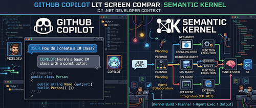

在 .NET 的 AI 生态里，GitHub Copilot SDK 和 Semantic Kernel 是两个经常被放到一起比较的框架。两者都能用来构建 AI 驱动的应用，但它们针对的场景根本不同，混淆它们只会让选型越来越纠结。

这篇文章的目标很直接：搞清楚什么时候该用哪一个，以及为什么。



## 各自的定位

[GitHub Copilot SDK for .NET](https://github.com/github/copilot-sdk/tree/main/dotnet) 是为构建和 GitHub Copilot 深度集成的对话式 AI 体验而生的。它轻量、基于会话（session），在聊天式交互场景下使用 Copilot 能力时几乎没有什么多余的抽象。

[Semantic Kernel](https://learn.microsoft.com/en-us/semantic-kernel/overview/) 则是一个完整的 AI 编排框架，专为需要多步骤工作流、多智能体系统、RAG 应用和企业级 AI 解决方案的场景设计。它提供了插件、计划器（Planner）、向量存储、过滤器等一整套基础设施。

一句话总结：Copilot SDK 是聊天界面的专用工具，Semantic Kernel 是通用的 AI 编排平台。它们不是竞争关系，而是工作在不同抽象层级的工具。

## 架构差异对比

两个框架的设计哲学差异在核心抽象上一目了然：

| 概念          | GitHub Copilot SDK       | Semantic Kernel                            |
| ------------- | ------------------------ | ------------------------------------------ |
| 核心抽象      | `CopilotSession`         | `Kernel`                                   |
| 函数/工具系统 | `AIFunctionFactory`      | `KernelFunction` + 插件                    |
| 对话管理      | 内置会话状态             | 手动管理 `ChatHistory`                     |
| 流式输出      | 原生支持                 | 通过 `IAsyncEnumerable`                    |
| 钩子/过滤器   | 会话生命周期钩子         | 过滤器和中间件                             |
| Memory/RAG    | 无原生支持               | `VectorStoreRecordCollection` + 存储连接器 |
| 多智能体      | 基础 `CopilotAgent` 协调 | 完整的 Agent 框架 + 计划器                 |
| 模型抽象      | 侧重 Copilot 兼容模型    | 多供应商连接器                             |

Copilot SDK 以 `CopilotSession` 为中心，这是一个有状态的对话上下文，自动管理消息历史、工具执行和流式响应。Semantic Kernel 则围绕 `Kernel` 对象组织插件、服务和 AI 模型，没有内建的对话状态——需要时自己加。

在 Memory 和 RAG 场景上，两者的差距非常明显。Copilot SDK 不提供向量存储或 Memory 连接器，如果你要搜索自己的数据，这部分需要自己实现或引入外部库。Semantic Kernel 则把向量数据库、嵌入向量和 RAG 模式作为一等公民支持。

## 什么时候选 Copilot SDK

有几个场景下 Copilot SDK 是明确的优选：

**构建 GitHub Copilot 扩展**：如果你的目标就是扩展 GitHub Copilot 的功能，Copilot SDK 几乎是唯一选择。它处理了所有 Copilot 专有的协议、认证和会话管理，自己实现这些会非常痛苦。

**简单对话型 AI 功能**：不需要复杂编排，只是希望以最少的代码实现可用的 AI 聊天——这是 Copilot SDK 的甜蜜区。

下面这段代码展示了 Copilot SDK 有多简洁：

```csharp
using GitHub.Copilot.SDK;

var client = new CopilotClient(new CopilotClientOptions
{
    GithubToken = Environment.GetEnvironmentVariable("GITHUB_TOKEN")
});

await using var session = await client.CreateSessionAsync(new SessionConfig
{
    Model = "gpt-5",
    Tools = new[]
    {
        AIFunctionFactory.Create(
            () => DateTime.UtcNow.ToString("o"),
            name: "get_current_time",
            description: "Gets the current UTC time")
    }
});

var result = new StringBuilder();
session.On(evt =>
{
    switch (evt)
    {
        case AssistantMessageDeltaEvent delta:
            result.Append(delta.Data.DeltaContent);
            Console.Write(delta.Data.DeltaContent);
            break;
    }
});

await session.SendAsync(new MessageOptions { Prompt = "What time is it?" });
```

这种简洁度是个显著优势。对于需要快速交付 AI 功能、且不需要 RAG 或多智能体协调的项目，用不着 Semantic Kernel 的全套复杂度。

## 什么时候选 Semantic Kernel

Semantic Kernel 在需要精密 AI 编排的场景下才真正体现价值：

**RAG 应用**：需要对向量数据库做语义搜索、处理文档检索——Semantic Kernel 的内置支持是首选。

**多智能体协调**：需要多个专业化 Agent 协作解决复杂问题时，Semantic Kernel 的 Agent 框架提供了计划和协调能力，这是 Copilot SDK 无法覆盖的。

**多模型策略**：需要针对不同任务使用不同的 AI 供应商，Semantic Kernel 的服务抽象层让切换变得直接。

**企业级可观测性**：需要完整的依赖注入支持、测试基础设施、过滤器管道——这些在 Semantic Kernel 里都是标配。

以下是 Semantic Kernel 插件的基本用法：

```csharp
using Microsoft.SemanticKernel;

var builder = Kernel.CreateBuilder();
builder.AddAzureOpenAIChatCompletion(
    deploymentName: "gpt-4",
    endpoint: azureEndpoint,
    apiKey: azureApiKey
);

// 注册多个插件
builder.Plugins.AddFromType<TimePlugin>();
builder.Plugins.AddFromType<WeatherPlugin>();

var kernel = builder.Build();

// 自动函数调用
var result = await kernel.InvokePromptAsync(
    "What's the weather like at my current time?"
);

Console.WriteLine(result);
```

插件体系让相关函数的组织和复用变得清晰，适合需要维护和扩展的 AI 系统。

## 两者可以同时用吗

可以，而且有些场景确实值得这样做。常见模式是：用 Copilot SDK 管理对话层，用 Semantic Kernel 在后台处理复杂逻辑。

```csharp
// 两个框架结合使用
var kernel = CreateSemanticKernel();
var client = new CopilotClient(new CopilotClientOptions
{
    GithubToken = Environment.GetEnvironmentVariable("GITHUB_TOKEN")
});

var config = new SessionConfig
{
    Model = "gpt-5",
    Tools = new[]
    {
        AIFunctionFactory.Create(
            async (string query) =>
            {
                // 调用 Semantic Kernel 的 RAG 能力
                var result = await kernel.InvokePromptAsync(
                    $"Search documents and answer: {query}",
                    new KernelArguments { ["query"] = query }
                );
                return result.ToString();
            },
            name: "search_documents",
            description: "Searches internal documents using RAG")
    }
};

await using var session = await client.CreateSessionAsync(config);
```

这个模式给用户呈现 Copilot 式的对话体验，同时 Semantic Kernel 在后台处理文档搜索、多 Agent 协调等复杂逻辑。

不过，原作者的建议是：**除非有明确的架构理由，否则不要同时引入两者**。双框架会增加复杂度、扩大依赖范围，也会让代码职责变模糊。如果 Copilot SDK 能搞定，就不要引入 Semantic Kernel；如果整个应用都需要 Semantic Kernel 的能力，很可能根本不需要 Copilot SDK。

## 决策框架

按这个顺序问自己几个问题，基本能得出答案：

1. **是否在构建 GitHub Copilot 扩展？** 是 → 用 Copilot SDK，没有争议
2. **是否需要对自有数据做向量搜索（RAG）？** 是 → 用 Semantic Kernel
3. **是否需要多个专业化 AI Agent 协作？** 是 → 用 Semantic Kernel
4. **是否需要支持多个 AI 供应商或动态切换模型？** 是 → 用 Semantic Kernel
5. **核心需求是简单的对话型 AI + 有限工具调用？** 是 → 用 Copilot SDK

大多数情况下，从更简单的选项入手——对于对话类应用通常是 Copilot SDK——是稳妥的出发点。等需求増长到需要 RAG 或多 Agent 时，再迁移到 Semantic Kernel。

## 迁移时的注意点

从 Copilot SDK 迁移到 Semantic Kernel：工具和函数调用的逻辑基本可以直接复用，只是注册方式不同。对话管理需要重写，因为 `CopilotSession` 的自动状态管理换成了手动维护 `ChatHistory`。流式响应部分也需要重写，Semantic Kernel 使用 `IAsyncEnumerable`，和 Copilot SDK 的事件模式不同。

反向迁移（从 Semantic Kernel 简化到 Copilot SDK）比较少见，通常发生在意识到方案过度设计之后。迁移前需要确认你真的不需要向量存储和高级 Agent 功能。

## 小结

选型的核心逻辑很简单：

- **构建 Copilot 扩展或简单聊天界面** → Copilot SDK
- **需要 RAG、多 Agent 或企业级 AI 编排** → Semantic Kernel
- **不确定** → 先试 Copilot SDK，有明确需求时再升级

两个框架在 .NET AI 生态里都有自己的位置。理解它们各自的强项，比纠结"哪个更好"要务实得多。

## 参考

- [原文：GitHub Copilot SDK vs Semantic Kernel: When to Use Each in C#](https://www.devleader.ca/2026/03/30/github-copilot-sdk-vs-semantic-kernel-when-to-use-each-in-c)
- [GitHub Copilot SDK for .NET](https://github.com/github/copilot-sdk/tree/main/dotnet)
- [Semantic Kernel 官方文档](https://learn.microsoft.com/en-us/semantic-kernel/overview/)
