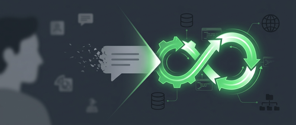

过去两年，大多数团队和 AI 打交道的方式是一致的：输入文本，等待文本回复，然后人工决定下一步该做什么。这套模式足以应对个人效率工具，但一旦要把 AI 真正嵌入生产软件，它就暴露出根本性的局限。

Gwen Davis 在 GitHub Blog 上发表的这篇文章，直接点出了这个转变：**"AI 即文本"的时代结束了，执行才是新的界面。**

## 问题出在哪里

生产软件不靠独立的问答交换来运行。真实系统需要执行：规划步骤、调用工具、修改文件、从错误中恢复、在你定义的约束内适应变化。把文本输出对接进去，靠人工或脚本再串联后续操作，这个中间层越来越脆。

很多开发者用过 GitHub Copilot 在 IDE 里的 Agent 模式后，都有同一个困惑：「这种 Agentic 工作流，为什么不能直接用在我自己的应用里？」

GitHub Copilot SDK 给出了答案。它把驱动 GitHub Copilot CLI 的那套生产级规划和执行引擎，作为可编程能力暴露出来，让你直接在自己的系统里内嵌。

## 三种可落地的模式

文章提出了三种具体模式，团队正在用它们把 Agent 执行能力嵌入真实应用。

### 模式一：把多步骤工作交给 Agent 去做

过去，团队靠脚本和胶水代码自动化重复任务。但一旦工作流依赖上下文、中途改变形态，或者需要错误恢复，脚本就变脆了——要么硬编码边界情况，要么开始自己搭编排层。

用 Copilot SDK，应用可以传递**意图**，而不是编码固定步骤。

比如暴露一个操作「准备这个仓库用于发布」，不需要手动定义每一步，你只传入意图和约束，Agent 会：

- 探索仓库结构
- 规划所需步骤
- 修改文件
- 执行命令
- 遇到失败时自动适应

整个过程在你定义的边界内运行，可观测、可控制。

**为什么重要**：随着系统规模增长，固定工作流会崩。Agentic 执行让软件在保持约束和可观测性的前提下适应变化，不用每次都从头重建编排逻辑。

### 模式二：用结构化运行时上下文接地气

很多团队试图把更多行为塞进 Prompt。但把系统逻辑编码进文本，会让工作流越来越难测试、难推理、难演进。随着时间推移，Prompt 变成了结构化系统集成的脆弱替代品。

用 Copilot SDK，上下文变成结构化的、可组合的：

- 定义领域专属工具或 Agent 技能
- 通过 [Model Context Protocol (MCP)](https://github.com/microsoft/mcp-for-beginners/) 暴露工具
- 让执行引擎在运行时检索上下文

举个例子，一个内部 Agent 可以：

- 查询服务归属
- 拉取历史决策记录
- 检查依赖图
- 引用内部 API
- 在定义的安全约束下行动

不再需要把所有权数据、API Schema、依赖规则都塞进 Prompt——Agent 在规划和执行过程中直接访问这些系统。

**为什么重要**：可靠的 AI 工作流依赖结构化的、有权限管理的上下文。MCP 提供了管道，让 Agentic 执行牢牢接地在真实工具和真实数据上，而不是靠嵌入 Prompt 里的猜测。

### 模式三：在 IDE 之外嵌入执行能力

今天的大多数 AI 工具都假设有意义的工作发生在 IDE 里。但现代软件生态远不止一个编辑器。

团队真正需要的是把 Agentic 能力嵌入到：

- 桌面应用
- 内部运营工具
- 后台服务
- SaaS 平台
- 事件驱动系统

用 Copilot SDK，执行成为应用层能力。系统可以监听一个事件（文件变更、部署触发、用户操作），然后以编程方式调用 Copilot。规划和执行循环在你的产品内部运行，不再依赖独立的界面或开发者工具。

**为什么重要**：当执行能力嵌入到应用里，AI 就不再是一个侧边栏里的助手，而是基础设施。它在你的软件运行的任何地方都可用，不局限于 IDE 或终端。

## 这个转变是架构层面的

从"AI 即文本"到"AI 即执行"，是一次架构转变。Agentic 工作流是可编程的规划和执行循环，在约束下运行、与真实系统集成、在运行时适应。

GitHub Copilot SDK 把这些执行能力作为可编程层暴露出来。团队可以把精力放在**定义软件应该完成什么**，而不是每次引入 AI 都重新搭一遍编排机制。

这句话是这篇文章最核心的判断：

> 如果你的应用能触发逻辑，它就能触发 Agentic 执行。

这不是在说 AI 会更聪明，而是在说 AI 的集成界面变了。以前你和 AI 对话，现在你在你的系统里配置它的执行边界，让它作为基础设施运行。

## 参考

- [原文：The era of "AI as text" is over. Execution is the new interface. — GitHub Blog](https://github.blog/ai-and-ml/github-copilot/the-era-of-ai-as-text-is-over-execution-is-the-new-interface/)
- [GitHub Copilot SDK](https://github.com/github/copilot-sdk/)
- [Model Context Protocol for Beginners](https://github.com/microsoft/mcp-for-beginners/)
- [Copilot SDK Cookbook — multi-step execution examples](https://github.com/github/awesome-copilot/tree/main/cookbook/copilot-sdk/)
