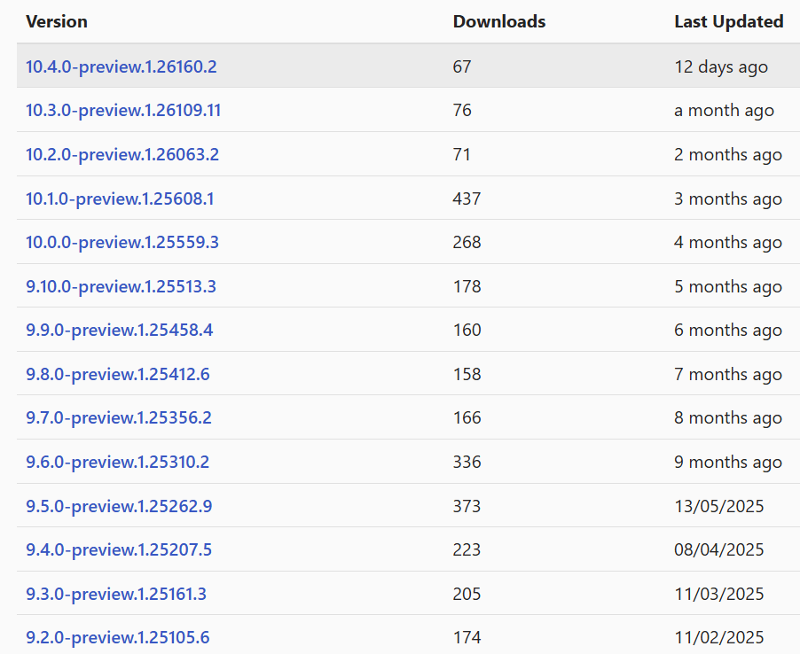

`Microsoft.Extensions.Options.Contextual` 是一个藏在 dotnet 仓库里、几乎没什么人知道的实验性包。Andrew Lock 在浏览 .NET 仓库时偶然发现了它，写下了这篇探索性文章。本文整理了他的分析，帮你快速判断这个包是什么、怎么用，以及值不值得引入。


## 这个包解决什么问题

.NET 的 `IOptions<T>`、`IOptionsSnapshot<T>` 体系大家都熟悉。它的问题在于配置是"全局的"——不管你用 singleton 还是 scoped，最终拿到的 options 实例都基于同一套配置来源（appsettings.json、环境变量、代码中的 `Configure()` 调用等），没有办法在运行时根据某个业务对象来动态调整。

`Microsoft.Extensions.Options.Contextual` 要做的就是这件事：**让你在取 options 的时候传入一个"上下文"对象，系统根据该上下文动态组装出对应的选项值。**

官方描述是：

> APIs for dynamically configuring options based on a given context

举个原文用的例子：有一个 `WeatherForecastOptions`，包含 `TemperatureScale`（摄氏/华氏）和 `ForecastDays`（预报天数）两个属性。现在希望根据当前用户的国籍动态决定用哪种温度单位。用这个库，调用侧看起来像这样：

```csharp
// 从 DI 取 IContextualOptions<TOptions, TContext>
IContextualOptions<WeatherForecastOptions, AppContext> _contextualOptions;

AppContext context = ...; // 从请求/业务层获取上下文

// 传入上下文，拿到按该上下文配置好的 options 实例
WeatherForecastOptions options = await _contextualOptions.GetAsync(context, cancellationToken);
```

这和 named options 不同——named options 是预先定义好几套固定配置，这里是**根据运行时传入的任意上下文对象来决定配置**。

## 安装包

这个包从未发布稳定版，所以安装时必须加 `--prerelease` 标志：

```bash
dotnet add package Microsoft.Extensions.Options.Contextual --prerelease
```

安装后 `.csproj` 里会出现类似这样的引用（支持 .NET Framework 和 .NET 8+）：

```xml
<PackageReference Include="Microsoft.Extensions.Options.Contextual"
                  Version="10.4.0-preview.1.26160.2" />
```

目前的最新版本如下图所示：



## 配置步骤

使用这个库需要配置三个部分：给上下文对象加 `[OptionsContext]` 属性、实现 `IOptionsContextReceiver`、以及注册配置逻辑。

### 第一步：给上下文对象加 `[OptionsContext]` 属性

上下文类型需要加上 `[OptionsContext]` 属性，并声明为 `partial`：

```csharp
[OptionsContext]          // 👈 加这个，同时类型要声明为 partial
internal partial class AppContext
{
    public Guid UserId { get; set; }
    public string Country { get; set; } = "";
}
```

这会触发源生成器 `ContextualOptionsGenerator`，自动生成如下的 partial 类：

```csharp
// <auto-generated/>
partial class AppContext : IOptionsContext
{
    void IOptionsContext.PopulateReceiver(IOptionsContextReceiver receiver)
    {
        receiver.Receive(nameof(Country), Country);
        receiver.Receive(nameof(UserId), UserId);
    }
}
```

本质上，源生成器让你的上下文类型实现了 `IOptionsContext`，提供了一个把所有属性"喂给" receiver 的机制。

### 第二步：实现 `IOptionsContextReceiver`

`IOptionsContextReceiver` 是一个简单接口，用来从上下文中提取你关心的属性，并做适当转换：

```csharp
// 实现 IOptionsContextReceiver，接收上下文属性值
internal class CountryTemperatureReceiver : IOptionsContextReceiver
{
    // 暴露提取后的结果
    public string DefaultUnit { get; private set; } = "Celsius";

    // Receive 会被每个属性调用一次
    public void Receive<T>(string key, T value)
    {
        if (key == nameof(AppContext.Country) && value is string country)
        {
            // 根据国家代码决定默认温度单位
            DefaultUnit = country == "US" ? "Fahrenheit" : "Celsius";
        }
    }
}
```

### 第三步：注册配置逻辑

在服务注册时，同时配置标准选项和上下文选项：

```csharp
var builder = WebApplication.CreateBuilder(args);

builder.Services
    .AddOptions<WeatherForecastOptions>()
    .Configure(x => x.ForecastDays = 7)               // 标准配置
    .Configure<IOptionsContext>((opts, ctx) =>          // 上下文配置
    {
        // 1. 创建 receiver
        var receiver = new CountryTemperatureReceiver();

        // 2. 用上下文填充 receiver
        ctx.PopulateReceiver(receiver);

        // 3. 根据 receiver 的提取结果更新选项
        if (receiver.DefaultUnit != null)
        {
            opts.TemperatureScale = receiver.DefaultUnit;
        }
    });
```

### 第四步：从 DI 取出并使用

配置完成后，就可以在需要的地方注入 `IContextualOptions<WeatherForecastOptions, AppContext>`，传入运行时上下文来获取配置好的选项实例：

```csharp
public class WeatherService(
    IContextualOptions<WeatherForecastOptions, AppContext> contextualOptions)
{
    public async Task<string> GetForecast(AppContext context, CancellationToken ct)
    {
        WeatherForecastOptions opts = await contextualOptions.GetAsync(context, ct);
        // opts.TemperatureScale 已按 context.Country 动态设置
        return $"{opts.ForecastDays} days forecast in {opts.TemperatureScale}";
    }
}
```

## 作者的直接判断

看完这套机制，Andrew Lock 的第一反应是：**为什么要这么麻烦？**

如果你想根据 `AppContext.Country` 来决定 `TemperatureScale`，直接写不就行了：

```csharp
WeatherForecastOptions opts = new();
opts.TemperatureScale = appContext.Country == "US" ? "Fahrenheit" : "Celsius";
```

引入 receiver 后，表面上"解耦"了 options 和 context，但实际上你仍然通过魔法字符串 `nameof(AppContext.Country)` 耦合在一起——如果重命名 `Country` 属性，这里悄悄就断了。

那这个库的真实意图是什么？查找相关 API proposal 后，Andrew 找到了答案：


这个提案是**关闭状态**的。API review 讨论中有人问："实际上有多少个 `IOptionsContextReceiver` 实现？"回答里提到了 LaunchDarkly——一个商业特性标志服务。也就是说，这套 API 最初的设想是配合**第三方 feature flags 服务**来用，由第三方平台实现 receiver，把远端配置注入进来。

但 .NET 已经有了 `Microsoft.FeatureManagement`（Andrew 7 年前写过详细介绍），下载量超过 1.4 亿，可以说完全够用。目前可以找到的唯一开源使用者是 `excos-platform/config-client`，一个特性标志/实验平台的客户端。

## 关于"实验性"警告

所有 API 都标记了 `[Experimental]` 属性，会产生编译时错误 `EXTEXP0018`。更麻烦的是，**源生成器生成的代码里也有这个错误**，而你没有办法给自动生成的代码加 `#pragma`，所以实际上你只能在 `.csproj` 里全局禁用它：

```xml
<PropertyGroup>
  <!-- 压制实验性 API 警告 -->
  <NoWarn>$(NoWarn);EXTEXP0018</NoWarn>
</PropertyGroup>
```

这让 `[Experimental]` 属性的保护意义大打折扣。

## 总结

`Microsoft.Extensions.Options.Contextual` 是一个设计思路有趣、但目前没有必要引入的包：

- 全部版本均为 preview，没有稳定发布
- 所有 API 带 `[Experimental]` 标记
- 无法单独使用 `#pragma` 禁用源生成器的警告
- 任意版本的下载量均未超过 1000 次

如果你深度依赖 `IOptions<>` 体系，并且**恰好需要一个接受第三方上下文注入的 receiver 机制**，那这个包或许有用武之地。否则，直接在业务层按上下文配置对象，代码更清晰，也更容易追踪。

想要 feature flags 功能，可以看看 [OpenFeature](https://openfeature.dev/)，它是跨语言的、有更完善的生态。

## 参考

- [原文：Configuring contextual options with Microsoft.Extensions.Options.Contextual](https://andrewlock.net/configuring-contextual-options-with-microsoft-extensions-options-contextual/)
- [GitHub 仓库：Microsoft.Extensions.Options.Contextual](https://github.com/dotnet/extensions/tree/main/src/Libraries/Microsoft.Extensions.Options.Contextual)
- [API Proposal #5049](https://github.com/dotnet/extensions/issues/5049)
- [NuGet 包页面](https://www.nuget.org/packages/Microsoft.Extensions.Options.Contextual/10.4.0-preview.1.26160.2)
- [OpenFeature](https://openfeature.dev/)
