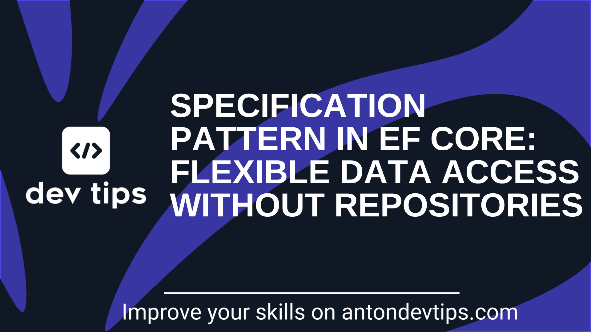

随着 .NET 项目规模增长，Repository 模式开始暴露出它的问题：每增加一个业务需求，就要往 Repository 里塞一个新方法；过一段时间，一个类里全是相似但微妙不同的查询方法，不仅难以维护，还会产生大量重复逻辑。

规格模式（Specification Pattern）是应对这一问题的清晰方案——用小而专注、可复用的类来描述你想要的数据，避免把所有查询逻辑堆积在 Repository 里。


## Repository 为什么会成为瓶颈

项目小的时候，Repository 看起来很整洁。但随着项目成长，你会遇到这些问题：

**1. 方法爆炸**

每个新的业务需求都意味着新方法：

```csharp
public class PostRepository
{
    GetPostsByUser(userId)
    GetPopularPosts()
    GetPostsByCategory(category)
    GetRecentViralPosts(daysBack)
    GetPostsByCategoryAndLikesCountAndDate(...)
    // ...还有很多
}
```

**2. 命名越来越难看**

为了描述每一种过滤条件，方法名越拼越长：`GetPostsByCategoryAndLikesCountAndDate`。如果还需要按日期降序排列的版本，就又要复制一份。

**3. Repository 越拆越碎**

为了控制单个 Repository 的大小，有时候拆成很多小类。但这样又失去了"集中管理"的好处，逻辑也更难复用。

> **值得注意的是**：EF Core 的 `DbContext` 本身已经实现了 Repository 和 Unit of Work 模式（官方文档明确指出）。在 EF Core 上再包一层 Repository，是在抽象之上加抽象，往往导致过度设计。



## 什么是规格模式

规格模式用一个个小的、可复用的类（Specification）来描述你的查询条件。每个 Specification 代表一个过滤规则，可以单独使用，也可以与其他 Specification 组合。

**核心优势：**

| 优势 | 说明 |
|------|------|
| **可复用性** | 写一次，在项目任意位置使用 |
| **可组合性** | 多个 Specification 通过 And/Or 组合成复杂查询 |
| **可测试性** | Specification 是普通类，可以单独写单元测试或集成测试 |
| **关注点分离** | 查询逻辑与数据访问代码解耦 |

一个简单的示例——返回点赞数超过 150 的病毒式传播帖子：

```csharp
public class ViralPostSpecification : Specification<Post>
{
    public ViralPostSpecification(int minLikesCount)
    {
        AddFilteringQuery(p => p.LikesCount >= minLikesCount);
        AddOrderByDescendingQuery(p => p.LikesCount);
    }
}
```

## 在 EF Core 中实现规格模式

### 第一步：定义 ISpecification 接口

```csharp
public interface ISpecification<T>
{
    Expression<Func<T, bool>>? FilterQuery { get; }
    IReadOnlyCollection<Expression<Func<T, object>>> IncludeQueries { get; }
    IReadOnlyCollection<Expression<Func<T, object>>> OrderByQueries { get; }
    IReadOnlyCollection<Expression<Func<T, object>>> OrderByDescendingQueries { get; }
}
```

### 第二步：创建基础 Specification 类

基类封装所有构建查询的逻辑，子类只需调用受保护的辅助方法：

```csharp
public abstract class Specification<T> : ISpecification<T>
{
    private readonly List<Expression<Func<T, object>>> _includeQueries = [];
    private readonly List<Expression<Func<T, object>>> _orderByQueries = [];
    private readonly List<Expression<Func<T, object>>> _orderByDescendingQueries = [];

    public Expression<Func<T, bool>>? FilterQuery { get; private set; }
    public IReadOnlyCollection<Expression<Func<T, object>>> IncludeQueries => _includeQueries;
    public IReadOnlyCollection<Expression<Func<T, object>>> OrderByQueries => _orderByQueries;
    public IReadOnlyCollection<Expression<Func<T, object>>> OrderByDescendingQueries => _orderByDescendingQueries;

    protected Specification() { }

    // 从另一个 Specification 复制所有条件
    protected Specification(ISpecification<T> specification)
    {
        FilterQuery = specification.FilterQuery;
        _includeQueries.AddRange(specification.IncludeQueries);
        _orderByQueries.AddRange(specification.OrderByQueries);
        _orderByDescendingQueries.AddRange(specification.OrderByDescendingQueries);
    }

    protected void AddFilteringQuery(Expression<Func<T, bool>> filterExpression)
        => FilterQuery = filterExpression;

    protected void AddIncludeQuery(Expression<Func<T, object>> includeExpression)
        => _includeQueries.Add(includeExpression);

    protected void AddOrderByQuery(Expression<Func<T, object>> orderByExpression)
        => _orderByQueries.Add(orderByExpression);

    protected void AddOrderByDescendingQuery(Expression<Func<T, object>> orderByExpression)
        => _orderByDescendingQueries.Add(orderByExpression);
}
```

### 第三步：将 Specification 应用到 EF Core 查询

创建一个 `EfCoreSpecification` 类，把 Specification 的各个条件依次应用到 `IQueryable`：

```csharp
public class EfCoreSpecification<T> : Specification<T> where T : class
{
    public EfCoreSpecification(ISpecification<T> specification) : base(specification) { }

    public IQueryable<T> Apply(IQueryable<T> queryable)
    {
        // 1. 应用 Where 过滤
        if (FilterQuery is not null)
            queryable = queryable.Where(FilterQuery);

        // 2. 应用 Include（EF Core 预加载）
        queryable = IncludeQueries.Aggregate(queryable,
            (current, includeQuery) => current.Include(includeQuery));

        // 3. 应用排序（OrderBy + ThenBy）
        if (OrderByQueries.Any())
        {
            var ordered = queryable.OrderBy(OrderByQueries.First());
            var orderedQueryable = OrderByQueries.Skip(1)
                .Aggregate(ordered, (current, orderQuery) => current.ThenBy(orderQuery));
            queryable = orderedQueryable;
        }

        // 4. 应用降序排序（OrderByDescending + ThenByDescending）
        if (OrderByDescendingQueries.Any())
        {
            var ordered = queryable.OrderByDescending(OrderByDescendingQueries.First());
            var orderedQueryable = OrderByDescendingQueries.Skip(1)
                .Aggregate(ordered, (current, orderQuery) => current.ThenByDescending(orderQuery));
            queryable = orderedQueryable;
        }

        return queryable;
    }
}
```

### 第四步：添加 DbContext 扩展方法

```csharp
public static class SpecificationExtensions
{
    public static IQueryable<T> ApplySpecification<T>(
        this ApplicationDbContext dbContext,
        ISpecification<T> specification) where T : class
    {
        var efCoreSpecification = new EfCoreSpecification<T>(specification);
        return dbContext.Set<T>().AsNoTracking().Apply(efCoreSpecification);
    }
}
```

### 第五步：在端点中直接使用

不需要 Repository，直接在端点（或 Application Handler、Service）里用 DbContext + Specification：

```csharp
app.MapGet("/posts/viral", async (
    [FromQuery] int minLikesCount,
    [FromServices] ApplicationDbContext dbContext,
    CancellationToken cancellationToken) =>
{
    var specification = new ViralPostSpecification(minLikesCount);

    var response = await dbContext
        .ApplySpecification(specification)
        .Select(p => new PostResponse(p.Id, p.Title, p.LikesCount))
        .ToListAsync(cancellationToken);

    return Results.Ok(response);
});
```

> **如果仍然需要 Repository**，可以在 Repository 的通用方法里应用 Specification，但作者更推荐直接使用 DbContext，避免不必要的抽象层。

## 高级用法：组合规格

规格模式最强大的地方在于**组合**。通过 `And` / `Or` 操作符将两个或多个 Specification 合并成新的规格，同时保持每个规格的独立性和可测试性。

### 实现 AndSpecification / OrSpecification

组合时需要合并两个 Lambda 表达式，这里需要一个 `ReplaceExpressionVisitor` 来处理参数替换：

```csharp
public class ReplaceExpressionVisitor(Expression oldValue, Expression newValue) : ExpressionVisitor
{
    public override Expression Visit(Expression node) =>
        node == oldValue ? newValue : base.Visit(node);
}

public class AndSpecification<T> : Specification<T>
{
    public AndSpecification(Specification<T> left, Specification<T> right)
    {
        RegisterFilteringQuery(left, right);
    }

    private void RegisterFilteringQuery(Specification<T> left, Specification<T> right)
    {
        var leftExpr  = left.FilterQuery;
        var rightExpr = right.FilterQuery;

        if (leftExpr is null && rightExpr is null) return;
        if (leftExpr is null) { AddFilteringQuery(rightExpr!); return; }
        if (rightExpr is null) { AddFilteringQuery(leftExpr); return; }

        // 替换 rightExpr 的参数为 leftExpr 的参数，然后 AndAlso 合并
        var visitor      = new ReplaceExpressionVisitor(rightExpr.Parameters[0], leftExpr.Parameters[0]);
        var replacedBody = visitor.Visit(rightExpr.Body);
        var andExpr      = Expression.AndAlso(leftExpr.Body, replacedBody);
        AddFilteringQuery(Expression.Lambda<Func<T, bool>>(andExpr, leftExpr.Parameters[0]));
    }
}

// OrSpecification 结构相同，只是用 Expression.OrElse 替代 Expression.AndAlso
```

### 在基类中添加组合辅助方法

```csharp
public abstract class Specification<T>
{
    // ... 前面的代码 ...

    public Specification<T> And(Specification<T> specification) =>
        new AndSpecification<T>(this, specification);

    public Specification<T> Or(Specification<T> specification) =>
        new OrSpecification<T>(this, specification);
}
```

### 组合示例一：Or 合并分类查询

查询属于".NET"或"架构"分类的帖子：

```csharp
public class DotNetAndArchitecturePostSpecification : Specification<Post>
{
    public DotNetAndArchitecturePostSpecification()
    {
        var dotNetSpec       = new PostByCategorySpecification("DotNet");
        var architectureSpec = new PostByCategorySpecification("Architecture");

        // 用 Or 合并两个分类规格
        var combinedSpec = dotNetSpec.Or(architectureSpec);

        AddFilteringQuery(combinedSpec.FilterQuery!);
        AddOrderByDescendingQuery(p => p.CreatedAt);
    }
}
```

### 组合示例二：And 合并多条件查询

查询"近期发布"且"高互动"的帖子：

```csharp
public class HighEngagementRecentPostSpecification : Specification<Post>
{
    public HighEngagementRecentPostSpecification(int daysBack, int minLikes, int minComments)
    {
        var recentSpec          = new RecentPostSpecification(daysBack);
        var highEngagementSpec  = new HighEngagementPostSpecification(minLikes, minComments);

        // 用 And 合并两个规格
        var combinedSpec = recentSpec.And(highEngagementSpec);

        AddFilteringQuery(combinedSpec.FilterQuery!);
        AddOrderByDescendingQuery(p => p.LikesCount);
    }
}
```

## 关于 Include 的说明

在与端点直接配合时，**通常不需要在 Specification 里写 `AddIncludeQuery`**，因为端点会通过 `Select` 投影来选取所需字段，而不是直接拿整个实体对象。投影本身会让 EF Core 只生成包含所需列的 SQL，效率更高。

如果使用 Repository 模式，想在通用 `WhereAsync` 方法里支持 Include，有两个选择：
1. 在 Specification 里添加 Include——但这可能拉取过多数据。
2. 在 `WhereAsync` 方法里增加一个 mapping delegate 参数。

两种方案各有取舍，这也是作者更倾向于不用 Repository、直接操作 DbContext 的原因之一。

## 完整端点示例

```csharp
app.MapGet("/posts/dotnet-and-architecture", async (
    [FromServices] ApplicationDbContext dbContext,
    CancellationToken cancellationToken) =>
{
    var specification = new DotNetAndArchitecturePostSpecification();

    var response = await dbContext
        .ApplySpecification(specification)
        .Select(p => new PostResponse(p.Id, p.Title, p.Category, p.LikesCount))
        .ToListAsync(cancellationToken);

    return Results.Ok(response);
});
```

## 总结

规格模式能有效应对 Repository 方法爆炸的问题，让 .NET 项目的数据访问层保持整洁：

- **不再需要 Repository**——EF Core 的 `DbContext` 已经是完整的数据访问抽象，直接用 Specification + DbContext 就够了。
- **查询逻辑变成可复用类**——一个 `ViralPostSpecification` 可以在任意端点、Handler、Service 里用。
- **And/Or 组合无需修改现有类**——新业务需求只需组合已有规格，符合开闭原则。
- **测试更容易**——Specification 是普通类，不依赖数据库，可以写精准的单元测试。

当你发现自己在 Repository 里不断添加相似方法，或者写出越来越长的方法名时，这就是引入规格模式的信号。

## 参考

- [原文：Specification Pattern in EF Core: Flexible Data Access Without Repositories](https://antondevtips.com/blog/specification-pattern-in-ef-core-flexible-data-access-without-repositories)
- [Anton Martyniuk Newsletter](https://antondevtips.com/)
