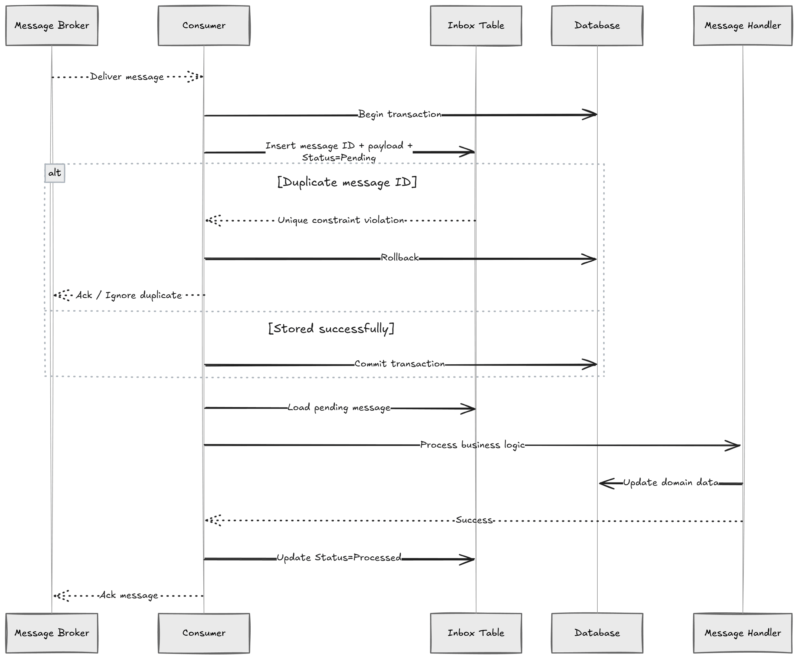

Outbox 模式解决了消息的可靠发布问题，但消费端呢？

消息发布方可靠地把消息送出，Broker 也成功投递，消费者处理完毕——然后出事了。一个超时，一次崩溃，一个网络闪断。Broker 认为 ACK 没收到，于是**重新投递同一条消息**。消费者把同样的逻辑跑了两遍。

这就是 **Inbox 模式**要解决的问题。

## 为什么需要 Inbox

绝大多数消息中间件提供的是**至少一次投递**（at-least-once delivery）。Broker 保证每条消息都会被投递，但不保证只投递一次。

一个典型的失败路径：

1. Broker 将消息投递给消费者
2. 消费者成功处理
3. ACK 还没到达 Broker，连接断了
4. Broker 认为消息丢失，重新投递
5. 消费者把同一条消息**处理了两次**

解决办法之一是让每个 Handler 实现幂等性。这能用，但意味着每个消费者都要在做任何实际工作之前先查一遍去重表。Inbox 模式把这件事集中到基础设施层，只处理一次。

**核心思路：**

1. 消息从 Broker 到达
2. 不立即处理，而是**写入 inbox 表**
3. 如果消息已存在（重复投递），写入被静默忽略
4. **后台进程**读取未处理的消息并分发处理

这将消息接收和处理解耦。消费者变成一个薄薄的持久化层，不会产生重复。



## 数据库表结构

`inbox_messages` 表存储所有到达的消息：

```sql
CREATE TABLE IF NOT EXISTS inbox_messages (
    id UUID PRIMARY KEY,
    type VARCHAR(255) NOT NULL,
    content JSONB NOT NULL,
    received_on_utc TIMESTAMP WITH TIME ZONE NOT NULL,
    processed_on_utc TIMESTAMP WITH TIME ZONE NULL,
    error TEXT NULL
);

CREATE INDEX IF NOT EXISTS idx_inbox_messages_unprocessed
ON public.inbox_messages (received_on_utc, processed_on_utc)
INCLUDE (id, type, content)
WHERE processed_on_utc IS NULL;
```

结构和 Outbox 模式的 `outbox_messages` 表镜像对应。`id` 字段通过 `ON CONFLICT DO NOTHING` 实现幂等插入。过滤索引只索引未处理的消息，已处理的消息自动从索引中排除，保持索引小而精。

服务间传递的消息基于一个共享的 `IntegrationEvent` 基础 record：

```csharp
public abstract record IntegrationEvent(Guid MessageId);

public sealed record OrderCreatedIntegrationEvent(Guid OrderId)
    : IntegrationEvent(Guid.CreateVersion7());
```

## Inbox Consumer

消费者是一个 MassTransit `IConsumer<T>`。它不处理消息，只是**把消息写入 inbox 表**然后返回。可以做成泛型，适配所有 Integration Event：

```csharp
internal sealed class InboxConsumer<T>(NpgsqlDataSource dataSource)
    : IConsumer<T> where T : IntegrationEvent
{
    public async Task Consume(ConsumeContext<T> context)
    {
        await using var connection = await dataSource.OpenConnectionAsync(
            context.CancellationToken);

        const string sql = """
            INSERT INTO public.inbox_messages (id, type, content, received_on_utc)
            VALUES (@Id, @Type, @Content::jsonb, @ReceivedOnUtc)
            ON CONFLICT (id) DO NOTHING;
            """;

        await connection.ExecuteAsync(sql, new
        {
            Id = context.Message.MessageId,
            Type = typeof(T).FullName,
            Content = JsonSerializer.Serialize(context.Message),
            ReceivedOnUtc = DateTime.UtcNow
        });
    }
}
```

`ON CONFLICT (id) DO NOTHING` 是真正在发挥作用的那一行。如果 Broker 投递了同一条消息两次，第二次插入会被静默忽略。在插入成功但 ACK 发出前崩溃？下次重新投递时同样会被安全去重。

## Inbox Processor

Processor 运行在后台服务或定时任务中，批量获取未处理的消息并分发处理：

```csharp
internal sealed class InboxProcessor(
    NpgsqlDataSource dataSource,
    IEventDispatcher eventDispatcher,
    ILogger<InboxProcessor> logger)
{
    private const int BatchSize = 1000;

    public async Task<int> Execute(CancellationToken cancellationToken = default)
    {
        await using var connection = await dataSource.OpenConnectionAsync(cancellationToken);
        await using var transaction = await connection.BeginTransactionAsync(cancellationToken);

        var messages = (await connection.QueryAsync<InboxMessage>(
            """
            SELECT id AS Id, type AS Type, content AS Content
            FROM inbox_messages
            WHERE processed_on_utc IS NULL
            ORDER BY received_on_utc
            LIMIT @BatchSize
            FOR UPDATE SKIP LOCKED
            """,
            new { BatchSize },
            transaction: transaction)).AsList();

        var processedAt = DateTime.UtcNow;
        var results = new List<(Guid Id, DateTime ProcessedAt, string? Error)>(messages.Count);

        foreach (var message in messages)
        {
            try
            {
                var messageType = Type.GetType(message.Type)!;
                var deserialized = JsonSerializer.Deserialize(message.Content, messageType)!;
                await eventDispatcher.DispatchAsync(deserialized, cancellationToken);
                results.Add((message.Id, processedAt, null));
            }
            catch (Exception ex)
            {
                logger.LogError(ex, "Failed to process inbox message {Id}", message.Id);
                results.Add((message.Id, processedAt, ex.ToString()));
            }
        }

        if (results.Count > 0)
        {
            await connection.ExecuteAsync(
                """
                UPDATE inbox_messages
                SET processed_on_utc = v.processed_on_utc,
                    error = v.error
                FROM UNNEST(@Ids, @ProcessedAts, @Errors)
                    AS v(id, processed_on_utc, error)
                WHERE inbox_messages.id = v.id
                """,
                new
                {
                    Ids = results.Select(r => r.Id).ToArray(),
                    ProcessedAts = results.Select(r => r.ProcessedAt).ToArray(),
                    Errors = results.Select(r => r.Error).ToArray()
                },
                transaction: transaction);
        }

        await transaction.CommitAsync(cancellationToken);
        return messages.Count;
    }
}
```

几个关键设计点：

- **`FOR UPDATE SKIP LOCKED`**：让多个 Processor 实例并发运行而互不竞争。这和 Outbox 模式横向扩展时采用的方法相同。
- **用 `UNNEST` 批量更新**：所有结果一次 round-trip 写入，最小化数据库往返次数。
- **错误捕获**：失败的消息会被标记错误信息，不会阻塞整个队列继续处理。

如果 Processor 在批次处理中途崩溃，事务会回滚，这批消息在下一次运行时会被重新拾取。

## 几个需要注意的地方

**表体积增长**：inbox 表会无限增长。可以在保留期到达后删除已处理的消息，或者按时间范围分区并丢弃旧分区，也可以归档到另一张表以保留历史记录。

**毒消息（Poison messages）**：如果某条消息持续处理失败，它每次都会被标记错误并留在表里。考虑设置最大重试次数，超过 N 次失败后将其送入死信队列并告警。

**消息顺序**：`ORDER BY received_on_utc` 给出的是大致按到达时间排序的结果。但配合 `SKIP LOCKED` 和多个 Processor 实例，**严格顺序无法保证**。如果需要按聚合根维度的有序处理，需要额外的协调机制。

**监控滞后**：跟踪 `received_on_utc` 和 `processed_on_utc` 之间的时间差。如果这个差值持续增长，说明处理能力跟不上，可以增大批次大小、缩短轮询间隔，或者横向扩展更多 Processor 实例。

## Inbox 与幂等消费者的区别

Inbox 模式和幂等消费者（Idempotent Consumer）都能防止重复处理，区别在于**处理发生的时机**和**谁来控制重试**。

**幂等消费者**在消息到达时立即处理。它先查去重表，再执行业务逻辑，最后在同一个事务里记录去重条目。如果处理失败，事务回滚，去重记录不留下，**Broker 按自己的节奏**重新投递消息。这意味着你不能控制重试的时机和间隔。

**Inbox 模式**把接收和处理分开。Consumer 写入消息然后立即 ACK，Broker 就此退场。如果 Processor 失败，它记录错误并继续处理下一条。重试是你自己的责任：可以把失败消息的 `processed_on_utc` 重置为 `NULL`，或者用一个单独的循环按延迟重新处理失败消息。

适用场景的选择思路：
- 副作用是事务性的，Broker 来管理重试已经够用 → **幂等消费者**
- 需要批量处理、自定义重试策略、或者通过 `FOR UPDATE SKIP LOCKED` 横向扩展 → **Inbox 模式**

## 小结

Inbox 模式是 Outbox 模式的消费端对应物，核心机制是：

- **`ON CONFLICT DO NOTHING`** 让消费者插入天然幂等
- **接收与处理分离** 带来独立的重试控制能力
- **`FOR UPDATE SKIP LOCKED`** 实现 Processor 的横向扩展
- **`UNNEST` 批量更新** 最小化数据库 round-trip

如果你在构建事件驱动系统，把 Outbox 和 Inbox 配对使用，就能在发布侧和消费侧都建立起可靠的消息保障。

## 参考

- [Implementing the Inbox Pattern for Reliable Message Consumption](https://www.milanjovanovic.tech/blog/implementing-the-inbox-pattern-for-reliable-message-consumption) - Milan Jovanović
- [Implementing the Outbox Pattern](https://www.milanjovanovic.tech/blog/implementing-the-outbox-pattern) - Milan Jovanović
- [The Idempotent Consumer Pattern](https://www.milanjovanovic.tech/blog/the-idempotent-consumer-pattern-in-dotnet-and-why-you-need-it) - Milan Jovanović
- [Scaling the Outbox Pattern](https://www.milanjovanovic.tech/blog/scaling-the-outbox-pattern) - Milan Jovanović
