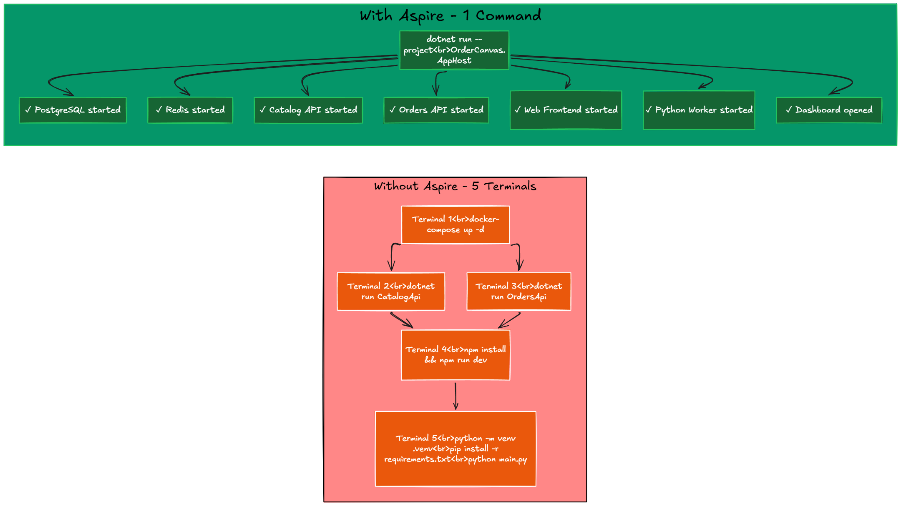
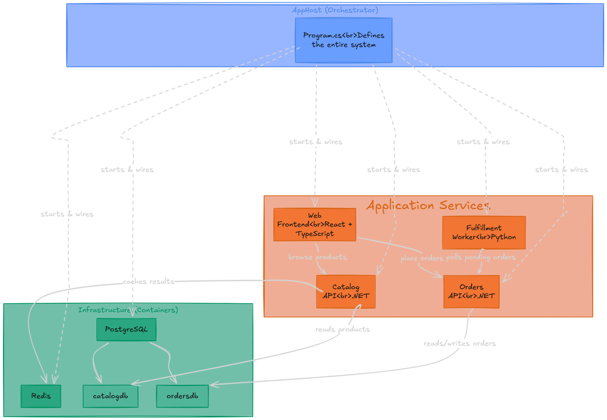
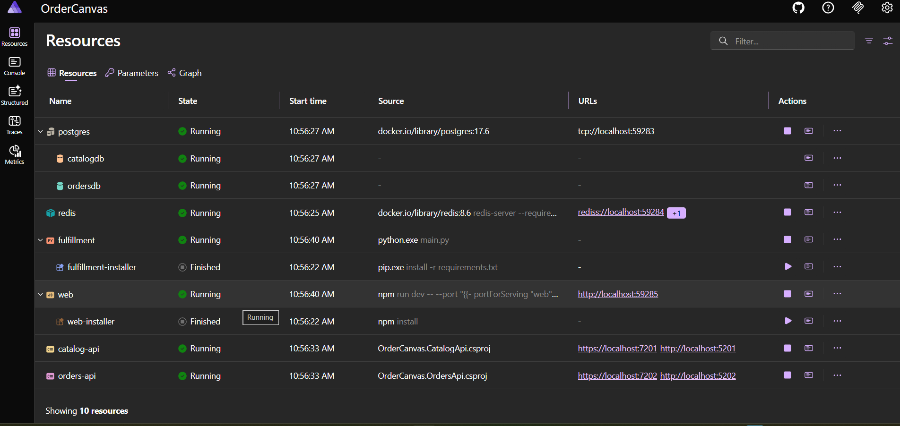
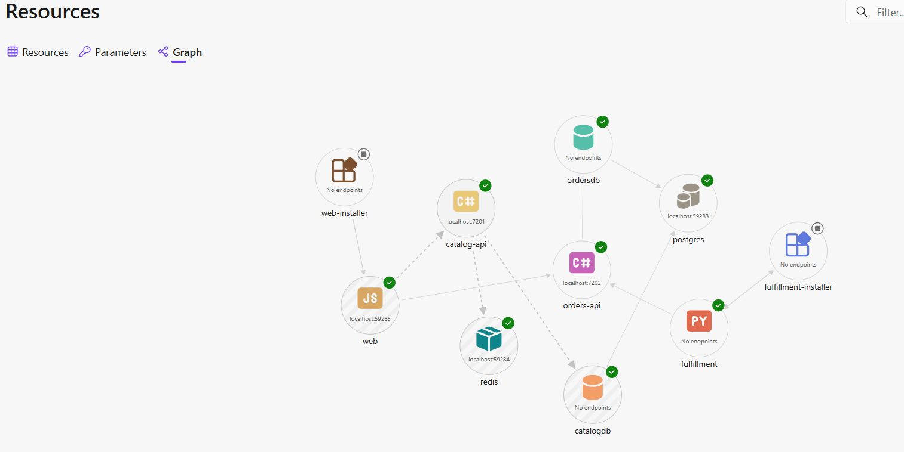
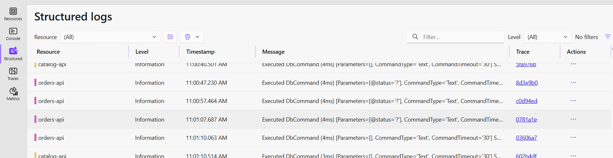
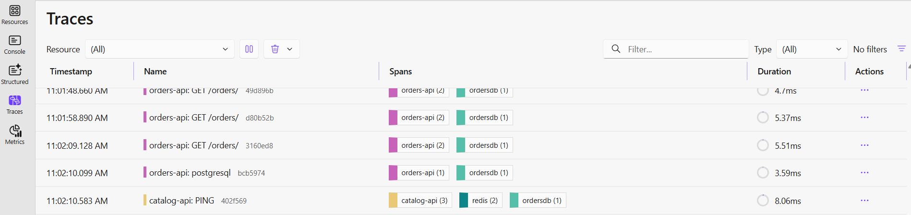
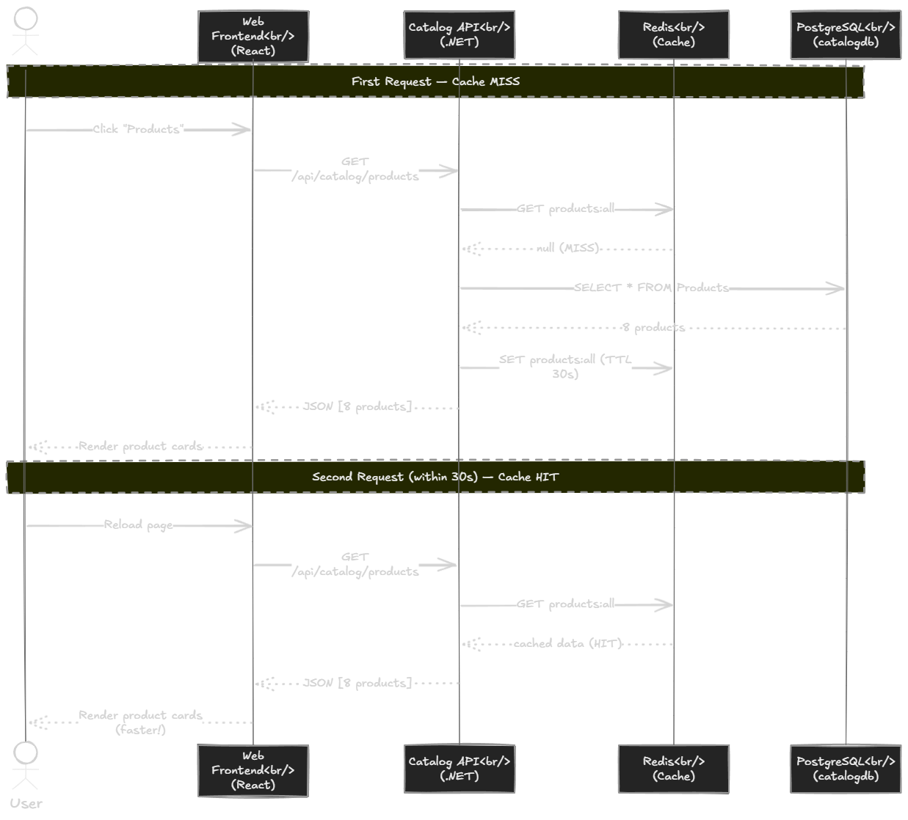
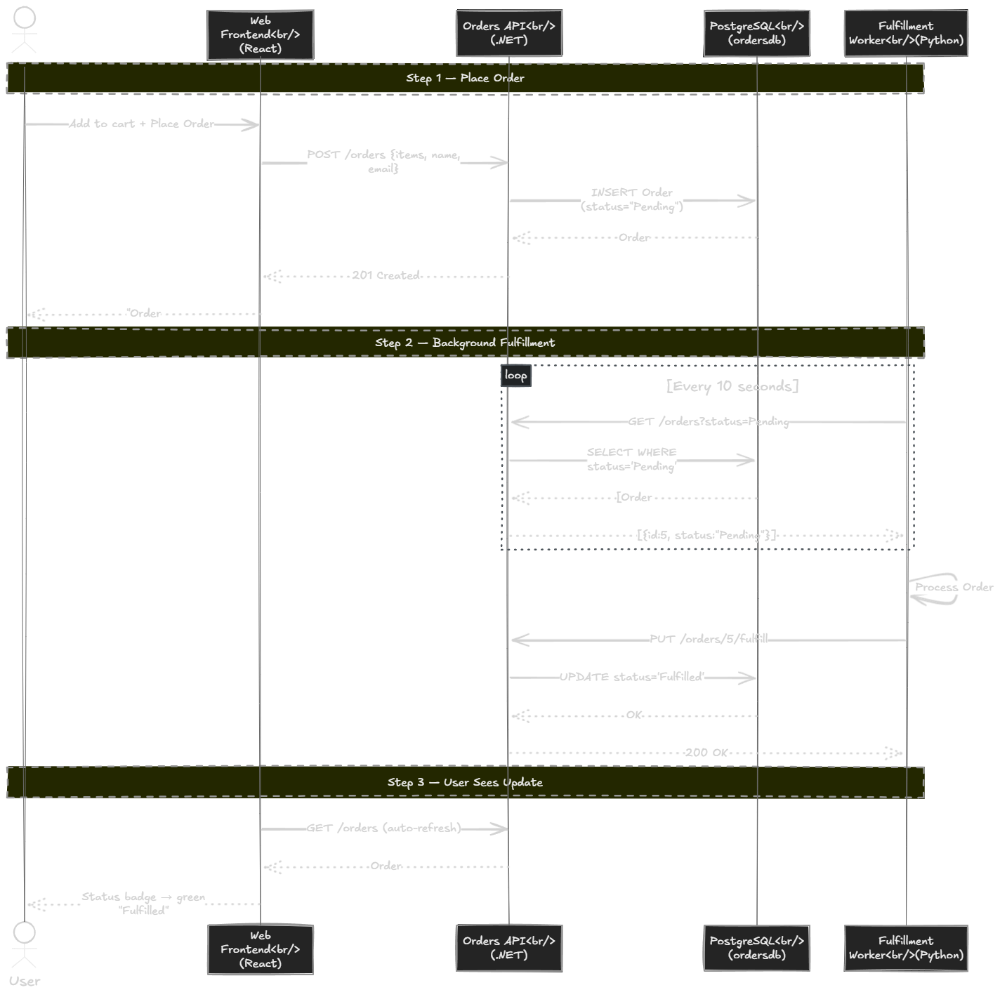
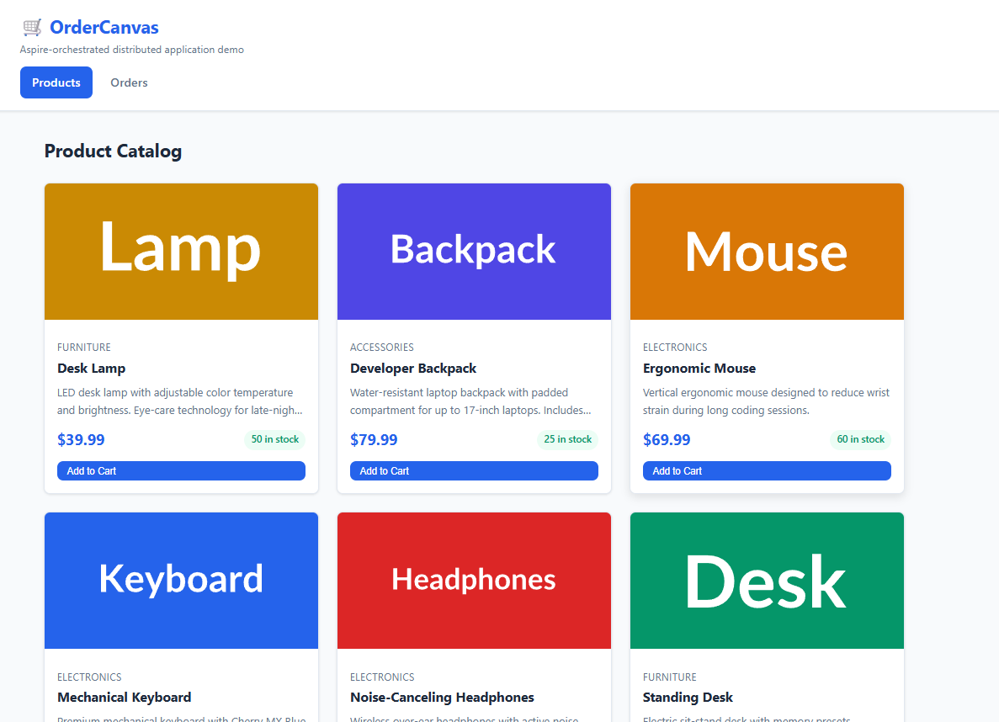

在本地跑一个分布式应用，很多人都有过这种体验：先开一个终端跑 `docker-compose up -d` 启动 PostgreSQL 和 Redis，再开第二个终端跑第一个 API，第三个终端跑第二个 API，第四个终端安装前端依赖再启动 Vite，第五个终端配 Python 虚拟环境然后跑 worker——然后还是有服务连不上，一查才发现某个配置文件里的连接字符串写错了。

每次有新人加入团队，这一套流程要重新走一遍，半天就没了。

Aspire 就是为了解决这个问题而来的。

## Aspire 是什么

你可能看过一些文章叫它".NET Aspire"。现在它叫 Aspire，Microsoft 去掉了".NET"前缀，因为这个工具本身并不限于 .NET 服务。编排器是用 .NET（或 TypeScript）写的，但被它管理的服务可以用任何语言。

Aspire 是**代码优先的分布式应用编排层**。

当你在构建一个有多个服务、数据库和缓存的系统时，面对的核心问题是：怎么在本地跑起来？服务之间怎么互相找到对方？出了问题怎么看清楚发生了什么？

Aspire 通过 **AppHost** 来解决这些问题。AppHost 是一个小项目，在里面描述整个系统：

- 需要什么基础设施（PostgreSQL、Redis、RabbitMQ 等）
- 有哪些服务（任何语言的 API、Worker、前端）
- 它们怎么互相连接
- 谁要等谁启动完才能启动

运行 AppHost 之后，Aspire 会：

- 用一条命令启动所有东西——容器、API、前端、worker
- 自动注入连接字符串和服务端点（通过环境变量）
- 提供统一 Dashboard，包含所有服务的日志、追踪、指标和健康状态
- 管理完整生命周期——拉取 Docker 镜像、创建 Python venv、运行 `npm install`

## 为什么需要它

你可能会说："我有 Docker Compose 了，够用。"

Docker Compose 可以启动容器，但对于本地分布式开发来说，它只解决了基础设施的部分，剩下的问题还是要手动处理：

| 问题 | 没有 Aspire | 有 Aspire |
| --- | --- | --- |
| 启动系统 | 5+ 个终端，手动排序 | `dotnet run`（一条命令） |
| 连接字符串 | 复制粘贴到各个配置文件 | 声明一次，自动注入 |
| 服务 URL | 硬编码 `localhost:PORT` | Aspire 通过环境变量注入 |
| 端口冲突 | 手动调试 | Aspire 自动分配 |
| 创建数据库 | 手写 SQL 或脚本 | `AddDatabase()` 搞定 |
| 查日志 | 在多个终端之间切换 | Dashboard 统一查看，可过滤 |
| 分布式追踪 | 安装 Jaeger + 配置 | 内置，零配置 |
| 新增服务 | 改 docker-compose，加环境变量 | AppHost 一行代码 |
| 新人上手 | 长篇 README | `dotnet run` 搞定 |

上面每一行都是在实际项目中遇到过的真实问题。光是连接字符串不同步这件事，就已经在多个团队里让我花掉了若干小时。



## OrderCanvas 演示项目

为了展示 Aspire 的实际效果，原作者构建了 OrderCanvas——一个小型订单和履约平台，包含：

- **Catalog API**（.NET）：从 PostgreSQL 提供商品数据，加 Redis 缓存
- **Orders API**（.NET）：在 PostgreSQL 中创建和管理订单
- **Web 前端**（React + TypeScript + Vite）：浏览商品和下单的界面
- **Fulfillment Worker**（Python）：后台服务，处理待处理订单
- **PostgreSQL**：关系型数据库（由 Aspire 容器化）
- **Redis**：缓存层（由 Aspire 容器化）

六个组件，三种语言，一个 AppHost。



## AppHost：系统的唯一入口

整套编排只需要 AppHost 项目里的 `Program.cs`：

```csharp
var builder = DistributedApplication.CreateBuilder(args);

// 基础设施
var postgres = builder.AddPostgres("postgres");
var catalogDb = postgres.AddDatabase("catalogdb");
var ordersDb = postgres.AddDatabase("ordersdb");
var redis = builder.AddRedis("redis");

// .NET API
var catalogApi = builder.AddProject<Projects.OrderCanvas_CatalogApi>("catalog-api")
    .WithReference(catalogDb)
    .WithReference(redis)
    .WaitFor(catalogDb)
    .WaitFor(redis);

var ordersApi = builder.AddProject<Projects.OrderCanvas_OrdersApi>("orders-api")
    .WithReference(ordersDb)
    .WaitFor(ordersDb);

// React 前端
builder.AddViteApp("web", "../ordercanvas-web")
    .WithReference(catalogApi)
    .WithReference(ordersApi)
    .WaitFor(catalogApi)
    .WaitFor(ordersApi);

// Python Worker
builder.AddPythonApp("fulfillment", "../ordercanvas-fulfillment", "main.py")
    .WithReference(ordersApi)
    .WaitFor(ordersApi);

builder.Build().Run();
```

就这些。没有 Docker Compose 文件，没有硬编码端口，没有手写的连接字符串。

几点说明：

- `WithReference()` 告诉 Aspire 把依赖的连接字符串或 URL 注入进来
- `WaitFor()` 确保服务在依赖健康之前不会启动
- `AddPostgres()` / `AddRedis()` 会自动拉取并运行容器
- `AddViteApp()` / `AddPythonApp()` 会自动处理 npm install、venv 创建、pip install 等流程

## 运行只需要一条命令

```bash
dotnet run --project src/OrderCanvas.AppHost
```

背后发生了什么：

1. PostgreSQL 和 Redis 容器自动启动
2. `catalogdb` 和 `ordersdb` 数据库被创建
3. 两个 .NET API 启动，正确的连接字符串已注入
4. 前端执行 `npm install` + `npm run dev`
5. Python venv 被创建，依赖安装完，worker 启动
6. Aspire Dashboard 在浏览器中打开

30–60 秒内，所有东西都跑起来了。不需要 Docker Compose 文件，不需要 5 个终端，不需要任何设置文档。

## Dashboard：把所有服务放到一个视图

Aspire Dashboard 是让整个效果变得直观的地方。

**Resources 标签页**展示每个组件的实时健康状态：



你还能看到服务间的依赖拓扑图，直观了解整个系统结构：



除此之外，Dashboard 还提供：

**结构化日志**——所有服务的日志在同一视图，可按服务过滤：



**分布式追踪**——跨服务边界的完整请求链路（Browser → API → Database）：



不需要 Jaeger、Zipkin 或 Grafana。这些全都内置了。

## 服务之间怎么协作

### 浏览商品：缓存命中与未命中



**第一次请求（缓存未命中）：**

1. React 前端调用 `GET /api/catalog/products`
2. Vite 代理转发到 Catalog API
3. Catalog API 查询 Redis → 未命中
4. 从 PostgreSQL 查询所有商品
5. 结果写入 Redis，TTL 30 秒
6. 返回商品列表给浏览器

**30 秒内的第二次请求（缓存命中）：**

1. 同样的请求到达 Catalog API
2. 查询 Redis → 命中
3. 直接返回缓存数据，完全不查数据库

在 Aspire Dashboard 里，你能看到完整的追踪链路：`web → catalog-api → Redis (GET) → PostgreSQL (SELECT) → Redis (SET)`。缓存命中时追踪更短，没有 PostgreSQL 步骤。

### 下单和履约：多语言协作



**第一步——用户下单：**

1. React 发送 `POST /api/orders/orders`，携带购物车商品
2. Orders API 验证请求，将订单写入 PostgreSQL，状态为"Pending"
3. 用户看到成功消息

**第二步——Python worker 自动履约：**

1. Python Fulfillment Worker 每 10 秒轮询 `GET /orders?status=Pending`
2. 找到待处理订单，模拟处理（2 秒延迟）
3. 调用 `PUT /orders/{id}/fulfill`
4. 订单状态变为"Fulfilled"

**第三步——用户看到更新：**

Orders 页面自动刷新，显示绿色"Fulfilled"徽章。

Aspire Dashboard 中的分布式追踪展示了从 Python → .NET → PostgreSQL 的完整链路。三种语言，一个追踪视图，不需要在多个终端之间切换。

## Service Defaults：一行代码搞定可观测性

如果你手动配过 OpenTelemetry，你知道那需要多少工作：安装 NuGet 包、配置 exporter、决定把数据发到哪、跑一个 Jaeger 或 Zipkin……

在 Aspire 里，每个 .NET 服务只需要调用一行：

```csharp
builder.AddServiceDefaults();
```

这一行配置了：

- OpenTelemetry 结构化日志
- 指标（ASP.NET Core、HTTP client、运行时）
- 分布式追踪（ASP.NET Core、HTTP client）
- 指向 Aspire Dashboard 的 OTLP exporter
- `/health` 和 `/alive` 健康检查端点

对于非 .NET 服务，Aspire 同样处理得很好。OrderCanvas 里的 Python worker 会自动收到 `OTEL_EXPORTER_OTLP_ENDPOINT` 环境变量，不需要任何 Python 侧的配置。它的结构化 stdout 日志会被捕获，和 .NET 服务一起显示在同一个 Dashboard 里。

## 多语言编排是真实可用的

Aspire 不要求你的服务是 .NET。在 OrderCanvas 里：

- Catalog API 和 Orders API 是 .NET
- Web 前端是 React + TypeScript
- Fulfillment Worker 是 Python

三者都出现在同一个 Dashboard，都能通过 `WithReference()` 互相引用，都有健康监控，都能收到环境变量注入。

本地开发不需要 Dockerfile，不需要手动管理端口。一张图，一个 Dashboard，任何语言。

## 项目结构

```text
OrderCanvas/
├── src/
│   ├── OrderCanvas.AppHost/           # 编排器
│   │   └── Program.cs                 # 定义整个系统
│   ├── OrderCanvas.ServiceDefaults/   # 共享的遥测/健康检查配置
│   ├── OrderCanvas.CatalogApi/        # 商品目录 API（.NET）
│   ├── OrderCanvas.OrdersApi/         # 订单管理 API（.NET）
│   ├── ordercanvas-web/               # React + Vite 前端
│   └── ordercanvas-fulfillment/       # Python worker
└── README.md
```

AppHost 的 `Program.cs` 是唯一的系统描述真相来源。一个新开发者打开这个文件，立刻能理解整个系统的拓扑结构。

## 实际运行效果

打开 Web 前端后是商品目录页，一个整洁的商品网格，数据从 Catalog API 拉取：



你往购物车里加几件商品，填写姓名和邮箱，点击"Place Order"。订单保存为"Pending"，几秒后 Python Fulfillment Worker 自动拾起并处理，状态变为"Fulfilled"。你在 Orders 页面能看到状态徽章从紫色的"Pending"变为绿色的"Fulfilled"，不需要手动操作任何事情。

整个流程涉及 3 种语言和 4 个服务（React → .NET Catalog API → .NET Orders API → Python Worker），从一条命令启动，在一个 Dashboard 里可见。

## 小结

Aspire 解决的是每个分布式应用开发者都面对过的问题：**在本地运行、连接和观察多个服务有多痛苦**。

它给了你：

- **一个 AppHost** 描述整个系统
- **一条命令** 启动所有东西
- **自动连接** 不再手写、复制连接字符串
- **内置可观测性** 日志、追踪、指标、健康检查开箱即用
- **任何语言** .NET、TypeScript、Python 都在同一个 Dashboard

OrderCanvas 演示项目的源码已开放：[GitHub repository](https://github.com/StefanTheCode/AspireDemoApplication)

## 参考

- [原文：Aspire for Beginners - Build and Run Distributed Applications](https://thecodeman.net/posts/aspire-for-beginners-distributed-applications)
- [OrderCanvas GitHub 仓库](https://github.com/StefanTheCode/AspireDemoApplication)
