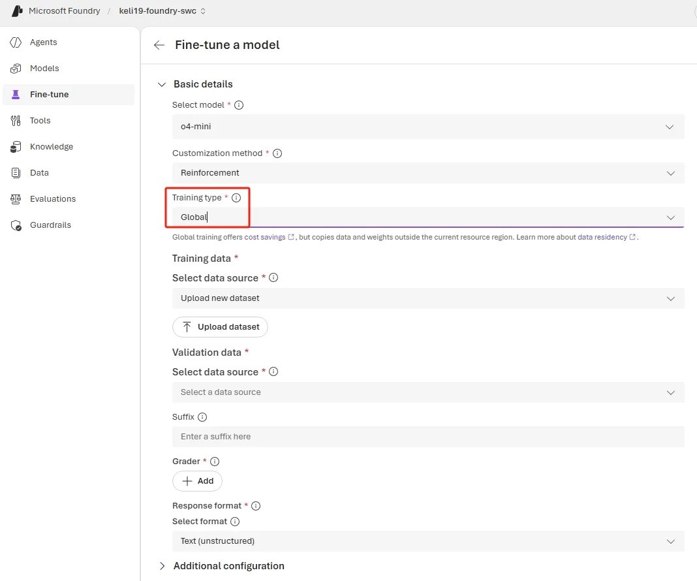

Azure AI Foundry 在四月份为强化微调（Reinforcement Fine-Tuning，RFT）推出了三项更新，分别从训练成本、评分器选择和实践规范三个维度入手。如果你正在用 RFT 定制 reasoning 模型或 agentic 工作流，这次更新值得花时间看一遍。

## o4-mini 全球训练

以前用 o4-mini 做微调，只能在有限的区域发起任务。现在 Global Training 支持从 **13 个 Azure 区域**发起 o4-mini 的训练任务，到四月底会扩展到所有微调区域。

目前可用区域：East US 2、North Central US、West US 3、Australia East、France Central、Germany West Central、Switzerland North、Norway East、Poland Central、Spain Central、Italy North、Switzerland West、Sweden Central。

训练基础设施和模型质量不受区域影响，但 Global Training 的定价低于 Standard 训练——对于跨地域团队或需要频繁迭代的场景，成本差异会比较明显。



通过 REST API 创建全球训练任务的示例：

```bash
curl -X POST "https://<your-resource>.openai.azure.com/openai/fine_tuning/jobs?api-version=2025-04-01-preview" \
  -H "Content-Type: application/json" \
  -H "api-key: $AZURE_OPENAI_API_KEY" \
  -d '{
    "model": "o4-mini",
    "training_file": "<your-training-file-id>",
    "method": {
      "type": "reinforcement",
      "reinforcement": {
        "grader": {
          "type": "string_check",
          "name": "answer-check",
          "input": "{{sample.output_text}}",
          "reference": "{{item.reference_answer}}",
          "operation": "eq"
        }
      }
    },
    "hyperparameters": {
      "n_epochs": 2,
      "compute_multiplier": 1.0
    },
    "trainingType": "globalstandard"
  }'
```

关键差异在于最后一个字段 `"trainingType": "globalstandard"`，其余结构与 Standard 训练相同。

## 新增模型评分器：GPT-4.1 系列

RFT 的核心是评分器（grader）——它定义了模型优化的奖励信号。这次更新让 **GPT-4.1、GPT-4.1-mini 和 GPT-4.1-nano** 三个模型也可以充当评分器。

### 什么时候用模型评分器

模型评分器不是默认首选。官方建议的优先级是：

- **确定性评分器优先**（字符串匹配、Python、端点验证）：更快、更便宜、更可复现。
- **模型评分器适用场景**：
  - 任务输出是开放式或主观的（比如摘要质量、多步推理一致性）
  - 需要在一次评分中同时评估多个维度（准确性、完整性、安全性）
  - 构建 agentic 工作流，工具调用正确性依赖语义上下文

### 如何选择 GPT-4.1 系列中的哪个

- **GPT-4.1-nano**：用于早期实验，成本低、迭代快
- **GPT-4.1-mini**：评分标准稳定后升级，兼顾成本和精度
- **GPT-4.1**：生产级评分或复杂评分标准，每次判断都需要高可信度时使用

一个任务里可以混用不同类型的评分器。比如用字符串匹配检查答案是否正确，再用 GPT-4.1-mini 评估推理过程的质量——两者在同一个 RFT 任务里并行工作。

## RFT 最佳实践指南

官方同步发布了一份最佳实践文档，整理了从设计评分器到避免常见坑的完整建议。以下是核心内容的提炼。

### RFT 适合哪些场景

RFT 适合输出可以被明确评分的任务：

- **工具调用准确性**：模型需要选择正确的工具并传入合法参数
- **策略 / 规则执行**：输出必须遵守可验证的业务规则
- **结构化数据提取**：正确性无歧义，可以确定性打分

**不适合 RFT 的场景**：格式调整、语气改写、风格迁移——这类需求用 prompt engineering、结构化输出或有监督微调（SFT）更合适。

### 五步工作流

**第一步：明确目标**

先写清楚"任务是什么"和"成功是什么样子"，再设计能够可靠反映真实质量的评分器。评分器是 RFT 成功的主要驱动因素，值得投入不成比例的精力。

**第二步：建立基线**

训练前先用 10–100 个样本跑一次基线评估，了解起始性能，后续才能判断提升是真实的。用基础模型（比如 o4-mini）配合 system prompt 调优，在微调前尽可能压榨 prompt 的上限。

**第三步：设计有效评分器**

- 用最简单的评分器——如果答案是数字或选项，用字符串匹配而不是模型评分
- 偏好确定性检查（Python、端点）而不是模型评分
- 奖励分布要合理，过于稀疏或过于均匀都会让学习信号变弱
- 在多样、真实的输入上验证评分器，不要只用合成数据

**第四步：从小规模开始迭代**

从 10–100 个样本、简单评分器、低 epoch 数入手：

1. 先用 o4-mini RFT 验证端到端流程和评分器行为
2. 确认奖励信号健康后再升级到更大模型
3. 每次只改一个变量，方便归因收益或回退

**第五步：调整训练参数**

`epoch_count` 和 `compute_multiplier` 对质量影响最大。逐一调整，全程监控奖励趋势和方差。

### 数据格式：SFT vs RFT

这是 RFT 中最容易踩到的格式问题。RFT 要求每行数据的**最后一条消息必须是 User 或 Developer 角色**——答案不放在 assistant 里，而是放到顶层字段。

**SFT 格式**（答案在 assistant 消息里）：

```json
{
  "messages": [
    { "role": "system", "content": "尽可能准确回答用户的问题。" },
    { "role": "user", "content": "问题：法国的首都是哪里？" },
    { "role": "assistant", "content": "巴黎" }
  ]
}
```

**RFT 格式**（答案移到顶层字段，供评分器引用）：

```json
{
  "messages": [
    { "role": "developer", "content": "尽可能准确回答用户的问题。" },
    { "role": "user", "content": "问题：法国的首都是哪里？" }
  ],
  "reference_answer": "巴黎"
}
```

评分器里用 `{{item.reference_answer}}` 引用这个字段。

### 常见坑

**数据与评分器字段不匹配**

评分器里引用的每个键（比如 `item.reference_answer`）必须在所有数据行里都存在。字段名不一致会导致任务静默失败或打分错误。

**缺少 response format**

如果评分器要引用 `sample.output_json`，必须在任务定义里提供 `response_format`，否则模型输出自由文本，JSON 引用会失败：

```json
{
  "type": "json_schema",
  "json_schema": {
    "name": "response",
    "strict": true,
    "schema": {
      "properties": {
        "capital": { "title": "Capital", "type": "string" }
      },
      "title": "CapitalData",
      "type": "object",
      "additionalProperties": false
    }
  }
}
```

### 进阶：Agentic RFT 场景

**工具设计原则**

把工具视为环境的一部分，而不是被动的执行者。工具需要覆盖任务的完整决策周期，而不只是最终动作。比如自动升级工作流，不能只有"触发升级"的工具，还需要"检查接收方是否可用"的工具——没有这一步，模型就无法学会何时该升级。

同时要为训练规模的并发做好准备：设置超时和限流，添加链路追踪，规划重试策略，避免慢请求引发重试风暴。

**MCP 集成**

RFT 通过 function-calling 支持工具使用，但对于生产级 agentic 系统，MCP 是首选方案。把每个工具实现一次，通过 MCP 接口暴露给 MCP 原生客户端，同时提供 function-calling 兼容接口用于微调。

**监控奖励黑客行为**

训练过程中通过 Foundry 微调任务详情页的 **Metrics 标签**实时观察输出和评估指标，不要等到训练结束才看结果。

奖励黑客的典型信号：

- 评估分数上升，但输出质量肉眼可见地变差
- 模型输出"通过"了评分器，但并没有执行预期行为（比如语义错误的工具调用恰好匹配了模式检查）

应对措施：

- 使用包含多样真实输入的保留评估集
- 从多个维度（结果、工具使用、安全性）给出部分信用
- 显式要求关键中间步骤（比如写操作前必须先查询）
- 保持评分器确定性，确保提升来自策略变化而不是评分器噪声

## 参考

- [原文：What's new in Foundry Finetune — April 2026](https://devblogs.microsoft.com/foundry/whats-new-in-foundry-finetune-april-2026)
- [RFT 最佳实践指南（GitHub）](https://github.com/microsoft-foundry/fine-tuning/blob/main/Demos/Agentic_RFT_PrivatePreview/RFT_Best_Practice.md)
- [微调代码示例（GitHub）](https://github.com/microsoft-foundry/fine-tuning/Demos)
- [强化微调操作指南（Microsoft Learn）](https://learn.microsoft.com/en-us/azure/ai-foundry/openai/how-to/reinforcement-fine-tuning)
