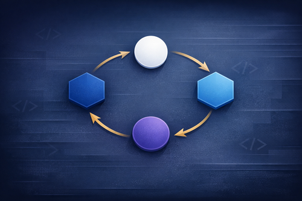

当一个对象的行为随着内部状态不同而改变时，代码里很快就会出现大量 `switch` 或嵌套 `if-else`。随着状态数量增加，每加一个状态就得改好几处判断逻辑，这种结构很难维护。

状态设计模式（State Design Pattern）是 GoF 行为型模式之一，专门用来处理这类情况。它把每种状态的行为封装进独立的类，让上下文对象把请求委托给当前状态对象执行，外部看起来像是对象"换了一副面孔"，但实际上只是委托对象变了。

## 三个核心参与者

理解状态模式，先搞清楚三个角色的职责边界。

**State 接口**声明上下文支持的所有状态相关操作，所有具体状态类都要实现它。在 C# 里，通常用 `interface` 或 `abstract class`。如果部分状态之间有共享默认行为，用抽象类可以减少重复代码。

**Concrete State 类**实现 State 接口，封装某一种具体状态下的全部逻辑。它可以调用上下文的 `SetState` 方法来触发状态转移——也就是说，状态类之间彼此知晓，这是它与策略模式最大的结构差异。

**Context** 是客户端直接交互的对象。它持有当前状态的引用，把方法调用转发给当前状态，自身不包含任何状态相关的判断逻辑。这里体现的是控制反转：Context 把行为决策权下放给状态对象。

## 动手实现：订单系统

用一个订单系统来演示。订单会经历 Pending → Confirmed → Shipped → Delivered 四个状态，以及随时可能进入的 Cancelled 状态。

### 定义 State 接口

```csharp
public interface IOrderState
{
    void Confirm(OrderContext order);
    void Ship(OrderContext order);
    void Deliver(OrderContext order);
    void Cancel(OrderContext order);
    string GetStatus();
}
```

五个方法，每个接收 `OrderContext` 参数，让状态对象可以调用 `SetState` 触发转移。`GetStatus()` 返回当前状态的可读标签。

### Pending 状态

```csharp
using System;

public sealed class PendingState : IOrderState
{
    public void Confirm(OrderContext order)
    {
        Console.WriteLine("Order confirmed.");
        order.SetState(new ConfirmedState());
    }

    public void Ship(OrderContext order)
    {
        Console.WriteLine("Cannot ship. Order has not been confirmed.");
    }

    public void Deliver(OrderContext order)
    {
        Console.WriteLine("Cannot deliver. Order has not been shipped.");
    }

    public void Cancel(OrderContext order)
    {
        Console.WriteLine("Order cancelled.");
        order.SetState(new CancelledState());
    }

    public string GetStatus() => "Pending";
}
```

Pending 状态只允许两个操作：确认和取消。发货、签收在此状态下无效，调用只打印拒绝消息，不做状态转移。

### Confirmed 状态

```csharp
using System;

public sealed class ConfirmedState : IOrderState
{
    public void Confirm(OrderContext order)
    {
        Console.WriteLine("Order is already confirmed.");
    }

    public void Ship(OrderContext order)
    {
        Console.WriteLine("Order shipped.");
        order.SetState(new ShippedState());
    }

    public void Deliver(OrderContext order)
    {
        Console.WriteLine("Cannot deliver. Order has not been shipped.");
    }

    public void Cancel(OrderContext order)
    {
        Console.WriteLine("Confirmed order cancelled.");
        order.SetState(new CancelledState());
    }

    public string GetStatus() => "Confirmed";
}
```

已确认的订单可以发货或取消，但不能再次确认，也不能直接签收。

### Shipped、Delivered 和 Cancelled 状态

```csharp
using System;

public sealed class ShippedState : IOrderState
{
    public void Confirm(OrderContext order)
        => Console.WriteLine("Cannot confirm. Order is already shipped.");

    public void Ship(OrderContext order)
        => Console.WriteLine("Order is already shipped.");

    public void Deliver(OrderContext order)
    {
        Console.WriteLine("Order delivered.");
        order.SetState(new DeliveredState());
    }

    public void Cancel(OrderContext order)
        => Console.WriteLine("Cannot cancel. Order is already shipped.");

    public string GetStatus() => "Shipped";
}

public sealed class DeliveredState : IOrderState
{
    public void Confirm(OrderContext order)
        => Console.WriteLine("Cannot confirm. Order is already delivered.");
    public void Ship(OrderContext order)
        => Console.WriteLine("Cannot ship. Order is already delivered.");
    public void Deliver(OrderContext order)
        => Console.WriteLine("Order is already delivered.");
    public void Cancel(OrderContext order)
        => Console.WriteLine("Cannot cancel. Order is already delivered.");
    public string GetStatus() => "Delivered";
}

public sealed class CancelledState : IOrderState
{
    public void Confirm(OrderContext order)
        => Console.WriteLine("Cannot confirm. Order is cancelled.");
    public void Ship(OrderContext order)
        => Console.WriteLine("Cannot ship. Order is cancelled.");
    public void Deliver(OrderContext order)
        => Console.WriteLine("Cannot deliver. Order is cancelled.");
    public void Cancel(OrderContext order)
        => Console.WriteLine("Order is already cancelled.");
    public string GetStatus() => "Cancelled";
}
```

`DeliveredState` 和 `CancelledState` 是终态——所有操作都被拒绝。这是状态机设计中的常见做法：终态用拒绝消息守护所有无效转移。

### Context 类

```csharp
using System;

public sealed class OrderContext
{
    private IOrderState _currentState;

    public OrderContext()
    {
        _currentState = new PendingState();
    }

    public void SetState(IOrderState state)
    {
        _currentState = state;
        Console.WriteLine($"State changed to: {_currentState.GetStatus()}");
    }

    public void Confirm() => _currentState.Confirm(this);
    public void Ship()    => _currentState.Ship(this);
    public void Deliver() => _currentState.Deliver(this);
    public void Cancel()  => _currentState.Cancel(this);

    public string Status => _currentState.GetStatus();
}
```

Context 干净利落：没有任何条件判断，每个方法都是一行转发。构造时初始化为 `PendingState`。

### 运行起来看看

```csharp
var order = new OrderContext();
Console.WriteLine($"Current status: {order.Status}");
// Output: Current status: Pending

order.Ship();
// Output: Cannot ship. Order has not been confirmed.

order.Confirm();
// Output: Order confirmed.
// Output: State changed to: Confirmed

order.Ship();
// Output: Order shipped.
// Output: State changed to: Shipped

order.Cancel();
// Output: Cannot cancel. Order is already shipped.

order.Deliver();
// Output: Order delivered.
// Output: State changed to: Delivered

Console.WriteLine($"Final status: {order.Status}");
// Output: Final status: Delivered
```

客户端只和 `OrderContext` 打交道，不需要知道任何内部状态类的存在。无效操作被当前状态优雅地拒绝，有效操作自动触发转移。

## 有限状态机与转移表

状态模式本质上是有限状态机（FSM）的面向对象实现。FSM 定义了一组状态、一组输入事件，以及事件触发的状态转移规则。

动手之前先把转移表画出来，能帮你发现遗漏的路径和歧义状态：

| 当前状态 | 事件 | 下一状态 | 附加动作 |
|---|---|---|---|
| Pending | Confirm | Confirmed | 验证支付信息 |
| Pending | Cancel | Cancelled | 释放库存 |
| Confirmed | Ship | Shipped | 生成物流单号 |
| Confirmed | Cancel | Cancelled | 发起退款 |
| Shipped | Deliver | Delivered | 发送确认邮件 |

表里每行直接对应一个具体状态类里的方法实现。"附加动作"那列就是 `SetState` 调用之前的逻辑。

关于转移逻辑放在哪里：本例由具体状态类自己调用 `SetState`，这是最常见的做法。另一种选择是把转移逻辑集中在 Context 或一张转移表里，但这样很容易在 Context 里积累条件分支——恰好是状态模式想要避免的。大多数情况下，让状态类自己管理转移是更好的权衡。

## 与策略模式的区别

状态模式和策略模式的类图几乎一样，都是 Context 持有一个接口引用，通过多态分发行为。但意图不同：

**策略模式**：客户端在运行时选择算法，策略之间互相不知晓，不会自己触发切换。适合场景：排序算法、压缩方式、定价规则。

**状态模式**：行为切换由对象的内部事件驱动，状态类彼此知晓并触发转移，客户端不需要手动切换状态。适合场景：工作流、游戏角色状态机、连接状态管理。

一个简单判断：如果行为切换是客户端主动发起的，一般是策略；如果是对象自己的生命周期决定的，一般是状态。

## 与其他模式搭配

- **观察者模式**：在 Context 的 `SetState` 里发布事件，让外部系统（UI、日志、通知）监听状态变化，不需要修改状态类。
- **命令模式**：把触发状态转移的操作封装成命令对象，支持排队、撤销或审计日志。工作流引擎场景下这个组合很实用。
- **适配器模式**：如果某个第三方组件的行为恰好对应一个状态，但它不实现你的状态接口，用适配器桥接，不用修改外部库。

## 优势与代价

**优势：**

- 消灭条件分支：`switch` 和 `if-else` 被多态替代，每个状态类只关注自己的逻辑。
- 符合开闭原则：加新状态只需新增类，不用改 Context 和已有状态类（前提是转移逻辑不需要调整）。
- 单一职责：每个状态类只负责一种条件下的行为，不会被多个状态的逻辑混杂。
- 显式状态模型：状态和转移可见于类和方法调用，便于理解、文档和测试。每个状态类都可以单独用 mock Context 测试。

**代价：**

- 类数量增加：每个状态对应一个类。状态多时，代码库里会多出很多小类。
- 状态间耦合：具体状态类相互引用（为触发转移），重构转移逻辑时影响面会扩大。
- 简单场景过度设计：只有两三个状态、逻辑很简单时，`enum` + `switch` 反而更直接。
- 转移逻辑分散：每个状态类都藏着部分转移规则，不易一眼看全整张 FSM。

## 常见问题

**什么时候该用状态模式？**

当对象行为依赖内部状态、且这种依赖体现在多个方法里时，就值得考虑。经典信号：每次加一个新状态，都要在多处 `switch` 里同时修改。常见场景：订单流程、文档审批、游戏角色状态、连接管理（connecting/connected/disconnected）。

**能不能用 enum 代替？**

状态数量少、逻辑简单时，`enum` + `switch` 够用。当状态和操作增多，`switch` 出现在多个方法里且每次都得改，那就是重构到状态模式的时机。

**怎么处理多个状态的共同行为？**

用抽象基类代替或配合接口使用，把共同行为提到基类，具体状态只覆写有差异的方法。C# 8 的默认接口方法也可以，但抽象基类更主流。

## 小结

状态模式的核心价值在于把行为和状态绑在一起，而不是把判断逻辑和状态散落在各处。加新状态时你只需要新增一个类，不用翻遍整个代码库找 `switch`。

如果你现在代码里有一个字段叫 `status`、`mode` 或 `phase`，并且它的值影响好几个方法的行为——先画一张转移表，再看这些 `switch` 是否已经到了让人头疼的规模。状态模式给你一个结构化的方式来分解这些逻辑，代价是多出几个专注且易测试的小类。

## 参考

- [原文：State Design Pattern in C#: Complete Guide with Examples](https://www.devleader.ca/2026/04/19/state-design-pattern-in-c-complete-guide-with-examples)
- [Strategy Design Pattern in C#](https://www.devleader.ca/2026/03/02/strategy-design-pattern-in-c-complete-guide-with-examples)
- [Observer Design Pattern in C#](https://www.devleader.ca/2026/03/26/observer-design-pattern-in-c-complete-guide-with-examples)
- [Command Design Pattern in C#](https://www.devleader.ca/2026/04/14/command-design-pattern-in-c-complete-guide-with-examples)
- [GoF 设计模式大全](https://www.devleader.ca/2023/12/31/the-big-list-of-design-patterns-everything-you-need-to-know)
