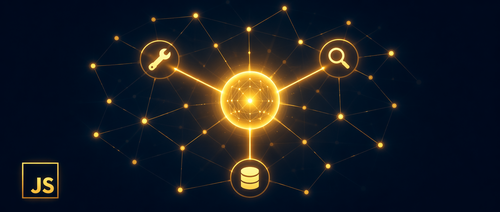

如果你熟悉 Node.js、TypeScript 和 async/await，但从没写过 AI 应用，这门课程值得看看。

微软发布了一门免费开源课程 [LangChain.js for Beginners](https://github.com/microsoft/langchainjs-for-beginners)，8 个章节加上 70 余个可直接运行的 TypeScript 示例。目标只有一个：让 JavaScript 开发者能构建真正能推理、调用工具、检索知识库的 AI 应用，而不是停留在基础的聊天补全阶段。

## 为什么选 LangChain.js

Python 在 AI 领域确实更常见，但切换语言不是唯一选择。LangChain.js 给 JavaScript 生态带来了完整的组件集：聊天模型、工具、Agent、检索等，不需要从零拼接。

原文有个比喻很到位：LangChain.js 像一家备货充足的五金店，架子上什么都有，你直接拿来用，不用先炼钢。如果你已经会 npm 和 async/await，进入 AI 开发的门槛比想象中低。

## 课程的学习路径

课程采用 **Agent 优先** 的设计，而非从文档加载和向量嵌入开始。这个顺序更贴近生产系统的实际样子。

**第 1-3 章**：打基础。第一次 LLM 调用、聊天模型、流式输出、提示词模板，以及用 Zod schema 获取结构化输出。这些是后面一切的前提。

**第 4 章 — 函数调用与工具**：AI 从"说话"变成"做事"。你定义函数，模型自行判断什么时候调用它们。这是课程从理论走向实践的转折点。

**第 5 章 — Agent**：LLM 能回答问题，Agent 能推理问题、选择工具、执行多步计划。本章介绍 ReAct 模式，并演示如何用 LangChain.js 构建 Agent。

**第 6 章 — MCP**：Model Context Protocol 正在成为 AI 连接外部服务的通用标准。这章讲如何构建 MCP 服务器，通过 HTTP 和 stdio 两种传输方式将 Agent 与它们连接起来。

**第 7-8 章**：引入文档、向量嵌入和语义搜索，最终汇聚成 Agentic RAG。Agent 自行决定什么时候需要搜索知识库，什么时候直接从已知内容回答。

每一章都包含：概念解释（附类比）、可立即运行的代码示例、动手练习、关键结论。

## 为什么先讲 Agent，再讲 RAG

这是课程设计中被问得最多的问题。

原文的类比很清楚：传统 RAG 像一个"开卷考试"里每道题都翻书的学生，哪怕问的是 "2+2 等于几"。Agentic RAG 是那个聪明的学生，简单的问题直接答，只有真正需要查资料时才翻书。

按课程顺序走到第 8 章时，你已经理解了工具、Agent 和 MCP，文档检索只是 Agent 能调用的又一种能力。Agent 知道如何推理工具选择，自然就能判断"这个问题需要检索吗"。结果是响应更快、成本更低（减少不必要的向量查询），体验也更好。

## 适合谁学

只需要会 JavaScript/TypeScript、npm install 和 async/await。不需要 AI 或机器学习背景。

每章从实际生活类比入手，比如硬件店（工具组件）、餐厅员工（角色分工）、USB-C 转接头（MCP 协议），然后给出可运行的代码，再附上练习题。

可以在本地运行，也可以用 GitHub Codespaces 跳过本地安装。

## 支持多个 AI 提供商

课程示例不绑定特定 AI 服务商。三个选项都可以：

- **GitHub Models**：免费，适合学习
- **Microsoft Azure AI Foundry**：生产级
- **OpenAI**：直接对接

配置方式完全一样：在 `.env` 文件里设置四个环境变量 `AI_API_KEY`、`AI_ENDPOINT`、`AI_MODEL`、`AI_EMBEDDING_MODEL`，所有示例开箱即用，不需要改代码。

## 综合项目与延伸示例

课程末尾有一个综合项目：一个通过 HTTP 暴露文档搜索和文档摄取工具的 MCP RAG 服务器。多个 Agent 可以连接到这个服务器，共享一个集中的知识库，而不用各自维护一份数据副本。

除 70+ 课程示例和综合项目之外，README 还链接了几个额外示例：

- [汉堡点餐 Agent](https://github.com/microsoft/ai-agents-for-beginners-sample)：带 Serverless API 和 MCP Server
- [Serverless AI 聊天（含 RAG）](https://github.com/Azure-Samples/serverless-chat-langchainjs)：运行在 Azure 上
- [多 Agent 旅行规划师](https://github.com/Azure-Samples/azure-ai-travel-agents)：跨 Azure Container Apps 协调多个专属 Agent

## 开始学习

访问 [github.com/microsoft/langchainjs-for-beginners](https://github.com/microsoft/langchainjs-for-beginners)，Clone 仓库，配置 API Key，运行示例。章节之间有依赖关系，但每章也足够独立，如果某个具体主题吸引了你，直接跳到那里也没问题。

如果 AI 基础概念还不熟悉，可以先看配套课程 [Generative AI with JavaScript](https://github.com/microsoft/generative-ai-with-javascript) 打底。

另外，Python 和 Java 版本也有对应课程：
- [LangChain for Beginners（Python）](https://github.com/microsoft/langchain-for-beginners)
- [LangChain4j for Beginners（Java）](https://github.com/microsoft/langchain4j-for-beginners)

## 参考

- [LangChain.js for Beginners: A Free Course to Build Agentic AI Apps with JavaScript](https://devblogs.microsoft.com/blog/langchainjs-for-beginners)
- [课程仓库：microsoft/langchainjs-for-beginners](https://github.com/microsoft/langchainjs-for-beginners)
- [Generative AI with JavaScript](https://github.com/microsoft/generative-ai-with-javascript)
