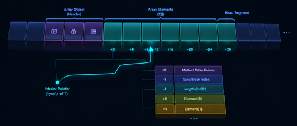

在前两篇文章里，我们完成了垃圾回收器标记阶段的基本实现。但有一个问题被有意跳过了：内部指针（interior pointer）。这篇文章专门来补这个坑，你很快就会明白为什么它值得单独写一篇。

## 什么是内部指针

通常，一个引用指向的是某个对象的起始位置——更准确地说，是紧跟在对象头之后的地方（即 MethodTable 指针所在的位置）：

```csharp
var obj = new MyObject();
```

```
                     MyObject
                +-----------------+
                | Object header   |
                +-----------------+
       obj ---> | MethodTable*    |
                +-----------------+
                |  Field1         |
                +-----------------+
                |  Field2         |
                +-----------------+
                |  Field3         |
                +-----------------+
                |  Field4         |
                +-----------------+
```

而内部指针指向的是对象内部的某个位置：

```csharp
var obj = new MyObject();
ref var ptr = ref obj.Field2;
```

```
                     MyObject
                +-----------------+
                | Object header   |
                +-----------------+
       obj ---> | MethodTable*    |
                +-----------------+
                |  Field1         |
                +-----------------+
       ptr ---> |  Field2         |
                +-----------------+
                |  Field3         |
                +-----------------+
                |  Field4         |
                +-----------------+
```

直接指向某个字段的情况比较少见，但在高性能 C# 代码里，拿到数组某个元素的引用却越来越普遍。最典型的场景是 `Span<T>`：

```csharp
long[] array = [1, 2, 3, 4];
var span = array.AsSpan();
var slice = span.Slice(2);
```

`Span<T>` 在底层就是持有一个指向数组内部的原始指针：

```
                      long[]
                +-----------------+
                | Object header   |
                +-----------------+
     array ---> | MethodTable*    |
                +-----------------+
                |  Length         |
                +-----------------+
                |  Padding        |
                +-----------------+
      span ---> |  1              |
                +-----------------|
                |  2              |
                +-----------------|
     slice ---> |  3              |
                +-----------------|
                |  4              |
                +-----------------+
```

## GC 视角下的问题

内部指针和普通引用一样，必须让它所属的对象保持存活。考虑下面这段代码：

```csharp
public static void Test()
{
    long[] array = [1, 2, 3, 4];
    var span = array.AsSpan().Slice(2);
    DoStuff(span);
}

private static void DoStuff(ReadOnlySpan<long> span)
{
    // 使用 span 做一些操作
}
```

调用 `DoStuff` 时，JIT 认为 `array` 引用已不再存活，对象可被回收。但 `span` 里的内部指针仍然指向这块内存。如果 GC 不知道这一层关系，就可能释放掉 `array`，导致 `span` 读到非法内存。

标记阶段，GC 需要读取 MethodTable 指针，至少有两个原因：

- 解析 GCDesc，找到对象内所有出站引用的偏移（见第五部分）
- 用 MethodTable 指针的最低有效位来标记对象（见第六部分）

普通引用直接就是 MethodTable 的地址，没问题。但对于内部指针，GC 必须向前追溯，找到对象的起始地址。

看起来只要往回读内存找 MethodTable 就行了，但问题是：怎么知道什么时候找到了对象起始？

一个直觉上的方案是：扫描到某个指向有效 MethodTable 的值就认为找到了。但这非常容易误判。比如这样的代码：

```csharp
public class MyObject
{
    public nint Handle;
}

var obj = new MyObject { Handle = typeof(string).TypeHandle.Value };
```

`TypeHandle.Value` 就是 MethodTable 的地址，完全合法的数据，却会骗过这个启发式方案。更极端地说，就算是随机生成的哈希值，也有可能碰巧和某个 MethodTable 地址相同。问题本质上无解：不论你设计多复杂的识别模式，随机数据总有概率与之匹配。

那 GC 只能从内存段起始位置逐对象遍历到目标地址了——这对性能完全无法接受（.NET GC 的内存段在引入 region 之前可达 4 GB）。

解决方案是：**砖表（brick table）**。

## 砖表的设计思路

砖表的核心思想是：维护一张内存位置到对象起始地址的映射，让 GC 能够快速定位某个地址归属于哪个对象，而不必从头扫描整段内存。

### 方案一：位图（Bitmap）

用一个 bitmap，每个 bit 对应 1 字节内存，置 1 表示该地址有对象起始。对于 1 GB 的堆，需要 128 MB 的 bitmap——太浪费了。

考虑到对象按指针大小（x64 上 8 字节）对齐，每个 bit 可以覆盖 8 字节，降到 16 MB。还是偏大，而且这种方式难以在精度更低的情况下使用（降低精度后无法精确标记对象位置）。

### 方案二：偏移量数组

更好的方案是用一个字节数组。每个字节记录当前覆盖范围内第一个（或最后一个）对象的偏移量，0 表示该范围内没有对象。每个字节覆盖 `255 × 8 = 2040` 字节，1 GB 的堆只需约 500 KB——非常高效。

查找流程：

1. 给定地址，计算它对应砖表中的哪一项（地址除以 2040）
2. 读取该项。若非零，则从该偏移处开始遍历堆
3. 若为零，往前找，直到找到非零项

.NET GC 还做了进一步优化：把砖表项改为有符号短整型（`short`）：
- 正值表示范围内对象的偏移
- 负值表示"往前跳多少项才能找到正值"

这样每次回溯时最多只需一跳，不用逐项向前扫描：

> 比如当前在第 9 项，读到 -4，则直接跳到第 5 项，保证那里有正值。

## 实现细节

作者的实现没有引入 .NET GC 的跳转优化，而是用简单字节数组，每字节覆盖 2040 字节内存，并且存储范围内**最后一个**对象的偏移（避免第一个字节被浪费，因为段起始处总是有对象）。砖表分配在每个内存段的起始处，4 MB 段对应约 2 KB 的砖表，开销极小。

API 对外暴露两个方法：

- `void MarkObject(IntPtr addr)` — 把地址标记到砖表
- `IntPtr FindClosestObjectBelow(IntPtr addr)` — 给定地址，返回砖表中该地址以下最近的已知对象起始

有了砖表，`ScanRoots` 中那个 `// TODO` 就可以实现了：

```csharp
private void ScanRoots(GCObject* root, ScanContext* context, GcCallFlags flags)
{
    if ((IntPtr)root == 0)
    {
        return;
    }

    if (flags.HasFlag(GcCallFlags.GC_CALL_INTERIOR))
    {
        // 找到包含该内部指针的内存段
        var segment = _segmentManager.FindSegmentContaining((nint)root);

        if (segment.IsNull)
        {
            Write($"  No segment found for interior pointer {(IntPtr)root:x2}");
            return;
        }

        var objectStartPtr = segment.FindClosestObjectBelow((IntPtr)root);
        bool found = false;

        // 从 objectStartPtr 开始遍历堆，直到找到包含该内部指针的对象
        foreach (var ptr in WalkHeapObjects(objectStartPtr, (IntPtr)root))
        {
            var o = (GCObject*)ptr;
            var size = o->ComputeSize();

            // 判断内部指针是否在当前对象范围内
            if ((IntPtr)o <= (IntPtr)root && (IntPtr)root < (IntPtr)o + (nint)size)
            {
                root = o;
                found = true;
                break;
            }
        }

        if (!found)
        {
            Write($"  No object found for interior pointer {(IntPtr)root:x2}");
            return;
        }
    }

    _markStack.Push((IntPtr)root);

    while (_markStack.Count > 0)
    {
        var ptr = _markStack.Pop();
        var o = (GCObject*)ptr;

        if (o->IsMarked())
        {
            continue;
        }

        var segment = _segmentManager.FindSegmentContaining((nint)o);

        if (segment.IsNull)
        {
            continue;
        }

        o->EnumerateObjectReferences(_markStack.Push);
        o->Mark();
        segment.MarkObject((IntPtr)o); // 同步更新砖表
    }
}
```

相比之前的版本，两处改动：

1. **内部指针处理**：用砖表找到附近的对象，再遍历堆确认准确的所属对象
2. **标记时同步更新砖表**：`o->Mark()` 之后调用 `segment.MarkObject((IntPtr)o)`

### 首次 GC 的冷启动问题

首次 GC 时砖表是空的，扫描内部指针代价很高。为此有两种缓解措施：

- 标记阶段发现对象时顺手更新砖表，让它逐步填充
- 线程通过 allocation context 自主分配，但每次向 GC 申请新分配上下文时，GC 可以同时更新砖表（见[源码中的 Alloc 方法](https://github.com/kevingosse/ManagedDotnetGC/blob/500772ac383195177d74c779e554e8861a28f24e/ManagedDotnetGC/GCHeap.cs#L200)）

这样砖表会在早期 GC 循环中快速填满，后续的内部指针扫描就会高效许多。

## 小结

内部指针看起来只是一个细节，实现起来却涉及不少权衡。正因为 `Span<T>` 和高性能代码越来越依赖它，GC 处理内部指针的效率至关重要。

目前实现还有一个性能隐患：`FindSegmentContaining` 直接线性扫描所有段，砖表引入后这个操作被调用得更频繁，会成为瓶颈。下一篇文章将彻底重构内存分配策略，同时也会处理目前完全忽略的 frozen segment 话题。

完整实现可以在 [GitHub 仓库](https://github.com/kevingosse/ManagedDotnetGC/blob/master/ManagedDotnetGC/Segment.cs) 查看。

## 参考

- [原文：Writing a .NET Garbage Collector in C# - Part 8: Interior pointers](https://minidump.net/writing-a-net-gc-in-c-part-8/)
- [Part 5：解析 GCDesc 找到托管对象的引用](https://minidump.net/writing-a-net-gc-in-c-part-5/)
- [Part 6：实现标记与清除阶段](https://minidump.net/writing-a-net-gc-in-c-part-6/)
- [Part 4：遍历托管堆](https://minidump.net/writing-a-net-gc-in-c-part-4/)
- [ManagedDotnetGC 源码（GitHub）](https://github.com/kevingosse/ManagedDotnetGC)
