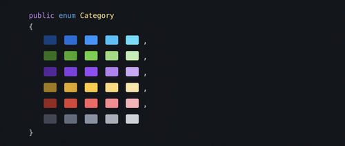

代码里散落的魔法数字是一种慢性毒药。六个月后读到 `if (role == 3)` 时，你必须翻历史记录才能想起 `3` 代表什么。在 C# 里使用 `enum` 就能彻底消除这个问题——它用有意义的名字替换掉数字字面量，让代码读起来像散文一样自然。

这篇文章覆盖枚举的完整用法：声明方式、显式赋值、与整数之间的相互转换、比较与迭代，以及把枚举用好所需要的最佳实践。

## 声明枚举

声明一个枚举只需一行样板代码，后面跟上你的领域所需要的成员：

```csharp
public enum OrderStatus
{
    Pending,
    Processing,
    Shipped,
    Delivered,
    Cancelled
}
```

`public` 修饰符让这个枚举在整个项目中都可以访问。也可以用 `internal`（程序集范围）、`private`（嵌套在类内部）或 `protected`（基类内部）。

枚举成员默认从 `0` 开始自动编号：`Pending` 是 `0`，`Processing` 是 `1`，依此类推。当这些值只在代码内部使用时，隐式编号没有问题。但如果值会持久化到数据库或与外部系统共享，就应该显式赋值——下一节会讲到。

**声明位置建议**：枚举是类型，应该放在命名空间级别（和使用它的类型同文件，或者单独一个文件）。不要把枚举声明在方法内部，那样会不必要地限制它的可见性。

## 显式赋值

需要精确控制每个成员对应哪个整数时，可以显式赋值：

```csharp
public enum HttpStatusCode
{
    Ok                  = 200,
    Created             = 201,
    NoContent           = 204,
    BadRequest          = 400,
    Unauthorized        = 401,
    Forbidden           = 403,
    NotFound            = 404,
    InternalServerError = 500
}
```

以下场景必须使用显式值：

- 枚举代表某个协议或外部系统的固定数字码
- 值会持久化到数据库，后续可能追加成员
- 希望防止因重新排序成员而静默修改已存储的数据

有一条关键原则：**持久化枚举绝不能依赖隐式顺序**。假设你有 `enum Role { Viewer, Editor, Admin }`，后来在 `Editor` 和 `Admin` 之间插入了 `Moderator`，所有存储的 `Admin` 值就会静默变成 `Moderator`，编译器不会给出任何警告。

## 使用枚举变量

声明之后，使用 C# 枚举非常直接：

```csharp
// 声明并赋值
OrderStatus status = OrderStatus.Pending;

// 比较
if (status == OrderStatus.Pending)
{
    Console.WriteLine("Order has not started yet.");
}

// 作为类字段
public class Order
{
    public OrderStatus Status { get; set; } = OrderStatus.Pending;
}

// 传给方法
void ProcessOrder(Order order, OrderStatus targetStatus)
{
    if (order.Status != targetStatus)
    {
        // ...
    }
}
```

编译器会强制你只能使用命名成员——`OrderStatus.Pending`，而不是 `5`。这种类型安全能消除一整类 bug。

## 枚举与 int 的相互转换

有时需要把枚举转成底层整数（用于存储或与外部数据比较），或者把整数解析回枚举：

```csharp
OrderStatus status = OrderStatus.Shipped;

// 枚举转 int——需要显式强制转换
int statusInt = (int)status;               // 2

// int 转枚举——同样需要显式强制转换
OrderStatus fromInt = (OrderStatus)2;      // Shipped

// 危险：C# 不会验证转换的合法性
OrderStatus invalid = (OrderStatus)99;     // 不会抛异常！值 99 没有对应的名称
Console.WriteLine(invalid);               // "99"——不是成员名
```

从 `int` 转回枚举不会抛出异常，即使值未定义。因此，在转换之前要始终验证外部整数：

```csharp
int incoming = GetStatusFromExternalApi();

if (!Enum.IsDefined(typeof(OrderStatus), incoming))
{
    throw new ArgumentException($"Unknown order status: {incoming}");
}

OrderStatus status = (OrderStatus)incoming;
```

如果输入来自 API 或用户表单的字符串，可以用 `Enum.TryParse`：

```csharp
if (Enum.TryParse<OrderStatus>(userInput, ignoreCase: true, out OrderStatus parsed))
{
    // 安全使用 parsed
}
else
{
    // 处理无效输入
}
```

## 比较枚举值

C# 枚举成员支持相等、不等和关系比较：

```csharp
OrderStatus a = OrderStatus.Shipped;
OrderStatus b = OrderStatus.Delivered;

bool equal  = (a == b);   // false
bool notEq  = (a != b);   // true

// 关系比较（基于底层 int 值）
bool shipped = (a < b);   // true——Shipped (2) < Delivered (3)
```

关系比较对于有天然顺序的枚举（如严重级别或优先级）有意义，对于没有内在顺序的枚举则意义不大。相等比较是最常见的用法。

对于基于枚举的分支逻辑，switch 表达式是更简洁、更彻底的写法：

```csharp
string GetLabel(OrderStatus status) => status switch
{
    OrderStatus.Pending    => "Pending",
    OrderStatus.Processing => "Processing",
    OrderStatus.Shipped    => "Shipped",
    OrderStatus.Delivered  => "Delivered",
    OrderStatus.Cancelled  => "Cancelled",
    _                      => "Unknown"
};
```

## 遍历所有枚举值

两种写法能覆盖大多数遍历需求：

```csharp
// .NET 5+ 推荐写法
foreach (OrderStatus status in Enum.GetValues<OrderStatus>())
{
    Console.WriteLine($"{status} = {(int)status}");
}
// 输出：
// Pending = 0
// Processing = 1
// Shipped = 2
// Delivered = 3
// Cancelled = 4

// 获取所有成员名称
string[] names = Enum.GetNames<OrderStatus>();

// 早期 .NET Framework / .NET Core 的旧写法
foreach (OrderStatus status in (OrderStatus[])Enum.GetValues(typeof(OrderStatus)))
{
    // ...
}
```

枚举遍历在这些场景中很实用：

- 填充下拉列表或选择控件
- 构建字符串到枚举的查找表
- 编写覆盖所有枚举成员的穷举单元测试
- 验证输入时记录所有合法值

## 在属性和方法参数中使用枚举

枚举让 API 自文档化。对比下面两个方法签名：

```csharp
// 不好——int status 是什么意思？
void UpdateOrder(int orderId, int status) { }

// 好——枚举让意图显而易见
void UpdateOrder(int orderId, OrderStatus status) { }
```

第二个版本在类型层面说清楚了契约，调用者不需要查文档就知道哪些值是合法的。

在领域模型里，枚举属性可以搭配可空类型处理可选值：

```csharp
public class Shipment
{
    public Guid Id { get; init; }
    public OrderStatus Status { get; set; } = OrderStatus.Pending;
    public DateTimeOffset? ShippedAt { get; set; }
    public DateTimeOffset? DeliveredAt { get; set; }
}
```

## 常见错误

**没有定义零值成员。** 未初始化的枚举字段默认值是 `0`。如果没有成员映射到 `0`，你就会持有一个没有名字的合法变量：

```csharp
// 有问题——default(OrderStatus) 是 0，但没有成员 = 0
public enum OrderStatus
{
    Pending = 1,
    Shipped = 2
}

// 安全——0 有明确对应的成员
public enum OrderStatus
{
    None    = 0,
    Pending = 1,
    Shipped = 2
}
```

**不验证就转换整数。** 如上所述，`(OrderStatus)99` 能编译和运行，不会报错。对外部数据做转换前必须验证。

**添加成员但没有更新所有 switch 语句。** 如果给 `OrderStatus` 加了 `OnHold`，每个没有对应分支的 switch 都会静默跳过该值。在 discard arm 里加上抛异常的处理，能让这类遗漏在运行时暴露出来。

**用枚举表示开放式分类。** 如果新值可能在运行时出现（用户自定义标签、插件类型名），应该用 `string` 或值对象。枚举适合那些在编译时就确定的、封闭的已知集合。

## 最佳实践速查

- 始终定义一个零值成员（`None`、`Unknown` 或符合领域语义的默认值）
- 枚举持久化或与外部系统共享时，使用显式值
- int 转枚举之前先用 `Enum.IsDefined` 验证
- 使用 switch 表达式，在 discard arm 里抛出异常处理未知值
- 枚举名称保持单数形式（`OrderStatus`，不是 `OrderStatuses`）
- 不要修改已有成员的值——会静默破坏已存储的数据
- 倾向于拆分成多个小枚举，而不是一个庞大的多用途枚举

## 参考

- [How to Use Enum in C#: Declaration, Values, and Best Practices](https://www.devleader.ca/2026/04/27/how-to-use-enum-in-c-declaration-values-and-best-practices)
- [C# Enum Switch Pattern Matching guide](https://www.devleader.ca/2023/11/16/the-csharp-switch-statement-how-to-go-from-zero-to-hero)
- [C# Enum: Complete Guide to Enumerations](https://www.devleader.ca/2026/04/26/c-enum-complete-guide-to-enumerations-in-net)
