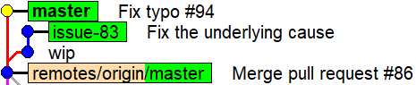
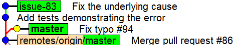
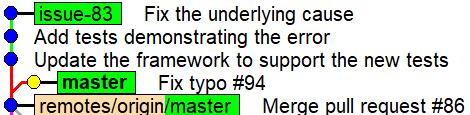

Git 2.54 在 2026 年 4 月发布，带来了几个让日常工作更顺手的新功能。本文聚焦三件事：新增的 `git history` 命令、hooks 的 config 化配置方式，以及 `git repo structure` 仓库统计命令。这几个功能不复杂，但如果你每天用 git，应该能派上用场。

## git history：不切分支也能改提交

`git history` 是 Git 2.54 新增的实验性命令，目前支持两个子命令：

- `git history reword <commit>`：修改某个提交的提交信息
- `git history split <commit>`：把某个提交拆成两个

这两个操作的核心亮点是：**不需要先切换到对应分支**。以前要改写一个不在当前分支上的提交，必须先 `git checkout` 到那个分支，再跑 `git rebase -i`，改完再切回来。现在直接在当前工作分支执行就行。

### 改写提交信息

假设你有一个 `issue-83` 分支，里面有一个提交信息写得很随意（比如 `wip`），但你现在在 `master` 上工作，不想切换分支：



旧的做法是：

```bash
git checkout issue-83        # 切换分支
git rebase -i origin/master  # 开始交互式 rebase
```

然后在编辑器里把对应提交的 `pick` 改成 `reword`，保存，再在弹出的编辑器里修改提交信息。

新的做法只需一步：

```bash
git history reword 055db134ac326766b1566a64cd81873c69b1dc58
```

Git 直接打开编辑器，等你改好，然后把提交信息和后续所有提交的哈希一起更新掉。速度很快，因为它只更新提交对象，不需要更新工作区文件。

改写后的结果：



### 拆分提交

`git history split` 的使用场景是：某个提交包含了本来应该分开的内容，想把它拆成两个独立提交。

传统流程是 `git rebase -i`，把对应提交标记为 `edit`，然后用 `git reset HEAD~` 把它"取消掉"（保留工作区改动），再手动分两次 `git add` 和 `git commit`，最后 `git rebase --continue`。

`git history split` 把这个流程压缩成一次调用：

```bash
git history split 1153957368717fbe4dd19866315fbf53b17a0993
```

执行后，Git 会逐个 hunk 弹出来让你选择，界面和 `git add -p` 类似：

```
diff --git a/src/.../NetEscapades.Configuration.Yaml.csproj b/src/.../NetEscapades.Configuration.Yaml.csproj
...
-    <PackageReference Include="YamlDotNet" Version="13.0.1" />
+    <PackageReference Include="YamlDotNet" Version="16.3.0" />
...
(1/1) Stage this hunk [y,n,q,a,d,?]?
```

选择 `y` 的 hunk 会进入"父提交"，其余留在原提交。选完后 Git 会弹编辑器两次，分别让你填写两个提交的信息。

拆分后结果：



### 使用限制

`git history` 有几个地方需要注意：

- **不支持含 merge commit 的历史段**：如果目标提交的祖先链里有合并提交，会直接报错：`error: replaying merge commits is not supported yet`
- **`split` 只有命令行界面**：如果你习惯用 GUI 工具做 hunk 级别的暂存（比如 JetBrains Rider 或 VS Code），这里只能用命令行，对部分人来说不够友好
- **功能范围有限**：目前只有 `reword` 和 `split`，如果你需要 `squash`、`fixup`、`drop` 等操作，还是得回到 `git rebase -i`
- **标记为实验性**：行为可能在后续版本中变化

## hooks 的 config 化配置

Git hooks 是在 Git 执行特定操作时自动触发脚本的机制，比如 `pre-commit`（提交前运行）和 `pre-push`（推送前运行）。常见用途包括：提交前自动跑 linter、推送前运行测试等。

之前配置 hooks 需要手动在 `.git/hooks/` 目录里创建可执行脚本文件，有一定上手门槛。Git 2.54 现在支持通过 `git config` 来配置：

```bash
git config set hook.formatter.event pre-commit
git config set hook.formatter.command "dotnet format"
```

这会在本地仓库的 git 配置文件中加入以下内容：

```ini
[hook "formatter"]
    event = pre-commit
    command = dotnet format
```

`formatter` 是自定义的名称，`event` 填触发时机，`command` 填要执行的命令。配置完成后每次 `git commit` 时都会自动执行 `dotnet format`。

用 `git hooks list <event>` 可以查看某个事件下已注册的所有 hooks：

```bash
$ git hook list pre-commit
formatter
```

有一个重要限制值得一提：**这个配置只存在于本地 git config，不能随仓库提交**。也就是说，其他人克隆你的仓库后不会自动获得这些 hooks。这是故意的设计——如果允许共享 hooks，相当于让仓库可以在任何克隆者的机器上执行任意代码，存在严重的安全风险。

## git repo structure：仓库统计信息

`git repo structure` 是一个新命令，用于展示仓库的结构和大小统计：

```
$ git repo structure
Counting objects: 245390, done.

| Repository structure      | Value      |
| ------------------------- | ---------- |
| * References              |            |
|   * Count                 |   1.63 k   |
|     * Branches            |      1     |
|     * Tags                |    241     |
|     * Remotes             |   1.39 k   |
|     * Others              |      0     |
|                           |            |
| * Reachable objects       |            |
|   * Count                 | 245.39 k   |
|     * Commits             |  15.21 k   |
|     * Trees               | 121.16 k   |
|     * Blobs               | 109.01 k   |
|   * Inflated size         |   3.19 GiB |
|     * Commits             |  13.85 MiB |
|     * Trees               | 273.41 MiB |
|     * Blobs               |   2.91 GiB |
|   * Disk size             | 406.63 MiB |
| * Largest objects         |            |
|   * Commits               |            |
|     * Maximum size    [1] |  66.30 KiB |
|     * Maximum parents [2] |      2     |
|   * Trees                 |            |
|     * Maximum size    [3] | 238.24 KiB |
|     * Maximum entries [4] |   2.09 k   |
|   * Blobs                 |            |
|     * Maximum size    [5] |  86.33 MiB |
```

对于大多数开发者来说，这些数字可能没什么直接用处。但如果你在维护一个高频提交的大型仓库，或者在排查 CI 性能慢、克隆耗时长等问题，这些指标就很有参考价值。

## 总结

Git 2.54 的三个新功能：

- **`git history reword` / `split`**：不切分支改写提交或拆分提交，省去了完整 rebase 的操作步骤，适合只需要做简单改写的场景
- **config-based hooks**：用 `git config` 管理 hooks，配置方式更统一，但仍然是本地配置，无法跨仓库共享
- **`git repo structure`**：仓库结构统计，对高负载仓库的性能分析有实用价值

`git history` 目前仍是实验性功能，后续可能还会扩展或调整。如果你喜欢用 Rider 这类 IDE 做 git 操作，`git history split` 的纯命令行界面可能不够顺手，但 `git history reword` 确实可以在一些场景下节省几步操作。

## 参考

- [New features in Git 2.54: easier rebasing, hooks, and statistics](https://andrewlock.net/new-features-in-git-2-54-easier-rebasing-hooks-and-statistcs/) - Andrew Lock
- [Git 2.54 Release Notes](https://lore.kernel.org/git/xmqqa4uxsjrs.fsf@gitster.g/T/#u)
- [Highlights from Git 2.54 - GitHub Blog](https://github.blog/open-source/git/highlights-from-git-2-54/)
