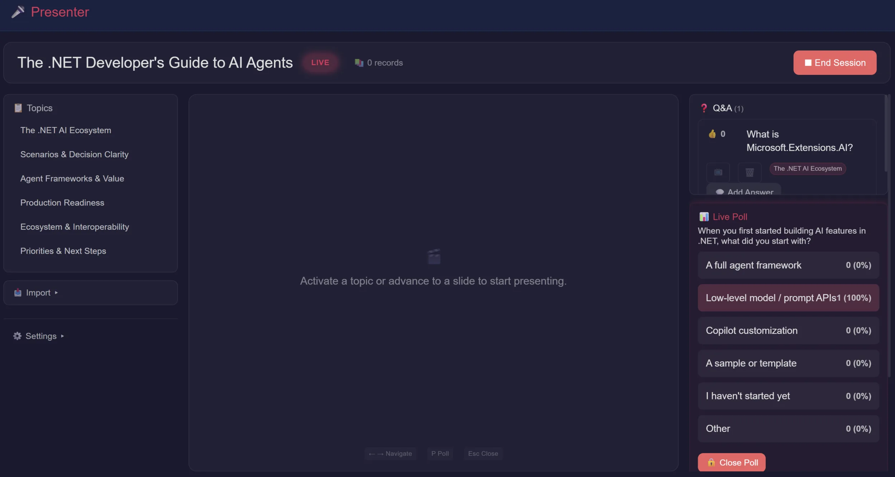
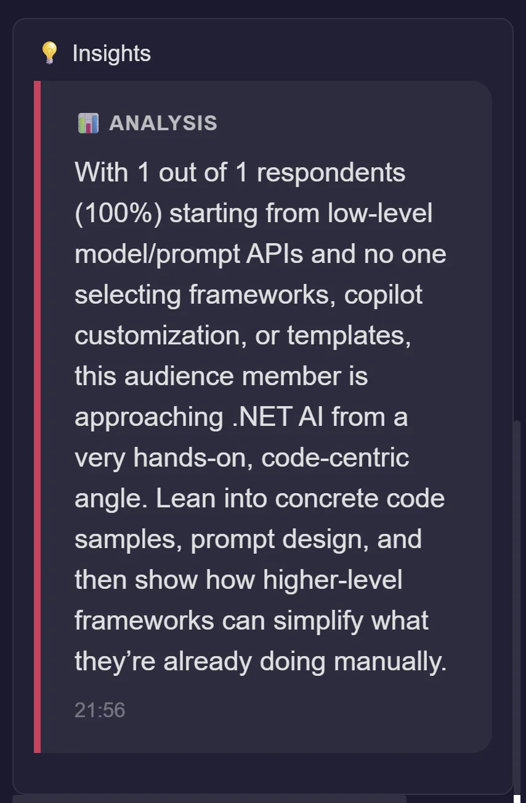
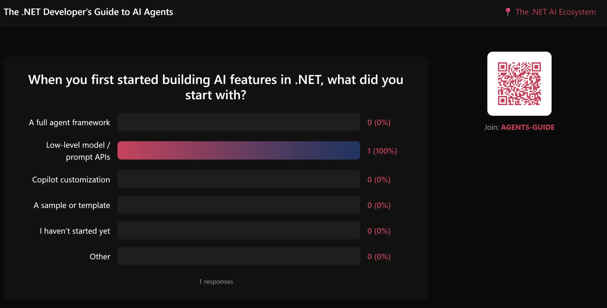
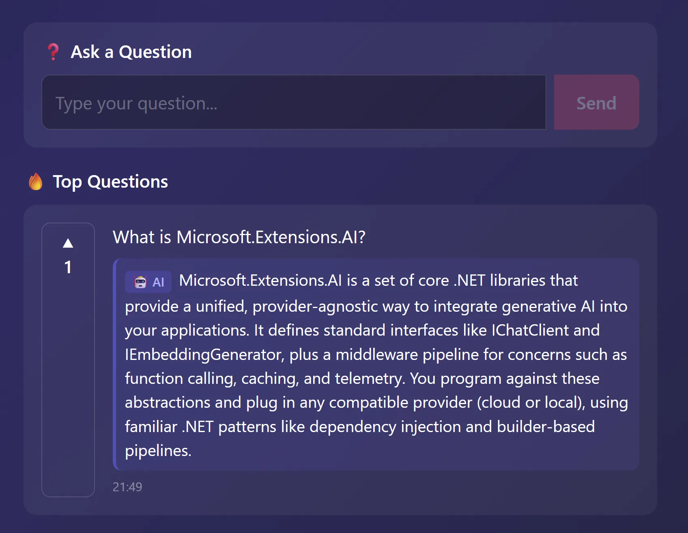
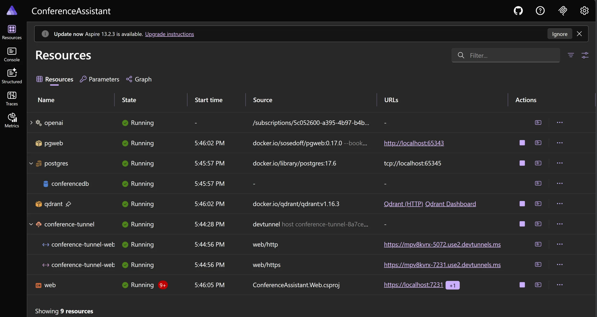

把 AI 功能接进 .NET 应用，很多团队的第一反应是直接对接 OpenAI SDK，把各种 prompt 硬编码进服务里。但一旦需要换模型、接向量数据库或者引入多个数据源，代码就开始乱。微软 .NET 团队在 MVP Summit 做了一个叫 **ConferencePulse** 的互动会议助手，用一套可组合的 AI 抽象层搭起整个应用。他们把这个 demo 做成了真正的演讲工具，在会议现场跑，然后把完整代码开源。

这篇文章拆解这个应用的架构和关键代码，看看这些抽象层在实际场景下长什么样。



## 做了什么

ConferencePulse 是一个 Blazor Server 应用，跑在会议现场。观众扫码进入会话，可以参与投票和提问。后端的 AI 功能包括四块：

- **实时投票**：AI 根据会议内容自动生成题目，观众投票后结果实时显示。
- **观众 Q&A**：AI 通过 RAG 流程检索知识库（本地文档 + Microsoft Learn 文档 + GitHub 仓库 wiki）来回答问题。
- **自动洞察**：投票关闭后，AI 分析结果和观众提问，生成趋势分析。
- **会话总结**：演讲结束时，多个 AI agent 并发分析不同维度，汇聚成一份完整总结。

应用跑在 .NET 10 + Aspire 上，五个项目分工明确：

```
src/
├── ConferenceAssistant.Web/          ← Blazor Server（UI + 业务协调）
├── ConferenceAssistant.Core/         ← 模型、接口、会话状态
├── ConferenceAssistant.Ingestion/    ← 数据摄入管道 + 向量搜索
├── ConferenceAssistant.Agents/       ← AI agent、工作流、工具
├── ConferenceAssistant.Mcp/          ← MCP 服务端工具 + MCP 客户端
└── ConferenceAssistant.AppHost/      ← .NET Aspire（Qdrant、PostgreSQL、Azure OpenAI）
```

## Microsoft.Extensions.AI：统一的聊天接口

`Microsoft.Extensions.AI` 提供了 `IChatClient`，一个适配 OpenAI、Azure OpenAI、Ollama、Foundry Local 等所有 provider 的统一抽象。ConferencePulse 里所有 AI 调用都走同一个中间件管道：

```csharp
var openaiBuilder = builder.AddAzureOpenAIClient("openai");

openaiBuilder.AddChatClient("chat")
    .UseFunctionInvocation()
    .UseOpenTelemetry()
    .UseLogging();

openaiBuilder.AddEmbeddingGenerator("embedding");
```

六行。如果熟悉 ASP.NET Core 中间件，这个写法会很眼熟——每个 `.Use*()` 都是往内层 client 上套一层行为：`UseFunctionInvocation()` 处理工具调用循环，`UseOpenTelemetry()` 追踪每次请求，`UseLogging()` 记录请求/响应对。

换 provider 只需要改内层 client。投票生成、Q&A 回答、数据摄入增强、多 agent 工作流，全都共享这个管道。

## DataIngestion + VectorData：知识层

AI 能给出有用的答案，前提是有足够的上下文。`Microsoft.Extensions.DataIngestion` 提供一个文档处理管道，`Microsoft.Extensions.VectorData` 提供跨 vector store 的统一抽象。

ConferencePulse 从 GitHub repo 导入内容时，走的是这样的管道：

```csharp
IngestionDocumentReader reader = new MarkdownReader();

var tokenizer = TiktokenTokenizer.CreateForModel("gpt-4o");
var chunkerOptions = new IngestionChunkerOptions(tokenizer)
{
    MaxTokensPerChunk = 500,
    OverlapTokens = 50
};
IngestionChunker<string> chunker = new HeaderChunker(chunkerOptions);

var enricherOptions = new EnricherOptions(_chatClient) { LoggerFactory = _loggerFactory };

using var writer = new VectorStoreWriter<string>(
    _searchService.VectorStore,
    dimensionCount: 1536,
    new VectorStoreWriterOptions
    {
        CollectionName = "conference_knowledge",
        IncrementalIngestion = true
    });

using IngestionPipeline<string> pipeline = new(
    reader, chunker, writer, new IngestionPipelineOptions(), _loggerFactory)
{
    ChunkProcessors =
    {
        new SummaryEnricher(enricherOptions),
        new KeywordEnricher(enricherOptions, ReadOnlySpan<string>.Empty),
        frontMatterProcessor
    }
};
```

管道读取 Markdown，按标题切块，用 AI 生成每块的摘要和关键词，然后向量化存入 Qdrant。每个步骤都是可换的组件。把 `MarkdownReader` 换成 PDF reader，或者把 Qdrant 换成 Azure AI Search，管道组合本身不变。

`SummaryEnricher` 和 `KeywordEnricher` 都接收 `EnricherOptions(_chatClient)`，用的是上面注册的同一个 `IChatClient`。自己摄入的内容，用自己做增强。

查询时，`VectorStoreCollection` 支持跨 backend 的语义搜索：

```csharp
var results = collection.SearchAsync(query, topK);

await foreach (var result in results)
{
    var content = result.Record["content"] as string;
    // Use the content...
}
```

会话进行中，投票结果、观众提问、Q&A 问答对、AI 生成的洞察也会实时摄入到知识库里。到会议结束，知识库里包含了原始内容加上整场会议的所有互动数据。



## IChatClient + 工具：按复杂度选方案

这里有一个值得记下来的设计原则：**用能搞定问题的最简方案**。`IChatClient` 加工具能覆盖大量场景，在真正需要 agent 框架之前不要过早引入。

ConferencePulse 三个 AI 功能，复杂度不同，方案也不同，但都用同一个 `IChatClient`。

### 洞察生成：单次调用

投票关闭后生成洞察，就是一次 `GetResponseAsync`：

```csharp
var response = await chatClient.GetResponseAsync(
[
    new(ChatRole.System,
        "You are a conference analytics assistant generating real-time insights from audience data."),
    new(ChatRole.User, prompt)  // prompt 包含投票结果
]);

var content = response.Text?.Trim();
if (!string.IsNullOrWhiteSpace(content))
{
    ctx.AddInsight(new Insight
    {
        TopicId = poll.TopicId,
        PollId = pollId,
        Content = content,
        Type = InsightType.PollAnalysis
    });
}
```

没有工具，没有框架。中间件管道负责遥测和日志。

### 投票生成：IChatClient + 工具

生成一道投票题需要更多上下文——当前主题、已讲过的内容、以往的互动数据。这里需要工具：

```csharp
public class PollGenerationWorkflow(IChatClient chatClient, AgentTools tools)
{
    public async Task<string> ExecuteAsync(string topicId)
    {
        var options = new ChatOptions
        {
            Tools = [tools.GetCurrentTopic, tools.SearchKnowledge,
                     tools.GetAudienceQuestions, tools.GetAllPollResults,
                     tools.GetAllInsights, tools.CreatePoll]
        };

        var messages = new List<ChatMessage>
        {
            new(ChatRole.System, AgentDefinitions.SurveyArchitectInstructions),
            new(ChatRole.User, $"Generate an engaging poll for topic: {topicId}...")
        };

        var response = await chatClient.GetResponseAsync(messages, options);
        return response.Text ?? "Unable to generate poll.";
    }
}
```

工具是从 C# 方法创建的强类型 `AITool`：

```csharp
public class AgentTools
{
    public AITool SearchKnowledge { get; }
    public AITool GetCurrentTopic { get; }
    public AITool CreatePoll { get; }
    // ...

    public AgentTools(IPollService pollService, ISemanticSearchService searchService, ...)
    {
        SearchKnowledge = AIFunctionFactory.Create(SearchKnowledgeCore,
            new AIFunctionFactoryOptions
            {
                Name = nameof(SearchKnowledge),
                Description = "Search the session knowledge base for content related to the query"
            });
        // ...
    }
}
```

模型决定需要更多上下文后调用 `GetCurrentTopic` 和 `SearchKnowledge`，生成投票后调用 `CreatePoll` 保存。工具调用循环由 `UseFunctionInvocation()` 自动处理。



### Q&A 回答：多来源 RAG

Q&A 服务把多个组件拼在一起。观众提问后，同时从三个地方检索上下文：

```csharp
// 1. 检索本地知识库
var searchResults = await searchService.SearchAsync(questionText, topK: 5);
var localContext = string.Join("\n\n---\n\n",
    searchResults.Select(r => r.Content).Where(c => !string.IsNullOrWhiteSpace(c)));

// 2. 通过 MCP 查询 Microsoft Learn 文档
var docsContext = await mcpClient.SearchDocsAsync(questionText);

// 3. 通过 MCP 询问 DeepWiki 关于相关 .NET 仓库的信息
var deepWikiContext = await mcpClient.AskDeepWikiAsync("dotnet/extensions", questionText);
```

VectorData 负责本地检索，MCP 负责外部上下文，`IChatClient` 负责生成答案。



## MCP：双向使用

Model Context Protocol 是一套让 AI 应用发现和调用外部工具的协议。ConferencePulse 同时扮演消费方和提供方两个角色。

### 作为消费方

启动时连接 Microsoft Learn 和 DeepWiki 两个 MCP 服务器：

```csharp
public async Task InitializeAsync(CancellationToken ct = default)
{
    var learnTransport = new HttpClientTransport(new HttpClientTransportOptions
    {
        Endpoint = new Uri("https://learn.microsoft.com/api/mcp"),
        TransportMode = HttpTransportMode.StreamableHttp
    }, loggerFactory);
    _learnClient = await McpClient.CreateAsync(learnTransport, null, loggerFactory, ct);

    var deepWikiTransport = new HttpClientTransport(new HttpClientTransportOptions
    {
        Endpoint = new Uri("https://mcp.deepwiki.com/mcp"),
        TransportMode = HttpTransportMode.StreamableHttp
    }, loggerFactory);
    _deepWikiClient = await McpClient.CreateAsync(deepWikiTransport, null, loggerFactory, ct);
}
```

调用任意 MCP 服务器上的工具，写法一样：

```csharp
var result = await _learnClient.CallToolAsync(
    "microsoft_docs_search",
    new Dictionary<string, object?> { ["query"] = query },
    cancellationToken: ct);
```

### 作为提供方

ConferencePulse 也是一个 MCP 服务器。任何支持 MCP 的客户端（GitHub Copilot、Claude、自定义工具）都可以连进来查询会议数据：

```csharp
[McpServerToolType]
public class ConferenceTools
{
    [McpServerTool(Name = "get_session_status", ReadOnly = true),
     Description("Returns the current conference session status.")]
    public static string GetSessionStatus(ISessionService sessionService)
    {
        var session = sessionService.CurrentSession;
        if (session is null) return "No active conference session.";
        // ... 构建状态字符串
    }

    [McpServerTool(Name = "search_session_knowledge", ReadOnly = true),
     Description("Searches the session knowledge base for relevant content.")]
    public static async Task<string> SearchSessionKnowledge(
        ISemanticSearchService searchService,
        [Description("The search query.")] string query,
        [Description("Max results. Defaults to 5.")] int maxResults = 5)
    {
        var results = await searchService.SearchAsync(query, maxResults);
        // ... 格式化结果
    }
}
```

在 `Program.cs` 注册几行：

```csharp
builder.Services
    .AddMcpServer(options => { options.ServerInfo = new() { Name = "ConferencePulse", Version = "1.0.0" }; })
    .WithToolsFromAssembly(typeof(ConferenceTools).Assembly)
    .WithHttpTransport();

app.MapMcp("/mcp");
```

同一个协议，一边消费外部知识，一边把自身数据暴露给外部工具。

## Microsoft Agent Framework：多 agent 协调

大部分功能用 `IChatClient` 加工具就够了。但会话总结需要三个专门化 agent 并发运行，分别处理投票数据、观众提问和洞察，然后汇聚结果。这才是引入 Microsoft Agent Framework 的地方：

```csharp
public class SessionSummaryWorkflow(IChatClient chatClient, AgentTools tools)
{
    public async Task<string> ExecuteAsync()
    {
        ChatClientAgent pollAnalyst = new(chatClient,
            name: "PollAnalyst",
            description: "Analyzes poll results and trends",
            instructions: "You are a poll analyst. Use GetAllPollResults to retrieve every poll...",
            tools: [tools.GetAllPollResults]);

        ChatClientAgent questionAnalyst = new(chatClient,
            name: "QuestionAnalyst",
            description: "Analyzes audience questions and themes",
            instructions: "You are an audience question analyst...",
            tools: [tools.GetAudienceQuestions]);

        ChatClientAgent insightAnalyst = new(chatClient,
            name: "InsightAnalyst",
            description: "Analyzes generated insights and knowledge patterns",
            instructions: "You are an insight analyst...",
            tools: [tools.GetAllInsights, tools.SearchKnowledge]);
```

每个 `ChatClientAgent` 包装同一个 `IChatClient`，但各自拥有限定的工具集和专属指令。然后用 `AgentWorkflowBuilder.BuildConcurrent` 做并发扇出，再接 `WorkflowBuilder` 组合完整流水线：

```csharp
        // 扇出：三个分析师并发运行
        var analysisWorkflow = AgentWorkflowBuilder.BuildConcurrent(
            [pollAnalyst, questionAnalyst, insightAnalyst],
            MergeAgentOutputs);

        // 扇入：synthesizer 汇聚所有分析结果
        ChatClientAgent synthesizer = new(chatClient,
            name: "Synthesizer",
            instructions: "Synthesize the analyses into one cohesive session summary...");

        // 组合：并发分析 → 顺序汇总
        var analysisExec = new SubworkflowBinding(analysisWorkflow, "Analysis");
        ExecutorBinding synthExec = synthesizer;

        var composedWorkflow = new WorkflowBuilder(analysisExec)
            .WithName("SessionSummaryPipeline")
            .BindExecutor(synthExec)
            .AddEdge(analysisExec, synthExec)
            .WithOutputFrom([synthExec])
            .Build();

        var run = await InProcessExecution.Default.RunAsync(
            composedWorkflow,
            "Analyze the conference session data and provide your specialized findings.");
```

对比一下投票生成工作流——约 10 行，因为它只需要 `IChatClient` 加工具。会话总结约 40 行，因为它真的需要并发 agent、限定工具集和汇聚步骤。两种方案都用同一个底层抽象。

## 各层的分工



整套技术栈的各功能对应关系：

| 功能 | 技术 |
|---|---|
| 实时投票 | `IChatClient` + 工具（MEAI） |
| 知识库构建 | `IngestionPipeline` + `VectorStoreWriter` |
| Q&A 回答 | `VectorData` + `IChatClient` + MCP |
| 自动洞察 | `IChatClient`（单次调用） |
| 会话总结 | Microsoft Agent Framework（扇出/扇入） |
| 可观测性 | `UseOpenTelemetry()` + Aspire Dashboard |
| 基础设施 | Aspire：Qdrant + PostgreSQL + Azure OpenAI |

`IChatClient` 贯穿全程：出现在摄入增强器里，出现在 agent 工具里，出现在 MCP 增强的 Q&A 里，也出现在 Agent Framework 的 `ChatClientAgent` 里。学一次，到处用。

这套方案的核心价值在于：provider 会换，模型会升级，但应用层代码不需要跟着改。抽象层吸收了这些变化。

## 开始使用

源码在 [GitHub](https://github.com/luisquintanilla/dotnet-ai-conference-assistant)，克隆后运行 `aspire run` 就能跑起完整栈。

各个库的文档：

- [Microsoft.Extensions.AI](https://learn.microsoft.com/dotnet/ai/ai-extensions)
- [Microsoft.Extensions.VectorData](https://learn.microsoft.com/dotnet/ai/vector-stores/overview)
- [Microsoft.Extensions.DataIngestion](https://learn.microsoft.com/dotnet/ai/conceptual/data-ingestion)
- [.NET 中的 Model Context Protocol](https://learn.microsoft.com/dotnet/ai/get-started-mcp)
- [Microsoft Agent Framework](https://github.com/microsoft/agent-framework)

## 参考

- [Building an AI-Powered Conference App with .NET's Composable AI Stack](https://devblogs.microsoft.com/dotnet/building-ai-conference-app-dotnet-composable-stack/) — Luis Quintanilla, .NET Blog
- [ConferencePulse 源码](https://github.com/luisquintanilla/dotnet-ai-conference-assistant)
