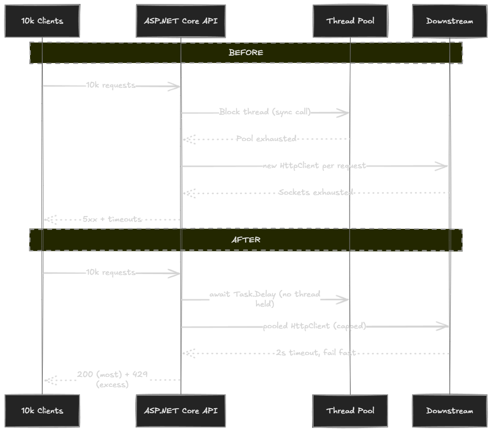

当一个 ASP.NET Core 服务在高负载下开始出问题，"每秒请求数（RPS）"这个指标几乎告诉不了你任何原因。RPS 是**结果**，真正的原因要具体得多：某个线程被卡住了、某个 Socket 没有被复用、某个队列没有上界。

这篇文章是一个压测实验室。你会：

1. 从零搭一个极简的 .NET 10 Web API
2. 用 [k6](https://k6.io/) 把它推到约 1 万并发连接
3. 复现三种不同的崩溃模式，观察**每种模式在运行时层面的具体行为**
4. 对每种模式实施一个精准修复，并解释修复背后的机制
5. 用同一份压测脚本重跑，比较延迟曲线和错误曲线的变化

目标不是"让数字变好看"，而是理解因果链——这样下次你在生产环境看到相同的曲线形态时，已经知道往哪里看。

**准备条件**：.NET 10 SDK、[k6](https://k6.io/docs/get-started/installation/)，可选第二台机器作为负载发生器（客户端和服务端共用一台主机时会争抢端口和 CPU，可能掩盖或放大问题）。

## 搭建基础项目

```bash
mkdir Concurrency.Lab
cd Concurrency.Lab
dotnet new web -n Concurrency.Api -f net10.0
cd Concurrency.Api
```

把 `Program.cs` 替换成这个基础版本：

```csharp
// Program.cs
var builder = WebApplication.CreateBuilder(args);
builder.Services.AddHttpClient(); // Step 6 会用到

var app = builder.Build();

app.MapGet("/health", () => Results.Ok(new { status = "ok", utc = DateTime.UtcNow }));

app.Run("http://0.0.0.0:5080");
```

跑一次确认能启动：

```bash
dotnet run -c Release
# → Now listening on: http://0.0.0.0:5080
```

**注意**：`-c Release` 不是可选项。JIT、分层编译和内联在 Debug 模式下的行为差异很大，在 Debug 下跑压测会得到有误导性的延迟数字和假性慢代码。

Kestrel 本身默认不设置全局并发连接上限，它接受的 TCP 连接数量受 OS 约束（Linux 的文件描述符限制、Windows 的临时端口范围）。所以你的服务**看起来**能接受负载——服务端 Socket 监听器几乎不是瓶颈。

## 三个故意写坏的端点

```csharp
// --- 有问题的端点（不要在生产环境用这些）---

// (A) 同步阻塞调用 -> 线程池饥饿
app.MapGet("/bad/blocking", () =>
{
    // 模拟一个耗时 200ms 的同步调用
    Thread.Sleep(200);
    return Results.Ok(new { mode = "blocking", at = DateTime.UtcNow });
});

// (B) 每请求新建 HttpClient -> Socket 耗尽
app.MapGet("/bad/http", async () =>
{
    using var client = new HttpClient
    {
        Timeout = TimeSpan.FromSeconds(30)
    };
    var body = await client.GetStringAsync("http://localhost:5080/health");
    return Results.Ok(new { mode = "new-httpclient", length = body.Length });
});

// (C) 无背压、无超时 -> 无限队列 + 重试风暴
app.MapGet("/bad/io", async (int delayMs) =>
{
    var d = Math.Clamp(delayMs, 5, 5000);
    await Task.Delay(d); // 没有 CancellationToken
    return Results.Ok(new { mode = "io", delayMs = d });
});
```

这三个端点不是抽象的反模式，每一个都以可观测的方式破坏运行时：

- **(A) `/bad/blocking`** 调用 `Thread.Sleep(200)`。线程在睡眠期间**仍然被线程池视为忙碌**，不会归还。每个并发请求都占用一个线程整整 200ms。线程池会补充线程，但补充节奏很慢（超过 `MinThreads` 之后大约每秒一两个），"需求"和"供给"之间的差距就是报出来的延迟。
- **(B) `/bad/http`** 每次请求都新建一个 `HttpClient`。`HttpClient` 本身不贵，但它底层的 `SocketsHttpHandler` 会开一个真实的 TCP 连接。`HttpClient` 被 Dispose 之后，该 Socket 会进入 OS 的 `TIME_WAIT` 状态约 120 秒（Windows 默认），期间这个本地端口号不可复用。Windows 的临时端口范围大约只有 16,384 个。哪怕每秒 200 个请求，不到两分钟就能耗尽。
- **(C) `/bad/io`** 没有 `CancellationToken` 也没有并发限制。客户端放弃并重试时，**服务端原来的请求还在跑**——服务端无法感知客户端已经离开。每次重试都增加一个新的 in-flight 任务，而有效工作量没有增加。

## 添加诊断端点

在修任何东西之前，先加一个 `/metrics` 端点，这是你能打出去的最有用的一份遥测：

```csharp
app.MapGet("/metrics", () =>
{
    ThreadPool.GetAvailableThreads(out var workers, out var io);
    ThreadPool.GetMaxThreads(out var maxWorkers, out var maxIo);
    ThreadPool.GetMinThreads(out var minWorkers, out var minIo);

    return Results.Ok(new
    {
        threadPool = new
        {
            workersInUse   = maxWorkers - workers,
            workersFree    = workers,
            workersMin     = minWorkers,
            workersMax     = maxWorkers,
            ioInUse        = maxIo - io,
            ioFree         = io
        },
        gcMemoryMb = GC.GetTotalMemory(false) / 1024 / 1024,
        utc        = DateTime.UtcNow
    });
});
```

压测运行期间，从另一个终端轮询它：

```bash
# Linux / macOS
watch -n 1 "curl -s http://localhost:5080/metrics | jq"

# Windows PowerShell
while ($true) { Invoke-RestMethod http://localhost:5080/metrics; Start-Sleep -Seconds 1 }
```

你会看到 `workersInUse` 快速爬升，`workersFree` 逼近零——这是证据：瓶颈是**线程**，不是 CPU。

几个关键观察点：

- `workersMin` 以下，线程池不会自我限速。超过这个阈值后，每新增一个线程都走节流调度——这就是"延迟一直涨、CPU 却没动静"的来源。
- `workersInUse > workersMin` 且 `workersInUse < workersMax` 是危险区：请求还在被处理，但每一波新请求都在等节流成长。
- `workersInUse` 封顶于 `workersMax`，新工作进入无限队列，什么都得等别人完成才能继续。

## 设置 k6 压测脚本

在项目旁边建 `k6` 目录，添加以下脚本：

```javascript
// k6/storm.js
import http from 'k6/http';
import { check } from 'k6';

export const options = {
  scenarios: {
    blocking: {
      executor: 'ramping-vus',
      exec: 'blocking',
      startVUs: 0,
      stages: [
        { duration: '30s', target: 2000 },
        { duration: '1m',  target: 10000 },
        { duration: '30s', target: 0 }
      ],
      gracefulRampDown: '10s'
    }
  },
  thresholds: {
    http_req_failed:   ['rate<0.02'],
    http_req_duration: ['p(95)<500']
  }
};

export function blocking() {
  const r = http.get('http://localhost:5080/bad/blocking', { timeout: '5s' });
  check(r, { '2xx': (res) => res.status >= 200 && res.status < 300 });
}
```

`ramping-vus` 比直接设死 10000 VUs 更重要。30 秒爬到 2000、再缓慢爬到 10000，这才是真实流量事件的样子（功能上线、营销活动启动、重试风暴开始）。方波负载会让所有问题都看起来像冷启动问题。

每个请求 5 秒的 `timeout` 也是刻意的。没有它，你分不清"服务器很慢"和"服务器已经停止响应"。

```bash
k6 run k6/storm.js
```

在测试机上（Ryzen 7 4800H，16 逻辑核，400 VU 爬坡 55 秒的精简版脚本）测得：

```
http_reqs ................... 9,278   (168 RPS)
http_req_duration  avg ...... 1.53 s
http_req_duration  p(95) .... 2.27 s
http_req_duration  p(99) .... 2.47 s
http_req_duration  max ...... 2.82 s
```

实际工作只是 `Thread.Sleep(200)`，**p95 却是 2.27 秒**——超过工作时间的 11 倍。16 线程机器上吞吐量崩到 168 RPS。这就是失败模式一：**线程池饥饿**。

## 修复一：把阻塞调用改成异步

`/bad/blocking` 的修复是今天改动最小的一个：

```csharp
// /good/blocking —— 唯一的改动是 Thread.Sleep -> Task.Delay
app.MapGet("/good/blocking", async (CancellationToken ct) =>
{
    await Task.Delay(200, ct);
    return Results.Ok(new { mode = "non-blocking", at = DateTime.UtcNow });
});
```

**为什么一行就够了**

- `Thread.Sleep(200)` 把 OS 线程停住，整整 200ms 没有让步，线程不归还给任何人。
- `await Task.Delay(200, ct)` 调度一个定时器回调，**立刻把线程还给线程池**。200ms 后定时器触发，续体被排进线程池队列，跑几微秒就结束。

**线程占用时间**从 200ms 降到 <1ms。一个线程现在能服务几百个并发请求，而不是 5 个。工作速度没有变快，只是不再浪费线程。

`CancellationToken ct` 让框架在客户端断连时发出取消信号。`Task.Delay` 抛出 `OperationCanceledException`，请求被展开，线程更早释放——这也是阻断重试风暴复利效应的机制。

重新对着新端点跑同一份压测：

```
http_reqs ................... 68,272  (1,238 RPS)
http_req_duration  avg ...... 205 ms
http_req_duration  p(95) .... 217 ms
http_req_duration  p(99) .... 218 ms
http_req_duration  max ...... 222 ms
```

p95 从 **2.27 秒降到 217ms**（10.5 倍），吞吐量从 **168 RPS 升到 1,238 RPS**（7.4 倍）。p95 现在基本等于"200ms 的工作 + 不到 20ms 的排队税"，这是在不提高工作本身速度的前提下能达到的最好结果。

## 修复二：停止每请求新建 HttpClient

把 k6 指向 `/bad/http` 跑约 2 分钟，你会开始看到：

```
# Windows
read tcp 127.0.0.1:xxxxx->127.0.0.1:5080: socket: only one usage of each socket address...

# Linux
HttpRequestException: Only one usage of each socket address ... (errno 99)
```

**Socket 层面发生了什么**

每个 `new HttpClient()` 都创建一个独立的 `SocketsHttpHandler`，有自己的连接池（大小为 1）。Dispose 客户端时，该连接被关闭。在 OS 层面，TCP 连接的**发起方**（客户端）在 2×MSL 时间内把这个 Socket 保持在 `TIME_WAIT` 状态（Windows 约 120 秒，Linux 约 60 秒）。这段时间里 `(本地IP, 本地端口, 远端IP, 远端端口)` 四元组被预留，同一目标的新连接无法重用这个本地端口。

Windows 临时端口范围 49152–65535，只有大约 16,384 个。在回环测试里所有连接目标都是同一个 `127.0.0.1:5080`，每个连接都消耗一个端口。几百 RPS 跑不到两分钟就耗尽，下一个 `connect()` 就会失败。

**修复：使用 IHttpClientFactory**

```csharp
// 服务注册时：
builder.Services.AddHttpClient("internal", c =>
{
    c.Timeout = TimeSpan.FromSeconds(2); // <- 始终要设超时
})
.ConfigurePrimaryHttpMessageHandler(() => new SocketsHttpHandler
{
    PooledConnectionLifetime    = TimeSpan.FromMinutes(2),
    PooledConnectionIdleTimeout = TimeSpan.FromSeconds(30),
    MaxConnectionsPerServer     = 200
});

// /good/http —— 复用连接池
app.MapGet("/good/http", async (IHttpClientFactory factory, CancellationToken ct) =>
{
    var client = factory.CreateClient("internal");
    var body = await client.GetStringAsync("http://localhost:5080/health", ct);
    return Results.Ok(new { mode = "pooled-httpclient", length = body.Length });
});
```

三个 Handler 设置不是可选的，每一个都修复它自己特定的失败模式：

- **`Timeout`**：默认 100 秒。一个下游服务不健康时，如果不覆盖这个值，每个 in-flight 请求都会占住一个线程和一个连接 100 秒才失败——一个慢依赖就能导致全面宕机。1–3 秒是服务间调用的合理上限。
- **`PooledConnectionLifetime`**：不设置的话，长连接会一直打向同一个后端实例，DNS 变更后依然如此。在 Kubernetes 里，Pod 重启后流量会持续发到死亡的 IP。2 分钟的生命周期强制定期重新解析 DNS，同时不需要每次请求都开新连接。
- **`MaxConnectionsPerServer`**：默认不限上限。一个异常的下游服务会让客户端用越来越多的连接轰炸它，反而加重问题。这个参数是**爆炸半径**控制：下游 X 出问题时，最多只有 `MaxConnectionsPerServer` 个 worker 请求卡在它上面。

测试结果对比（150 VU，45 秒）：

| 指标 | `/bad/http` | `/good/http` | 提升 |
|---|---|---|---|
| 吞吐量 | 73 RPS | 24,562 RPS | 336× |
| p95 延迟 | 2.07 秒 | 11.9 ms | 174× |
| p99 延迟 | 2.15 秒 | 24 ms | 89× |
| TIME_WAIT Socket | 3,308 | 基本持平 | — |

坏版本里 2 秒的延迟不是请求本身——是 OS 在反复重试 `connect()` 直到有端口可用。池化 Handler 之后，每个请求复用一个热 TCP 连接，端到端延迟降到几毫秒。

## 修复三：用限流器建立真正的背压

最后一种失败模式是最危险的，因为**它无法靠在端点内部写更好的代码来修复**。端点本身已经是 async 的、已经很短、已经做了正确的事。问题是**同时运行的太多了**，而待处理工作的队列没有上限。唯一正确的响应是故意拒绝一部分工作——这叫**甩负荷（load shedding）**。

为什么甩负荷**优于**缓慢处理？因为慢响应会把连接保持打开，使线程等待 I/O，阻止下一个请求得到服务。一个慢租户会拖累同节点的所有其他租户。一个快速的 `429` 会立刻把连接归还给池，行为良好的那 95% 的客户端继续得到快速的 `200`。

ASP.NET Core 有一流的限流中间件：

```csharp
using System.Threading.RateLimiting;

builder.Services.AddRateLimiter(options =>
{
    options.RejectionStatusCode = StatusCodes.Status429TooManyRequests;

    // 并发限制器：最多 500 个请求并发执行，
    // 100 个排队，其余立即返回 429
    options.AddPolicy("io", _ =>
        RateLimitPartition.GetConcurrencyLimiter("global", _ => new ConcurrencyLimiterOptions
        {
            PermitLimit          = 500,
            QueueLimit           = 100,
            QueueProcessingOrder = QueueProcessingOrder.OldestFirst
        }));
});

app.UseRateLimiter();

// /good/io —— 有边界，有真实的 CancellationToken
app.MapGet("/good/io", async (int delayMs, CancellationToken ct) =>
{
    var d = Math.Clamp(delayMs, 5, 5000);
    await Task.Delay(d, ct);
    return Results.Ok(new { mode = "io", delayMs = d });
})
.RequireRateLimiting("io");
```

**如何选择 PermitLimit 和 QueueLimit**

这两个数字是你的并发契约，不是审美选择：

- **`PermitLimit`** 基于端点实际受限的资源来定。CPU 密集型，从 `2 × CPU 核数` 开始；I/O 密集型且下游有连接数限制（如 SQL Server `Max Pool Size = 100`），就在那个值以下。设得比下游能服务的上限更高，就是在制造超时。
- **`QueueLimit`** 是吸收短暂突刺的小缓冲。100 能平滑 100ms 的尖峰而不拒绝请求。10000 会把系统性过载隐藏在 30 秒的延迟后面，最终超时——这正是你想阻止的行为。**队列要小**。
- **`QueueProcessingOrder.OldestFirst`** 很重要。`NewestFirst` 偏好新请求，听起来不错，但会饿死等待已久的老请求——那些客户端已经在等了，随时可能重试。始终优先处理最老的，除非有特定原因。

对 `/good/io` 发压（1,500 VU，20 秒）：

| 端点 | 200（成功） | 429（甩负荷） | 连接拒绝 |
|---|---|---|---|
| `/bad/io`（无限流器） | 558,913 | 0 | 38,991 |
| `/good/io`（有限流器） | 91,563 | 419,934 | 0 |

注意最后一列：没有限流器时，38,991 个客户端请求收到了**连接拒绝**——Kestrel 的 accept 队列溢出，服务对这些客户端等同于宕机。有限流器之后，**零个**请求遇到这堵墙。无法服务的 75% 得到了快速 `429`，客户端可以用它做决策（退避、换节点、展示友好提示）。`429` 是受控拒绝；连接拒绝或 30 秒超时是信息丢失，会迫使客户端重试，让风暴更糟。

## 最终完整 Program.cs



```csharp
using System.Threading.RateLimiting;

var builder = WebApplication.CreateBuilder(args);

builder.Services.AddHttpClient("internal", c =>
{
    c.Timeout = TimeSpan.FromSeconds(2);
})
.ConfigurePrimaryHttpMessageHandler(() => new SocketsHttpHandler
{
    PooledConnectionLifetime    = TimeSpan.FromMinutes(2),
    PooledConnectionIdleTimeout = TimeSpan.FromSeconds(30),
    MaxConnectionsPerServer     = 200
});

builder.Services.AddRateLimiter(options =>
{
    options.RejectionStatusCode = StatusCodes.Status429TooManyRequests;

    options.AddPolicy("io", _ =>
        RateLimitPartition.GetConcurrencyLimiter("global", _ => new ConcurrencyLimiterOptions
        {
            PermitLimit          = 500,
            QueueLimit           = 100,
            QueueProcessingOrder = QueueProcessingOrder.OldestFirst
        }));
});

var app = builder.Build();
app.UseRateLimiter();

// Health + metrics
app.MapGet("/health", () => Results.Ok(new { status = "ok" }));

app.MapGet("/metrics", () =>
{
    ThreadPool.GetAvailableThreads(out var w, out var io);
    ThreadPool.GetMaxThreads(out var maxW, out var maxIo);
    return Results.Ok(new
    {
        workersInUse = maxW - w,
        workersFree  = w,
        ioInUse      = maxIo - io,
        gcMemoryMb   = GC.GetTotalMemory(false) / 1024 / 1024
    });
});

// 正确的端点
app.MapGet("/good/blocking", async (CancellationToken ct) =>
{
    await Task.Delay(200, ct);
    return Results.Ok(new { ok = true });
});

app.MapGet("/good/http", async (IHttpClientFactory f, CancellationToken ct) =>
{
    var client = f.CreateClient("internal");
    var body = await client.GetStringAsync("http://localhost:5080/health", ct);
    return Results.Ok(new { length = body.Length });
});

app.MapGet("/good/io", async (int delayMs, CancellationToken ct) =>
{
    var d = Math.Clamp(delayMs, 5, 5000);
    await Task.Delay(d, ct);
    return Results.Ok(new { delayMs = d });
})
.RequireRateLimiting("io");

app.Run("http://0.0.0.0:5080");
```

## 前后数据对比

所有数字在测试机上测得（Ryzen 7 4800H，16 逻辑核，.NET 10，k6 回环测试）：

| 失败模式 | 修复前 | 修复后 | 提升 |
|---|---|---|---|
| 同步阻塞调用 | p95 2.27s，168 RPS | p95 217ms，1,238 RPS | p95 低 10.5×，吞吐高 7.4× |
| 每请求新建 HttpClient | p95 2.07s，73 RPS，3308 TIME_WAIT | p95 12ms，24,562 RPS，Socket 持平 | p95 低 174×，吞吐高 336× |
| 无限并发 + 重试风暴 | 38,991 连接拒绝 | 0 错误，受控 429 | 雪崩 → 优雅甩负荷 |

## 生产环境该盯哪四个信号

这四个指标能告诉你在用户察觉之前**是哪种失败**正在发生：

1. `ThreadPool.GetAvailableThreads` 的 workers 趋近于 0 → 修复一的领地
2. 临时端口计数增长，或 `TIME_WAIT` 数量增加 → 修复二的领地
3. 限流器队列长度增长，或 `429` 计数上升 → 修复三的领地，同时说明需要横向扩容
4. p99 在 CPU 持平时持续攀升 → 几乎总是上述三种之一。CPU 平但延迟升，意味着工作在等线程、Socket 或队列以外的资源

## FAQ

**ASP.NET Core 10 能处理 1 万并发连接吗？**  
能。Kestrel 在现代 .NET 上不是瓶颈。首先崩溃的是你的代码与线程、Socket 和下游的交互方式。

**应该先优化什么？**  
按这个顺序：阻塞调用、下游超时、HttpClient 生命周期、限流。其他优化（缓存、横向扩容、更快的 DB）在这四个没解决之前都是在掩盖症状，因为每一个都会让其他问题的症状更难被发现。

**为什么 429 比慢 200 好？**  
`429` 是信息：客户端知道请求没有执行，可以决定怎么处理（退避重试、快速失败、展示提示）。慢 `200` 或 30 秒超时会把连接保持打开、占住服务端线程、而且对客户端没有任何有用的信息。一个慢请求会拖累同节点所有其他并发请求。

**一定要用 k6 吗？**  
不必，`wrk`、`bombardier`、`NBomber`、`Microsoft.Crank` 都可以。k6 在这里是因为脚本短、像 JavaScript 一样可读、输出你真正关心的百分位数据。

**源码在哪？**  
[Github 链接](https://github.com/StefanTheCode/ConcurrencyLab)——包含好坏两个版本的所有端点、k6 脚本和一份 5 分钟复现指南的 README。

## 总结

ASP.NET Core 的高并发不是"买个更大的机器"的问题。归根结底是三个清晰的机制：

- 阻塞线程 → 耗尽线程池
- 泄漏 HttpClient → 耗尽 Socket
- 忘记背压 → 耗尽队列

每种失败都有一个小而精准的修复，每个修复都可以用压测单独验证。把这个实验室项目留着，下次生产环境某个指标在规模下开始跌，就跑一遍压测、把曲线形态和上面三种模式对比——答案几乎总在里面。

## 参考

- [原文：What Breaks First at 10k Concurrent Connections in ASP.NET Core](https://thecodeman.net/posts/what-breaks-first-at-10k-concurrent-connections-in-aspnet-core)
- [k6 Load Testing Tool](https://k6.io/)
- [ConcurrencyLab GitHub 源码](https://github.com/StefanTheCode/ConcurrencyLab)
