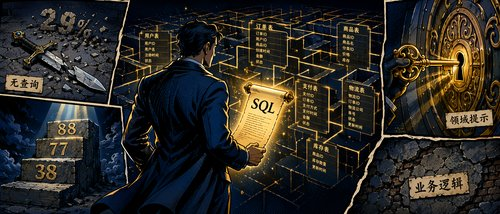

把自然语言问题转成 SQL 查询，听起来不难——给定问题和数据库 schema，让模型写一条 SELECT 语句就好了。但在真实场景里，数据库往往是另一回事：表名晦涩、外键缺失、数据存在 JSON 列里、同一个问题有多种合理解读。微软 ISE 团队在一次内部项目中专门研究了这种"陌生数据库"场景，对比了三种 AI Agent 方案在 LiveSQLBench 上的表现，整理出了一套可操作的实践经验。

这篇文章是他们的实验总结。如果你正在考虑用 LLM 做 NL-to-SQL，这里有实验数据支持的具体建议，而不只是概念框架。



---

## 问题背景

LLM 在已标注好的数据库上做 NL-to-SQL 已经有成熟方案，这篇文章关注的是另一类场景：**数据库是陌生的、文档不全的**。在这种情况下，单靠 schema 信息写出来的查询通常是错的，需要 agent 能主动探索数据、理解字段含义、验证中间结果。

研究的出发点来自 [RAISE 论文](https://arxiv.org/html/2506.01273v1)（Reasoning Agent for Interactive SQL Exploration），其核心思路是：agent 不应该只看 schema，而要实际查询数据，推理之后再给出最终 SQL。这个方向也给团队指出了两个需要避免的坑——过早给出答案，以及陷入无效推理循环。

---

## 数据集

实验使用 [LiveSQLBench](https://github.com/bird-bench/livesqlbench)，这是专门为真实世界 NL-to-SQL 设计的基准集。团队聚焦在中等复杂度的 `SELECT` 查询上：2-3 个表的 JOIN、多个 `WHERE` 条件、数据库有 10+ 张表。

数据集的"难"主要来自这几个方面：

- 表名和列名晦涩，没有清晰的外键关系（甚至根本没有外键）
- 部分数据存储在 JSON 列里
- 非规范化数据
- 问题本身存在歧义，有多种合理解读

---

## 三种方案

团队依次测试了三套方案，从快速验证到生产级框架：

### 方案一：GitHub Copilot CLI

最先做的是概念验证，用 GitHub Copilot CLI 实现了一个遵循 RAISE 思路的单 agent，同时可以接入 Gemini 3.0 和 Claude Sonnet 4.5 等当时 Microsoft Foundry 上还没有的模型。

Agent 配备了四个核心工具：

- `get_db_schema()`：返回所有表的 schema（列名、类型、约束、外键）
- `get_db_table_list()`：列出所有表名
- `get_tb_table_schema(name)`：返回指定表的详细 schema
- `query_db(sql)`：执行 SQL 并返回查询结果

### 方案二：Microsoft Agent Framework

在 Copilot CLI 验证了思路之后，团队在 Microsoft Foundry 上用 Microsoft Agent Framework 重新实现。工具集保持一致，但刻意保持设计简单——用直接的 agentic loop，而不是引入 sub-agent 编排，结果发现这个粒度已经足够达到不错的性能。

### 方案三：Azure Databricks AI/BI Genie

Genie 是 Azure Databricks 生态里的现成企业方案，用户可以用自然语言查询数据，后端依赖 Unity Catalog 元数据。团队测试了从"空白 Genie Space"到"逐步添加列描述、注入领域知识、利用反馈机制存储 SQL 模式"的全过程。

---

## 评估方法

每道题的评估流程：

1. **生成 Ground Truth**：执行标准 SQL，记录结果
2. **提示 agent**：只输入自然语言问题
3. **记录中间过程**：捕获所有消息和工具调用，便于追踪和归因
4. **生成预测结果**：agent 输出 SQL，执行后得到预测结果
5. **比较结果**：用三种匹配策略：
   - 浮点容差：数值在可配置的误差范围内即视为匹配
   - 字符串不区分大小写
   - 行级二分匹配：正确处理重复值

这套评估框架参考了 LiveSQLBench 的设计，目标是识别"语义等价但形式不同"的结果，同时保持足够的精确性。

---

## 实验结果

### GitHub Copilot CLI

| 模型 | 实验配置 | 准确率 |
|---|---|---|
| Claude Sonnet 4.5 | 仅元数据 | 66.70% |
| Claude Sonnet 4.5 | 元数据 + 领域提示 | **80.77%** |
| Gemini 3.0 Pro Preview | 元数据 + 领域提示 | 74.07% |

### Microsoft Agent Framework

| 模型 | 实验配置 | 准确率 |
|---|---|---|
| GPT-5 Mini | 仅元数据 | 55.60% |
| GPT-5 Mini | 元数据 + 领域提示 | 65.38% |
| GPT-5 Mini | 元数据 + 额外澄清 agent 工具 | 69.23% |
| GPT-5 Mini | 元数据 + 领域提示 + 修订后的 agent 指令 | **76.92%** |
| GPT-5 Mini | 消融研究——移除运行时查询能力 | **38.46%** |

### Azure Databricks AI/BI Genie

| 实验配置 | 准确率 |
|---|---|
| 空白 Space，无元数据 | 9.50% |
| 添加列描述 + 领域知识系统指令 | 69.23% |
| 反馈机制（3 轮反馈存储 SQL 模式） | **88.50%** |

---

## 核心发现

### 运行时查询是命门

把 `query_db` 工具从 agent 的工具集里去掉，准确率直接从 76.92% 跌到 38.46%。这意味着元数据再丰富，如果 agent 不能实际执行 SQL 来验证中间结果，准确率就会大幅下降。

元数据的提升同样明显：AI/BI Genie 从 9.50% 升至 69.23%，Copilot CLI（Claude Sonnet 4.5）从 66.70% 升至 80.77%，Agent Framework（GPT-5 Mini）从 55.60% 升至 69.23%。两者叠加效果最好。

### 模型选择影响显著

在相同数据集、相同 prompt、相同评估标准下，Claude Sonnet 4.5 达到 80.77%，GPT-5 Mini 停在 69.23%，Gemini 3.0 Pro Preview 达到 74.07%。模型之间有 10-20 个百分点的差距很常见。

Gemini 在空白/时间归一化上表现出色，在某些用例上甚至超过了 ground truth 的质量，但在 join 路径覆盖和 JSON 字段选择上存在缺口。不同模型有各自的强项和弱项，需要根据具体 schema 特点、延迟/成本要求和错误容忍度来评估。

### 反馈循环的价值

Genie 的反馈机制把准确率从 69.23% 提升到 88.50%，提升了 19.27 个百分点。这背后的机制是：把已验证的 SQL 模式和 join 关系存储起来，后续复用。对于有大量重复查询类型的生产系统，建立这样的反馈机制值得投入。

不过 Genie 的反馈主要是手动的，不适合完全自动化的数据探索场景；它更擅长优化已知的重复查询。

### 业务逻辑是真正的瓶颈

剩余的失败案例里，绝大多数不是 SQL 语法错误，而是语义误解：

- 成本汇总不完整（5/8 个必要字段，导致 46% 的低估）
- 指标计算错误（重新计算了本应使用预计算列的值，导致精度和单位错位）
- 歧义解读（用模式匹配"极低温"还是精确匹配"-70°C"）

这类问题靠调整元数据和 prompt 解决不了。团队的经验是：把公式和约束显式地写进 prompt 或知识库，而不是期望模型自己推断出来。

### 评估策略的设计要提早

评估本身也是一门学问。同样的 SQL 查询，返回不同列名、不同列数、语义等价的结果，但评估框架会把它标记为错误。

一个典型的假阴性例子：问"退货中保修索赔的百分比"，ground truth 返回 `{"wcr_percent": "53.30"}`，agent 返回：

```json
{"total_returns": "1500", "returns_with_warranty_claim": "799", "percent_with_warranty_claim": "53.30"}
```

百分比值一样（53.30%），但列名不同、多了支撑字段，最初被判为错误。这类结构差异调整之后，准确率显著提升。

设计建议：早期就确定评估策略，根据数据特点调整（比如金融场景的数值容差、脏数据场景的列灵活性），避免把正确答案判为失败。

---

## 结论与实践建议

NL-to-SQL 已经不是纯粹的研究问题，而是一个工程挑战，有清晰的已知解法。团队给出四条实践建议：

1. **从 schema 文档化和运行时验证入手**——这两件事的性价比最高
2. **评估策略要早定**——评估标准要和你的数据特点与业务目标对齐，而不是事后补
3. **预留业务逻辑的迭代预算**——需要领域专家参与和持续修正，不能指望模型自动搞定
4. **多试几个模型**——10-20 个百分点的差距很常见，值得花时间对比

目前的系统还有约 25% 的错误率，几乎都来自业务逻辑语义误解。这部分是否可接受，以及能否通过领域知识和反馈机制逐步缩小，需要根据你的具体场景判断。

## 参考

- [SQL query generation from natural language – ISE Developer Blog](https://devblogs.microsoft.com/ise/llm-sql-query-generation)
- [RAISE: Reasoning Agent for Interactive SQL Exploration](https://arxiv.org/html/2506.01273v1)
- [LiveSQLBench](https://github.com/bird-bench/livesqlbench)
- [AI/BI Genie 文档](https://learn.microsoft.com/en-us/azure/databricks/genie/)
