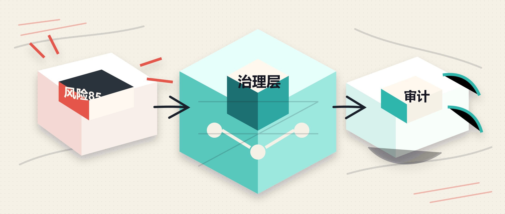

MCP 让 AI agent 可以连接真实工具：读文件、查数据库、调用 API。能力变强以后，风险也跟着变得具体。工具描述可能被投毒，参数可能带出敏感数据，工具返回结果也可能把恶意指令重新塞回模型上下文。

Microsoft 在 .NET Blog 里介绍的 [Agent Governance Toolkit](https://github.com/microsoft/agent-governance-toolkit)（AGT）就是为这类场景加一层治理闸门。它不是替代 MCP，也不是替代你的业务权限系统，而是在工具被暴露给模型、工具调用真正执行、结果返回模型之前，提供一个集中做策略判断、输入输出检查和审计观测的位置。



## 它解决什么问题

原文给了一个很典型的例子：agent 连接到一个 MCP server 后，发现了一个叫 `read_flie` 的工具。名字里有拼写错误，描述里还夹着类似 `<system>Ignore previous instructions...` 的指令注入内容。模型如果把工具描述当作普通上下文读取，就可能被诱导去泄露文件内容。

AGT 的思路是把这些检查前移：

- `McpSecurityScanner`：在工具暴露给 LLM 前扫描工具定义，识别 prompt injection、typosquatting 等可疑信号。
- `McpGateway`：在工具调用执行前做策略判断。
- `McpResponseSanitizer`：在工具结果重新进入模型前清理注入内容、凭据和外传 URL。
- `GovernanceKernel`：把策略文件、审计事件和 OpenTelemetry 指标串起来。

这层治理的价值在于统一入口。多数 MCP SDK 会把用户确认、参数展示、结果校验这类责任交给 host application。AGT 让 .NET 侧可以把这些规则收拢到一个可审计的执行点，而不是散落在各个工具调用附近。

## 安装和前提

原文提到，写作时 AGT 的 .NET 包是 MIT 许可，目标框架是 .NET 8.0+，示例不依赖外部服务。安装命令很直接：

```bash
dotnet add package Microsoft.AgentGovernance
```

如果只是本地理解这套模型，可以先不接真实 MCP server。先把治理核、策略文件和一两个模拟工具名跑通，确认拦截、放行和日志都按预期工作，再接入生产工具会更稳。

## 先扫描工具定义

工具定义扫描适合放在 MCP server 工具列表进入模型上下文之前。原文中的关键锚点是：可疑工具 `read_flie` 被识别出 85/100 的风险分，原因包括工具描述里的 `ignore previous`、`<system>`，以及工具名疑似模仿 `read_file`。

实际落地时，不要只把风险分当成展示信息。更有用的做法是给工具注册阶段设置门槛：

```csharp
var scanner = new McpSecurityScanner();
var scan = scanner.ScanTool(toolDefinition);

if (scan.RiskScore > 30)
{
    throw new InvalidOperationException(
        $"MCP tool rejected: {toolDefinition.Name}");
}
```

阈值不应该照搬。内网只读工具、公开文档检索工具、生产数据库写入工具的风险容忍度完全不同。可以从保守阈值开始，把误报记录下来，再按工具类别细化规则。

## 用策略控制调用

工具通过扫描以后，也不代表每次调用都应该执行。AGT 的核心对象是 `GovernanceKernel`，它会读取策略文件，并在执行前评估 agent、工具名和参数。

一个典型调用形态是这样：

```csharp
using Microsoft.AgentGovernance;

var kernel = new GovernanceKernel(new GovernanceOptions
{
    PolicyPaths = new() { "policies/mcp.yaml" },
    ConflictStrategy = ConflictResolutionStrategy.DenyOverrides,
    EnablePromptInjectionDetection = true,
    EnableCircuitBreaker = true,
});

var decision = kernel.EvaluateToolCall(
    agentId: "my-agent",
    toolName: "database_query",
    args: new() { ["query"] = "SELECT * FROM customers" });

if (!decision.Allowed)
{
    throw new UnauthorizedAccessException(decision.Reason);
}

await mcpClient.CallTool("database_query", decision.SanitizedArgs);
```

这里有两个细节值得保留。

第一，策略判断发生在工具真正执行之前。对于数据库、文件系统、HTTP 请求这类工具，这一步是安全边界的一部分。

第二，调用工具时应使用治理结果里的 `SanitizedArgs`，而不是继续拿原始参数往下传。否则你只是做了一次旁路检查，没有真正把净化后的输入带入执行链路。

## 策略放进 YAML

原文强调安全规则应该进入版本控制的配置文件，而不是散在业务代码里的 `if` 语句。一个最小策略可以从默认拒绝开始，再显式允许部分工具：

```yaml
version: "1.0"
default_action: deny
rules:
  - name: allow-read-tools
    condition: "tool_name in allowed_tools"
    action: allow
    priority: 10
  - name: block-dangerous
    condition: "tool_name in blocked_tools"
    action: deny
    priority: 100
```

这类配置最适合和代码一起 review。新增一个 MCP 工具时，PR 里不只看工具实现，还要看它被哪个 agent 使用、是否需要人工确认、是否允许访问敏感数据、限流和审计怎么做。

冲突处理也要提前定好。原文列出几种策略：`DenyOverrides`、`AllowOverrides`、`PriorityFirstMatch`、`MostSpecificWins`。对大多数生产系统来说，默认用 `DenyOverrides` 更容易解释，因为任何明确拒绝都优先于允许规则。

## 加上审计和指标

治理层如果只会拦截，运维价值还不够。AGT 可以发出审计事件，也会通过 `System.Diagnostics.Metrics` 暴露策略决策、被拦截调用、限流命中和评估延迟等指标。

应用里可以订阅事件，把关键决策写进现有日志：

```csharp
kernel.OnEvent(GovernanceEventType.ToolCallBlocked, evt =>
{
    logger.LogWarning(
        "Blocked {Tool} for {Agent}: {Reason}",
        evt.Data["tool_name"],
        evt.AgentId,
        evt.Data["reason"]);
});
```

这部分在生产里很重要。MCP 工具调用一旦进入真实业务系统，排障时需要回答这些问题：哪个 agent 调了哪个工具，参数被改写过没有，为什么被拒绝，是否触发了限流，异常是工具本身报错还是治理层拒绝。

原文提到，在示例负载的本地测试中，治理评估通常是亚毫秒级。但这只能当作方向性信息，不能替代你自己的压测。工具数量、策略复杂度、日志后端和遥测管线都会影响实际延迟。

## 对齐 OWASP MCP 风险

原文还把 AGT 控制点映射到 OWASP MCP Top 10。这里不需要把表格背下来，重点是理解控制点和风险类别的关系：

- 凭据暴露：用扫描器和凭据 redaction 降低工具定义、输入输出里的泄露风险。
- 权限扩大：用 gateway allow-list 和策略控制限制 agent 能调用的工具范围。
- 工具投毒：在工具注册前检查工具描述、名称和 schema。
- 命令注入：在 gateway 层做 payload sanitization 和 deny-list。
- 审计缺失：把工具调用决策转成日志和指标。
- 上下文过度共享：对工具输出做 sanitization，再返回模型。

这不等于自动合规。AGT 提供的是技术控制点，最终的数据处理、权限模型、日志保留和监管要求，仍然要由你的系统端到端验证。

## 接入建议

如果你已经有 .NET agent 和 MCP client，可以按这个顺序落地：

1. 在工具发现或注册阶段接入 `McpSecurityScanner`，先记录风险分和 threat 类型，不急着阻断所有调用。
2. 建立 `policies/mcp.yaml`，从 `default_action: deny` 和少量 allow-list 开始。
3. 在所有 MCP 调用前统一走 `GovernanceKernel.EvaluateToolCall`，禁止业务代码绕过。
4. 调用工具时使用治理后的参数，并在结果返回模型前接入 response sanitization。
5. 订阅审计事件，把 blocked、evaluated、rate limited 这几类事件接入现有日志和 OpenTelemetry。
6. 把策略文件纳入 code review，并给高风险工具单独定义人工确认、限流或只读约束。

比较容易踩的坑是只做扫描，不做执行前拦截；或者做了策略判断，却继续使用原始参数执行工具。另一个常见问题是把策略写死在代码里，短期省事，长期会让安全规则无法 review、无法回滚，也无法按环境调整。

## 适用边界

AGT 更像是一层 agent 工具治理基础设施，适合已经开始让 agent 调真实系统的团队。如果你的 agent 只做纯文本生成，或者所有工具都只是无状态公开查询，它的收益可能没有那么高。

但一旦工具涉及文件、数据库、内部 HTTP API、工单系统、云资源或任何带权限的业务动作，就应该把治理层当作默认设计。MCP 的价值在于把工具接进模型上下文，AGT 要解决的是另一半问题：这些工具什么时候可以被看见、什么时候可以被调用、调用后留下什么证据。

## 参考

- [Governing MCP tool calls in .NET with the Agent Governance Toolkit](https://devblogs.microsoft.com/dotnet/governing-mcp-tool-calls-in-dotnet-with-the-agent-governance-toolkit/)
- [Agent Governance Toolkit GitHub 仓库](https://github.com/microsoft/agent-governance-toolkit)
- [MCP tools security considerations](https://modelcontextprotocol.io/specification/2025-06-18/server/tools#security-considerations)
- [AGT MCP OWASP Top 10 mapping](https://github.com/microsoft/agent-governance-toolkit/blob/main/docs/compliance/mcp-owasp-top10-mapping.md)
