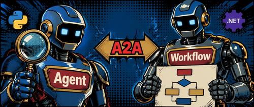

2026 年 4 月 3 日，Microsoft Agent Framework（MAF）正式发布 1.0 GA 版本。这个版本标志着 Microsoft 在 AI agent 领域完成了一次重要的产品化转型：从之前分散于 Semantic Kernel、AutoGen 等工具的实验性编排能力，收拢到一个统一的、同时支持 .NET 和 Python 的生产级 SDK。



如果你现在在做 AI agent 相关开发，这个版本值得认真看一遍——不是因为它"开创了新范式"，而是因为它把几个之前需要自己拼接的能力（跨语言通信、工具发现、RAI 合规、可视化调试）直接打包进了框架，并且承诺了稳定 API 和长期支持。

## 框架的核心设计：Agent 与 Workflow 的分离

MAF 最重要的设计决策是把两类关注点明确分开：

| 关注点 | 由谁负责 |
|--------|----------|
| 推理与工具调用 | **Agent** |
| 执行策略与控制流 | **Workflow** |

**Agent** 是有状态的运行时组件，它用 LLM 解读输入、调用工具和 MCP server、维护对话上下文、生成响应。原文的表述是"不只是 prompt 包装器，而是有状态的执行单元"。

**Workflow** 是图化的编排引擎，负责连接多个 Agent 和函数、定义执行顺序、支持断点恢复（checkpointing）和"人工介入"（human-in-the-loop）场景。

这种分离带来的实际好处是：对话逻辑交给 Agent 处理，任务流程的幂等性、可重试性和可观测性交给 Workflow 保证，两件事不再耦合在一起。

## 架构主要组成部分

框架由几个核心构建块组成：

- **Model clients**：统一的聊天补全接口，屏蔽不同模型提供商的差异
- **Agent sessions**：状态与对话管理
- **Context providers**：记忆与检索
- **Middleware pipeline**：执行链路上的拦截、过滤、遥测注入点
- **MCP clients**：工具发现与调用
- **Workflow engine**：图化编排

## 1.0 带来了什么

**生产就绪的稳定性**

之前的 Release Candidate 版本 API 变化较频繁。1.0 承诺了稳定 API、版本化发布和长期支持（LTS）。如果你之前因为 API 不稳定而不敢在生产环境用，这次是转正信号。

**A2A 协议（Agent-to-Agent）**

这是 1.0 中含金量最高的新能力。A2A 是一个结构化的 agent 间消息协议，允许不同运行时的 agent 跨框架协作。实际意义是：Python 端写的 agent 可以直接和 .NET 端的 agent 通信，不需要手写中间层。对于团队里同时有 Python 工程师和 C# 工程师的情况，这省去了大量胶水代码。

**MCP（Model Context Protocol）全面集成**

框架内置了 MCP client，agent 可以动态发现和调用外部工具，不再需要为每个工具手写集成代码。这意味着任何暴露了 MCP 接口的服务都可以直接被 agent 消费。

**多 Agent 编排模式（稳定版）**

三种常用编排模式都在 1.0 里稳定下来：

- **Sequential**：线性的专有 agent 移交，适合流水线任务
- **Group Chat**：多 agent 协作讨论、共同解决问题
- **Magentic-One**：面向复杂任务的推理规划模式

**Middleware Pipeline**

Middleware 让你可以在不修改核心 prompt 的情况下，向 agent 执行链路注入逻辑。最典型的用途是负责任 AI（Responsible AI）相关的内容安全过滤、日志记录和合规检查——集中写一次，全局生效。

**DevUI Debugger**

一个基于浏览器的本地调试器，实时展示 agent 的消息流、工具调用和状态变化。对于排查多 agent 系统里"哪个 agent 做了什么决定"这类问题，比打 log 直观很多。

## 代码示例

### C# 创建一个 Agent

```csharp
using Azure.AI.Projects;
using Azure.Identity;
using Microsoft.Agents.AI;

AIAgent agent = new AIProjectClient(
    new Uri("https://your-foundry-service.services.ai.azure.com/api/projects/your-project"),
    new AzureCliCredential())
  .AsAIAgent(
    model: "gpt-4o-mini",
    instructions: "You are a friendly assistant. Keep your answers brief."
  );

Console.WriteLine(await agent.RunAsync("What is the largest city in France?"));
```

这段代码展示了三件事：通过 `AIProjectClient` 做到提供商无关的模型访问；通过 `.AsAIAgent()` 创建有状态的 agent；以及极简的生产环境接入方式。

### Python 创建同一个 Agent

```python
from agent_framework.foundry import FoundryChatClient
from azure.identity import AzureCliCredential

client = FoundryChatClient(
    project_endpoint="https://your-foundry-service.services.ai.azure.com/api/projects/your-project",
    model="gpt-4o-mini",
    credential=AzureCliCredential(),
)

agent = client.as_agent(
    name="HelloAgent",
    instructions="You are a friendly assistant. Keep your answers brief.",
)

result = await agent.run("What is the largest city in France?")
print(result)
```

两种语言的 agent 抽象是一致的，切换语言时不需要重新学习一套概念。

## 什么时候用 Agent，什么时候用 Workflow

原文给了一个清晰的判断表：

| 用 Agent 当… | 用 Workflow 当… |
|-------------|----------------|
| 任务是开放性的 | 步骤是明确定义的 |
| 需要自主工具调用 | 执行顺序很重要 |
| 只有一个决策点 | 多个 agent/函数需要协作 |

原文中有一条值得记住的原则：**如果你可以用确定性代码解决这个任务，就直接写代码，不要上 AI agent。**

## 与其他框架的对比

MAF 1.0 的定位是"企业就绪 + 互操作性"，和 Semantic Kernel/AutoGen、LangChain/CrewAI 的差异主要在这几个维度：

| 维度 | MAF 1.0 | Semantic Kernel / AutoGen | LangChain / CrewAI |
|------|---------|--------------------------|-------------------|
| 定位 | 统一生产级 SDK | 研究导向或工具专项 | 高层开发者友好抽象 |
| 集成 | 深度集成 Microsoft Foundry 和 Azure | 程度不一，通常需要更多胶水代码 | 云无关 |
| 互操作 | 原生 A2A + MCP | 受限于内部生态 | 使用专有连接器 |
| 运行时 | .NET 和 Python API 完全对等 | Python 优先（SK 有 C#） | Python 为主 |
| 控制流 | 图化确定性 Workflow | 偏非确定性/实验性 | 角色制与 agentic 混合 |

如果你来自 Semantic Kernel，框架提供了迁移辅助工具，可以分析现有代码并生成升级到 MAF 1.0 的分步计划。

## 落地时的几个判断点

**什么团队适合现在评估 MAF 1.0**：需要 .NET 和 Python 混合的多 agent 系统；有 RAI/合规要求需要集中管控；已经在用 Azure AI Foundry 的团队。

**什么情况可以继续等**：如果现有的 Semantic Kernel 项目运行稳定，没有跨语言通信需求，迁移收益不大。框架提供了迁移工具，但迁移本身仍然有成本。

**还需要观察的地方**：1.0 GA 刚发布不久，社区生态（第三方 MCP server、案例、踩坑记录）还在积累中。对于高复杂度的生产系统，建议先用小范围验证再大规模铺开。

## 参考

- [The Future of Agentic AI: Inside Microsoft Agent Framework 1.0](https://techcommunity.microsoft.com/blog/azuredevcommunityblog/the-future-of-agentic-ai-inside-microsoft-agent-framework-1-0/4510698)
- [Microsoft Agent Framework Version 1.0 发布公告](https://devblogs.microsoft.com/agent-framework/microsoft-agent-framework-version-1-0/)
- [Agent Framework 官方文档](https://learn.microsoft.com/en-us/agent-framework/)
- [Build Multi-Agent AI Apps on Azure App Service with MAF 1.0](https://techcommunity.microsoft.com/blog/appsonazureblog/build-multi-agent-ai-apps-on-azure-app-service-with-microsoft-agent-framework-1-/4510017)
