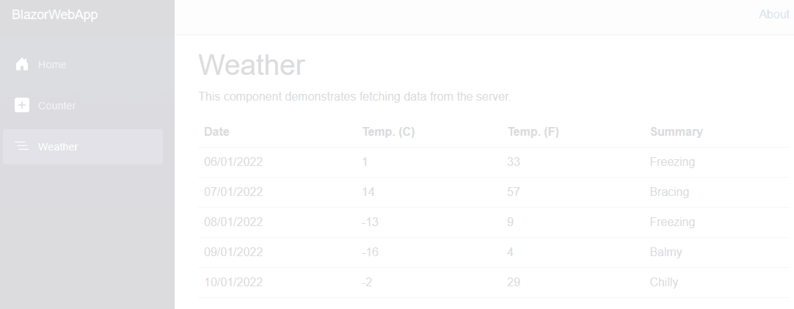
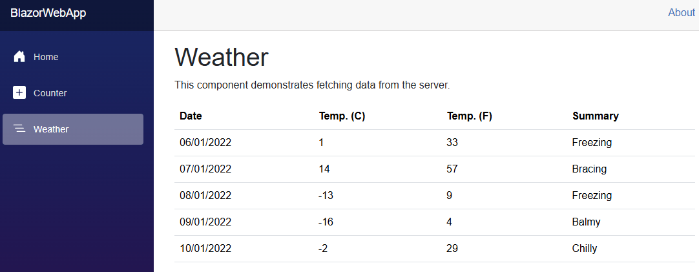
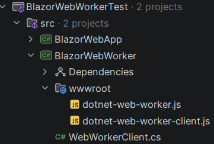
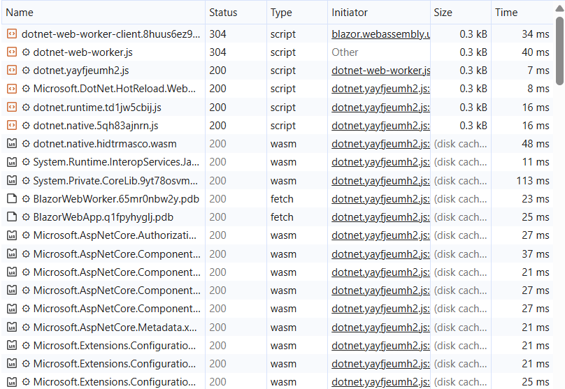

> 本文基于 .NET 11 preview 3 编写，正式发布前细节可能还会变化。

Blazor WASM 有一个老问题：JavaScript 引擎（比如 V8）本质上是单线程的。一旦你在主线程里跑 CPU 密集型任务，比如图像处理、文档解析、大量数据计算，整个 UI 就会冻住，浏览器甚至会提示用户关闭页面。

.NET 8 就已经能在 Blazor 里接入 Web Workers，但配置相当繁琐。.NET 11 preview 2 直接内置了一个 `webworker` 项目模板，把大部分样板代码都打包好了，让接入成本大幅降低。这篇文章从头走一遍：为什么需要 Web Workers，怎么用新模板，以及模板里那几个文件各自在做什么。

## 为什么 Blazor WASM 需要 Web Workers

Blazor Server 的 CPU 密集任务跑在服务器上，影响有限。但 Blazor WASM 是把 .NET 运行时打包进浏览器运行的，所有代码都跑在 JS 的单线程事件循环里。

如果你调用一个会阻塞 5 秒的方法——哪怕用了 `async`/`await`，只要这段计算本身是 CPU-bound——UI 就会彻底停住。



Web Workers 的解法是：把这段计算移到一个独立线程里跑，主线程负责维持 UI 响应，Worker 线程算完了再把结果消息发回来。这和 Windows Forms 里 STA 线程只能在主线程改 UI 的约束是类似的思路，只是浏览器版本的"协作式多线程"。

和 .NET 线程池那种隐式调度（`Task.Run()` 可以直接把工作扔给线程池）不同，Web Worker 需要你**显式**地把工作调度过去。

## 搭建 Blazor WASM 应用

先建一个基础 Blazor WASM 应用：

```bash
dotnet new sln
mkdir src
dotnet new blazorwasm -o ./src/BlazorWebApp
dotnet sln add ./src/BlazorWebApp
```

运行起来是熟悉的默认模板，有 Counter 和 Weather 两个页面。



我们的目标是把 Weather 页面的数据加载改成通过 Web Worker 生成，而不是从 HTTP 请求加载。

## 生成 Web Worker 项目

.NET 11 新增了 `webworker` 模板。注意它是一个**独立项目**，不是直接加到 Blazor 项目里的文件——这和旧文档的做法不同：

```bash
dotnet new webworker -o ./src/BlazorWebWorker
dotnet sln add ./src/BlazorWebWorker
```

模板生成的文件不多：



接下来把这个项目引用到主应用里，同时开启 `AllowUnsafeBlocks`（因为要用 `[JSExport]`）：

```bash
dotnet add ./src/BlazorWebApp reference ./src/BlazorWebWorker
```

在 `BlazorWebApp.csproj` 里加一行：

```xml
<Project Sdk="Microsoft.NET.Sdk.BlazorWebAssembly">

  <PropertyGroup>
    <TargetFramework>net11.0</TargetFramework>
    <Nullable>enable</Nullable>
    <ImplicitUsings>enable</ImplicitUsings>
    <OverrideHtmlAssetPlaceholders>true</OverrideHtmlAssetPlaceholders>
    <!-- 👇 Add this -->
    <AllowUnsafeBlocks>true</AllowUnsafeBlocks>
  </PropertyGroup>

  <ItemGroup>
    <PackageReference Include="Microsoft.AspNetCore.Components.WebAssembly" Version="11.0.0-preview.3.26207.106" />
    <PackageReference Include="Microsoft.AspNetCore.Components.WebAssembly.DevServer" Version="11.0.0-preview.3.26207.106" PrivateAssets="all" />
  </ItemGroup>

  <ItemGroup>
    <ProjectReference Include="..\BlazorWebWorker\BlazorWebWorker.csproj" />
  </ItemGroup>

</Project>
```

## 定义要在 Worker 里跑的方法

想在 Web Worker 线程里执行的方法，要用 `[JSExport]` 修饰。有几个限制要注意：

- 所在类必须是 `static partial` 类
- 加 `[SupportedOSPlatform("browser")]`，因为这段代码只在浏览器里运行
- 返回值只能是基础类型（`int`、`bool` 等）或 `string`，不能直接返回自定义对象

所以复杂对象要先序列化成字符串再返回。下面这个例子用 `Thread.Sleep(5_000)` 模拟耗时计算，然后把 `WeatherForecast` 数组序列化返回：

```csharp
[SupportedOSPlatform("browser")]
public static partial class WorkerMethods
{
    [JSExport]
    public static string GetForecasts(int count)
    {
        // 模拟会阻塞主线程的耗时工作
        Thread.Sleep(5_000); 

        // 生成数据
        Weather.WeatherForecast[] forecasts =
        [
            new() { Date = new DateOnly(2022, 01, 06), TemperatureC = 1,   Summary = "Freezing" },
            new() { Date = new DateOnly(2022, 01, 07), TemperatureC = 14,  Summary = "Bracing"  },
            new() { Date = new DateOnly(2022, 01, 08), TemperatureC = -13, Summary = "Freezing" },
            new() { Date = new DateOnly(2022, 01, 09), TemperatureC = -16, Summary = "Balmy"    },
            new() { Date = new DateOnly(2022, 01, 10), TemperatureC = -2,  Summary = "Chilly"   }
        ];

        // 只能序列化成 string 返回
        return JsonSerializer.Serialize(forecasts.Take(count)); 
    }
}
```

## 在 Blazor 组件里调用 Web Worker

原来的 Weather 组件用 `HttpClient` 加载数据：

```csharp
@code {
    private WeatherForecast[]? forecasts;

    protected override async Task OnInitializedAsync()
    {
        forecasts = await Http.GetFromJsonAsync<WeatherForecast[]>("sample-data/weather.json");
    }
}
```

改成通过 Web Worker 运行：

```csharp
@using BlazorWebWorker
@inject IJSRuntime JsRuntime
@code {
    private WeatherForecast[]? forecasts;

    protected override async Task OnInitializedAsync()
    {
        // 创建 Web Worker 实例
        await using var worker = await WebWorkerClient.CreateAsync(JsRuntime);

        // 方法全名：命名空间.类名.方法名
        const string workerMethod = $"{nameof(BlazorWebApp)}.{nameof(WorkerMethods)}.{nameof(WorkerMethods.GetForecasts)}";
        const int initialCount = 5;
        
        // 在 Web Worker 上调用方法，InvokeAsync<T> 会自动反序列化返回的 JSON 字符串
        forecasts = await worker.InvokeAsync<WeatherForecast[]>(workerMethod, args: [initialCount]);
    }
}
```

这样 `GetForecasts` 就跑在独立的 Worker 线程里，5 秒的阻塞不会影响 UI。

## 缓存 Web Worker 实例

直接跑这段代码会发现一个问题：每次进 Weather 页面都要等一段时间才开始加载。打开 DevTools 网络面板能看到原因——Web Worker 需要初始化一个全新的 .NET 运行时，会加载一批 .NET 程序集：



这个冷启动开销不小。解法是把 `WebWorkerClient` 实例缓存起来，第二次用就不需要再初始化了：

```csharp
private static WebWorkerClient? _client;
public static async Task<WebWorkerClient> GetOrCreateClient(IJSRuntime jsRuntime)
{
    // 已有实例直接复用
    if (_client is { } client)
    {
        return client;
    }

    // 首次初始化（较慢）
    _client = await WebWorkerClient.CreateAsync(jsRuntime);
    return _client;
}
```

在 Weather 组件里替换调用方式：

```csharp
protected override async Task OnInitializedAsync()
{
-    await using var worker = await WebWorkerClient.CreateAsync(JsRuntime);
+    var worker = await WorkerMethods.GetOrCreateClient(JsRuntime);
}
```

第一次调用仍然慢，之后就直接复用了。

## 模板内部机制

模板里只有几个文件，分别负责不同的层次。

### WebWorkerClient：.NET 侧的包装

`WebWorkerClient` 是从 .NET 代码调用 Web Worker 的入口：

```csharp
public sealed class WebWorkerClient(IJSObjectReference worker) : IAsyncDisposable
{
    public static async Task<WebWorkerClient> CreateAsync(IJSRuntime jsRuntime)
    {
        // 导入客户端 JS 模块
        await using var module = await jsRuntime.InvokeAsync<IJSObjectReference>(
            "import", "./_content/BlazorWebWorker/dotnet-web-worker-client.js");

        // 调用 create() 创建 DotnetWebWorkerClient 实例
        var workerRef = await module.InvokeAsync<IJSObjectReference>("create");

        return new WebWorkerClient(workerRef);
    }

    public async Task<TResult> InvokeAsync<TResult>(string method, object[] args, CancellationToken cancellationToken = default)
    {
        // 调用 JS 侧的 invoke 方法，指定要执行的 [JSExport] 方法全名
        return await worker.InvokeAsync<TResult>("invoke", cancellationToken, [method, args]);
    }

    public async ValueTask DisposeAsync()
    {
        try
        {
            await worker.InvokeVoidAsync("terminate");
        }
        catch (JSDisconnectedException) { }

        await worker.DisposeAsync();
    }
}
```

注意 JS 文件路径里嵌了项目名 `BlazorWebWorker`——如果你改了项目名，这里也要跟着改。

### dotnet-web-worker-client.js：胶水层

这个 JS 文件负责在主线程侧创建 Web Worker，并处理消息的发送和接收。它用了 ES2021 的 `#` 私有字段语法，作者也坦言自己写这段代码时才发现这个语法——"大概说明我离上次认真写 JS 已经很久了"。

核心逻辑是：`create()` 方法启动一个运行 `dotnet-web-worker.js` 的 Worker，等收到 `ready` 消息后返回包装对象；`invoke()` 把方法调用请求发给 Worker，通过 requestId 做请求追踪，等结果回来再 resolve Promise。

### dotnet-web-worker.js：Worker 线程

Worker 线程完全独立——它需要自己启动一套 .NET 运行时，然后监听消息，找到对应的 `[JSExport]` 方法并执行，把结果 `postMessage` 回主线程。这就是冷启动慢的根本原因：每个 Worker 实例都要重新加载 .NET 运行时。

方法查找的方式也很直白：把 `"BlazorWebApp.WorkerMethods.GetForecasts"` 这样的字符串按 `.` 分割，在 `workerExports` 对象上逐层查找，找到后直接调用。

## 小结

.NET 11 的 `webworker` 模板把 Blazor WASM 接入 Web Workers 的工作量降到了一个合理的水平：创建独立项目、引用到主应用、用 `[JSExport]` 标记要后台运行的方法、通过 `WebWorkerClient` 调用——大部分机制代码都由模板提供。

几个实践要点：

- Worker 线程的方法只能返回基础类型或 `string`，复杂对象要序列化
- **缓存 `WebWorkerClient` 实例**，冷启动开销不可忽视
- 如果改了 Web Worker 项目名，记得同步修改 `WebWorkerClient.cs` 里的 JS 文件路径
- 当前还在 preview 阶段，API 细节在正式发布前可能还会调整

## 参考

- [原文：Running background tasks in Blazor with Web Workers](https://andrewlock.net/exploring-the-dotnet-11-preview-1-running-background-tasks-in-blazor-with-web-workers/)
- [官方文档：Blazor with .NET on Web Workers](https://learn.microsoft.com/en-us/aspnet/core/blazor/blazor-with-dotnet-on-web-workers)
- [官方文档：.NET on Web Workers](https://learn.microsoft.com/en-us/aspnet/core/client-side/dotnet-on-webworkers)
- [BlazorWorker 开源项目](https://github.com/Tewr/BlazorWorker)
- [MDN：Web Workers API](https://developer.mozilla.org/en-US/docs/Web/API/Web_Workers_API/Using_web_workers)
