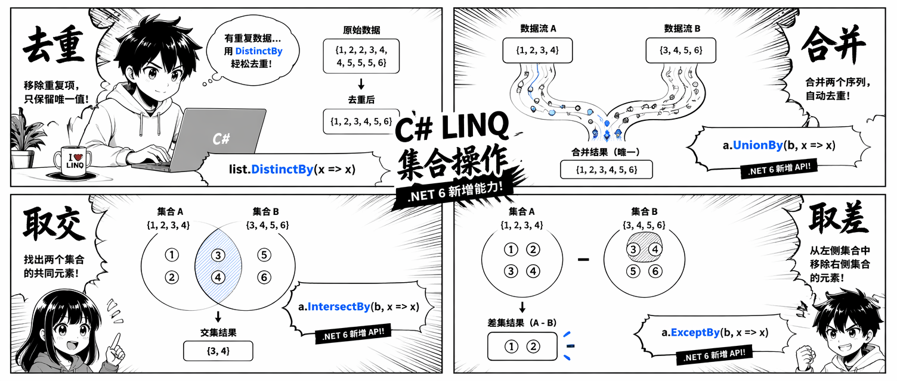

集合去重、交集、差集是日常编程里最常见的需求之一。LINQ 从 .NET Framework 3.5 起就提供了 `Distinct`、`Union`、`Intersect`、`Except` 四个操作符。.NET 6 在此基础上为每个操作符都加了 `By` 后缀变体，接受一个 key selector，从根本上消除了大量 `IEqualityComparer` 的手写需求。

这篇文章把这八个方法放在一起，用真实业务场景的模型举例，帮你看清楚每个操作符做什么、新旧写法有什么区别、以及几个容易踩坑的细节。

## 领域模型

后面的例子都基于这三个简单 record：

```csharp
namespace DevLeader.LinqSetOperations;

public record Product(int Id, string Name, string Category, decimal Price);
public record Tag(string Value);
public record Employee(int Id, string Name, string Department, string Email);
```

record 天然具有结构相等语义，所以在集合操作中不需要额外的 comparer。

## Distinct：去重

`Distinct()` 返回序列中每个不重复的元素。对于值类型和 record，直接可用：

```csharp
int[] scores = [90, 85, 90, 72, 85, 100];
IEnumerable<int> unique = scores.Distinct(); // 90, 85, 72, 100
```

对于没有结构相等的引用类型，必须传 `IEqualityComparer<T>`：

```csharp
public sealed class ProductNameComparer : IEqualityComparer<Product>
{
    public bool Equals(Product? x, Product? y)
        => string.Equals(x?.Name, y?.Name, StringComparison.OrdinalIgnoreCase);

    public int GetHashCode(Product obj)
        => StringComparer.OrdinalIgnoreCase.GetHashCode(obj.Name);
}

IEnumerable<Product> uniqueByName = catalog.Distinct(new ProductNameComparer());
```

每次都写一个 `IEqualityComparer` 很繁琐，这正是 `DistinctBy` 存在的原因。

## DistinctBy（.NET 6）：按 key 去重

`DistinctBy(keySelector)` 保留每个 key 第一次出现的元素，后续重复的直接丢弃，不需要 comparer：

```csharp
// .NET 6 之前 — GroupBy 变通写法
IEnumerable<Product> uniqueOld = catalog
    .GroupBy(p => p.Name.ToUpperInvariant())
    .Select(g => g.First());

// .NET 6 — 简洁直接
IEnumerable<Product> uniqueNew = catalog.DistinctBy(p => p.Name);

// 每类别保留第一个产品
IEnumerable<Product> onePerCategory = catalog.DistinctBy(p => p.Category);
```

"第一个元素胜出"与原始序列顺序一致。如果需要每组里的特定元素（比如最便宜的），用 `GroupBy` 加结果选择器更合适。

### 复合 key

复合 key 用匿名类型，和 `GroupBy`、`Join` 的用法一样：

```csharp
// 按 (Department, Name) 去重 — 处理调岗和同名的情况
IEnumerable<Employee> uniqueDeptName = employees
    .DistinctBy(e => new { e.Department, e.Name });
```

匿名类型自带结构相等，两个字段都会参与比较。

## Union 和 UnionBy：合并序列

`Union` 合并两个序列并去重，相当于 SQL 的 `UNION`（不是 `UNION ALL`）：

```csharp
IEnumerable<Tag> webTags    = [new("csharp"), new("dotnet"), new("blazor")];
IEnumerable<Tag> mobileTags = [new("csharp"), new("maui"), new("mobile")];

// record 有结构相等，"csharp" 只出现一次
IEnumerable<Tag> allTags = webTags.Union(mobileTags);
// 结果：csharp, dotnet, blazor, maui, mobile
```

对于没有结构相等的引用类型，`.NET 6` 的 `UnionBy` 更简洁：

```csharp
// .NET 6 之前
IEnumerable<Product> combinedOld = storeA
    .Concat(storeB)
    .GroupBy(p => p.Id)
    .Select(g => g.First());

// .NET 6
IEnumerable<Product> combinedNew = storeA.UnionBy(storeB, p => p.Id);
```

**注意**：当两个序列都包含相同 key 的元素时，`UnionBy` 保留**左序列**的那个元素。如果两侧在非 key 字段上有差异，左序列的数据会覆盖右侧。

## Intersect 和 IntersectBy：取交集

`Intersect` 返回同时存在于两个序列中的元素：

```csharp
IEnumerable<Tag> requiredSkills  = [new("csharp"), new("sql"), new("azure")];
IEnumerable<Tag> candidateSkills = [new("csharp"), new("python"), new("azure"), new("docker")];

IEnumerable<Tag> matchedSkills = requiredSkills.Intersect(candidateSkills);
// 结果：csharp, azure
```

`IntersectBy`（.NET 6）对 key 做交集：

```csharp
// .NET 6 之前 — 先建 HashSet 再过滤
HashSet<int> teamBIds = teamB.Select(e => e.Id).ToHashSet();
IEnumerable<Employee> sharedOld = teamA.Where(e => teamBIds.Contains(e.Id));

// .NET 6
IEnumerable<Employee> sharedNew = teamA.IntersectBy(teamB.Select(e => e.Id), e => e.Id);
```

**容易混淆的地方**：`IntersectBy` 的第二个参数不是"内序列的 key selector"，而是**内序列已经投影出来的 key 值集合**，所以要写 `teamB.Select(e => e.Id)` 而不是直接传 `teamB`。第一个 key selector（`e => e.Id`）是对外序列做投影，用来和第二个参数里的 key 值对比。

实际场景——找出同时在促销目录和主目录中的产品：

```csharp
IEnumerable<Product> eligiblePromo =
    promoProducts.IntersectBy(mainCatalog.Select(p => p.Id), p => p.Id);
```

## Except 和 ExceptBy：取差集

`Except` 返回第一个序列中**不在**第二个序列里的元素（集合差）：

```csharp
IEnumerable<Tag> allFeatureTags  = GetAllFeatureTags();
IEnumerable<Tag> deprecatedTags  = GetDeprecatedTags();

IEnumerable<Tag> activeTags = allFeatureTags.Except(deprecatedTags);
```

`ExceptBy`（.NET 6）用 key 做差集：

```csharp
// .NET 6 之前
HashSet<int> terminatedIds = terminatedEmployees.Select(e => e.Id).ToHashSet();
IEnumerable<Employee> activeOld = allEmployees.Where(e => !terminatedIds.Contains(e.Id));

// .NET 6
IEnumerable<Employee> activeNew =
    allEmployees.ExceptBy(terminatedEmployees.Select(e => e.Id), e => e.Id);
```

找出主目录中还没有参与任何促销的产品：

```csharp
IEnumerable<Product> unpromotedProducts =
    mainCatalog.ExceptBy(promoProducts.Select(p => p.Id), p => p.Id);
```

## 自定义相等：IEqualityComparer

当默认相等不够用时（比如大小写不敏感的 Tag 比较），所有集合操作符都支持传入 `IEqualityComparer<T>`：

```csharp
public sealed class CaseInsensitiveTagComparer : IEqualityComparer<Tag>
{
    public static readonly CaseInsensitiveTagComparer Instance = new();

    public bool Equals(Tag? x, Tag? y)
        => string.Equals(x?.Value, y?.Value, StringComparison.OrdinalIgnoreCase);

    public int GetHashCode(Tag obj)
        => StringComparer.OrdinalIgnoreCase.GetHashCode(obj.Value);
}

IEnumerable<Tag> sourceTags = [new("CSharp"), new("DOTNET")];
IEnumerable<Tag> filterTags = [new("csharp"), new("blazor")];

// "CSharp" 被过滤掉，因为不区分大小写匹配到了 "csharp"
IEnumerable<Tag> remaining = sourceTags.Except(filterTags, CaseInsensitiveTagComparer.Instance);
// 结果：DOTNET
```

comparer 上的单例模式（`Instance`）避免在高频路径上重复分配。

## 值类型与引用类型的行为对照

| 类型 | 默认相等 | 集合操作表现 |
|------|----------|-------------|
| `int`、`string`、`bool` | 结构相等 | 无需 comparer |
| `record`（C# 9+） | 结构相等（自动生成） | 无需 comparer |
| `struct`（自定义） | 默认结构相等 | 通常正确 |
| `class`（无重写） | 引用相等 | 需要 `IEqualityComparer` 或 `*By` |
| `class`（重写了 `Equals`/`GetHashCode`） | 自定义结构相等 | 无需 comparer |

如果你在设计供 LINQ 集合操作使用的领域类型，优先选 `record`——它在大多数场景下都能直接用，不需要写 comparer 样板代码。

## 组合使用：增量变更检测

集合操作符可以自由组合。一个经典的"快照差量"模式：

```csharp
IEnumerable<Product> catalogPrevious = GetPreviousCatalog();
IEnumerable<Product> catalogCurrent  = GetCurrentCatalog();

// 新增的产品
IEnumerable<Product> added =
    catalogCurrent.ExceptBy(catalogPrevious.Select(p => p.Id), p => p.Id);

// 移除的产品
IEnumerable<Product> removed =
    catalogPrevious.ExceptBy(catalogCurrent.Select(p => p.Id), p => p.Id);

// 两个快照都有的产品
IEnumerable<Product> unchanged =
    catalogCurrent.IntersectBy(catalogPrevious.Select(p => p.Id), p => p.Id);
```

这个 delta 模式在同步流程、变更检测管道和增量数据处理中很常见。

## 几个常见问题

**`Distinct` 和 `DistinctBy` 的区别？**  
`Distinct()` 按元素本身的相等性去重；`DistinctBy(keySelector)` 按投影 key 去重，保留每个 key 第一次出现的元素，无需 comparer。

**`Union` 会对单个序列内部也去重吗？**  
是的。`Union` 对合并后的整体去重，包括每个源序列内部的重复项。如果只想拼接不去重，用 `Concat`。

**`IntersectBy` 和 `Where + HashSet` 哪个性能更好？**  
性能相当——`IntersectBy` 内部也是建 `HashSet`。区别在于：`Where + HashSet` 模式可以在多个操作中复用同一个 `HashSet`；`IntersectBy` 更声明式，意图更清晰。

**集合操作是延迟执行的吗？**  
是的，`Distinct`、`DistinctBy`、`Union`、`UnionBy`、`Intersect`、`IntersectBy`、`Except`、`ExceptBy` 都是延迟执行。内部 `HashSet` 在元素被 yield 时才按需构建。

**能对不同类型的序列做集合操作吗？**  
两个序列的元素类型 `T` 必须一致。如果有 `IEnumerable<Product>` 和 `IEnumerable<DiscountedProduct>`，需要先投影到公共类型。这也是 `*By` 变体的优势——`IntersectBy` 可以用共同的 `Id` 字段关联两个不同类型的序列，不需要类型转换。

## 小结

LINQ 的八个集合操作方法覆盖了日常的去重、合并、取交集、取差集需求：

- `Distinct` / `DistinctBy`：去重，.NET 6+ 优先用 `DistinctBy` 避免写 comparer
- `Union` / `UnionBy`：合并并去重，key 冲突时左序列优先
- `Intersect` / `IntersectBy`：取两个序列的公共部分
- `Except` / `ExceptBy`：取左序列中不在右序列里的部分
- 所有操作符都支持延迟执行，也都接受可选的 `IEqualityComparer<T>`

设计新领域类型时优先选 `record`，LINQ 集合操作里就不需要 comparer 了。需要精细控制相等语义时，再引入 `IEqualityComparer` 单例。

## 参考

- [原文：LINQ Set Operations in C#: Distinct, DistinctBy, Union, Intersect, and Except](https://www.devleader.ca/2026/05/13/linq-set-operations-in-c-distinct-distinctby-union-intersect-and-except)
