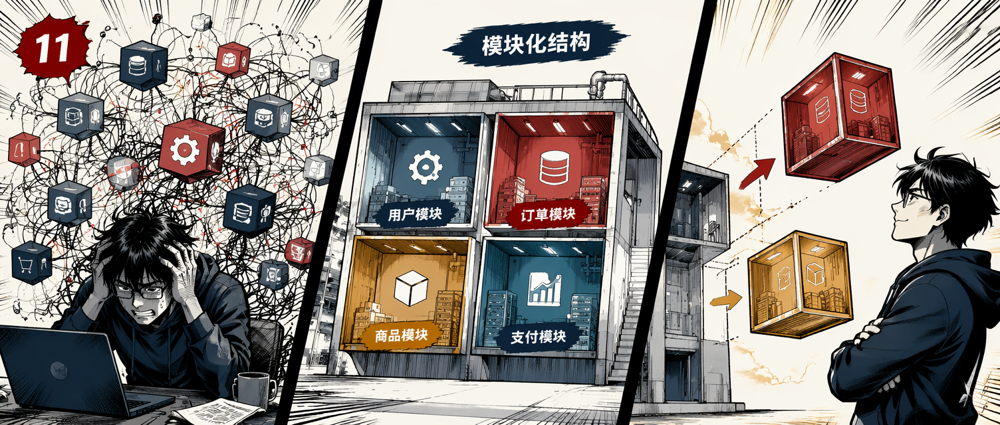

每隔几年，就会有一种新的架构风格被捧成"正确答案"。2014 年是微服务，2019 年是服务网格，2022 年是 Serverless。到了 2025 年，公开承认"模块化单体其实才是正确答案"开始变得时髦。

与此同时，在真实的 .NET 团队里，同一个故事反复上演：团队拆了微服务，花了 18 个月，得到 15 个服务、3 个值班轮次、一张昂贵的 Kubernetes 账单——以及和以前一样的业务问题。

本文是作者希望更多团队在"那个周一"之前就能看到的行动手册，核心路线是：

**单体 → 模块化单体 → 选择性微服务**

核心论点只有一句话，但贯穿全文：**架构演进应跟随可测量的痛点，而非炒作。**

## 一个你可能经历过的故事

Stefan 把这家公司叫做"Northwind Pay"，一个 B2B 计费平台。

- **5,000 用户**：单个 ASP.NET Core 8 应用，一个 Postgres、一个 Redis、一个后台 Worker。两名工程师，部署只需 4 分钟。没人抱怨。
- **30,000 用户**：团队扩至 8 人，发布流水线已增长到 22 分钟，`Startup.cs` 里的合并冲突是每日仪式。有两位工程师悄悄开始把共用服务重构成"模块"。
- **60,000 用户**：一位从大厂来的高级工程师加入，他自信地说"这需要微服务"。没人反驳，因为没人想显得初级。六个月的拆分开始了。
- **100,000 用户**：11 个服务、4 个数据库、RabbitMQ、半成品 Kubernetes、没人完整配置的分布式追踪。P99 延迟反而更高。三分之二的故障由之前不存在的服务间网络问题引起。CTO 在一对一中问架构师："我们真的需要这些吗？"
- **转折**：团队把 11 个服务里的 9 个合并回一个结构良好的模块化单体。只有两个有真正独立扩展需求的服务（PDF 生成器和 Webhook 投递 Worker）保持独立。延迟下降，故障减少，团队重新开始顺利交付功能。

这不是反微服务的故事。这是关于**顺序**的故事。

## 规模增长时，什么先坏掉

在讨论方案之前，先搞清楚在典型 .NET 单体中，各种问题出现的顺序。这很重要，因为正确的架构动作取决于你实际感受到哪种痛。

| 用户规模 | 最先出现的问题 |
|---|---|
| 5k–20k | 数据库查询：N+1、缺失索引、EF Core 在热路径上的变更追踪 |
| 20k–40k | 后台工作侵入请求路径：同步调用三方 API、在 HTTP Handler 里生成 PDF |
| 30k–60k | 部署协调：两个团队无法独立发布，每次部署都触及同一个二进制文件 |
| 50k–80k | 认知负担：新工程师找不到功能在哪，代码审查花几天 |
| 80k–150k | 独立扩展需求：某个子系统需要 10 倍于其他部分的资源 |
| 100k+ | 爆炸半径：一次错误部署或一条失控查询可以让整个产品宕机 |

注意：前两个问题根本不是架构问题，是代码和设计问题。如果你为了解决问题 #1 迁移到微服务，会非常失望，也会花很多不必要的钱。

## 单体：2026 年仍然是正确的默认选择

在 .NET 语境下，单体就是一个可部署的制品——通常是一个 ASP.NET Core 进程——包含所有业务逻辑，连接一个主数据库。

Stack Overflow、Shopify（多年间）、Basecamp、GitHub（大部分历史时期）都用这种"无聊的架构"扩展到了数百万用户。

单体在大多数团队仍然占优的原因：

- **一个部署单元**：没有服务网格、分布式追踪配置、Kubernetes Ingress 折腾
- **本地函数调用而非网络调用**：亚毫秒级，可事务，一个堆栈跟踪就能调试
- **一个数据库事务**：跨模块的 ACID 基本上是免费的，不需要 Saga，不需要 Outbox
- **一个代码库、一条 CI 流水线**：切换上下文只需 `cd ..`，而不是 `git clone`
- **便宜**：一台性能合理的 VM 或 App Service 就能承载惊人的负载，前提是代码写得合理

对于 5k–50k 用户的小团队，你的任务不是为未来设计架构，而是**保持单体健康**：修复慢查询，把慢工作推到后台服务，保持模块边界干净。

## 模块化单体：被低估的中间步骤

当单体开始令人痛苦——而你已经排除了"只是慢查询"的可能——下一步几乎从来不是微服务，而是**模块化单体**。

模块化单体仍然是一个可部署单元，但内部结构化为严格边界的模块，每个模块拥有：

- 自己的文件夹
- 自己的内部类（不向外泄漏不必要的公共类型）
- 自己的数据库 Schema
- 自己的公共契约（一个小而有意图的接口表面）
- 只通过契约或事件与其他模块通信

为什么这是被低估的步骤：

1. 你获得了微服务的大部分边界清晰性
2. 你保留了单体的大部分操作简单性
3. 如果边界设计错了——第一次往往会错——你用重构修复，而不是一个季度的迁移
4. 你在生产环境中发现哪些模块真正需要成为独立服务

最后一点是这个步骤存在的全部意义：**你无法提前知道哪些边界是真实的，只能通过使用来学习。**

## 在 .NET 中落地模块边界

### 文件夹结构

```text
src/
  NorthwindPay.Api/                  // 组合根，承载所有模块
    Program.cs
    appsettings.json
  Modules/
    Orders/
      NorthwindPay.Orders/           // 内部实现
        Domain/
        Application/
        Infrastructure/
        OrdersModule.cs              // 注册扩展方法
      NorthwindPay.Orders.Contracts/ // 公共契约 + 集成事件
    Billing/
      NorthwindPay.Billing/
      NorthwindPay.Billing.Contracts/
    Identity/
      NorthwindPay.Identity/
      NorthwindPay.Identity.Contracts/
    Notifications/
      NorthwindPay.Notifications/
      NorthwindPay.Notifications.Contracts/
  BuildingBlocks/
    NorthwindPay.SharedKernel/       // Result 类型、Guard 子句、基础类型
    NorthwindPay.EventBus/           // 进程内总线 + Outbox 抽象
```

两条严格执行的规则：

1. **宿主项目（`NorthwindPay.Api`）是唯一引用所有模块的地方**。任何模块都不引用另一个模块的实现项目。
2. **模块间只通过 `*.Contracts` 项目通信**，即接口、DTO 和集成事件——绝不是 EF Core 实体，绝不是内部服务。

这不是装饰性的文件夹分组。这是**编译时**的边界强制。如果 Orders 模块的开发者试图直接调用 Billing 服务，它编译不过。这是你能拥有的最强架构规则，因为它在代码审查中无法被争论。

### 模块注册

每个模块暴露一个扩展方法，`Program.cs` 变成这些方法的列表：

```csharp
// NorthwindPay.Orders/OrdersModule.cs
public static class OrdersModule
{
    public static IServiceCollection AddOrdersModule(
        this IServiceCollection services,
        IConfiguration configuration)
    {
        services.AddDbContext<OrdersDbContext>(opt =>
            opt.UseNpgsql(
                configuration.GetConnectionString("Orders"),
                npg => npg.MigrationsHistoryTable("__EFMigrationsHistory", "orders")));

        services.AddScoped<IOrderService, OrderService>();
        services.AddMediatR(cfg =>
            cfg.RegisterServicesFromAssemblyContaining<OrdersModule>());

        return services;
    }

    public static IEndpointRouteBuilder MapOrdersEndpoints(
        this IEndpointRouteBuilder app)
    {
        var group = app.MapGroup("/api/orders").WithTags("Orders");
        group.MapPost("/", CreateOrderEndpoint.Handle);
        group.MapGet("/{id:guid}", GetOrderEndpoint.Handle);
        return app;
    }
}
```

```csharp
// Program.cs
var builder = WebApplication.CreateBuilder(args);

builder.Services
    .AddIdentityModule(builder.Configuration)
    .AddOrdersModule(builder.Configuration)
    .AddBillingModule(builder.Configuration)
    .AddNotificationsModule(builder.Configuration);

var app = builder.Build();

app.MapOrdersEndpoints();
app.MapBillingEndpoints();
app.Run();
```

如果 `Program.cs` 超过约 30 行，说明模块有问题。

### 模块间的内部契约

当 Orders 需要 Billing 的数据时，它不直接依赖 Billing 的实现，而是通过契约接口：

```csharp
// NorthwindPay.Billing.Contracts/IBillingApi.cs
public interface IBillingApi
{
    Task<InvoiceSummary> CreateInvoiceAsync(
        CreateInvoiceCommand command,
        CancellationToken ct);

    Task<InvoiceSummary?> GetInvoiceAsync(
        Guid invoiceId,
        CancellationToken ct);
}

public sealed record CreateInvoiceCommand(
    Guid OrderId,
    Guid CustomerId,
    decimal Amount,
    string Currency);

public sealed record InvoiceSummary(
    Guid InvoiceId,
    Guid OrderId,
    string Status,
    DateTimeOffset IssuedAt);
```

Billing 模块在内部实现 `IBillingApi`。Orders 只看到契约。当 Billing 有一天变成独立服务时，你把进程内实现替换成实现了同一接口的 HTTP/gRPC 客户端。Orders 模块零改动。

**这是本文最重要的模式。**

## 模块间的异步通信

直接调用适合查询（给我发票 X），但对于工作流（一个订单被下了，现在要做五件事）是陷阱。对于工作流，使用事件：

```csharp
// NorthwindPay.Orders.Contracts/Events/OrderPlaced.cs
public sealed record OrderPlaced(
    Guid OrderId,
    Guid CustomerId,
    decimal Amount,
    string Currency,
    DateTimeOffset OccurredAt) : IIntegrationEvent;
```

```csharp
// NorthwindPay.Notifications/Handlers/OrderPlacedHandler.cs
internal sealed class OrderPlacedHandler : IIntegrationEventHandler<OrderPlaced>
{
    public async Task HandleAsync(OrderPlaced @event, CancellationToken ct)
    {
        var customer = await _customers.GetAsync(@event.CustomerId, ct);
        await _email.SendAsync(
            to: customer.Email,
            subject: "We received your order",
            body: $"Order {@event.OrderId} for {@event.Amount} confirmed.",
            ct);
    }
}
```

Orders 模块对 Notifications 一无所知，发布 `OrderPlaced` 然后继续。如果 Notifications 慢了、出错了、临时禁用了，Orders 不在乎。

## Outbox 模式：正确的做法

事件发布最常见的写法是错的：

```csharp
await _db.SaveChangesAsync(ct);
await _bus.PublishAsync(new OrderPlaced(...)); // 进程在这里崩溃
```

订单保存了，事件丢了。永远丢了。这是 .NET 分布式系统中最常见的静默数据损坏 bug。

**修复方法是 Outbox 模式**：把事件和状态变更在同一个数据库事务中持久化，然后由后台进程发布。

```csharp
public sealed class CreateOrderHandler : IRequestHandler<CreateOrderCommand, Result<Guid>>
{
    public async Task<Result<Guid>> Handle(
        CreateOrderCommand cmd, CancellationToken ct)
    {
        var order = Order.Place(cmd.CustomerId, cmd.Items);

        _db.Orders.Add(order);

        _db.OutboxMessages.Add(new OutboxMessage
        {
            Id = Guid.NewGuid(),
            OccurredOnUtc = DateTime.UtcNow,
            Type = nameof(OrderPlaced),
            Content = JsonSerializer.Serialize(new OrderPlaced(
                order.Id, order.CustomerId, order.Total, order.Currency, DateTimeOffset.UtcNow))
        });

        await _db.SaveChangesAsync(ct); // 原子操作：订单 + outbox 行

        return order.Id;
    }
}
```

生产中学到的几条经验：

- **消费者端的幂等键是不可协商的**。Outbox 保证至少一次，不是恰好一次。消费者必须能容忍看到同一事件两次。
- **给 `(ProcessedOnUtc, OccurredOnUtc)` 建索引**，否则当表增长到 5000 万行时你会在凌晨 3 点被叫醒。
- **归档已处理的行**，7-30 天后移到冷表。
- **监控毒丸消息**：加一个 `Attempts` 列和一个死信表，一条格式错误的消息不应该阻塞所有其他消息。

## 读写分离：在微服务之前就能用

在需要微服务之前，通常先需要读写分离：

- 写操作通过 MediatR 命令处理器，触及聚合，产生事件
- 读操作完全绕过聚合，从去规范化的读模型直接投影（单独的表、Redis 缓存或搜索索引）

```csharp
// 读取端：Dapper 直接查询视图
internal sealed class OrderListQueryHandler
    : IRequestHandler<OrderListQuery, IReadOnlyList<OrderListItemDto>>
{
    private readonly NpgsqlDataSource _ds;

    public async Task<IReadOnlyList<OrderListItemDto>> Handle(
        OrderListQuery q, CancellationToken ct)
    {
        await using var conn = await _ds.OpenConnectionAsync(ct);
        var rows = await conn.QueryAsync<OrderListItemDto>(
            "select id, total, status, placed_at from orders.order_list_view where customer_id = @cid",
            new { cid = q.CustomerId });
        return rows.ToList();
    }
}
```

读操作用 Dapper 或原生 SQL 查视图或投影表，写操作用 EF Core。这一个改动通常能消除 60-80% 的"API 慢"工单，不需要任何微服务。

## 何时（以及如何）提取服务

如果你的模块化单体做得好，提取其实是容易的部分。如果没做好，那就是噩梦。

**一个模块成为提取候选，需要满足以下至少两条：**

1. 它有明显不同的扩展需求（例如 Webhook 投递需要其余部分 10 倍的 Worker）
2. 它有明显不同的可靠性需求（例如支付服务需要 99.99% 可用性，管理后台 99.5% 就够了）
3. 它由一个需要独立发布节奏的不同团队负责
4. 它的数据所有权是完全内部的——没有其他模块直接读取它的表
5. 它已经稳定运行至少 6 个月——很少有新字段，很少有破坏性契约变更

只满足一条，就是提取太早了。

提取步骤（当模块边界已经良好时）：

1. `*.Contracts` 项目变成一个 NuGet 包
2. 实现移到新仓库和新的 ASP.NET Core 宿主
3. 跨模块调用从进程内 `IBillingApi` 切换到实现同一接口的 HTTP 客户端
4. 集成事件从进程内总线移到 RabbitMQ / Azure Service Bus / Kafka
5. 数据库 Schema（已经隔离）变成独立数据库

如果第 5 步很难，说明你没有模块化单体，你只有带文件夹的单体。

## 操作复杂度：隐藏的成本

提取第一个服务的那天，你的操作复杂度大约翻倍。出现在账单上的东西：

- **服务模板**：日志、追踪、健康检查、指标、认证、配置，必须内置在模板里，否则每个新服务都会重复发明
- **分布式追踪**：OpenTelemetry + OTLP Collector + 后端（Jaeger、Tempo、Application Insights）。没有这个，调试跨服务问题是中世纪级别的痛苦
- **集中日志**：带 Correlation ID 的结构化日志，跨服务传播
- **服务发现和配置**：连接字符串、Secret、功能标志的跨服务策略
- **部署编排**：版本化 API、向后兼容契约、expand/contract 迁移

**诚实地说：做微服务不能是兼职。你要么投资一个平台团队，要么承受痛苦。**

## 可观测性：不可协商的前提

在提取第一个服务之前，你的单体就应该已经具备：

- 用 Serilog 或 `Microsoft.Extensions.Logging` 输出 JSON 格式的结构化日志
- 启用了 ASP.NET Core、EF Core 和 HttpClient 追踪的 OpenTelemetry
- 请求率、错误率、P50/P95/P99 延迟的指标
- 贯穿所有层（包括读 Outbox 的后台 Worker）的 Correlation ID

```csharp
// Program.cs - 最小可行可观测性
builder.Services.AddOpenTelemetry()
    .WithTracing(t => t
        .AddAspNetCoreInstrumentation()
        .AddHttpClientInstrumentation()
        .AddEntityFrameworkCoreInstrumentation()
        .AddSource("NorthwindPay.*")
        .AddOtlpExporter())
    .WithMetrics(m => m
        .AddAspNetCoreInstrumentation()
        .AddRuntimeInstrumentation()
        .AddMeter("NorthwindPay.*")
        .AddOtlpExporter());
```

为什么要在拆分之前做？因为一旦分开，你就失去了在单个堆栈跟踪中单步调试的能力。如果你现在没有可观测性的肌肉记忆，你将在三个不同的系统里读日志、一边哭。

## 现实的迁移路线图

| 阶段 | 时间 | 工作内容 |
|---|---|---|
| **Phase 0** - 稳定单体 | 第 1-4 周 | 添加 OpenTelemetry；找出最慢的 10 个端点并修复查询；把邮件/PDF/Webhook 移到 `BackgroundService`；添加健康和就绪端点 |
| **Phase 1** - 内部模块化 | 第 4-12 周 | 按业务域划分模块文件夹；创建 `*.Contracts` 项目；EF Core 实体迁移到各模块 Schema；用架构测试（NetArchTest / ArchUnitNET）禁止跨模块类型引用；引入进程内事件总线 |
| **Phase 2** - 异步骨干 | 第 8-16 周 | 在每个发布事件的模块中实现 Outbox；消费者添加幂等键；添加死信表；添加 Outbox 延迟的指标 |
| **Phase 3** - 读写分离 | 第 12-20 周 | 找出最热的读端点；构建专用投影或物化视图；将这些读操作从 EF Core 写模型中移出 |
| **Phase 4** - 选择性提取 | 第 6 个月之后 | 选一个满足提取标准的模块；提取它，在生产中运行 30 天；测量：操作痛苦是否下降？如果是，考虑下一个候选。如果不是，回滚。 |

**愿意回滚，这才是区分工程团队和货物崇拜团队的标准。**

## 常见反模式

经过足够多的架构审查，同样的错误反复出现：

- **分布式单体**：多个服务，一个共享数据库，所有请求路径中都有同步 HTTP 调用。微服务的所有成本，没有任何好处。这是最常见的失败模式。
- **Auth 服务陷阱**：先提取认证服务，因为"每个服务都需要它"——然后系统中的每个请求在关键路径上都多了一次网络跳转。Auth 应该是一个库加一个身份提供商（Keycloak、Auth0、Entra），而不是热路径上的同步服务。
- **每表一服务**："Orders 服务"、"Customers 服务"、"Products 服务"——每个拥有一张表。你没有提取业务域，你提取了表。每个业务工作流现在需要跨三个服务。
- **事件驱动汤**：没有文档化的契约，没有 Schema 注册，没有幂等性。事件触发，事情发生，没人知道以什么顺序，调试需要读三个月的日志。
- **"稍后添加追踪"服务**：提取服务时没有可观测性。你不会稍后添加追踪，你会在事后复盘时添加。
- **过早的 Kafka**：6 人团队运行 Kafka + ZooKeeper + Schema Registry + Kafka Connect，每天传输一千条消息。RabbitMQ 或 Azure Service Bus 只需要 10 行配置。
- **God 模块**：一个 80% 的其他模块都依赖的"Core"或"Common"模块。恭喜，你在单体里重新发明了单体。

## 总结

跳过模块化单体是最昂贵的单一架构错误。团队从一个混乱的单体直接跳到微服务，发现他们其实并不理解自己的业务域，然后花一年时间用值班呼叫单来偿还这笔债。做得好的团队走的是无聊的路径：

1. **稳定单体**：修复查询，把慢工作移出请求路径，接入可观测性
2. **内部模块化**：边界、契约、Schema、事件、Outbox
3. **只在痛点可测量且边界已被验证的地方提取服务**

这个顺序不光鲜，不会让你登上技术大会的舞台。但它会让你以一个仍然能交付功能、仍然能睡整觉的团队，走到 100k 用户。

**架构演进应跟随可测量的痛点，而非炒作。** 这是这篇文章唯一需要带走的一句话。

## 参考

- [原文：Monolith to Modular Monolith to Microservices at 100k Users](https://thecodeman.net/posts/monolith-to-modular-monolith-to-microservices-at-100k-users)
