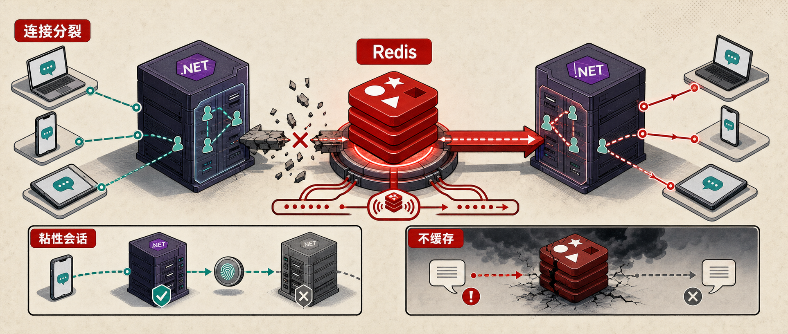

SignalR 在单实例里很好用：客户端连到 Hub，服务端通过
`Clients.User(...)`、`Clients.Group(...)` 或 `IHubContext` 把消息推回去，
一切都像在本机内存里查连接表一样自然。

问题会在横向扩展后出现。你启动了两个、三个、十个应用实例后，每个
SignalR 连接仍然只存在于它当前连上的那台服务器里。某个请求如果落到
Replica 2，但目标用户的 WebSocket 连接在 Replica 1 上，Replica 2
本地根本找不到这条连接，消息就发不到人。

Redis backplane 解决的就是这件事：把多台应用服务器之间的 SignalR
消息广播补起来。它的配置很少，但生产环境里有两个边界一定要提前说清楚：
它不替你取消 sticky sessions，也不会在 Redis 不可用期间帮你缓存消息。

## 问题在哪

SignalR 的连接映射是服务器本地状态。单实例部署时，所有客户端都连到同一台
服务器，服务端当然能知道每个 connection、user 和 group 在哪里。

多实例部署后，负载均衡器会把客户端分散到不同服务器：

- 客户端 A 连在 Server 1
- 客户端 B 连在 Server 2
- 后端某个业务请求刚好打到 Server 2
- 这个请求想给客户端 A 推送消息

如果没有额外机制，Server 2 只知道连到自己的客户端。它不知道客户端 A
在 Server 1 上，于是 `Clients.User(...)` 这一类调用就只会在当前实例的
本地连接表里查找。

这也是很多实时功能“本地测试没问题，上线扩容后偶尔收不到通知”的根源。
问题不在 Hub 方法，也不一定在身份认证，而是在消息路由范围仍然停留在单机。

## Backplane 做什么

Backplane 可以理解成所有应用实例共享的一层消息通道。一个实例想发
SignalR 消息时，不再只在本地找连接，而是把这条消息发布到共享通道里；
其他实例收到后，再判断自己本地有没有对应的客户端连接，有就转发出去。

Redis backplane 用 Redis Pub/Sub 承担这层共享通道。流程大致是：

1. Server 2 收到业务请求，决定给某个用户推送通知。
2. SignalR 把消息发布到 Redis backplane。
3. Server 1 和 Server 2 都订阅同一个 backplane 通道。
4. Server 1 发现目标连接在自己这里，于是把消息发给客户端 A。

应用层调用点通常不用改。原文里提到，作者用两个副本测试时给通知打上了发送
实例 ID，客户端连接在 Replica 1，却收到了 Replica 2 发出的通知，这说明
消息确实已经通过 Redis 跨实例转发。

## 安装包

ASP.NET Core SignalR 的 Redis backplane 需要这个 NuGet 包：

```bash
dotnet add package Microsoft.AspNetCore.SignalR.StackExchangeRedis
```

如果你已经在项目里使用 Redis 做缓存或分布式锁，也不要默认复用同一个连接配置。
SignalR 消息对延迟比较敏感，生产环境里要确认 Redis 和应用在同一个数据中心或
足够接近的网络环境中。Microsoft 文档也提醒，跨数据中心的 Redis backplane
会因为网络延迟拖慢性能；如果应用本身就在 Azure 上，应该优先评估
Azure SignalR Service。

## 注册 Backplane

最小配置只有一行，放在 `builder.Build()` 之前：

```csharp
builder.Services
    .AddSignalR()
    .AddStackExchangeRedis(
        builder.Configuration.GetConnectionString("cache")!);
```

这会让 SignalR 用指定 Redis 连接作为 backplane。你的 Hub、客户端代码、
`IHubContext<T>` 调用方式都可以保持不变。

如果你用 .NET Aspire 管理 Redis 资源，原文里的写法是先注册 Redis
分布式缓存，再从配置里读取同一个名为 `cache` 的连接字符串：

```csharp
builder.AddRedisDistributedCache("cache");

builder.Services
    .AddSignalR()
    .AddStackExchangeRedis(
        builder.Configuration.GetConnectionString("cache")!);
```

这段代码的重点不是 Aspire 本身，而是连接字符串要来自当前环境的配置系统。
本地、测试、生产可以有不同 Redis，但 SignalR backplane 的注册方式保持一致。

## 加 ChannelPrefix

如果多个 SignalR 应用共用同一个 Redis 实例，一定要设置 channel prefix。
否则一个应用发给自己客户端的消息，可能会被同一个 Redis backplane 上的其他
应用实例也收到。

可以这样隔离通道：

```csharp
using StackExchange.Redis;

builder.Services
    .AddSignalR()
    .AddStackExchangeRedis(connectionString, options =>
    {
        options.Configuration.ChannelPrefix =
            RedisChannel.Literal("OrderNotifications");
    });
```

`OrderNotifications` 换成你的应用或 bounded context 名称。这里不要写得太泛，
例如 `SignalR`、`Production` 这类名字后续很容易撞车。更稳妥的做法是把系统名、
环境名和实时功能边界组合起来，例如 `Billing.Prod.Notifications`。

## 仍要粘性会话

Redis backplane 解决的是消息路由，不解决 SignalR 连接建立时的负载均衡问题。

SignalR 连接通常会经历两个步骤：

1. 客户端请求 `/hub/negotiate`，拿到连接 token。
2. 客户端使用这个 token 建立 WebSocket 连接。

这两个请求需要落到同一台服务器上。如果 negotiate 打到了 Server 1，
WebSocket 升级却被负载均衡器转到 Server 2，连接可能直接失败。

所以即使接了 Redis backplane，负载均衡器仍然要开启 sticky sessions，
也就是会话亲和性。常见实现包括 cookie affinity、IP hash，或者云厂商自己的
会话保持配置。上线前要明确查你所用负载均衡器的文档，而不是只看应用代码。

一个容易误判的点是：消息已经能跨实例转发，并不代表连接建立链路也跨实例安全。
这两个问题处在不同阶段。

## Redis 故障时

Redis backplane 不是持久队列。Redis 不可用时，SignalR 不会把消息先缓存起来，
等 Redis 恢复后再补发。

Microsoft 文档列出的典型故障现象包括：写消息失败、Hub 方法调用失败、
Redis 连接失败。已经存在的 WebSocket 连接通常不会因此断开；Redis 恢复后，
SignalR 会自动重连 backplane。但故障窗口里发出的消息就是丢了。

这对很多实时通知是可以接受的。比如订单状态、看板数字、在线状态这类信息，
下一次状态变化或用户刷新页面就能重新对齐。

如果消息本身有业务不可丢的含义，就不要只依赖 Redis backplane。更可靠的设计是：

- 关键事件先写入数据库或 durable queue
- SignalR 只负责“有新状态了”的实时提醒
- 客户端重连后主动拉取最新状态
- 服务端保留补偿或 reconciliation 逻辑

换句话说，Redis backplane 是实时投递层，不是事件持久化层。

## 什么时候不用它

Redis backplane 更适合这些场景：

- 应用自托管，已经有 Redis 运维能力
- 应用实例和 Redis 在同一个数据中心或同一低延迟网络内
- 实时消息可以接受短暂故障窗口内丢失
- 你希望保持现有 SignalR Hub 和客户端模型

如果你在 Azure 上运行，并且希望少管理连接扩容、backplane、sticky sessions
这些基础设施细节，Azure SignalR Service 更省心。它会代理客户端连接，应用服务器
只需要维持到服务端的少量连接；Microsoft 文档也明确把它作为 Azure 场景下替代
自管 Redis backplane 的选择。

自托管 Redis 的优势是简单、低成本、延迟可控；托管服务的优势是连接规模、运维边界
和云平台集成。选哪个，不是看哪一个更“高级”，而是看你愿意把哪部分复杂度留在自己
系统里。

## 上线前检查

接入 Redis backplane 后，可以按这几项做一次冒烟验证：

- 启动至少两个应用副本。
- 让客户端明确连接到不同副本，可以在消息里临时带上实例 ID。
- 从 Replica 2 触发一条发给 Replica 1 客户端的通知。
- 确认客户端能收到，并且消息来源显示跨实例。
- 关闭 Redis 或阻断连接，确认故障窗口内的行为符合预期。
- 恢复 Redis，确认后续消息可以继续投递。
- 检查负载均衡器 sticky sessions 是否开启。
- 如果共用 Redis，检查 `ChannelPrefix` 是否按应用隔离。

这类测试不要只在单机跑。单机里所有连接都在同一个进程，最关键的问题根本不会出现。

## 小结

Redis backplane 的代码改动很小，但它解决的是 SignalR 横向扩展里最核心的
消息路由问题：目标客户端不在当前实例上时，消息仍然能通过共享通道找到它。

真正需要记住的是三个边界：

- `AddStackExchangeRedis` 只补跨实例消息路由。
- sticky sessions 仍然要在负载均衡器上配置。
- Redis 故障期间消息不缓存，关键事件要另有持久化路径。

把这三件事处理好，SignalR 才能从“本机很好用”走到“多实例部署也可靠”。

如果你关注 AI 助手、开发工具和软件工程实践，可以关注 Aide Hub。这里会继续分享能落地的工具教程、技术观察和项目经验。

## 参考

- [Scaling SignalR With a Redis Backplane](https://www.milanjovanovic.tech/blog/scaling-signalr-with-redis-backplane)
- [Set up a Redis backplane for ASP.NET Core SignalR scale-out](https://learn.microsoft.com/en-us/aspnet/core/signalr/redis-backplane)
- [What is Azure SignalR Service?](https://learn.microsoft.com/en-us/azure/azure-signalr/signalr-overview)
