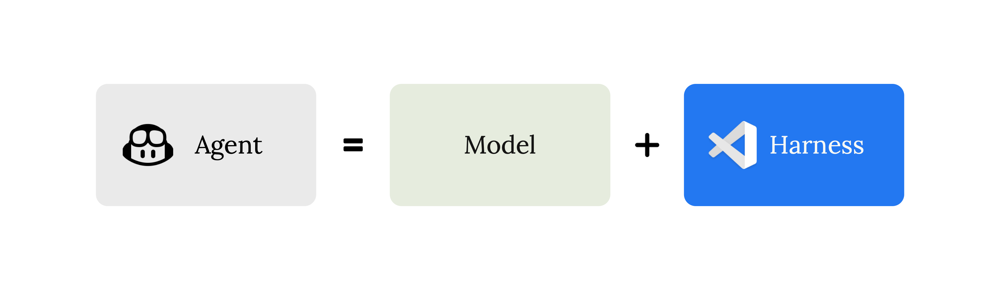
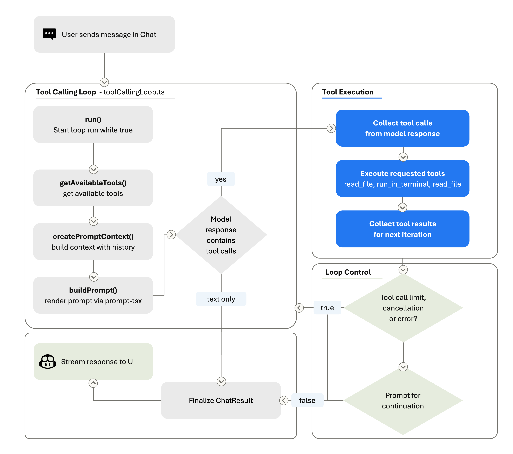
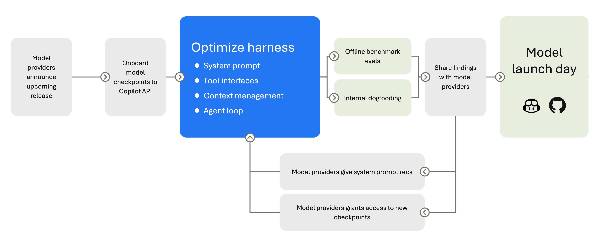
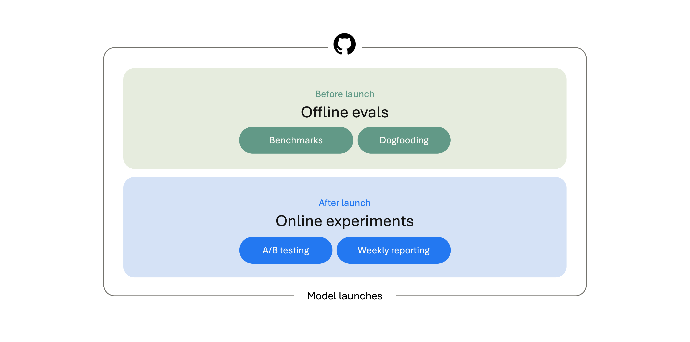

每次新模型发布，同一个问题就会被重新讨论一遍：哪个模型最聪明？哪个最快？该用哪个？

这些问题有价值，但对 VS Code 这样的产品来说，模型只是整体体验的一部分。开发者真正在交互的，是 **coding harness**——组装上下文、暴露工具、运行 agent 循环、把模型输出变成编辑器里真实操作的那一层。

这篇文章来自 VS Code 团队（Julia Kasper、Megan Rogge、Aaron Munger），解释了这套机制的工作方式，以及他们如何在模型和开发者工作流不断演进时持续评估它。

## 套件做三件事

语言模型本身不能编辑文件、执行命令或运行测试。它只能生成文字。coding harness 是连接代码编辑器与语言模型的桥梁，把模型输出的文字转化为动作，再把执行结果反馈给模型，让它决定下一步怎么走。

在 VS Code 里，这套机制主要负责三件事：

**上下文组装**：请求发给模型之前，套件要先构建一个 prompt。这个 prompt 包含系统指令、用户的查询内容、工作区结构（语言、框架、当前打开的文件）、历史对话、工具执行结果、自定义指令，以及之前会话留下的记忆。套件决定模型能看到什么，这些决定直接影响输出质量。

**工具暴露**：套件声明模型可以调用的工具集合：读文件（`read_file`）、编辑代码（`replace_string_in_file` 或 `apply_patch`）、执行终端命令（`run_in_terminal`）、搜索代码库（`semantic_search`）等。每个工具都有 JSON schema 和描述，模型据此判断何时调用。工具集可以按请求动态调整：某些工具只对特定模型启用，某些需要用户确认才执行，用户可以在工具选择器里手动开关，MCP 服务器和扩展也可以注入全新工具，自定义 agent（`.agent.md`）还可以把工具集限定在某个子集里。

**工具执行**：当模型发出工具调用（比如 `{"name": "run_in_terminal", "arguments": {"command": "npm test"}}`），套件负责验证参数、运行工具、处理报错、格式化结果，并把结果送入下一轮迭代。如果模型要求编辑文件，套件写入 diff；如果模型要求运行命令，套件启动进程、捕获输出并返回。

这三件事，模型没有一件能独立完成。但这些输入直接决定了模型的行为和最终结果。

## Agent 循环是怎么工作的

套件核心运行的是一个工具调用循环：「思考 → 行动 → 观察 → 再思考」的迭代周期。

每轮迭代里，套件构建 prompt（系统指令 + 上下文 + 历史 + 所有工具结果），发给模型，检查响应。如果响应包含工具调用，套件执行工具、记录结果，再循环。如果没有工具调用，循环结束，模型的文字输出成为最终响应。

几个概念值得区分：

- **一次对话轮次（turn）**：用户发一条消息，agent 最终产出一个响应，就是一轮。
- **一次循环（round）**：构建 prompt、调用模型、接收响应（文字和/或工具调用）、执行工具、记录结果，这是一个 round。
- **一次运行（run）**：一个 turn 包含的所有 round 的完整执行过程。

用户发一条消息，可能触发很多 round：搜索文件、读代码、修改代码、运行测试、读取输出、根据失败迭代。

循环有边界控制：套件会强制执行工具调用上限、在每轮之间检查取消信号，以及运行 stop hook（扩展点，可以检查 agent 状态并决定是否继续）。每轮 prompt 都会重建，模型始终看到工作区的最新状态。套件还管理对话摘要——当累积历史太长时，压缩早期轮次，让模型继续工作而不撞上上下文窗口上限。

## 套件才是产品

新模型上线，要适配的是已有的套件——系统 prompt、工具定义、循环逻辑、上下文组装，这些都是经过数月真实使用打磨出来的。模型变得更擅长填空，但套件定义了空在哪里。

GitHub Copilot 支持来自多个提供商的模型，VS Code 要应对持续扩展的模型生态：切换模型、自动选择、带自己的 key、通过扩展引入新提供商。这意味着 VS Code 面对的不是一个稳定的 API，而是一个不断变化的模型生态。

套件让开发者能在不重学产品的前提下切换模型。你切换模型或尝试新提供商，核心体验——聊天、会话、工具、终端输出、调试、源代码管理——应该保持熟悉。

但集成一个新模型绝不只是在模型选择器里加一个选项。不同提供商在工具调用暴露方式、结构化输出、推理控制、prompt 缓存、上下文限制、报错行为上各不相同。

具体差异举几个例子：

- Claude 模型用 `replace_string_in_file` 做文件编辑；GPT 模型用 `apply_patch`
- Gemini 需要提醒它用工具调用而不是用叙述代替，孤立的工具调用历史记录会导致它出错
- 有些模型支持 extended thinking，需要 reasoning-effort 控制
- 有些模型用简短的系统 prompt 效果最好；另一些需要详细的结构化指令才能保持稳定

Claude Sonnet 4 用的系统 prompt 和 Claude 4.5 不同，和 Opus 又不同。这些差异转化为每个模型专属的系统 prompt、工具集和对话管理策略。

新模型上线前，团队需要验证工具 schema、重新调整默认行为，并跑完整的 agent 会话测试。模型提供商通常会提前给 VS Code 团队访问新模型的预发布快照（checkpoint），让他们在模型正式发布前就开始调优套件。

## 评测让套件保持诚实

就像上线新功能前要测试一样，模型上线前也要测试。

公开基准测试是有价值的参照点，但在前沿水平上已经不够用了。SWE-bench 在发现前沿模型有时能从训练数据里复现正确答案（污染问题）后，停止了报告 Verified 结果。Coverage 也是限制：SWE-bench 聚焦于公开 bug 修复任务，Terminal-Bench 测命令行能力，但都不能完整覆盖开发者真实带给编辑器的工作流。

这是为什么 VS Code 团队构建了 **VSC-Bench**——他们自己的离线评测套件，专注于公开基准测试覆盖不好的 VS Code 专属开发者任务：自定义 agent 模式、扩展工作流、MCP 和工具使用、终端与浏览器交互、多轮对话、TypeScript/Python/C++ 等多语言编程任务。

VSC-Bench 从多个维度衡量模型行为：解决率、agent 努力程度、token 效率、延迟。每个 VSC-Bench 任务在可复现的容器化工作区里运行：套件启动 VS Code、打开工作区、向 agent 发送用户 prompt、让 agent 响应（文字和工具调用），然后评测发生了什么。

VS Code 团队发布了一张散点图，总结了横跨 8 个模型-推理力度配置的 40 次 VSC-Bench 运行结果。结论之一是：`xhigh` 推理力度用了更多 token，但解决率反而略低于 `high`，说明额外的思考超过了有效区间，不再带来更好结果。

公开基准告诉团队模型与行业对比如何；VSC-Bench 告诉他们模型是否准备好交付开发者在 VS Code 内期待的体验。

## PR 合并前先跑评测

基准测试不只用于发布新模型，也用于在套件变更落地前做验证。如果一个 PR 改动了核心工具、系统 prompt 或任何可能影响 agent 行为的东西，合并前就要有基准数字。

VS Code 团队使用了一套自动化评测流程。给 PR 加上 `~requires-eval-assessment` 标签，整个流程就会启动：

1. **构建 PR**：webhook 触发 vscode-engineering 里的工作流，针对 PR 的合并引用发起 Azure DevOps 构建，失败自动重试一次，PR 上会出现"已排队 1/2"的评论供审查者跟进。
2. **发布评测 agent**：构建成功后，发布管道把一个版本化 agent（`0.0.0-dev.<sha>`）推到 dev 标签的 vscode-evals npm feed，评论更新为"已排队 2/2"。
3. **创建 evald issue**：发布管道触发 repository_dispatch，在 github/evald 上开一个 model-evaluation issue，固定到精确的发布 agent 版本。
4. **反馈结果**：evald 跑完基准后，Azure Logic App 把评论 URL（不是分析正文，那部分留在 evald 内部）以 repository_dispatch 形式发回，最终作为链接发布在原始 VS Code PR 上。

## 模型是发动机，套件是整辆车

回到那个每隔几个月就被问一次的问题：哪个模型最好？

对于编码 agent，这个问题有点像在问哪款发动机最好。发动机重要，但光有发动机不够。模型看到的上下文、能够触达的工具、驱动它持续工作的循环，以及确保这一切正常运转的评测——这就是套件，也是工程团队花最多时间的地方。

随着模型获得更长上下文、更强规划能力和原生工具调用，套件也在随之演进。每次 VS Code 发布，都会随模型更新一起带来套件改进。

如果你想亲手探索套件的工作方式，可以查看 VS Code 源代码，用 Chat 里的 Tools UI 查看某次请求可用的工具列表，打开 Chat Debug View 检查一次 agent 运行背后的 prompt、工具调用和结果。

如果你关注 AI 助手、开发工具和软件工程实践，可以关注 Aide Hub。这里会继续分享能落地的工具教程、技术观察和项目经验。

## 参考

- [The Coding Harness Behind GitHub Copilot in VS Code](https://code.visualstudio.com/blogs/2026/05/15/agent-harnesses-github-copilot-vscode) — Julia Kasper, Megan Rogge, Aaron Munger, VS Code Blog
