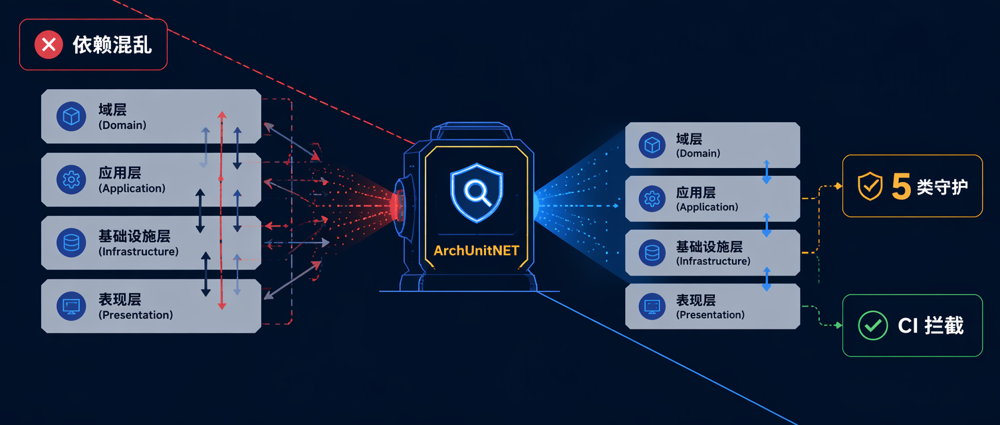

每个项目开始时都满怀诚意。大家在白板上画好层级关系，约定好依赖方向，把架构图贴进 Confluence。

六个月后，某位开发者把一个领域服务移进了 Infrastructure 项目，因为它要访问数据库。另一位把 Handler 命名成了 `ProcessPaymentService`，因为他不知道团队规范。还有人把本该 `internal` 的类改成了 `public`，因为编译器不会报错。Code Review 漏掉了这些，因为没有人在看这些细节。

[架构测试](https://www.milanjovanovic.tech/blog/shift-left-with-architecture-testing-in-dotnet)就是为此而生的。它把架构规则变成可执行的断言，跑在 CI 里。违反了规则，构建就失败。

下面是我在每个 .NET 项目里必加的 5 类架构测试。

## 工具与基础结构

[ArchUnitNET](https://github.com/TNG/ArchUnitNET) 是 Java 生态 [ArchUnit](https://www.archunit.org/) 的 .NET 移植版。它提供流畅的 API，把[架构规则](https://www.milanjovanovic.tech/blog/enforcing-software-architecture-with-architecture-tests)写成普通的 xUnit 测试。

```bash
# 也支持其他测试框架，这里用 xUnit
dotnet add package TngTech.ArchUnitNET.xUnit
```

所有测试类都继承自同一个基类。每个层需要一个"锚类型"，用来在编译期拿到对应程序集的引用：

```csharp
public abstract class BaseTest
{
    protected static readonly Assembly DomainAssembly =
        typeof(User).Assembly;

    protected static readonly Assembly ApplicationAssembly =
        typeof(ICommand).Assembly;

    protected static readonly Assembly InfrastructureAssembly =
        typeof(ApplicationDbContext).Assembly;

    protected static readonly Assembly PresentationAssembly =
        typeof(Program).Assembly;

    protected static readonly Architecture Architecture =
        new ArchLoader()
            .LoadAssemblies(
                DomainAssembly,
                ApplicationAssembly,
                InfrastructureAssembly,
                PresentationAssembly)
            .Build();
}
```

`ArchLoader` 扫描这些程序集，在内存里建立所有类型及其依赖关系的模型。每个测试类继承 `BaseTest` 后就能直接使用这些引用。

## 1. 层依赖测试

Clean Architecture 最核心的约束是[依赖规则](https://www.milanjovanovic.tech/blog/shift-left-with-architecture-testing-in-dotnet)：内层不能依赖外层，所有依赖方向指向内部。

项目引用已经能拦截最明显的违规——你无法给 Application 添加对 Infrastructure 的引用，因为 Infrastructure 已经引用了 Application，循环依赖会被编译器拒绝。

那为什么还要写这些测试？

因为项目引用不是依赖泄露的唯一通道。Infrastructure 里的某个 NuGet 包可能通过传递引用把类型带进 Application。有人重构解决方案结构时可能改变引用图。更重要的是，如果你使用[模块化单体](https://www.milanjovanovic.tech/blog/monolith-modular-monolith-microservices-100k-users-dotnet)，多个层共享一个程序集，编译器根本帮不了你。

这些测试是安全网，同时也是架构意图的活文档。

```csharp
using static ArchUnitNET.Fluent.ArchRuleDefinition;

public class LayerTests : BaseTest
{
    private static readonly IObjectProvider<IType> DomainLayer =
        Types().That().ResideInAssembly(DomainAssembly).As("Domain layer");

    private static readonly IObjectProvider<IType> ApplicationLayer =
        Types().That().ResideInAssembly(ApplicationAssembly).As("Application layer");

    private static readonly IObjectProvider<IType> InfrastructureLayer =
        Types().That().ResideInAssembly(InfrastructureAssembly).As("Infrastructure layer");

    private static readonly IObjectProvider<IType> PresentationLayer =
        Types().That().ResideInAssembly(PresentationAssembly).As("Presentation layer");

    [Fact]
    public void DomainLayer_ShouldNotDependOn_ApplicationLayer()
    {
        Types().That().Are(DomainLayer).Should()
            .NotDependOnAny(ApplicationLayer)
            .Check(Architecture);
    }

    [Fact]
    public void DomainLayer_ShouldNotDependOn_InfrastructureLayer()
    {
        Types().That().Are(DomainLayer).Should()
            .NotDependOnAny(InfrastructureLayer)
            .Check(Architecture);
    }

    [Fact]
    public void DomainLayer_ShouldNotDependOn_PresentationLayer()
    {
        Types().That().Are(DomainLayer).Should()
            .NotDependOnAny(PresentationLayer)
            .Check(Architecture);
    }

    [Fact]
    public void ApplicationLayer_ShouldNotDependOn_InfrastructureLayer()
    {
        Types().That().Are(ApplicationLayer).Should()
            .NotDependOnAny(InfrastructureLayer)
            .Check(Architecture);
    }

    [Fact]
    public void ApplicationLayer_ShouldNotDependOn_PresentationLayer()
    {
        Types().That().Are(ApplicationLayer).Should()
            .NotDependOnAny(PresentationLayer)
            .Check(Architecture);
    }

    [Fact]
    public void InfrastructureLayer_ShouldNotDependOn_PresentationLayer()
    {
        Types().That().Are(InfrastructureLayer).Should()
            .NotDependOnAny(PresentationLayer)
            .Check(Architecture);
    }
}
```

六条测试，覆盖所有非法依赖方向。流畅 API 读起来接近自然语言："Domain 层中的类型不应该依赖 Application 层中的任何类型"。出现违规时，测试会精确告诉你哪个类型依赖了哪个类型。

这是我在任何项目里最先加的架构测试。如果这个列表你只选一类，就选这个。

你也可以继续扩展——比如测试某层内部特定命名空间之间不能互相引用，这在[垂直切片架构](https://www.milanjovanovic.tech/blog/vertical-slice-architecture-in-dotnet)里很有用。

## 2. 命名规范测试

当你有 50 个 Command Handler，其中 3 个叫 `OrderProcessor`、`PaymentExecutor` 或 `CreateOrderService`，代码就会变成猜谜游戏。

ArchUnitNET 可以根据类实现的接口来选择目标，再施加命名约束：

```csharp
public class NamingConventionTests : BaseTest
{
    [Fact]
    public void CommandHandlers_ShouldHave_NameEndingWith_CommandHandler()
    {
        Classes().That()
            .ImplementInterface(typeof(ICommandHandler<>))
            .Or()
            .ImplementInterface(typeof(ICommandHandler<,>))
            .And().DoNotResideInNamespace("Application.Abstractions.Behaviors")
            .Should().HaveNameEndingWith("CommandHandler")
            .Check(Architecture);
    }

    [Fact]
    public void QueryHandlers_ShouldHave_NameEndingWith_QueryHandler()
    {
        Classes().That()
            .ImplementInterface(typeof(IQueryHandler<,>))
            .Should().HaveNameEndingWith("QueryHandler")
            .Check(Architecture);
    }

    [Fact]
    public void Validators_ShouldHave_NameEndingWith_Validator()
    {
        Classes().That()
            .ResideInAssembly(ApplicationAssembly)
            .And().HaveNameEndingWith("Validator")
            .Should().ResideInAssembly(ApplicationAssembly)
            .Check(Architecture);
    }
}
```

有一个坑值得特别说明：`ValidationBehavior` 这类 Pipeline Behavior 也实现了 Handler 接口，但它是管道装饰器，不是业务 Handler。`DoNotResideInNamespace("Application.Abstractions.Behaviors")` 这个过滤器就是为了排除它们。不加这个过滤，每个 Behavior 都会挂在命名检查上——这个坑我真的踩过。

Validator 测试方向是反的：它说"名称以 `Validator` 结尾的类应该住在 Application 程序集里"。我见过有人把 Validator 误放进 Infrastructure，这个测试能拦住。

## 3. 类共位测试

这是我职业早期最希望能有的测试。

用 CQRS 时，Command（或 Query）和它的 Handler 总是成对出现。我的习惯是把它们放在同一个命名空间，让一个用例的所有相关代码住在一起。比如 `Application.TodoItems.Create` 下面同时放 `CreateTodoItemCommand` 和 `CreateTodoItemCommandHandler`。

但没有任何约束能阻止人把 Handler 扔进完全不同的命名空间。

```csharp
public class ColocationTests : BaseTest
{
    [Theory]
    [MemberData(nameof(GetHandlerAndCommandPairs))]
    public void Handlers_ShouldResideInSameNamespace_AsTheirCommandOrQuery(
        Type handlerType,
        Type commandOrQueryType)
    {
        handlerType.Namespace.ShouldBe(
            commandOrQueryType.Namespace,
            $"{handlerType.Name} should be in the same namespace as {commandOrQueryType.Name}");
    }

    public static TheoryData<Type, Type> GetHandlerAndCommandPairs()
    {
        Type[] handlerInterfaces =
        [
            typeof(ICommandHandler<>),
            typeof(ICommandHandler<,>),
            typeof(IQueryHandler<,>)
        ];

        var pairs = new TheoryData<Type, Type>();

        IEnumerable<Type> handlers = ApplicationAssembly
            .GetTypes()
            .Where(t => t.GetInterfaces().Any(i =>
                i.IsGenericType &&
                handlerInterfaces.Contains(i.GetGenericTypeDefinition())));

        foreach (Type handlerType in handlers)
        {
            Type handlerInterface = handlerType.GetInterfaces()
                .First(i => i.IsGenericType &&
                    handlerInterfaces.Contains(i.GetGenericTypeDefinition()));

            Type commandOrQueryType = handlerInterface.GetGenericArguments()[0];

            pairs.Add(handlerType, commandOrQueryType);
        }

        return pairs;
    }
}
```

这个测试不依赖 ArchUnitNET，用的是标准反射加 xUnit 的 `TheoryData`。`GetHandlerAndCommandPairs` 方法扫描 Application 程序集，找出所有实现 Handler 接口的类，从泛型参数里取出对应的 Command/Query 类型，返回配对列表。测试方法则逐对断言它们的命名空间一致。

## 4. 可见性测试

Command Handler 和 Query Handler 是实现细节。它们通过依赖注入解析，没有其他代码应该直接引用它们。

如果 Handler 是 `public` 的，其他层就可以绕过你精心设计的抽象，直接调用它——这破坏了 CQRS 的封装意图。

```csharp
using static ArchUnitNET.Fluent.ArchRuleDefinition;

public class VisibilityTests : BaseTest
{
    [Fact]
    public void CommandHandlers_ShouldBeInternal()
    {
        Classes().That()
            .ImplementInterface(typeof(ICommandHandler<>))
            .Or()
            .ImplementInterface(typeof(ICommandHandler<,>))
            .Should().BeInternal()
            .Check(Architecture);
    }

    [Fact]
    public void QueryHandlers_ShouldBeInternal()
    {
        Classes().That()
            .ImplementInterface(typeof(IQueryHandler<,>))
            .Should().BeInternal()
            .Check(Architecture);
    }
}
```

如果你担心 DI 容器找不到 `internal` 类，不用担心——程序集扫描能发现它们，注册完全正常。

这类测试也可以继续扩展，比如让 EF Core 的 Configuration 类也保持 `internal`——`OrderConfiguration` 没有任何理由暴露在 Infrastructure 之外。

## 5. 依赖守卫测试

层依赖测试保护的是你自己程序集之间的边界。但基础设施库可以通过传递 NuGet 引用悄悄渗进来。

Domain 层不应该知道 Entity Framework 的存在。Application 层不应该知道 Npgsql。如果这些包通过传递引用变得可用，编译器不会阻止你误用它们。

```csharp
using static ArchUnitNET.Fluent.ArchRuleDefinition;

public class DependencyGuardTests : BaseTest
{
    [Fact]
    public void DomainLayer_ShouldNotDependOn_EntityFramework()
    {
        Types().That().ResideInAssembly(DomainAssembly).Should()
            .NotDependOnAnyTypesThat()
            .ResideInNamespace("Microsoft.EntityFrameworkCore")
            .Check(Architecture);
    }

    [Fact]
    public void ApplicationLayer_ShouldNotDependOn_EntityFramework()
    {
        Types().That().ResideInAssembly(ApplicationAssembly).Should()
            .NotDependOnAnyTypesThat()
            .ResideInNamespace("Microsoft.EntityFrameworkCore")
            .Check(Architecture);
    }
}
```

根据项目实际情况增减规则。如果你用 Dapper，可以限制 Domain 不依赖 `Dapper` 命名空间。如果你用 MassTransit，可以限制 Domain 层不直接引用消息总线类型。

## 小结

这 5 类测试运行时间都在毫秒级，不需要任何外部基础设施。它们就放在你的单元测试旁边，随每次构建一起跑。

| 测试类型 | 守护目标 |
|---|---|
| 层依赖 | 内层不依赖外层 |
| 命名规范 | Handler、Validator 按约定命名 |
| 类共位 | Handler 与 Command/Query 同命名空间 |
| 可见性 | Handler 是 `internal`，不对外暴露 |
| 依赖守卫 | Domain/Application 不引入基础设施库 |

只要架构规则存在于文档里，它迟早会被违反。从层依赖测试开始——五分钟内能配置好，能拦住最有破坏力的违规。随着项目增长，再逐步补充其余几类。

---

如果你关注 .NET 架构设计、软件工程实践和 AI 开发工具，可以关注 Aide Hub。这里会持续分享能落地的技术教程、工程经验和工具评测。

## 参考

- [5 Architecture Tests You Should Add to Your .NET Projects – Milan Jovanović](https://www.milanjovanovic.tech/blog/5-architecture-tests-you-should-add-to-your-dotnet-projects)
- [ArchUnitNET GitHub 仓库](https://github.com/TNG/ArchUnitNET)
- [Shift Left with Architecture Testing in .NET](https://www.milanjovanovic.tech/blog/shift-left-with-architecture-testing-in-dotnet)
