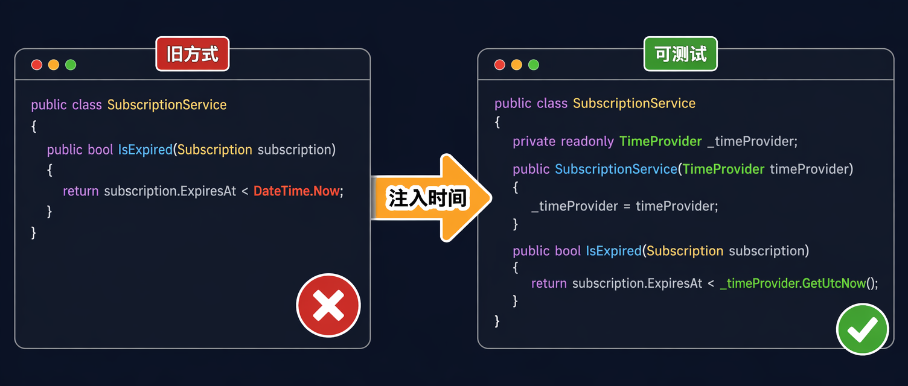
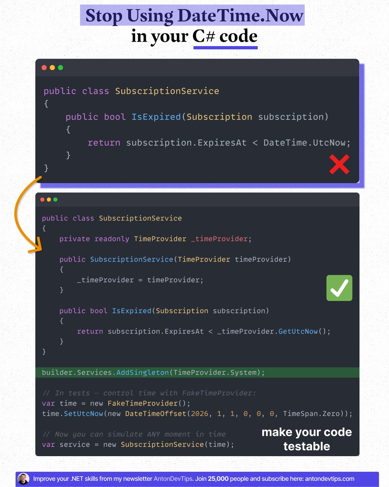

## DateTime.Now 的隐患

几乎每个 .NET 项目里都能找到类似这样的代码：

```csharp
public class SubscriptionService
{
    public bool IsExpired(Subscription subscription)
    {
        return subscription.ExpiresAt < DateTime.UtcNow;
    }
}
```

逻辑清晰，一目了然。但当你试图为这段代码写测试，想验证"订阅刚好在昨天到期"这个场景时，就会发现自己卡住了——`DateTime.UtcNow` 返回的永远是真实的当前时间，你没有办法把它拨到明天或者一年前。

这就是 `DateTime.Now` / `DateTime.UtcNow` 带来的根本问题：**它是一个隐式的全局状态**，藏在代码里，看起来无害，却悄悄破坏了可测试性和可靠性。

## 具体会有哪些麻烦

Anton Martyniuk（Microsoft MVP、.NET 软件架构师）在推文里列出了五个连锁问题：

- **测试时间相关逻辑变得困难**：无法在测试里控制"当前时间"
- **无法模拟边界场景**：比如"订阅在明天到期""免费试用刚好 30 天""折扣窗口在午夜关闭"
- **测试结果不稳定**：依赖服务器时钟的测试可能因时区或环境而随机失败
- **业务规则悄悄依赖服务器时钟**：换台机器或换个部署环境，行为可能就变了
- **不同环境间行为不一致**：本地跑通，CI/CD 上挂掉

他给了三个具体例子：想测试"订阅到期"时会发生什么？想测试"免费试用结束后"的行为？想验证"折扣窗口在午夜关闭"的逻辑？**这三类场景，在 `DateTime.Now` 直接散落代码里时，统统无法在测试中验证。**

## 解决思路：把时间当依赖注入

修复方式很简单：**不要在代码里直接调用 `DateTime.Now`，改成通过依赖注入传入一个时间提供者。**

.NET 里有两种做法：

### 方案一：自定义 IDateTimeProvider 接口

适合所有 .NET 版本，也适合旧项目改造：

```csharp
public interface IDateTimeProvider
{
    DateTimeOffset UtcNow { get; }
}

public class SystemDateTimeProvider : IDateTimeProvider
{
    public DateTimeOffset UtcNow => DateTimeOffset.UtcNow;
}
```

在 DI 容器里注册：

```csharp
builder.Services.AddSingleton<IDateTimeProvider, SystemDateTimeProvider>();
```

测试时用假实现替换：

```csharp
public class FakeDateTimeProvider : IDateTimeProvider
{
    public DateTimeOffset UtcNow { get; set; }
}
```

### 方案二：.NET 8 内置 TimeProvider（推荐）

.NET 8 开始，框架直接内置了抽象类 `TimeProvider`，省去了自己定义接口的步骤。在 DI 里注册一次：

```csharp
builder.Services.AddSingleton(TimeProvider.System);
```

然后在服务里注入并调用 `GetUtcNow()` 代替 `DateTime.UtcNow`：

```csharp
public class SubscriptionService
{
    private readonly TimeProvider _timeProvider;

    public SubscriptionService(TimeProvider timeProvider)
    {
        _timeProvider = timeProvider;
    }

    public bool IsExpired(Subscription subscription)
    {
        return subscription.ExpiresAt < _timeProvider.GetUtcNow();
    }
}
```

改动就一行：把 `DateTime.UtcNow` 换成 `_timeProvider.GetUtcNow()`。



## 在测试里控制时间

`TimeProvider` 内置了一个配套的测试实现 `FakeTimeProvider`，随框架发布，不需要自己写。先安装测试包：

```bash
dotnet add package Microsoft.Extensions.TimeProvider.Testing
```

然后在测试里把时间"定格"到任意时刻：

```csharp
var time = new FakeTimeProvider();
time.SetUtcNow(new DateTimeOffset(2026, 1, 1, 0, 0, 0, TimeSpan.Zero));

// Now you can simulate ANY moment in time
var service = new SubscriptionService(time);

// 把时间推进 31 天，模拟订阅到期
time.Advance(TimeSpan.FromDays(31));

Assert.True(service.IsExpired(subscription));
```

`FakeTimeProvider` 还支持 timer 和时区，基本覆盖了常见测试场景。

## 用哪种方案

Anton 的建议很直接：**新项目直接用 `TimeProvider`，旧项目用自定义 `IDateTimeProvider` 接口过渡。**

- 项目已经在 .NET 8+：`TimeProvider` 是更干净的选择，框架原生支持，测试工具现成
- 需要兼容旧版本，或团队更倾向于自己掌控接口：`IDateTimeProvider` 同样可行

两种方案的核心是一样的：**把时间变成可替换的依赖**，而不是让它作为全局状态藏在代码深处。

如果你的代码库里还有散落的 `DateTime.Now`，今天就是改掉它的好时机。

---

如果你关注 AI 助手、开发工具和软件工程实践，可以关注 Aide Hub。这里会持续分享能落地的工具教程、技术观察和项目经验。

## 参考

- [原文推文 by Anton Martyniuk](https://x.com/AntonMartyniuk/status/2055536005394907287)
- [TimeProvider Class - Microsoft Docs](https://learn.microsoft.com/en-us/dotnet/api/system.timeprovider)
- [Microsoft.Extensions.TimeProvider.Testing on NuGet](https://www.nuget.org/packages/Microsoft.Extensions.TimeProvider.Testing)
