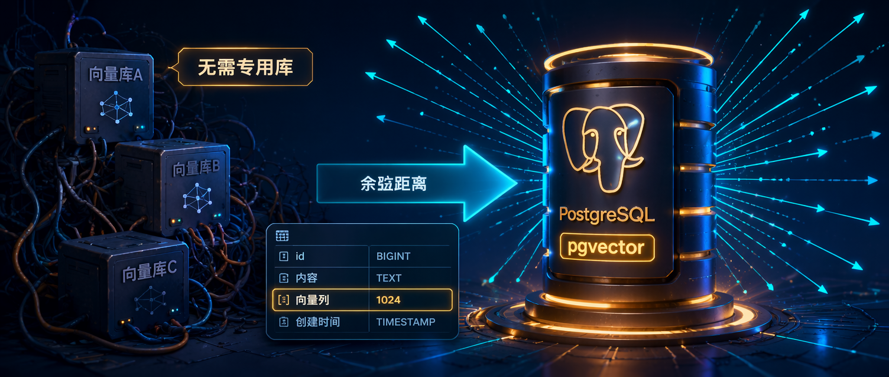

不是每个 AI 功能都需要专门的向量数据库。

Pinecone、Qdrant、Weaviate 这些专用向量库固然强大，但如果你的数据本来就住在 PostgreSQL 里，引入一个新的基础设施组件意味着额外的部署、同步和运维成本。

[pgvector](https://github.com/pgvector/pgvector) 是一个 PostgreSQL 扩展，把向量存储和相似性搜索直接带进你的现有数据库。启用扩展，加一列 `vector`，就可以开始查询了。

这篇文章走一遍完整流程：

- 向量搜索是什么，什么时候用它
- 用 .NET Aspire 启动带 pgvector 的 PostgreSQL 和 Ollama
- 用 Microsoft.Extensions.AI 生成 embedding，用 Dapper 存储
- 用余弦距离做语义相似性查询

## 向量搜索是什么

传统数据库查询靠精确匹配。你搜索 `"authentication"`，能找到包含这个词的行。但搜索 `"login"`、`"sign-in"`、`"identity verification"` 这些语义相近的词，`LIKE` 查询帮不上你。

向量搜索解决的是**语义相似**，而不是文本相似。

原理是这样的：把文本用机器学习模型转成一个浮点数数组，叫做 **embedding（嵌入向量）**。语义相近的文本会产生相近的向量。搜索时，把查询文本也转成向量，然后在数据库里找最近的向量。

常见用途：

- **语义搜索**：按含义找，不只按关键词
- **RAG（检索增强生成）**：给 LLM 提供相关上下文
- **推荐系统**：喜欢 X 的用户也喜欢 Y
- **去重**：找近似内容

关键判断：如果你已经在用 PostgreSQL，pgvector 能给你所有这些能力，不需要另一个数据库。

## 用 .NET Aspire 准备基础设施

用 [.NET Aspire](https://www.milanjovanovic.tech/blog/dotnet-aspire-a-game-changer-for-cloud-native-development) 在本地启动一个带 pgvector 的 PostgreSQL 容器，同时启动一个 [Ollama](https://www.milanjovanovic.tech/blog/how-to-extract-structured-data-from-images-using-ollama-in-dotnet) 实例来生成 embedding：

```csharp
var builder = DistributedApplication.CreateBuilder(args);

var ollama = builder.AddOllama("ollama")
    .WithLifetime(ContainerLifetime.Persistent)
    .WithDataVolume()
    .WithGPUSupport();

var embeddingModel = ollama.AddModel("qwen3-embedding:0.6b");

var postgres = builder.AddPostgres("postgres", port: 6432)
    .WithLifetime(ContainerLifetime.Persistent)
    .WithDataVolume()
    .WithImage("pgvector/pgvector", "pg17")
    .AddDatabase("articles");

builder.AddProject<Projects.PgVector_Articles>("pgvector-articles")
    .WithReference(embeddingModel)
    .WithReference(postgres)
    .WaitFor(embeddingModel)
    .WaitFor(postgres);

builder.Build().Run();
```

几个关键点：

- `pgvector/pgvector:pg17` 是预装了 pgvector 扩展的 PostgreSQL 17 镜像
- `WithLifetime(ContainerLifetime.Persistent)` 让容器在应用重启后继续保留数据
- `WaitFor` 确保数据库和模型都就绪后 API 才启动

不用 Aspire 也可以，直接用 `docker compose` 跑 `pgvector/pgvector:pg17`，然后指定连接字符串即可。

## 配置 API 项目

需要三个 NuGet 包：

```bash
dotnet add package Aspire.Npgsql
dotnet add package Pgvector.Dapper
dotnet add package CommunityToolkit.Aspire.OllamaSharp
```

`Pgvector.Dapper` 提供 Dapper 的 `Vector` 类型处理器。如果你用 EF Core 或原生 Npgsql，也有对应的库可选。

在 `Program.cs` 里注册服务：

```csharp
builder.AddOllamaApiClient("ollama-qwen3-embedding")
    .AddEmbeddingGenerator();

builder.AddNpgsqlDataSource("articles", configureDataSourceBuilder: b =>
{
    b.UseVector();
});

SqlMapper.AddTypeHandler(new VectorTypeHandler());
```

- `AddEmbeddingGenerator()` 注册一个 `IEmbeddingGenerator<string, Embedding<float>>`，使用 [Microsoft.Extensions.AI](https://www.milanjovanovic.tech/blog/working-with-llms-in-dotnet-using-microsoft-extensions-ai) 抽象
- `UseVector()` 让 Npgsql 识别 `vector` 类型
- `VectorTypeHandler` 让 Dapper 能序列化和反序列化 `Vector` 参数

## 初始化数据库

在使用向量之前，需要启用扩展并建表：

```csharp
app.MapPost("/init", async (NpgsqlDataSource dataSource) =>
{
    await using var conn = await dataSource.OpenConnectionAsync();

    await using var enableExt = new NpgsqlCommand(
        "CREATE EXTENSION IF NOT EXISTS vector", conn);
    await enableExt.ExecuteNonQueryAsync();

    conn.ReloadTypes();

    await conn.ExecuteAsync(
        """
        CREATE TABLE IF NOT EXISTS articles (
            id SERIAL PRIMARY KEY,
            url TEXT NOT NULL,
            title TEXT NOT NULL,
            embedding vector(1024) NOT NULL
        )
        """);

    await conn.ExecuteAsync(
        """
        CREATE INDEX IF NOT EXISTS articles_embedding_idx
        ON articles USING hnsw (embedding vector_cosine_ops)
        """);

    return Results.Ok("Database initialized.");
});
```

注意几点：

- `CREATE EXTENSION IF NOT EXISTS vector` 启用 pgvector
- `embedding vector(1024)` 定义 1024 维的向量列，与 `qwen3-embedding:0.6b` 模型输出维度匹配
- `conn.ReloadTypes()` 刷新 Npgsql 的类型缓存，让它认识新的 `vector` 类型
- **HNSW 索引**用 `vector_cosine_ops`，支持高效的近似最近邻搜索

[HNSW](https://en.wikipedia.org/wiki/Hierarchical_navigable_small_world)（Hierarchical Navigable Small World）是基于图的近似最近邻算法，通过多层结构加速相似性查找。数据量小时没有索引也能用，但随着数据增长，HNSW 能保持查询速度。

## 生成和存储 Embedding

给每条内容生成向量并存入数据库：

```csharp
app.MapPost("/embeddings/generate", async (
    BlogService blogService,
    IEmbeddingGenerator<string, Embedding<float>> embeddingGenerator,
    NpgsqlDataSource dataSource,
    ILogger<Program> logger) =>
{
    await using var conn = await dataSource.OpenConnectionAsync();
    conn.ReloadTypes();

    int count = 0;

    foreach (var articleUrl in File.ReadAllLines("sitemap_urls.txt"))
    {
        var (title, content) = await blogService.GetTitleAndContentAsync(articleUrl);

        var embedding = await embeddingGenerator.GenerateAsync(content);

        await conn.ExecuteAsync(
            "INSERT INTO articles (url, title, embedding) VALUES (@url, @title, @embedding)",
            new
            {
                url = articleUrl,
                title,
                embedding = new Vector(embedding.Vector.ToArray())
            });

        count++;
        logger.LogInformation("Processed ({Count}): {Url}", count, articleUrl);
    }

    return Results.Ok(new { processed = count });
});
```

`embeddingGenerator.GenerateAsync(content)` 把文本发给 Ollama 模型，返回一个向量。用 `Pgvector.Vector` 包装后，Dapper 自动处理剩下的事情。

`IEmbeddingGenerator` 是与提供商无关的抽象。如果以后想换成 OpenAI 或 Azure OpenAI，只改 `Program.cs` 里的注册，业务代码不用动。

## 相似性搜索

搜索时，把查询文本转成向量，然后找数据库中最近的向量：

```csharp
app.MapGet("/search", async (
    string query,
    IEmbeddingGenerator<string, Embedding<float>> embeddingGenerator,
    NpgsqlDataSource dataSource,
    int limit = 5) =>
{
    var searchEmbedding = await embeddingGenerator.GenerateAsync(query);

    await using var con = await dataSource.OpenConnectionAsync();
    con.ReloadTypes();

    var embedding = new Vector(searchEmbedding.Vector.ToArray());

    var results = await con.QueryAsync<SearchResult>(
        @"""
        SELECT title, url, embedding <=> @embedding as distance
        FROM articles
        ORDER BY embedding <=> @embedding
        LIMIT @limit
        """,
        new { embedding, limit });

    return Results.Ok(new { query, results });
});

record SearchResult(string Title, string Url, double Distance);
```

`<=>` 是 pgvector 的**余弦距离**操作符，值越小表示越相似。按距离升序排列，取前 N 条。

有一个关键约束：查询文本必须用**和存储 embedding 时相同的模型**来转换。不同模型产生的向量在不同的嵌入空间里，混用会得到没有意义的结果。

pgvector 支持三种距离操作符：

| 操作符 | 含义           | 索引类型            |
| ------ | -------------- | ------------------- |
| `<->`  | L2（欧氏）距离 | `vector_l2_ops`     |
| `<=>`  | 余弦距离       | `vector_cosine_ops` |
| `<#>`  | 内积（负值）   | `vector_ip_ops`     |

文本 embedding 场景下通常选余弦距离。

## 小结

不需要专用向量数据库也能做语义搜索。如果你已经在用 PostgreSQL，pgvector 能让你直接在现有数据库里存储和查询向量，不用增加新的基础设施。

本文覆盖的要点：

- **pgvector** 是 PostgreSQL 扩展，启用后得到原生的 `vector` 列类型
- **.NET Aspire** 用几行代码启动 pgvector-enabled PostgreSQL 和 Ollama
- **Embedding** 通过 `IEmbeddingGenerator` 生成，用 Dapper 存储
- **相似性搜索** 用 `<=>` 余弦距离操作符，返回最近匹配
- **HNSW 索引** 让向量查询在数据量增长时保持高效

向量数据就在关系数据旁边，联表、过滤、分页都可以直接用，不需要在两个数据库之间同步。

---

如果你关注 .NET 架构设计、软件工程实践和 AI 开发工具，可以关注 Aide Hub。这里会持续分享能落地的技术教程、工程经验和工具评测。

## 参考

- [Getting Started With PgVector in .NET for Simple Vector Search – Milan Jovanović](https://www.milanjovanovic.tech/blog/getting-started-with-pgvector-in-dotnet-for-simple-vector-search)
- [pgvector GitHub 仓库](https://github.com/pgvector/pgvector)
- [pgvector-dotnet：Dapper / Npgsql / EF Core 支持](https://github.com/pgvector/pgvector-dotnet)
- [What Is Vector Search? – Milan Jovanović](https://www.milanjovanovic.tech/blog/what-is-vector-search-a-concise-guide)
- [Working With LLMs in .NET Using Microsoft.Extensions.AI](https://www.milanjovanovic.tech/blog/working-with-llms-in-dotnet-using-microsoft-extensions-ai)
