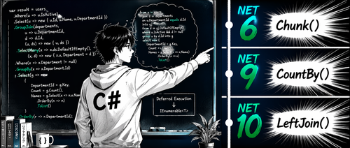

LINQ 从 .NET Framework 时代诞生，但它并没有停止演进。从 .NET 6 到 .NET 10，每个版本都补充了新方法，消灭掉一批过去只能手写循环或借助第三方库才能完成的模式。

这篇文章覆盖了 .NET 6 至 .NET 10 的全部 15 个新增方法，每个方法都附有 before/after 代码对比，让你看清楚它们具体能替换掉什么。

## 快速索引

| 方法 | 引入版本 | 功能说明 |
|---|---|---|
| `Chunk(size)` | 6 | 按固定大小分批，返回 `T[]` 数组的序列 |
| `DistinctBy(keySelector)` | 6 | 按投影键去重 |
| `MinBy(keySelector)` | 6 | 返回投影键最小的**元素** |
| `MaxBy(keySelector)` | 6 | 返回投影键最大的**元素** |
| `ExceptBy(other, keySelector)` | 6 | 按键做集合差运算 |
| `IntersectBy(other, keySelector)` | 6 | 按键做集合交运算 |
| `UnionBy(other, keySelector)` | 6 | 按键做集合并运算 |
| `TryGetNonEnumeratedCount(out count)` | 6 | 在不遍历序列的情况下获取数量 |
| `Order()` | 7 | 对可比较类型直接排序，不需要 key selector |
| `OrderDescending()` | 7 | 对可比较类型降序排序 |
| `CountBy(keySelector)` | 9 | 单次遍历按键统计数量 |
| `AggregateBy(keySelector, seedSelector, accumulator)` | 9 | 单次遍历按键聚合 |
| `Index()` | 9 | 带零基索引枚举，返回 `(int Index, T Item)` |
| `LeftJoin(...)` | 10 | 左外连接 |
| `RightJoin(...)` | 10 | 右外连接 |

---

## .NET 6：最大的一批新增

.NET 6 一次性加入了 8 个方法，覆盖了批处理、按键去重、元素检索和集合操作几大类。

### Chunk — 分批处理不再手写循环

`Chunk(size)` 把序列切成最多 `size` 个元素的 `T[]` 数组。如果序列长度不能整除，最后一个批次会短一些。

```csharp
// .NET 6 之前 — 手写批量生成器
public static IEnumerable<List<T>> InBatches<T>(IEnumerable<T> source, int size)
{
    var batch = new List<T>(size);
    foreach (var item in source)
    {
        batch.Add(item);
        if (batch.Count == size)
        {
            yield return batch;
            batch = new List<T>(size);
        }
    }
    if (batch.Count > 0) { yield return batch; }
}
```

```csharp
// .NET 6 — Chunk()
foreach (var batch in subscribers.Chunk(100))
{
    await email.SendBulkAsync(batch, ct);
}
```

`Chunk` 返回 `IEnumerable<T[]>`，每个数组在 yield 时才物化，源序列只会被遍历一次。

### DistinctBy — 按投影键去重

按投影出的键保留第一个出现的元素，不需要实现 `IEqualityComparer<T>`：

```csharp
// .NET 6 之前 — 手动维护 HashSet
var seen = new HashSet<string>(StringComparer.OrdinalIgnoreCase);
foreach (var p in products)
{
    if (seen.Add(p.Category)) yield return p;
}
```

```csharp
// .NET 6 — DistinctBy()
products.DistinctBy(p => p.Category)
```

内部用 `HashSet<TKey>` 驱动，支持传入可选的 `IEqualityComparer<TKey>`。

### MinBy / MaxBy — 拿的是元素，不是值

`Min()` / `Max()` 返回的是标量值，`MinBy` / `MaxBy` 返回的是投影键最小/最大的**那个元素**——这才是通常真正需要的。

```csharp
// .NET 6 之前 — 聚合循环找元素
Product? cheapest = null;
foreach (var p in products)
{
    if (cheapest is null || p.Price < cheapest.Price)
        cheapest = p;
}
```

```csharp
// .NET 6 — MinBy() / MaxBy()
var cheapest = products.MinBy(p => p.Price);
var mostExpensive = products.MaxBy(p => p.Price);
var earliestOrder = orders.MinBy(o => o.PlacedAt);
```

两个方法在序列为空时返回 `null`，和其他 `OrDefault` 语义保持一致。

### ExceptBy / IntersectBy / UnionBy — 按键做集合运算

这三个是 `Except` / `Intersect` / `Union` 的键投影变体。过去要写整个 `IEqualityComparer<T>` 实现，现在提供一个 key selector 就够了：

```csharp
// .NET 6 之前 — 需要完整的 IEqualityComparer<Product> 实现
public sealed class ProductBySkuComparer : IEqualityComparer<Product>
{
    public bool Equals(Product? x, Product? y) => x?.Sku == y?.Sku;
    public int GetHashCode(Product obj) => obj.Sku.GetHashCode();
}
```

```csharp
// .NET 6 — ExceptBy / IntersectBy / UnionBy
// 排除已下架产品（按 SKU 匹配）
allProducts.ExceptBy(discontinuedProducts.Select(p => p.Sku), p => p.Sku)

// 找出两个目录都有的产品
ours.IntersectBy(partnerCatalog.Select(p => p.Sku), p => p.Sku)

// 合并两个目录，每个 SKU 只保留一个（先出现的优先）
primary.UnionBy(secondary, p => p.Sku)
```

注意签名区别：`ExceptBy` 和 `IntersectBy` 的第二个参数是 `IEnumerable<TKey>`，而 `UnionBy` 接受 `IEnumerable<T>`。

### TryGetNonEnumeratedCount — 不遍历就能知道数量

当底层集合支持 O(1) 计数时，返回 `true` 并通过 `out` 参数给出数量；否则不碰序列直接返回 `false`：

```csharp
public static List<T> SmartToList<T>(IEnumerable<T> source)
{
    // 能拿到数量就预分配，省掉 List<T> 扩容
    var list = source.TryGetNonEnumeratedCount(out int count)
        ? new List<T>(count)
        : [];
    list.AddRange(source);
    return list;
}
```

在分页查询场景里特别有用：对 `List<T>` 结果调用这个方法可以避免再做一次完整遍历来计数。

---

## .NET 7：两个排序快捷方式

.NET 7 增加了两个专注于简化排序的方法，解决掉冗余的恒等 key selector 写法。

### Order / OrderDescending — 去掉多余的 `x => x`

对实现了 `IComparable<T>` 的序列排序，之前必须写 `.OrderBy(x => x)`，这个恒等 selector 完全是噪音：

```csharp
// .NET 7 之前
var sortedPrices = prices.OrderBy(p => p).ToList();
var sortedTagsDesc = tags.OrderByDescending(t => t).ToList();
```

```csharp
// .NET 7 — Order() / OrderDescending()
var sortedPrices = prices.Order().ToList();
var sortedTagsDesc = tags.OrderDescending().ToList();

// 支持继续链式调用 ThenBy
var topNIds = ids.Order().Take(n);
```

适用类型：`int`、`string`、`DateTimeOffset`、`Guid`，以及任何实现了 `IComparable<T>` 的自定义 struct。对复杂对象（比如 `Product`）仍然需要 `OrderBy(p => p.Name)` 这类带 key selector 的版本。

---

## .NET 9：聚合操作的大跃升

.NET 9 一次加入了三个方法，把按键聚合的代码量压缩到极致。

### CountBy — 一次遍历按键统计

`CountBy` 是"每种 X 各有多少个"这个经典模式的专用简写，返回 `IEnumerable<KeyValuePair<TKey, int>>`：

```csharp
// .NET 9 之前 — GroupBy 再投影
return orders
    .GroupBy(o => o.Status)
    .ToDictionary(g => g.Key, g => g.Count());
```

```csharp
// .NET 9 — CountBy()
IEnumerable<KeyValuePair<string, int>> counts = orders.CountBy(o => o.Status);

// 可以直接解构 KeyValuePair
foreach (var (status, count) in orders.CountBy(o => o.Status))
    Console.WriteLine($"{status}: {count}");
```

`CountBy` 的单次遍历实现避免了为每个 key 创建中间的 `IGrouping<TKey, T>` 对象，在大序列上 GC 压力更小。

### AggregateBy — 单次遍历按键聚合

`AggregateBy` 把 `GroupBy` + `Aggregate` 合并成一次遍历。你提供 key selector、seed 工厂函数和累加器，返回 `IEnumerable<KeyValuePair<TKey, TAccumulate>>`：

```csharp
// .NET 9 之前 — GroupBy + ToDictionary
return sales
    .GroupBy(s => s.Region)
    .ToDictionary(g => g.Key, g => g.Sum(s => s.Amount));
```

```csharp
// .NET 9 — AggregateBy()
// 按地区汇总销售额
return sales.AggregateBy(
    keySelector: s => s.Region,
    seedSelector: _ => 0m,
    accumulator: (total, sale) => total + sale.Amount);

// seed 工厂可以接收 key，GroupBy 做不到这一点
return sales.AggregateBy(
    keySelector: s => s.SalespersonId,
    seedSelector: id => new SalesSummary(0m, 0, 0m),
    accumulator: (summary, sale) => summary with
    {
        TotalAmount = summary.TotalAmount + sale.Amount,
        OrderCount = summary.OrderCount + 1,
        LargestSale = Math.Max(summary.LargestSale, sale.Amount)
    });
```

关键区别：seed 是**工厂函数**（`Func<TKey, TAccumulate>`），不是固定值。这让初始累加器可以依赖 key 本身，这是 `GroupBy` 直接支持不了的。

### Index — 带位置信息枚举

`Index()` 把每个元素包装成带零基位置的元组，返回 `IEnumerable<(int Index, T Item)>`，替换掉可读性稍差的 `Select((item, i) => ...)` 重载：

```csharp
// .NET 9 之前 — 带索引参数的 Select 重载
products
    .OrderByDescending(p => p.SalesCount)
    .Select((p, i) => $"#{i + 1} {p.Name}")
```

```csharp
// .NET 9 — Index()
products
    .OrderByDescending(p => p.SalesCount)
    .Index()
    .Select(entry => $"#{entry.Index + 1} {entry.Item.Name}")

// 可组合：先附加索引，再按位置过滤
products
    .OrderByDescending(p => p.SalesCount)
    .Index()
    .Where(entry => entry.Index < 3)  // 只要前 3 名
    .Select(entry => entry.Item)
```

在 `foreach` 里解构也很自然：`foreach (var (i, product) in products.Index())`。

---

## .NET 10：外连接正式入库

在 .NET 10 之前，做左外连接要写 `GroupJoin` + `SelectMany` + `DefaultIfEmpty` 三步。这两个方法把这个常见模式压缩成一行。

### LeftJoin

每个外部（左侧）元素都出现在结果中，如果没有匹配的内部元素，则内部元素为 `null`：

```csharp
// .NET 10 — 替代 GroupJoin + SelectMany + DefaultIfEmpty
var result = customers.LeftJoin(
    orders,
    c => c.Id,
    o => o.CustomerId,
    (c, o) => new { c.Name, OrderId = o?.Id });
```

### RightJoin

每个内部（右侧）元素都出现在结果中，对应 `LeftJoin` 的镜像操作：

```csharp
// .NET 10 — 所有订单都保留，客户为空时用默认值
var result = customers.RightJoin(
    orders,
    c => c.Id,
    o => o.CustomerId,
    (c, o) => new { CustomerName = c?.Name ?? "(unassigned)", o.Id });
```

两个方法都针对 `IEnumerable<T>`（LINQ to Objects）。EF Core 10 同步提供了 `IQueryable<T>` 的 SQL 转译支持，可以在数据库查询中直接使用，不再需要 `GroupJoin` 变通写法。

---

## 项目文件配置

所有这些 API 都在 `System.Linq` 命名空间，不需要额外安装 NuGet 包，只需要设置对应的目标框架：

```xml
<!-- .NET 9 — CountBy, AggregateBy, Index -->
<TargetFramework>net9.0</TargetFramework>

<!-- .NET 10 — LeftJoin, RightJoin -->
<TargetFramework>net10.0</TargetFramework>
```

| 方法组 | 最低 TargetFramework |
|---|---|
| Chunk, DistinctBy, MinBy, MaxBy, ExceptBy, IntersectBy, UnionBy, TryGetNonEnumeratedCount | `net6.0` |
| Order, OrderDescending | `net7.0` |
| CountBy, AggregateBy, Index | `net9.0` |
| LeftJoin, RightJoin | `net10.0` |

如果要做多目标库，用 `#if NET6_0_OR_GREATER` / `#if NET9_0_OR_GREATER` 条件编译，并为旧目标提供回退实现。

---

## 几个常见问题

**`MinBy()` 和 `Min()` 的区别是什么？**

`Min()` 返回最小**值**（比如集合里最小的 `decimal` 价格），`MinBy(keySelector)` 返回投影键最小的那个**元素**（比如价格最低的 `Product` 对象）。当你需要的是对象而不是标量时，`MinBy` 是正确选择。

**`CountBy()` 比 `GroupBy().ToDictionary()` 更高效吗？**

是的。`CountBy(key)` 功能等价于 `GroupBy(key).Select(g => KV(g.Key, g.Count()))`，但它不会为每个 key 分配中间的 `IGrouping<TKey, T>` 对象。大序列多 group 的场景下 GC 压力明显更低。

**`Index()` 完全替代了 `Select((item, i) => ...)` 吗？**

基本上是。`Index()` 通过专用的可组合算子产生 `(int Index, T Item)` 元组，意图更明确，与后续 LINQ 算子组合时更容易推理。带 `(element, index)` 参数的 `Select` 重载仍然可以用，两种方式结果一致。

**`LeftJoin` / `RightJoin` 能被 EF Core 翻译成 SQL 吗？**

EF Core 10 已经加入了 `IQueryable<T>` 的翻译支持。在此之前对数据库查询需要继续用 `GroupJoin` + `SelectMany` + `DefaultIfEmpty` 方式。

**`Order()` 能用在复杂领域对象上吗？**

不能。`Order()` 只在 `T` 本身实现了 `IComparable<T>` 时有效，比如 `int`、`string`、`DateTimeOffset`、`Guid`，或者自定义实现了 `IComparable<T>` 的 struct。对 `Product` 这类复杂类型仍然需要 `OrderBy(p => p.Name)` 这样的带 key selector 写法。

---

## 参考

- [原文：New LINQ Methods in .NET 6-10](https://www.devleader.ca/2026/05/17/new-linq-methods-in-net-610-chunk-minby-countby-index-leftjoin-and-more)
