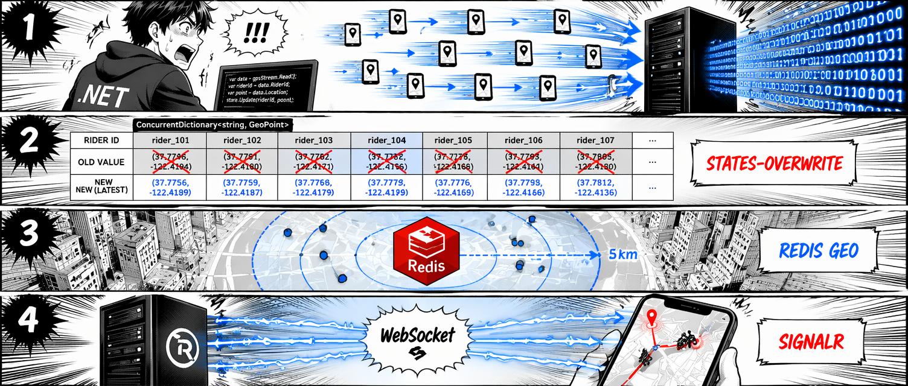
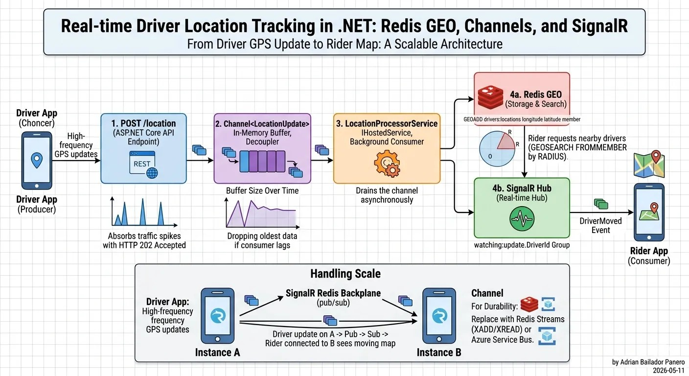

Uber 每四秒从每一位在线司机那里收到一次 GPS 坐标。高峰时段，活跃司机数量超过 500 万，换算下来是每分钟约 125 万次写入——还没算那些盯着地图等司机上门的乘客产生的读请求。

位置追踪管道是整个打车平台的心跳。它一旦变慢，司机和乘客的状态就开始错位；它一旦宕机，App 实际上就废了。

在 .NET 里实现这样一套管道，核心问题只有一个：**什么时候不应该用数据库**。GPS 更新高频、短命、天然地理化——关系型数据库扛不住这个写入压力，你需要 Redis。

这是"用 .NET 设计 Uber 同款系统"系列的第一篇，专注于位置追踪管道的实现。

## 把规模先量化

动手之前，先把数字落实：

- **500 万活跃司机**，每人每 4 秒发一次 GPS 更新
- **约 125 万次/分钟写入**打到 Redis 层
- **乘客看到的司机位置更新**延迟要控制在 1 秒以内，才有"实时"的感觉
- **司机匹配**——乘客叫车时，系统要在毫秒内找到附近可用的司机

最直觉的实现是把每次更新写进 SQL 表。两分钟之后，这张表就有 1.5 亿行，写入队列已经堆到地平线外了。这不是你想在凌晨十一点调试的瓶颈。

下面这套架构可以避开这个问题：



## 第一步：位置更新模型

数据结构保持简单。一次位置更新就是一条薄消息：

```csharp
public record LocationUpdate(
    string DriverId,
    double Latitude,
    double Longitude,
    DateTimeOffset Timestamp);
```

司机每 4 秒发一次这个 payload。这里不存历史——那是分析系统的活。这里只存**当前位置**。

## 第二步：状态缓冲，而不是队列

第一反应往往是用队列——`Channel<T>`、消息总线，什么能缓冲更新就用什么。这个直觉对这个场景是错的。

队列隐含着"每条消息都重要"的语义。位置追踪只关心**每位司机的最新位置**。如果处理器忙着的时候一位司机发了 10 次更新，其中 9 次是噪音——你只需要最新那一条。队列会把 10 条全部保留并按顺序处理；等到处理第 10 条时，你处理的已经是历史，不是当下。

正确的模型是每位司机的可变状态。用 `ConcurrentDictionary<string, LocationUpdate>`，每次写入直接覆盖前一个值：

```csharp
public class LocationStateBuffer
{
    private readonly ConcurrentDictionary<string, LocationUpdate> _latest = new();
    private readonly ConcurrentDictionary<string, byte> _dirty = new();

    public void Update(LocationUpdate update)
    {
        _latest[update.DriverId] = update;
        _dirty[update.DriverId] = 0;
    }

    public IReadOnlyList<LocationUpdate> TakeSnapshot()
    {
        var snapshot = new List<LocationUpdate>();
        foreach (var driverId in _dirty.Keys.ToArray())
        {
            if (_dirty.TryRemove(driverId, out _) && _latest.TryGetValue(driverId, out var update))
                snapshot.Add(update);
        }
        return snapshot;
    }
}
```

`_dirty` 集合追踪自上次刷新以来发送过更新的司机。`TakeSnapshot` 只返回这些司机——如果一位司机没移动，就没有东西需要写到 Redis。这意味着刷新开销正比于活跃度，而不是总司机数。

接收 HTTP 请求的端点写入是 O(1)，无论后台处理器在做什么都不会阻塞：

```csharp
app.MapPost("/drivers/{driverId}/location", (
    string driverId,
    LocationUpdateRequest request,
    LocationStateBuffer buffer) =>
{
    buffer.Update(new LocationUpdate(driverId, request.Latitude, request.Longitude, DateTimeOffset.UtcNow));
    return Results.Accepted();
});
```

不会溢出，不会让旧更新阻塞新更新。天然限速内置其中——如果一位司机在两次刷新之间发了 10 条更新，只产生 1 次 Redis 写入。

## 第三步：Redis GEO

Redis 内置基于有序集合的地理空间数据类型。核心命令：

- `GEOADD key longitude latitude member` — 存储或更新一个位置
- `GEOSEARCH key FROMMEMBER member BYRADIUS radius unit` — 找到半径内所有成员
- `GEOPOS key member` — 获取成员的当前位置

用 StackExchange.Redis 封装：

```csharp
public class RedisLocationStore
{
    private readonly IDatabase _db;
    private const string DriversKey = "drivers:locations";

    public RedisLocationStore(IConnectionMultiplexer redis)
    {
        _db = redis.GetDatabase();
    }

    public async Task UpdateAsync(LocationUpdate update)
    {
        await _db.GeoAddAsync(DriversKey, new GeoEntry(
            longitude: update.Longitude,
            latitude: update.Latitude,
            member: update.DriverId));
    }

    public async Task<IEnumerable<NearbyDriver>> FindNearbyAsync(
        double latitude,
        double longitude,
        double radiusKm)
    {
        var results = await _db.GeoSearchAsync(
            DriversKey,
            longitude, latitude,
            new GeoSearchCircle(radiusKm, GeoUnit.Kilometers),
            options: GeoRadiusOptions.WithDistance | GeoRadiusOptions.WithCoordinates);

        return results.Select(r => new NearbyDriver(
            DriverId: r.Member.ToString(),
            DistanceKm: r.Distance ?? 0,
            Latitude: r.Position?.Latitude ?? 0,
            Longitude: r.Position?.Longitude ?? 0));
    }
}

public record NearbyDriver(string DriverId, double DistanceKm, double Latitude, double Longitude);
```

`GEOSEARCH` 返回按距离排序的结果，速度快到可以在每次乘客请求时都实时查询——时间复杂度是 O(N+log(M))，其中 N 是结果集大小，不是总司机数。

值得注意的一点：Redis GEO 把位置存成压缩浮点数，精度损失约 0.6mm。导航场景完全可以接受。真正重要的是，即使存储了数百万个位置，`GEOSEARCH` 找 5km 内最近的 10 位司机也能在 1 毫秒以内完成。

## 第四步：后台处理器

`BackgroundService` 每 500ms 用 `PeriodicTimer` 把状态缓冲刷新到 Redis：

```csharp
public class LocationProcessorService : BackgroundService
{
    private readonly LocationStateBuffer _buffer;
    private readonly ILocationStore _store;
    private readonly IHubContext<DriverLocationHub> _hub;
    private readonly ILogger<LocationProcessorService> _logger;
    private static readonly TimeSpan FlushInterval = TimeSpan.FromMilliseconds(500);

    protected override async Task ExecuteAsync(CancellationToken stoppingToken)
    {
        using var timer = new PeriodicTimer(FlushInterval);
        while (await timer.WaitForNextTickAsync(stoppingToken))
        {
            var updates = _buffer.TakeSnapshot();
            if (updates.Count == 0) continue;

            foreach (var update in updates)
            {
                try
                {
                    await _store.UpdateAsync(update);
                    await _hub.Clients
                        .Group($"watching:{update.DriverId}")
                        .SendAsync("DriverMoved", new
                        {
                            update.DriverId,
                            update.Latitude,
                            update.Longitude,
                            update.Timestamp
                        }, stoppingToken);
                }
                catch (Exception ex)
                {
                    _logger.LogError(ex, "Failed flushing location for driver {DriverId}", update.DriverId);
                }
            }
        }
    }
}
```

`PeriodicTimer` 是 .NET 6+ 在托管服务里做周期性工作的标准写法——它不会漂移（每次 tick 从上一次 tick 的开始时间算，而不是结束时间），取消也是自动处理的。

每次刷新只涉及自上次 tick 以来发送过更新的司机。如果没有司机移动，`TakeSnapshot` 返回空列表，循环立即跳过。Redis 写入和 SignalR 推送是独立的——推送失败不会阻塞 Redis 更新，乘客端漏掉单次 UI 通知在视觉上完全感知不到。

## 第五步：SignalR Hub

乘客在跟踪行程时打开 WebSocket 连接，加入以司机命名的 SignalR 分组：

```csharp
public class DriverLocationHub : Hub
{
    public async Task WatchDriver(string driverId)
    {
        // 先退出之前的分组
        var previousDriver = Context.Items["watchingDriver"] as string;
        if (previousDriver is not null)
            await Groups.RemoveFromGroupAsync(Context.ConnectionId, $"watching:{previousDriver}");

        await Groups.AddToGroupAsync(Context.ConnectionId, $"watching:{driverId}");
        Context.Items["watchingDriver"] = driverId;
    }

    public async Task StopWatching()
    {
        var driverId = Context.Items["watchingDriver"] as string;
        if (driverId is not null)
            await Groups.RemoveFromGroupAsync(Context.ConnectionId, $"watching:{driverId}");
    }
}
```

客户端（精简版 TypeScript）：

```typescript
const connection = new signalR.HubConnectionBuilder()
    .withUrl("/hubs/driver-location")
    .withAutomaticReconnect()
    .build();

connection.on("DriverMoved", (data) => {
    updateDriverMarker(data.driverId, data.latitude, data.longitude);
});

await connection.start();
await connection.invoke("WatchDriver", driverId);
```

`withAutomaticReconnect()` 是关键：移动网络随时会断。没有它，一次短暂断网就会让乘客面对一张冻结的地图，而且没有任何提示说明出了什么问题。

## 第六步：把所有部分串起来

```csharp
var builder = WebApplication.CreateBuilder(args);

// Redis
var redis = await ConnectionMultiplexer.ConnectAsync(builder.Configuration["Redis:ConnectionString"]!);
builder.Services.AddSingleton<IConnectionMultiplexer>(redis);
builder.Services.AddSingleton<ILocationStore, RedisLocationStore>();

// 位置状态缓冲——每位司机的可变内存状态，周期性刷新
builder.Services.AddSingleton<LocationStateBuffer>();

// SignalR——水平扩展时加 .AddStackExchangeRedis(...)
builder.Services.AddSignalR();

// 后台处理器
builder.Services.AddHostedService<LocationProcessorService>();

var app = builder.Build();

app.MapPost("/drivers/{driverId}/location", (
    string driverId,
    LocationUpdateRequest request,
    LocationStateBuffer buffer) =>
{
    buffer.Update(new LocationUpdate(driverId, request.Latitude, request.Longitude, DateTimeOffset.UtcNow));
    return Results.Accepted();
});

app.MapHub<DriverLocationHub>("/hubs/driver-location");

app.MapGet("/drivers/nearby", async (
    double lat, double lon, double radius,
    ILocationStore store) =>
{
    var drivers = await store.FindNearbyAsync(lat, lon, radius);
    return Results.Ok(drivers);
});

app.Run();
```

## 水平扩展时的两处变化

上面这套单实例版本能撑住几千个并发司机。需要横向扩展时，有两件事要改：

**SignalR 背板（Backplane）**。SignalR 默认只把消息推到同一个服务器实例上的连接。多实例部署时，司机更新到达实例 A，乘客却连接着实例 B，地图就会卡住。解决方案是加一行 Redis 背板：

```csharp
builder.Services.AddSignalR()
    .AddStackExchangeRedis(builder.Configuration["Redis:ConnectionString"]!);
```

一行代码，SignalR 就开始用 Redis pub/sub 把消息扇出到所有实例。

**状态缓冲是单实例的**。`LocationStateBuffer` 在内存中，实例重启不保留，也不跨实例共享。对这个场景来说没问题：司机每 4 秒重发一次位置，重启后几秒缓冲就重新填满，用户感知不到任何影响。

## Uber 真实架构做了什么

Uber 的真实架构更复杂——他们用自研的地理空间分片系统 H3（六边形分层地理空间索引），按城市和区域对司机更新做分区，通过流式管道（Apache Kafka → Flink）处理位置数据。调度系统是独立服务，有自己的匹配算法。

我们构建的这套抓住了本质形态：不阻塞持久化的快速写入路径，毫秒级回答"附近有谁"的 Redis 地理索引，以及保持乘客地图实时更新的 WebSocket 通道。

两者的差距在规模和运维复杂度，不在架构方向。基础构件是一样的。

## 5 个常见错误

### 错误一：把位置直接写入 SQL

```csharp
// ❌ 每次 GPS 更新都打到数据库
await _dbContext.DriverLocations.AddAsync(new DriverLocation
{
    DriverId = update.DriverId,
    Latitude = update.Latitude,
    Longitude = update.Longitude,
    Timestamp = update.Timestamp
});
await _dbContext.SaveChangesAsync();
```

开发环境跑得飞快，生产环境直接崩。位置是短暂数据——你只需要当前位置，不需要每一条历史。如果要历史供分析，用时序存储或追加流异步写，不要嵌在请求路径里。

### 错误二：在 HTTP 线程上阻塞等待 Redis

```csharp
// ❌ 每次司机请求都阻塞到 Redis 确认写入
await _redis.GeoAddAsync(DriversKey, new GeoEntry(lon, lat, driverId));
return Results.Ok();
```

Redis 很快，但把网络 I/O 加到每次司机请求里会序列化你的吞吐量。状态缓冲把 HTTP 响应时间和 Redis 写入时间解耦——司机在微秒级拿到 `202`，Redis 在下一次刷新 tick 时跟上。

### 错误三：用队列处理本质是可变状态的问题

```csharp
// ❌ Channel 把每条更新都排队——处理器会处理已过时的位置
Channel.CreateBounded<LocationUpdate>(new BoundedChannelOptions(10_000)
{
    FullMode = BoundedChannelFullMode.DropOldest
});
```

带 `DropOldest` 的有界队列在高负载下随机丢弃，而且会处理等消费者到达时早已过时的中间位置。位置追踪是状态问题，不是消息传递问题。建模成状态。

### 错误四：按行程 ID 而不是司机 ID 命名 SignalR 分组

```csharp
// ❌ 用行程 ID 命名分组
await Groups.AddToGroupAsync(connectionId, $"trip:{tripId}");
```

行程 ID 在重试和重新分配时会变。司机 ID 不变。用司机 ID 命名分组，让乘客在分配发生变化时加入/退出。

### 错误五：多实例部署忘了加 SignalR 背板

```csharp
// ❌ 多实例，没有背板
// 司机更新到达实例 A，乘客连接在实例 B
// → 乘客地图冻结
builder.Services.AddSignalR(); // 缺少 .AddStackExchangeRedis(...)
```

这是 SignalR 生产部署最常见的 Bug。单实例开发环境完全正常，扩展到两个实例时静默失效。

## 总结

位置追踪管道是一个把抽象与问题匹配好的案例。GPS 更新高频、短命、地理化——所以我们把它建模为可变状态（而不是队列），用 Redis GEO 而不是关系型表做索引，用 SignalR 而不是轮询做实时推送。

这里没有用到什么重量级框架，也不需要分布式系统博士学位。就是一个 `ConcurrentDictionary`、一个 Redis 有序集合、一个 WebSocket 分组——标准 .NET 原语，组合起来解决了一个真实的规模难题。

下一篇文章会构建行程状态机：一次打车从 `Requested` 到 `Completed` 的完整生命周期、如何处理并发状态转换，以及如何用 EF Core 持久化这套生命周期。

## 参考

- [原文：Real-time Driver Location Tracking in .NET: Redis GEO, State Buffer and SignalR](https://adrianbailador.github.io/blog/58-realtime-driver-location-dotnet)
- [完整源码：github.com/AdrianBailador/realtime-driver-location-dotnet](https://github.com/AdrianBailador/realtime-driver-location-dotnet)
- [StackExchange.Redis 文档](https://stackexchange.github.io/StackExchange.Redis/)
- [ASP.NET Core SignalR 官方文档](https://learn.microsoft.com/en-us/aspnet/core/signalr/introduction)
