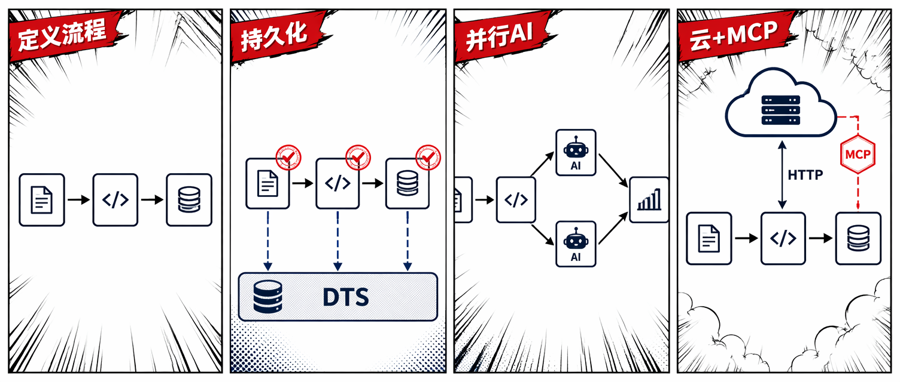
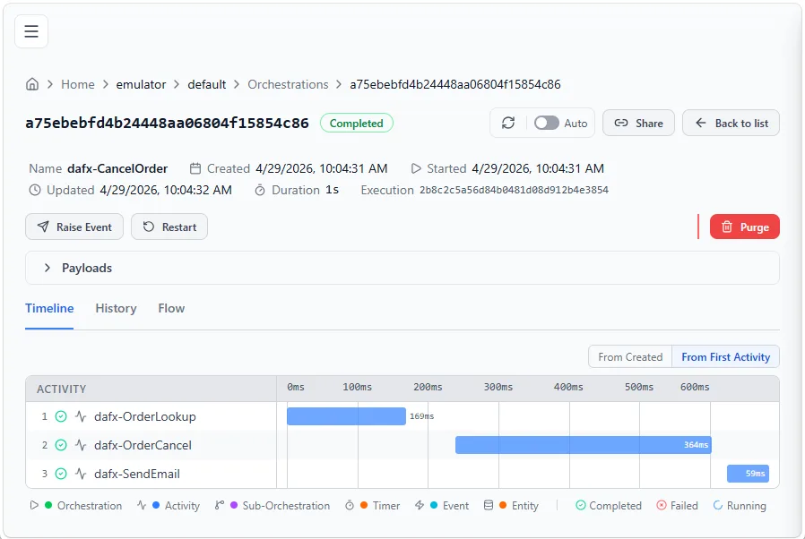
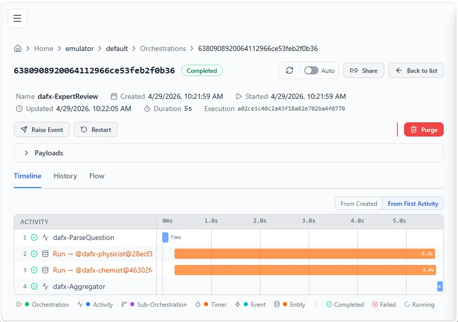
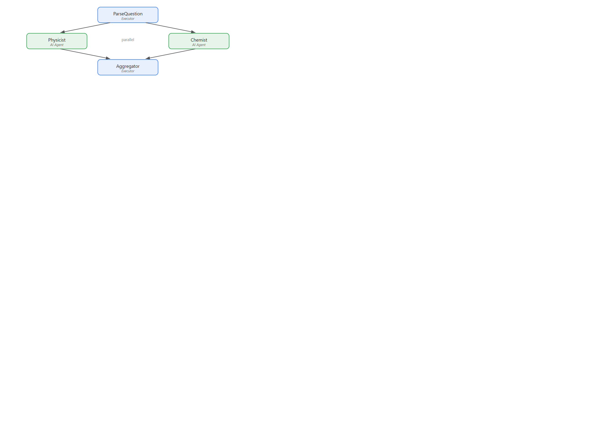
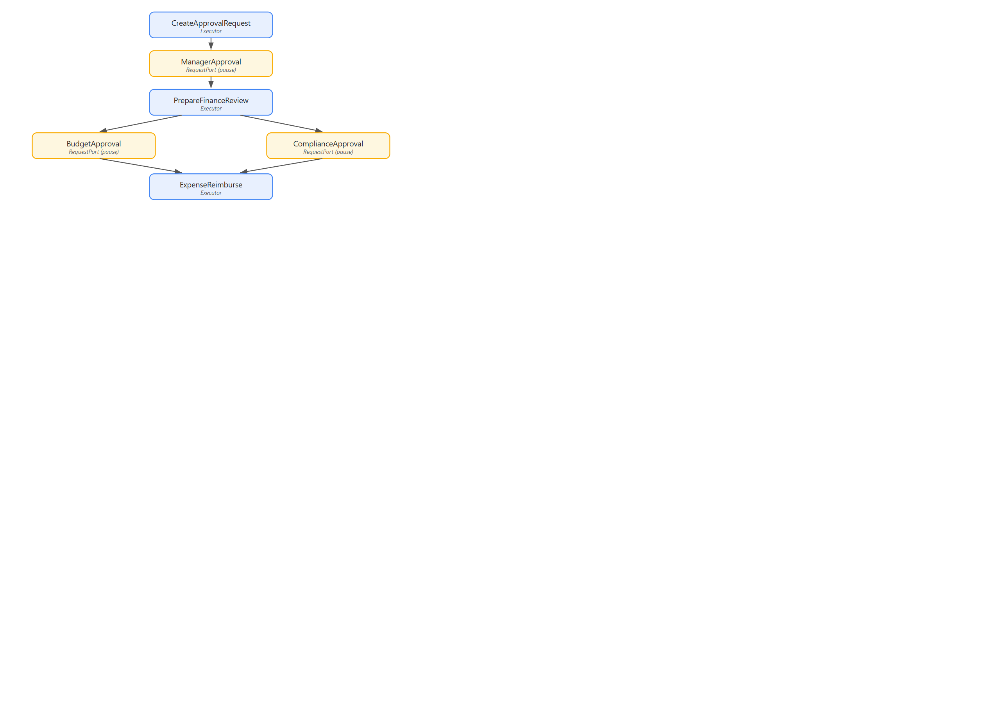

[Microsoft Agent Framework（MAF）](https://github.com/microsoft/agent-framework) 是微软开源的多语言 AI Agent 构建框架。自 Preview 发布以来，它增加了一套**工作流编程模型**：你把若干"执行单元"（Executor）用有向图连接起来，框架负责数据流转、错误传播和执行调度。

这篇文章跟着官方博客的节奏，从一个 .NET 控制台应用开始，依次演示如何让同一份工作流定义获得持久化能力、并行 AI Agent 执行和 Azure Functions 云托管——每一步的 Executor 代码都不需要改动。

## 工作流的两个核心概念

### Executor：最小工作单元

`Executor<TInput, TOutput>` 是工作流的原子步骤。它接收上游传来的 `TInput`，处理后输出 `TOutput` 交给下游。泛型类型参数在编译期就能约束上下游之间的数据契约。

```csharp
internal sealed class OrderLookup()
    : Executor<OrderCancelRequest, Order>("OrderLookup")
{
    public override async ValueTask<Order> HandleAsync(
        OrderCancelRequest message,
        IWorkflowContext context,
        CancellationToken cancellationToken = default)
    {
        await Task.Delay(TimeSpan.FromMilliseconds(100), cancellationToken);
        return new Order(
            Id: message.OrderId,
            OrderDate: DateTime.UtcNow.AddDays(-1),
            IsCancelled: false,
            CancelReason: message.Reason,
            Customer: new Customer(Name: "Jerry", Email: "jerry@example.com"));
    }
}
```

### WorkflowBuilder：连边成图

`WorkflowBuilder` 把多个 Executor 连成有向图。**框架在编译期就验证**：每条边的上游输出类型必须和下游输入类型匹配。

```csharp
OrderLookup orderLookup = new();
OrderCancel orderCancel = new();
SendEmail sendEmail = new();

// OrderLookup ──► OrderCancel ──► SendEmail
Workflow cancelOrder = new WorkflowBuilder(orderLookup)
    .WithName("CancelOrder")
    .WithDescription("Cancel an order and notify the customer")
    .AddEdge(orderLookup, orderCancel)
    .AddEdge(orderCancel, sendEmail)
    .Build();
```

## 先在内存中跑起来

最快的验证方式是 `InProcessExecution.RunStreamingAsync`，零基础设施、零外部依赖：

```csharp
dotnet add package Microsoft.Agents.AI
dotnet add package Microsoft.Agents.AI.Workflows
```

```csharp
var cancelRequest = new OrderCancelRequest(OrderId: "123", Reason: "Wrong color");

await using StreamingRun run =
    await InProcessExecution.RunStreamingAsync(cancelOrder, input: cancelRequest);

await foreach (WorkflowEvent evt in run.WatchStreamAsync())
{
    if (evt is ExecutorCompletedEvent completed)
        Console.WriteLine($"{completed.ExecutorId}: {completed.Data}");
}
```

`dotnet run` 即可运行，适合本地开发和快速原型。

## 让工作流持久化

内存运行最大的问题是：进程一旦退出，所有状态就消失了。真实场景里 AI Agent 可能需要跑几分钟甚至更长，也需要跨机器分布式执行。

`Microsoft.Agents.AI.DurableTask` 包基于 [Durable Task](https://github.com/Azure/durabletask) 技术栈，给工作流带来：

- **自动 checkpoint**：每个 Executor 完成后立即持久化，重启不丢进度
- **分布式执行**：同一工作流的不同 Executor 可以在不同机器上运行
- **可观测性**：内置 Dashboard，可以查看每步的输入输出和执行时间线

```csharp
dotnet add package Microsoft.Agents.AI.DurableTask --prerelease
dotnet add package Microsoft.DurableTask.Client.AzureManaged
dotnet add package Microsoft.DurableTask.Worker.AzureManaged
dotnet add package Microsoft.Extensions.Hosting
```

### 启动本地 DTS Emulator

持久化运行时需要一个后端来存储工作流状态，本地开发用 Docker 一条命令启动：

```bash
docker run -d --name dts-emulator \
  -p 8080:8080 -p 8082:8082 \
  mcr.microsoft.com/dts/dts-emulator:latest
```

- `8080`：Scheduler 端点（应用连接这里）
- `8082`：Dashboard UI（浏览器打开 `http://localhost:8082`）

### 切换到持久化运行时

关键点在于：**工作流定义代码一行不改**，只换 Host 配置：

```csharp
string dtsConnectionString =
    Environment.GetEnvironmentVariable("DURABLE_TASK_SCHEDULER_CONNECTION_STRING")
    ?? "Endpoint=http://localhost:8080;TaskHub=default;Authentication=None";

IHost host = Host.CreateDefaultBuilder(args)
    .ConfigureServices(services =>
    {
        services.ConfigureDurableWorkflows(
            workflowOptions => workflowOptions.AddWorkflow(cancelOrder),
            workerBuilder: builder => builder.UseDurableTaskScheduler(dtsConnectionString),
            clientBuilder: builder => builder.UseDurableTaskScheduler(dtsConnectionString));
    })
    .Build();

await host.StartAsync();

IWorkflowClient workflowClient = host.Services.GetRequiredService<IWorkflowClient>();
IAwaitableWorkflowRun run = (IAwaitableWorkflowRun)
    await workflowClient.RunAsync(cancelOrder, new OrderCancelRequest("12345", "Wrong color"));

string? result = await run.WaitForCompletionAsync<string>();
Console.WriteLine($"Workflow completed. {result}");
```

工作流完成后，打开 `http://localhost:8082`，可以看到每个 Executor 的执行时间线和输入输出。Dashboard 里的 Executor 名字带 `dafx-` 前缀（例如 `dafx-OrderLookup`）。



## AI Agent 并行执行：Fan-Out / Fan-In

当多个 Agent 需要对同一输入并发处理时，用 `AddFanOutEdge` + `AddFanInBarrierEdge`：

```csharp
// AI agents as executors
AIAgent physicist = chatClient.AsAIAgent(
    "You are a physics expert. Be concise (2-3 sentences).", "Physicist");
AIAgent chemist = chatClient.AsAIAgent(
    "You are a chemistry expert. Be concise (2-3 sentences).", "Chemist");

// ParseQuestion -> [Physicist, Chemist] -> Aggregator
Workflow workflow = new WorkflowBuilder(parseQuestion)
    .WithName("ExpertReview")
    .AddFanOutEdge(parseQuestion, [physicist, chemist])
    .AddFanInBarrierEdge([physicist, chemist], aggregator)
    .Build();
```

`AsAIAgent` 扩展方法把 `ChatClient` + 系统提示词直接包装成 Executor。`AddFanOutEdge` 把同一消息发给多个 Executor 并行处理，`AddFanInBarrierEdge` 等所有分支都完成后才继续。

由于跑在 Durable Task 分布式运行时上，Physicist Agent 可能在 VM-A 执行，Chemist Agent 在 VM-B 执行，各自结果独立 checkpoint——进程中途重启也不会重跑已完成的 Agent。

注意这里要用 `ConfigureDurableOptions`（而不是 `ConfigureDurableWorkflows`），它同时开放 `options.Workflows` 和 `options.Agents`，允许在同一 Host 里注册独立 Agent 和工作流。





## 托管到 Azure Functions

`Microsoft.Agents.AI.Hosting.AzureFunctions` 把 MAF 工作流接入 Azure Functions 运行时，一个扩展方法搞定：

```csharp
dotnet add package Microsoft.Agents.AI.Hosting.AzureFunctions
```

```csharp
using IHost app = FunctionsApplication
    .CreateBuilder(args)
    .ConfigureFunctionsWebApplication()
    .ConfigureDurableWorkflows(workflows => workflows.AddWorkflow(cancelOrder))
    .Build();

app.Run();
```

`.ConfigureDurableWorkflows()` 会自动把工作流翻译成 Durable Functions 原语：

- 工作流本身变成**编排函数（orchestrator function）**
- 每个 Executor 变成**活动函数（activity function）**，自带重试、checkpoint 和容错
- 每个注册的工作流自动生成一条 HTTP 触发器：`POST /api/workflows/CancelOrder/run`

Azure Functions 的优势：自动弹性扩容、Application Insights 监控、零基础设施运维。

### 调用工作流

```http
POST http://localhost:7071/api/workflows/CancelOrder/run
Content-Type: text/plain

12345
```

默认返回 `202 Accepted` + 运行 ID，异步执行。如果需要同步等待结果，加请求头：

```http
x-ms-wait-for-response: true
```

## Human-in-the-Loop：人工审批门

`RequestPort` 是一类特殊 Executor：到达时暂停工作流，等待外部输入后才继续。托管到 Azure Functions 后，框架自动生成检查待审批请求和提交响应的 HTTP 端点。

以下是一个报销审批工作流：先经过经理审批，再并行走预算和合规两个财务审批，最后执行报销：

```csharp
RequestPort<ApprovalRequest, ApprovalResponse> managerApproval =
    RequestPort.Create<ApprovalRequest, ApprovalResponse>("ManagerApproval");

Workflow expenseApproval = new WorkflowBuilder(createRequest)
    .WithName("ExpenseReimbursement")
    .AddEdge(createRequest, managerApproval)
    .AddEdge(managerApproval, prepareFinanceReview)
    .AddFanOutEdge(prepareFinanceReview, [budgetApproval, complianceApproval])
    .AddFanInBarrierEdge([budgetApproval, complianceApproval], reimburse)
    .Build();
```

外部系统或前端提交审批结果：

```http
POST http://localhost:7071/api/workflows/ExpenseReimbursement/respond/{runId}
Content-Type: application/json

{
  "eventName": "ManagerApproval",
  "response": { "approved": true, "comments": "Looks good" }
}
```



## 将工作流暴露为 MCP 工具

一个参数，工作流就变成可被 AI Agent 调用的 MCP 工具：

```csharp
.ConfigureDurableWorkflows(workflows =>
{
    workflows.AddWorkflow(orderLookupWorkflow,
        exposeStatusEndpoint: false,
        exposeMcpToolTrigger: true);
})
```

Functions 主机在 `/runtime/webhooks/mcp` 生成远程 MCP 端点，`.WithName()` 和 `.WithDescription()` 直接映射为 MCP tool 名称和描述。GitHub Copilot、VS Code 扩展以及任何 MCP 兼容客户端都可以发现并调用这些工作流。

## 其他工作流模式

这些模式在内存运行时和持久化运行时上都有效：

**条件路由**：根据上游输出路由到不同分支：

```csharp
builder.AddSwitch(spamDetector, switchBuilder =>
    switchBuilder
        .AddCase(result => result is DetectionResult r && r.Decision == SpamDecision.NotSpam, emailAssistant)
        .AddCase(result => result is DetectionResult r && r.Decision == SpamDecision.Spam, handleSpam)
        .WithDefault(handleUncertain));
```

**共享状态**：并行 Executor 之间通过作用域 key-value 共享数据：

```csharp
// 写入共享状态
await context.QueueStateUpdateAsync(fileID, fileContent,
    scopeName: "FileContentState", cancellationToken);

// 另一个 Executor 读取
var fileContent = await context.ReadStateAsync<string>(
    message, scopeName: "FileContentState", cancellationToken);
```

**子工作流**：把一个工作流嵌套为另一个工作流里的 Executor，构建层次化架构：

```csharp
ExecutorBinding subWorkflowExecutor = subWorkflow.BindAsExecutor("TextProcessing");

var mainWorkflow = new WorkflowBuilder(prefix)
    .AddEdge(prefix, subWorkflowExecutor)
    .AddEdge(subWorkflowExecutor, postProcess)
    .Build();
```

在持久化运行时上，子工作流以子编排（sub-orchestration）方式执行，结果正确传播。

## 小结

MAF 工作流的核心设计选择是：**工作流定义和运行时解耦**。同一份 `WorkflowBuilder` 代码，换一个 Host 配置就能在内存、DTS 持久化或 Azure Functions 上运行，Executor 代码零改动。从本地开发到生产部署的路径很清晰：

1. 先用 `InProcessExecution` 在本地验证逻辑
2. 用 `ConfigureDurableWorkflows` + DTS Emulator 验证持久化行为
3. 用 `AzureFunctions` 包部署到云端，自动获得弹性扩容和 HTTP/MCP 端点

## 参考

- [原文：Durable Workflows in the Microsoft Agent Framework](https://devblogs.microsoft.com/dotnet/durable-workflows-in-microsoft-agent-framework/)
- [Microsoft Agent Framework on GitHub](https://github.com/microsoft/agent-framework)
- [工作流示例代码](https://github.com/microsoft/agent-framework/tree/dotnet-1.5.0/dotnet/samples/04-hosting/DurableWorkflows/ConsoleApps)
- [Microsoft.Agents.AI.DurableTask on NuGet](https://www.nuget.org/packages/Microsoft.Agents.AI.DurableTask)
- [Microsoft.Agents.AI.Hosting.AzureFunctions on NuGet](https://www.nuget.org/packages/Microsoft.Agents.AI.Hosting.AzureFunctions)
