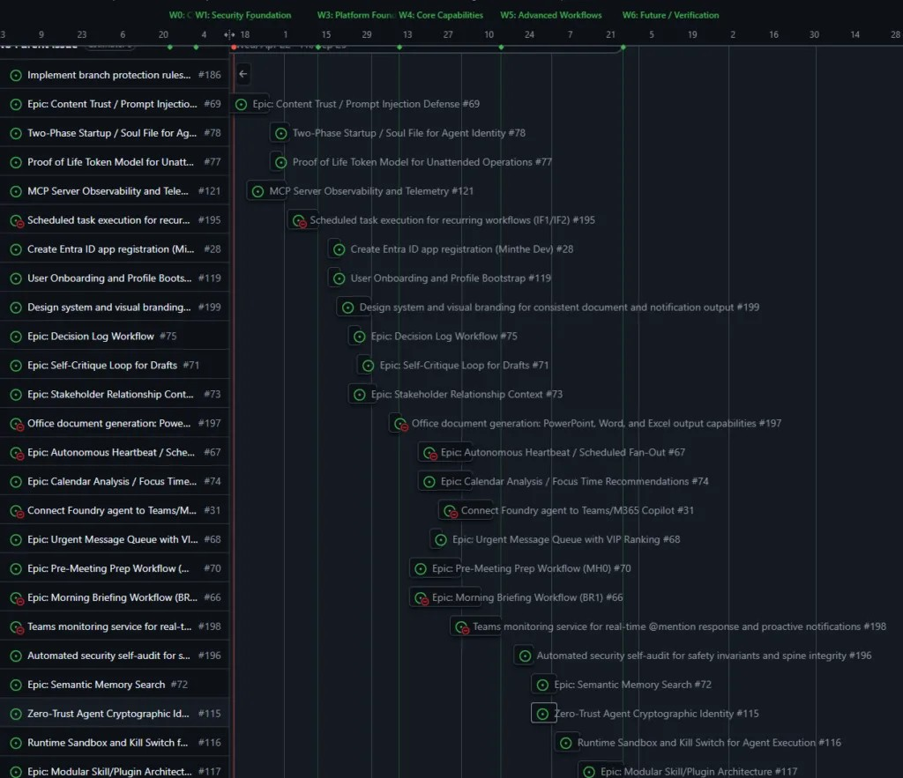

"一个糟糕的系统，终将战胜一个优秀的人（或智能体）。"——Dr. W. Edwards Deming（被作者略加改写）

Neil Van Heukelem 在 Microsoft 担任 Partner Tech Strategist，他和同事们发现，随着 AI 编程助手在团队中大规模铺开，大家踩上了同一类坑：开一个聊天窗口，写一段提示词，调整，再提示，调整……也许得到了一些有用的代码，也许花了一下午调试没人写过、没人测过的奇怪行为。

这篇文章是他们将这些实践梳理成方法论的第一篇。他们把它叫做 **Agentic-Agile**。

## 提示词驱动的四个系统性失败

提示词驱动开发（Prompt-driven development）在边界清晰的小任务上表现不错——生成一个函数、重构一个模块、写一个测试。但当范围扩大，问题就来了：

- **没有 Backlog**：需要构建什么、按什么顺序、依赖是什么，都没有结构化的列表。工作是在实现过程中"发现"的，而不是提前计划好的。
- **没有完成标准**：每次提示会话在开发者"觉得差不多"时结束，而不是"合约已满足"时结束。"够用了"替代了"符合验收标准"。
- **没有分阶段交付**：所有事情同时尝试推进，没有阶段性验证，无法中途停下来调整方向。
- **没有治理**：安全约束、验证规则、质量门禁都是事后补丁，如果有的话。

结果可以预见：智能体产出的代码在孤立运行时没问题，但集成就崩了。跨会话的行为会漂移，因为没有共享状态来定义预期行为。缺陷流入生产，因为没有结构化的审查门禁。开发者花更多时间审查和修正，侵蚀了智能体本应节省的时间。

**这不是模型问题，是流程问题。**升级模型无法修复缺失的验收标准。一个更强大的智能体面对模糊的规范，只会产生更精致的漂移，而不是更少。

## 什么是 Agentic-Agile

Agentic-Agile 的核心思路很直接：把敏捷工程实践适配给人类与 AI 智能体协作的团队。不是一套新框架，而是对现有敏捷实践的重新认识——这些实践同样能解决人机协作中的协调和治理问题。

**四条核心原则：**

1. **规范先行**：每个能力都是一个 Issue，每个 Issue 都有验收标准。在任何智能体执行之前，模糊的需求要变成结构化的合约。梳理 Backlog 不是行政开销，是主要的设计机制。
2. **合约驱动执行**：智能体按规范运行，而不是按开放式提示词运行。每个故事卡定义输入、输出和不变量。退出条件不是"够好了"，而是"合约已满足"。
3. **增量交付**：工作按优先级分组，每组之间有明确的退出标准。每个增量都产出可测试、可审查的结果，然后再开始下一个。
4. **治理从第一天开始**：安全约束、验证规则和审查门禁是流程设计的一部分，而不是事后追加的。

## 用文档把规范固化给人和智能体

Agentic-Agile 通过**将流程和标准固化在文档中**来解决问题——同时面向人类（仓库各处的 `README.md`）和智能体（`.github/copilot-instructions.md`、`CLAUDE.md`、`STYLE.md`）。



以 [agentic-agile-template](https://github.com/microsoft/agentic-agile-template) 为例，`.github/copilot-instructions.md` 用来引导 GitHub Copilot 的代码编写和测试标准，包括语言、格式化规范、命名约定、错误处理等。`CLAUDE.md` 则面向 Claude 模型，包含文档维护的明确规则——智能体在每次开发阶段后必须更新哪些文档：

```markdown
## Documentation Maintenance

| Document          | Update When                                |
| ----------------- | ------------------------------------------ |
| `README.md`       | Project scope, setup, or usage changes     |
| `CLAUDE.md`       | Process, conventions, or structure changes |
| `STYLE.md`        | Style conventions change                   |
| `CONTRIBUTING.md` | Contribution process changes               |
| API docs          | Endpoints added, modified, or removed      |
```

开发流程本身也用文档明确固化：

```
Plan → Issue → Implement → Review → Merge → Docs
```

关键一点：**你必须让智能体也参与到这套流程的维护里**。当项目的分支策略、框架选择或 CI 门禁发生变化，这些文档要随之更新，智能体才能持续在正确的上下文里工作。

## 把智能体当团队成员，而不是工具

大多数团队把 AI 智能体当工具来配置——选模型、写提示词、调参数、接收产品。Agentic-Agile 把智能体当**团队成员**。智能体的每一次操作都是一次开发行为，与人类的提交具有同等的下游后果。

智能体可以创建文件、引入依赖、编写测试，也可以丰富人类的提示词和规范，在 Backlog 里创建 Issue。当你和智能体建立信任后，可以给它更多自主权——研究、做架构决策、把决策记录在 ADR 文档里。

但如果智能体在做开发工作，**你需要和它就开发流程达成一致**。原本不允许人类在没有代码审查的情况下合并模块，那同样不应该允许智能体写的模块跳过等效的审查。

这里有一个 [Issue 模板示例](https://github.com/microsoft/agentic-agile-template/blob/main/.github/ISSUE_TEMPLATE/agentic-story.md)，包含了结构化故事的各个部分：摘要、动机、作用域（要创建或修改的文件）、要实现的接口、**验收标准**（可测试的具体条件）、**负约束**（明确不做什么）、依赖关系、文件所有权。

负约束这一栏特别有价值——它防止范围蔓延，也明确了边界，让智能体不会"好心地"做了不该做的事情。

## Minthe 项目：在实践中检验

作者的主要试验场是 Minthe——一个从构建"Microsoft Foundry 首席参谋智能体"开始的项目。

起初，作者在任何实现代码写成之前就撰写规范文档。经过几轮迭代后，他们发现智能体会更新设计文档，导致其偏离原始规范，而修改原始规范文档又会带来更多漂移，在多智能体并发运行（swarm）时造成信息冲突。

于是他们转向 **GitHub Issues 来管理规范**：每个能力都变成一个带验收标准的 Issue，GitHub Copilot CLI（主要用 Claude 模型）很容易适应"从 Issue 读取并执行"的工作模式。所有 Issue 工作都在独立分支上进行，减少了并行化时的冲突。关闭的 Issue 和 PR 评论成为后续迭代的历史参考点。

人类的角色逐渐清晰：**架构师和规范制定者**，类似 Scrum 中的教练，促进协作而不是指导每一步操作。智能体在约束内贡献实现。审查是共同责任。

这套模式后来被应用到几个与原始项目无关的项目中，领域完全不同。作者认为这证明了方法论的**可移植性**——只在发明它的项目上有效的方法论，算不上真正的方法论。

## 为什么治理不能推迟

一个常见的反对意见是："等我们知道在构建什么之后再加护栏。"在智能体开发中，这个逻辑是反的。

作者的教训来得直接：**CI 流水线不是第一个故事**。质量问题在多个交付波次中积累，等到加上流水线，已经在从未被验证过的假设上构建了很多东西。这需要重新打开并重新开发这些功能。

后来，他们把**对抗性代码审查**和**单元测试作为每个 Issue 验收标准的一部分**加进来，对交付质量产生了巨大影响。

Agentic-Agile 中的治理不是一个阶段，而是 **Backlog 本身的属性**。安全约束是故事上的验收标准，审查门禁位于执行波次之间，验证基础设施（CI/CD、linting、自动化测试）是第一个实现的故事，而不是最后一个。

判断标准很直接：如果你在最终审查时才发现架构违规，你的治理就太晚了。

## 从哪里开始

作者给出了本周可以直接行动的步骤：

1. **复制** [microsoft/agentic-agile-template](https://github.com/microsoft/agentic-agile-template) 仓库
2. 克隆到本地，切换到 `/plan` 模式，让 GitHub Copilot 读取仓库内容，然后向你提问以定制模板
3. 如果还没有 Backlog，为产品需要交付的主要能力创建高级别 Issue，包括 CI/CD 工具和门禁的 Issue
4. 回到 `/plan` 模式，让智能体帮你审查 Backlog 并决定先做哪些
5. 选一个 Issue，让 Copilot 完善描述使其符合模板格式
6. 让 Copilot 实现它，观察会发生什么

核心节奏：**每个模糊的能力变成一个 Issue，每个 Issue 有验收标准，每个验收标准成为引导智能体执行的合约。**

## 参考

- [原文：Agentic-Agile: Why Agent Development Needs Agile (Not Just Prompts)](https://devblogs.microsoft.com/blog/agentic-agile-why-agent-development-needs-agile-not-just-prompts)
- [Agentic-Agile Manifesto 完整版](https://devblogs.microsoft.com/blog/toward-an-agentic-agile-manifesto)
- [Agentic-Agile Template | GitHub](https://github.com/microsoft/agentic-agile-template)
- [The original Agile Manifesto](https://agilemanifesto.org/)
- [Andrej Karpathy: Software is changing (Again) | Y Combinator YouTube](https://www.youtube.com/watch?v=LCEmiRjPEtQ)
