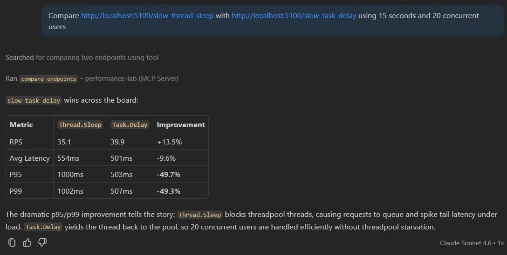
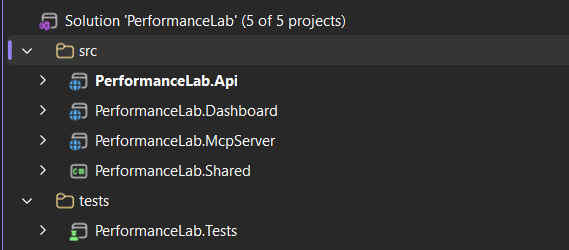
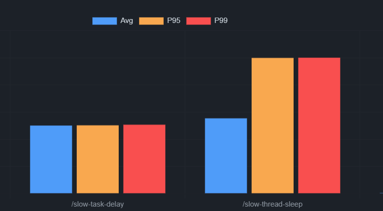
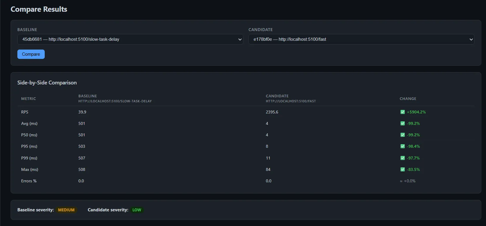

这篇文章讲一个能真正用起来的工具：把 .NET API 的负载测试接进 MCP，让 AI 直接调用"跑压测""对比两个端点"这类工具，而不是靠猜。

先看结果。对话大概是这样：

```
我：Compare http://localhost:5100/slow-thread-sleep with http://localhost:5100/slow-task-delay
    - 15 秒，20 并发用户

Copilot：
BASELINE  → /slow-thread-sleep    CANDIDATE → /slow-task-delay
Throughput:  35.1 RPS              →  39.9 RPS   (✅ +13.5%)
Average:     554ms                 →  501ms       (✅ -9.6%)
P95:        1000ms                 →  503ms       (✅ -49.7%)
P99:        1002ms                 →  507ms       (✅ -49.3%)

VERDICT: ✅ Candidate is faster
```

一条消息，两个端点的真实压测，百分比对比直接出来。



p95/p99 的改善说明了问题所在：`Thread.Sleep` 在等待期间占住一个 ThreadPool 线程，20 个并发用户一上来，线程就用完了，后续请求开始排队，尾延迟直接炸掉。`Task.Delay` 等待期间会把线程还给线程池——同样的 500ms 延迟，在并发负载下的行为完全不同。

## 什么是 MCP

MCP（Model Context Protocol）是一个开放标准，让你把"函数"暴露给 AI 工具直接调用。AI 不是猜，而是调用你明确声明的工具，比如"跑负载测试"或"分析结果"。

构建一个 MCP 服务器的最大好处是**一套服务器，接多个 AI 客户端**：GitHub Copilot、Claude Desktop、Cursor 都能连上去，不需要为每个客户端单独改代码。

## 项目结构

整个 demo 分四个项目：

```
PerformanceLab.Api        → 端口 5100  - 含刻意引入反模式的示例 API
PerformanceLab.McpServer  → 端口 5200  - MCP 服务器 + 负载测试引擎
PerformanceLab.Dashboard  → 端口 5300  - Blazor 可视化看板
PerformanceLab.Shared                  - 共享模型
```



关键设计决策：Dashboard 和 MCP 服务器共享同一个 `IResultStore`，但彼此完全解耦。AI 访问 `/mcp`，Dashboard 读 `/api/results`，数据源相同，消费方式不同。

## Part 1：刻意写"烂"的 API

`PerformanceLab.Api` 里的每个端点都演示一种真实的性能反模式，目的是提供可量化的对比目标。

### Thread.Sleep vs Task.Delay

```csharp
// ❌ 阻塞 ThreadPool 线程整个等待期
app.MapGet("/slow-thread-sleep", (int ms = 500) =>
{
    Thread.Sleep(ms);
    return Results.Ok(new { message = "done", blockedMs = ms });
});

// ✅ 等待期间把线程还给线程池
app.MapGet("/slow-task-delay", async (int ms = 500) =>
{
    await Task.Delay(ms);
    return Results.Ok(new { message = "done", waitedMs = ms });
});
```

从调用者角度看，这两个端点完全一样。在 20 并发用户的负载下却是天壤之别：`Thread.Sleep` 一次占住线程 500ms，ThreadPool 耗尽后吞吐量从数千 RPS 坍缩到几十 RPS。

### 串行 vs 并行

```csharp
// ❌ 五个查询依次执行 - 约 250ms
app.MapGet("/database-simulation", async () =>
{
    var results = new List<string>();
    for (int i = 1; i <= 5; i++)
    {
        await Task.Delay(50); // 模拟数据库查询
        results.Add($"Record {i}");
    }
    return Results.Ok(results);
});

// ✅ 五个查询同时跑 - 约 50ms
app.MapGet("/optimized-version", async () =>
{
    var tasks = Enumerable.Range(1, 5).Select(async i =>
    {
        await Task.Delay(50);
        return $"Record {i}";
    });
    var results = await Task.WhenAll(tasks);
    return Results.Ok(results);
});
```

这五个查询结果互不依赖，没有理由等前一个完成再发下一个。`Task.WhenAll` 一个改动，延迟降 5 倍。

此外还有 `/memory-heavy`（分配大数组触发 GC 压力）和 `/cpu-heavy`（SHA256 紧循环），每种都有明显的特征供分析器识别。

## Part 2：MCP 服务器

MCP 服务器就是一个普通的 ASP.NET Core 应用，只需要一个 NuGet 包：

```bash
dotnet add package ModelContextProtocol.AspNetCore --version 0.3.0-preview.2
```

### Program.cs

```csharp
// 注册服务
builder.Services.AddSingleton<IResultStore, InMemoryResultStore>();
builder.Services.AddScoped<LoadTestRunner>();
builder.Services.AddScoped<ResultAnalyzer>();

// MCP - 自动发现所有 [McpServerTool] 方法
builder.Services
    .AddMcpServer()
    .WithHttpTransport()
    .WithToolsFromAssembly();

// CORS 供 Blazor Dashboard 使用
builder.Services.AddCors(opts =>
    opts.AddPolicy("dashboard", policy =>
        policy.WithOrigins("http://localhost:5300")
              .AllowAnyHeader().AllowAnyMethod()));

var app = builder.Build();
app.UseCors("dashboard");

app.MapMcp("/mcp");                     // ← AI 客户端连这里
app.MapGet("/api/results", (IResultStore store) =>
    Results.Ok(store.GetAll()));        // ← Dashboard 读这里
```

`WithToolsFromAssembly()` 会扫描程序集里所有带 `[McpServerToolType]` 标注的类，不需要手动注册工具。

## Part 3：定义工具

工具就是带 `[McpServerTool]` 和 `[Description]` 特性的 C# 方法。`[Description]` 的内容就是 AI 决定"要不要调用这个工具，怎么传参"的依据。

```csharp
[McpServerToolType]
public sealed class PerformanceTools(
    LoadTestRunner runner,
    ResultAnalyzer  analyzer,
    IResultStore    store)
{
    [McpServerTool(Name = "run_load_test")]
    [Description(
        "Run a load test against an API endpoint. Fires concurrent HTTP requests for the " +
        "specified duration and returns throughput, latency percentiles, and error rate. " +
        "Returns a result ID that can be passed to analyze_results or generate_report.")]
    public async Task<string> RunLoadTest(
        [Description("Full URL of the endpoint to test. Example: http://localhost:5100/fast")]
        string url,
        [Description("How many seconds the test should run. Default: 10")]
        int durationSeconds = 10,
        [Description("Number of virtual concurrent users (parallel HTTP connections). Default: 10")]
        int concurrentUsers = 10,
        CancellationToken cancellationToken = default)
    {
        var request  = new LoadTestRequest
        {
            Url             = url,
            DurationSeconds = durationSeconds,
            ConcurrentUsers = concurrentUsers,
        };
        var result   = await runner.RunAsync(request, cancellationToken);
        var analysis = analyzer.Analyze(result);
        store.Add(result, analysis);

        return FormatLoadTestResult(result, analysis);
    }
}
```

两点值得注意：

**描述决定一切。** AI 完全根据 `[Description]` 决定调用哪个工具、传什么参数。写清楚"它做什么、返回什么、返回值怎么用"是让工具被正确调用的关键。

**工具返回字符串。** AI 读取纯文本并据此推理，不需要类型化 schema，清晰一致的输出格式就够了。

整个服务器共暴露 10 个工具：`run_load_test`、`compare_endpoints`、`analyze_results`、`detect_slow_responses`、`detect_threadpool_starvation`、`detect_memory_pressure`、`list_results`、`compare_before_after`、`suggest_optimizations`、`generate_report`。

## Part 4：负载测试引擎

没有 k6，没有 JMeter，纯 .NET：

```csharp
public async Task<LoadTestResult> RunAsync(LoadTestRequest request, CancellationToken ct)
{
    var records   = new ConcurrentBag<RequestRecord>();
    var endAt     = DateTime.UtcNow.AddSeconds(request.DurationSeconds);

    using var linkedCts = CancellationTokenSource.CreateLinkedTokenSource(ct);
    linkedCts.CancelAfter(TimeSpan.FromSeconds(request.DurationSeconds + 15));

    var workerTasks = Enumerable
        .Range(0, request.ConcurrentUsers)
        .Select(_ => RunWorkerAsync(request, records, endAt, linkedCts.Token))
        .ToArray();

    await Task.WhenAll(workerTasks);

    return BuildResult(request, [.. records]);
}
```

`Task.WhenAll` 启动 N 个并发 Worker，每个 Worker 对应一个虚拟用户，在时间窗口关闭前持续发请求。`ConcurrentBag<RequestRecord>` 收集所有结果，无锁。

有一个 `HttpClient` 配置细节不能忽略：

```csharp
builder.Services
    .AddHttpClient("loadtest", client =>
    {
        client.Timeout = TimeSpan.FromSeconds(30);
    })
    .ConfigurePrimaryHttpMessageHandler(() => new HttpClientHandler
    {
        AllowAutoRedirect        = false,
        MaxConnectionsPerServer  = 1000,
    });
```

`MaxConnectionsPerServer = 1000` 很关键。旧版 .NET 的默认值是 2，不改的话压测本身就会被连接数限制，根本没到服务器那边就已经瓶颈了。

## Part 5：基于规则的分析器

分析器是纯 C#，没有 AI，没有 ML。它应用来自真实性能排查经验的规则，返回严重程度评级和具体建议。

```csharp
public AnalysisResult Analyze(LoadTestResult result)
{
    var issues          = new List<string>();
    var recommendations = new List<string>();

    // ThreadPool 饥饿：p99 是 p50 的 10 倍以上
    // 健康 API 的 p99/p50 比值通常是 2-5
    // 饥饿 API 的比值可达 20-100
    if (result.P50Ms > 0 && result.P99Ms / result.P50Ms > 10)
    {
        var ratio = result.P99Ms / result.P50Ms;
        issues.Add(
            $"High latency variance - p99 is {ratio:F0}× higher than p50. " +
            "Classic ThreadPool starvation signature.");
        recommendations.Add(
            "Search for Thread.Sleep(), .Result, .Wait(), GetAwaiter().GetResult(). " +
            "Replace them all with async/await.");
    }

    // GC 暂停：单次最大耗时远超 p99
    if (result.MaxMs > result.P99Ms * 3)
    {
        issues.Add(
            $"Max ({result.MaxMs:F0}ms) is 3× higher than p99 ({result.P99Ms:F0}ms). " +
            "Suggests occasional GC pauses.");
    }

    // 低吞吐 + 多并发 = 严重阻塞
    if (result.RequestsPerSecond < 5 && result.ConcurrentUsers >= 10)
    {
        issues.Add(
            $"Very low throughput: {result.RequestsPerSecond:F1} RPS with " +
            $"{result.ConcurrentUsers} concurrent users. Suggests severe blocking.");
    }

    return new AnalysisResult
    {
        Severity        = DetermineSeverity(issues),
        Issues          = issues,
        Recommendations = recommendations,
    };
}
```

规则检测加上 AI 推理，效果比任何一方单独作战都好。AI 知道当前对话里的 URL、你展示过的代码、前几轮测试的结果，能结合上下文解释为什么慢、哪行代码导致的、下一步怎么改。

## 理解延迟百分位：p50、p95、p99

如果你对百分位延迟还不熟悉，快速过一遍：

把 1000 个请求按响应时间排序：

- **p50（中位数）**：第 500 个。一半用户比这快，一半比这慢。
- **p95**：第 950 个。每 20 个用户里有 1 个比这慢。
- **p99**：第 990 个。1% 的用户遇到这个延迟或更糟。

健康 API 的 p99 大约是 p50 的 2-5 倍。当 p99 是 p50 的 20-100 倍时，说明有请求慢得离谱——这就是 ThreadPool 饥饿的典型特征。

用实测数据对比：

```
/fast（健康）- 10 用户，5 秒
  RPS:      2,395.6
  Average:      4ms
  P95:          8ms   (~2× p50)
  P99:         12ms   (~3× p50)  ← 健康

/slow-thread-sleep（饥饿）- 20 用户，15 秒
  RPS:         35.1              ← 崩塌
  Average:    554ms
  P95:       1000ms
  P99:       1002ms
```

饥饿最直观的表现是吞吐量崩塌（2395 RPS → 35 RPS），而不是 p99/p50 比值——因为每个请求都在平等地等线程。



## Part 6：Blazor 看板

看板提供所有历史测试结果的可视化概览，是一个纯 REST 客户端——轮询 `/api/results`，用 Chart.js 渲染数据。

对比页面把两个结果并排展示，每列标注百分比增量。



看板对 MCP 一无所知，这是刻意的。看板是观察者，AI 是操作者。

## 接入 GitHub Copilot

在工作区里添加 `.vscode/mcp.json`：

```json
{
  "servers": {
    "performance-lab": {
      "type": "http",
      "url": "http://localhost:5200/mcp"
    }
  }
}
```

启动三个服务，在 Copilot **Agent 模式**里开始提问：

```
Run a load test against http://localhost:5100/fast for 5 seconds with 10 users
```

```
Compare http://localhost:5100/slow-thread-sleep with http://localhost:5100/slow-task-delay
using 15 seconds and 20 concurrent users
```

```
Detect threadpool starvation for result <ID>
```

```
Generate a full performance report for the last two runs
```

AI 在多轮对话间维持上下文。做完对比之后，它能解释为什么某个端点更快、指出导致问题的具体代码行，并给出修改建议——都在同一个对话里。

## 更广泛的模式

这个项目的核心模式可以照搬到其他场景：

**在已有服务上构建领域专用 MCP 工具。** AI 提供推理层，你的工具提供真实数据。

性能诊断是个完美的例子——AI 在不拿到你的 API 真实运行数据之前，根本没法告诉你哪里慢。MCP 给了它真实数字，AI 给了你上下文、解释和下一步方向。

同样的模式可以用在：

- 查询 CI/CD 流水线的部署工具
- 对慢查询执行 EXPLAIN 的数据库工具
- 读取 Prometheus/Grafana 指标的监控工具

MCP 协议本质上就是 HTTP + schema，价值完全在于你暴露了什么。

## 参考

- [原文：I Built an MCP Server That Tests .NET API Performance](https://thecodeman.net/posts/building-mcp-server-in-dotnet)
- [ModelContextProtocol.AspNetCore NuGet](https://www.nuget.org/packages/ModelContextProtocol.AspNetCore)
- [Model Context Protocol 官方文档](https://modelcontextprotocol.io/)
